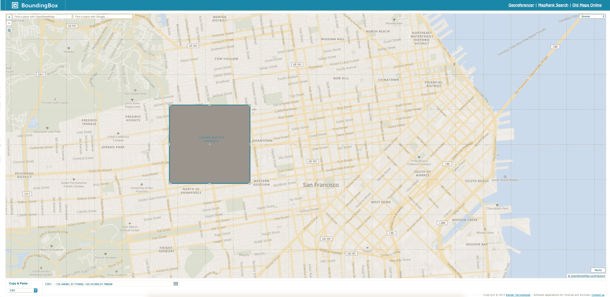
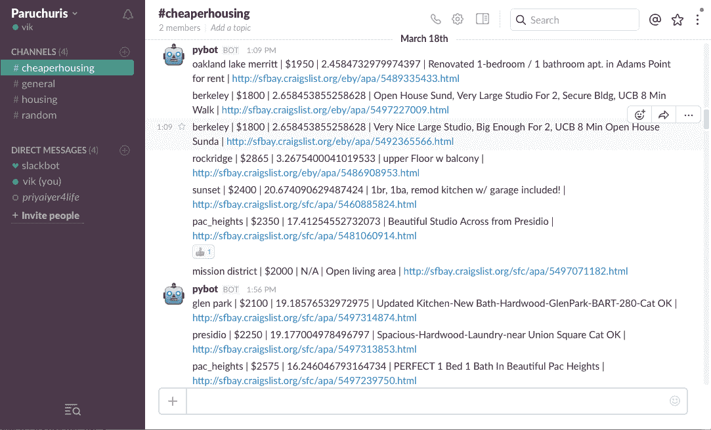

# 我是如何制作一个 Python 机器人来帮我在旧金山找公寓的

> 原文：<https://www.dataquest.io/blog/apartment-finding-slackbot/>

July 21, 2016

几个月前我从波士顿搬到了湾区。Priya(我的女朋友)和我听到了各种关于租赁市场的恐怖故事。在谷歌上搜索“如何在旧金山找到一套公寓”会得到几十页的建议，这个事实很好地说明了找房子是一个痛苦的过程。

波士顿很冷，但在旧金山找公寓很吓人。我们知道房东会开放房子，你必须把你所有的文件带到开放的房子里，并且愿意立即支付定金，这样你才会被考虑。

我们开始详尽地研究这个过程，发现很多找房子的事情都归结于时机。一些房东无论如何都想举行一次开放参观，但对其他人来说，成为第一批看到公寓的人之一通常意味着你可以得到它。你需要找到房源，迅速判断它是否符合你的标准，然后打电话给房东安排一次展示机会。

我们看了看互联网海报推荐的一些公寓租赁网站，如 [Padmapper](https://www.padmapper.com/) 和 [LiveLovely](https://livelovely.com) ，但它们都没有给我们实时房源，我们可以一起查看和评级。它们都没有给我们指定额外标准的能力，比如只指定非常具体的社区，或者靠近交通。由于湾区的大多数公寓房源最初都在 Craigslist 上，然后被其他网站抓取，所以人们也担心可能不是所有的房源都被抓取了，或者它们的抓取速度不够快，无法实现实时提醒。我们想要一种方法:

*   当有人在 Craigslist 上发帖时，您会得到近乎实时的通知。
*   过滤掉不属于我们想要的社区的列表。
*   过滤掉不符合附加条件的列表，例如靠近公共交通。
*   就列表进行协作，并一起对它们进行评分。
*   轻松联系房东，获取我们喜欢的房源。

思考这个问题后，我意识到我们可以用四个步骤来解决这个问题:

*   从 Craigslist 上抓取列表。
*   过滤掉不符合我们标准的物品。
*   将列表发布到团队聊天工具 [Slack](https://slack.com/) 上，这样我们就可以对它们进行讨论和评级。
*   将整个流程包装成一个持久的循环，并将其部署到服务器上(这样它就可以连续运行)。

在这篇文章的剩余部分，我们将介绍每一个部件是如何建造的，以及最终的 Slack bot 是如何帮助我们找到公寓的。使用这个机器人，Priya 和我找到了一个价格合理的(SF！)一周内我们就喜欢上了一间卧室，比我们想象的要快得多。

**如果你想在阅读这篇文章的时候看看代码，[这里有](https://github.com/VikParuchuri/apartment-finder)到完成项目的链接，[这里有](https://github.com/VikParuchuri/apartment-finder/blob/master/README.md)到 README.md.** 的链接

## 第一步——从 Craigslist 上抓取列表

构建我们的机器人的第一步是从 Craiglist 获取列表。不幸的是，Craiglist 没有 API，但是我们可以使用 [python-craiglist](https://github.com/juliomalegria/python-craigslist) 包获得帖子。`python-craigslist`抓取页面内容，然后使用 [BeautifulSoup](https://www.crummy.com/software/BeautifulSoup/) 从页面中提取相关片段，并将其转换为结构化数据。

这个包的代码相当短，值得通读一遍。旧金山 Craigslist 公寓列表位于`https://sfbay.craigslist.org/search/sfc/apa`。在下面的代码中，我们:

*   导入`CraigslistHousing`，一个`python-craigslist`中的类。
*   用以下参数初始化该类:
    *   我们想要抓取的 Craigslist 网站。与`https://sfbay.craigslist.org`一样，`site`是 URL 的第一部分。
    *   `area` —站点内我们要刮除的子区域。`area`是 URL 的最后一部分，就像`https://sfbay.craigslist.org/sfc/`，它只会在三藩市出现。
    *   `category` —我们想要寻找的列表类型。`category`是搜索 URL 的最后一部分，就像`https://sfbay.craigslist.org/search/sfc/apa`，它列出了所有的公寓。
    *   `filters` —我们想要应用于结果的任何过滤器。
        *   我们愿意支付的最高价格。
        *   我们想要的最低价格。
*   使用`get_results`方法从 Craigslist 获得结果，这是一个[生成器](https://wiki.python.org/moin/Generators)。
    *   传递`geotagged`参数，尝试向每个结果添加坐标。
    *   传递`limit`参数以仅获得`20`结果。
    *   传递参数`newest`只获取最新的列表。
*   从`results`生成器中获取每个`result`并打印出来。

```
 from craigslist import CraigslistHousing
cl = CraigslistHousing(site='sfbay', area='sfc', category='apa',                         filters={'max_price': 2000, 'min_price': 1000})
results = cl.get_results(sort_by='newest', geotagged=True, limit=20)
for result in results:
    print result 
```

我们已经很快完成了机器人的第一步！我们现在能够抓取 Craigslist 并获取列表。每个`result`都是一个包含几个字段的字典:

```
 {'datetime': '2016-07-20 16:39', 
 'geotag': (37.783166, -122.418671), 
 'has_image': True, 
 'has_map': True, 
 'id': '5692904929', 
 'name': 'Be the first in line at Brendas restaurant!SQuiet studio 
 available', 
 'price': '$1995', 
 'url': 'https://sfbay.craigslist.org/sfc/apa/5692904929.html', 
 'where': 'tenderloin'
} 
```

以下是对字段的描述:

*   `datetime` —发布列表的时间。
*   `geotag` —列表的坐标位置。
*   Craigslist 帖子中是否有图片。
*   `has_map` —是否有与列表关联的地图。
*   `id` —列表的唯一 Craigslist id。
*   `name`—Craigslist 上显示的列表名称。
*   `price` —月租金。
*   `url` —查看完整列表的 URL。
*   `where` —创建列表的人在它所在的地方放了什么。

## 第二步—过滤结果

既然我们有了从 Craigslist 获取列表的方法，我们只需要一种方法来过滤它们，只看到我们喜欢的列表。

#### 按区域过滤结果

当 Priya 和我在寻找公寓时，我们想看看几个地区的房子，包括:

*   旧金山
    *   [日落](https://en.wikipedia.org/wiki/Sunset_District,_San_Francisco)
    *   [太平洋高地](https://en.wikipedia.org/wiki/Pacific_Heights,_San_Francisco)
    *   [下太平洋高地](https://en.wikipedia.org/wiki/Lower_Pacific_Heights,_San_Francisco)
    *   [伯纳尔高地](https://en.wikipedia.org/wiki/Bernal_Heights,_San_Francisco)
    *   [里士满](https://en.wikipedia.org/wiki/Richmond_District,_San_Francisco)
*   伯克利
*   奥克兰
    *   [亚当斯点](https://en.wikipedia.org/wiki/Adams_Point,_Oakland,_California)
    *   [梅里特湖](https://en.wikipedia.org/wiki/Lake_Merritt)
    *   [洛克里奇](https://en.wikipedia.org/wiki/Rockridge,_Oakland,_California)
*   阿拉米达

为了按邻域过滤，我们首先需要定义区域周围的边界框:



在下太平洋高地周围画一个方框

上面的边界框是使用[边界框](https://boundingbox.klokantech.com/)创建的。一定要指定左下角的`CSV`选项来获取盒子的坐标。你也可以自己定义一个边界框，用谷歌地图这样的工具找到左下角和右上角的坐标。找到盒子后，我们将创建一个邻域和坐标字典:

```
 BOXES = {
    "adams_point": [
        [37.80789, -122.25000],
        [37.81589,    -122.26081],
    ],
    "piedmont": [
        [37.82240, -122.24768],
        [37.83237, -122.25386],
    ],
    ...
} 
```

每个字典键是一个邻居名称，每个键包含一个列表列表。第一个内部列表是盒子左下角的坐标，第二个是盒子右上角的坐标。然后，我们可以通过检查列表的坐标是否在任何框内来执行过滤。以下代码将:

*   循环浏览`BOXES`中的每个按键。
*   检查结果是否在盒子里。
*   如果是，设置适当的变量。

```
 def in_box(coords, box):
    if box[0][0] < coords[0] < box[1][0] and box[1][1] < coords[1] < box[0][1]:
        return True
    return False
geotag = result["geotag"]
area_found = False
area = ""
for a, coords in BOXES.items():
    if in_box(geotag, coords):
        area = a 
        area_found = True 
```

不幸的是，并非 Craigslist 的所有结果都有与之相关的坐标。由发布列表的人指定一个位置，可以从该位置计算坐标。发布列表的人对 Craigslist 越熟悉，他们就越有可能包含一个位置。

通常，由更可能收取高租金的代理发布的列表具有相关联的位置。所有者发布的信息更有可能没有坐标，但通常也是更好的交易。因此，有一个故障保险来判断没有相关坐标的列表是否在我们想要的邻域中是有意义的。

我们将创建一个邻域列表，然后进行字符串匹配，看看列表是否属于其中之一。这不如使用坐标准确，因为许多列表错误地报告了他们的邻居，但总比没有好:

```
NEIGHBORHOODS = ["berkeley north", "berkeley", "rockridge", "adams point", ... ]
```

为了进行基于名称的匹配，我们可以遍历每个`NEIGHBORHOODS`:

```
 location = result["where"]
for hood in NEIGHBORHOODS:
    if hood in location.lower():
        area = hood 
```

一旦我们已经编写的两部分代码处理了结果，我们将删除不在我们想要居住的社区中的所有列表。我们会有一些误报，我们可能会错过一些没有指定邻居或位置的列表，但这个系统可以捕获绝大多数列表。

### 通过接近中天过滤结果

Priya 和我都知道我们会经常去旧金山，所以如果我们不想成为旧金山人，我们想住在公共交通附近。在湾区，公共交通的主要形式被称为 [BART](https://en.wikipedia.org/wiki/Bay_Area_Rapid_Transit) 。

BART 是一个部分地下的区域运输系统，连接奥克兰、伯克利、旧金山和周边地区。为了将这个功能构建到我们的 bot 中，我们首先需要定义一个中转站列表。我们可以从[谷歌地图](https://maps.google.com)获得公交站点的坐标，然后创建一个它们的字典:

```
 TRANSIT_STATIONS = {
    "oakland_19th_bart": [37.8118051,-122.2720873],
    "macarthur_bart": [37.8265657,-122.2686705],    
    "rockridge_bart": [37.841286,-122.2566329],
    ...
} 
```

每个键都是一个中转站的名称，并有一个关联列表。该列表包含中转站的纬度和经度。一旦我们有了字典，我们就可以找到离每个结果最近的中转站。以下代码将:

*   循环浏览`TRANSIT_STATIONS`中的每个键和项目。
*   使用`coord_distance`功能找出两对坐标之间的距离，单位为千米。你可以在这里找到这个函数[的解释。](https://medium.com/@petehouston/calculate-distance-of-two-locations-on-earth-using-python-1501b1944d97)
*   查看电台是否离列表最近。
    *   如果该站太远(超过`2`公里，或大约`1.2`英里)，它将被忽略。
    *   如果该电台比前一个最近的电台更近，则使用该电台。

```
 min_dist = None
near_bart = False
bart_dist = "N/A"
bart = ""
MAX_TRANSIT_DIST = 2 # kilometers
for station, coords in TRANSIT_STATIONS.items():
    dist = coord_distance(coords[0], coords[1], geotag[0], geotag[1])
    if (min_dist is None or dist < min_dist) and dist < MAX_TRANSIT_DIST:
        bart = station
        near_bart = True

    if (min_dist is None or dist < min_dist):
        bart_dist = dist 
```

在这之后，我们知道离每个列表最近的中转站。

## 第三步——创建我们的 Slack Bot

#### 设置

在我们筛选出我们的结果后，我们就可以发布我们要发布的内容了。如果你不熟悉 Slack，它是一个团队聊天应用。您在 Slack 中创建了一个团队，然后可以邀请成员。每个松散团队可以有多个成员交换消息的渠道。每条消息都可以由频道中的其他人进行注释，例如添加大拇指或其他表情符号。这里是关于 Slack 的更多信息。

如果你想感受一下 Slack，我们有一个[数据科学 Slack 社区](https://community.dataquest.io/)，你可能想加入。通过将我们的结果发布到 Slack，我们将能够与其他人合作，并找出哪些列表是最好的。为此，我们需要:

*   创建一个松散的团队，我们可以在这里做。
*   为要发布的列表创建一个频道。[这里是](https://get.slack.help/hc/en-us/articles/201402297-Creating-a-channel)在这方面的帮助。建议使用`#housing`作为频道名称。
*   获取一个 Slack API 令牌，我们可以在这里做[。](https://api.slack.com/docs/oauth-test-tokens)[这里是关于这个过程的更多信息。](https://get.slack.help/hc/en-us/articles/215770388-Creating-and-regenerating-API-tokens)

完成这些步骤后，我们就可以创建将清单发布到 Slack 的代码了。

#### 编码完毕

在获得正确的通道名和令牌后，我们可以将结果发布到 Slack。为此，我们将使用 [python-slackclient](https://github.com/slackhq/python-slackclient) ，这是一个 python 包，使得使用 [Slack API](https://api.slack.com/) 变得容易。使用 Slack 令牌初始化，然后允许我们访问许多管理团队和消息的 API 端点。以下代码将:

*   使用`SLACK_TOKEN`初始化一个`SlackClient`。
*   从`result`创建一个消息字符串，包含我们需要看到的所有信息，比如价格、列表所在的街区和 URL。
*   用用户名`pybot`将消息发布到 Slack，一个机器人作为头像。

```
 from slackclient import SlackClient
SLACK_TOKEN = "ENTER_TOKEN_HERE"
SLACK_CHANNEL = "#housing"

sc = SlackClient(SLACK_TOKEN)
desc = "{0} | {1} | {2} | {3} 
| <{4}>".format(result["area"], result["price"], result["bart_dist"], result["name"], result["url"])
sc.api_call(
    "chat.postMessage", channel=SLACK_CHANNEL, text=desc,
    username='pybot', icon_emoji=':robot_face:') 
```

一旦所有东西都连接上了，Slack bot 就会将清单发布到 Slack 中，如下所示:



bot 运行时列表的外观。请注意如何用表情符号给列表添加注释，比如竖起大拇指。

## 第四步——操作一切

既然我们已经解决了基本问题，我们将需要持久地运行代码。毕竟，我们希望我们的结果能够实时发布到 Slack 上，或者接近实时。为了将一切操作化，我们需要经历几个步骤:

*   将列表存储在数据库中，这样我们就不会重复发布到 Slack 中。
*   将设置(如`SLACK_TOKEN`)与代码的其余部分分开，使它们易于调整。
*   创建一个连续运行的循环，所以我们 24/7 都在抓取结果。

#### 存储列表

第一步是使用名为 [SQLAlchemy](https://www.sqlalchemy.org/) 的 Python 包来存储我们的列表。SQLAlchemy 是一个[对象关系映射器](https://en.wikipedia.org/wiki/Object-relational_mapping)，或 ORM，它使得使用 Python 中的数据库更加容易。使用 SQLAlchemy，我们可以创建一个存储清单的数据库表和一个数据库连接，以便于向表中添加数据。

我们将结合使用 SQLAlchemy 和 [SQLite](https://www.sqlite.org/) 数据库引擎，它将我们所有的数据存储到一个名为`listings.db`的文件中。以下代码将:

*   导入 SQLAlchemy。
*   创建一个到 SQLite 数据库`listings.db`的连接，该数据库将在我们当前的目录中创建。
*   定义一个名为`Listing`的表，包含 Craigslist 列表中的所有相关字段。
    *   `unique`字段`cl_id`和`link`将阻止我们向 Slack 发布重复的列表。
*   从连接创建一个数据库会话，这将允许我们存储列表。

```
 from sqlalchemy import create_engine
from sqlalchemy.ext.declarative import declarative_base
from sqlalchemy import Column, Integer, String, DateTime, Float, Boolean
from sqlalchemy.orm import sessionmaker
engine = create_engine('sqlite:///listings.db', echo=False)
Base = declarative_base()
class Listing(Base):    
    """
    A table to store data on craigslist listings.
    """

    __tablename__ = 'listings'
    id = Column(Integer, primary_key=True)
    link = Column(String, unique=True)
    created = Column(DateTime)
    geotag = Column(String)
    lat = Column(Float)
    lon = Column(Float)
    name = Column(String)
    price = Column(Float) 
    location = Column(String)
    cl_id = Column(Integer, unique=True)
    area = Column(String)
    bart_stop = Column(String)

Base.metadata.create_all(engine)

Session = sessionmaker(bind=engine)
session = Session() 
```

现在我们有了数据库模型，我们只需要将每个列表存储到数据库中，这样我们就能够避免重复。

#### 从代码中分离配置

下一步是从代码中分离出配置。我们将创建一个名为`settings.py`的文件来存储我们的配置。配置包括`SLACK_TOKEN`，这是一个秘密，我们不希望一不小心提交 git 并推送到 Github，还有其他像`BOXES`这样不是秘密的设置，但我们希望能够轻松编辑。我们将以下设置移至`settings.py`:

*   `MIN_PRICE` —我们要搜寻的最低刊登价格。
*   `MAX_PRICE` —我们要搜寻的最低刊登价格。
*   我们想要搜索的区域性 Craigslist 网站。
*   我们想要搜索的区域 Craiglist 站点的区域列表。
*   `BOXES` —我们想要查看的邻域的坐标框。
*   `NEIGHBORHOODS` —如果列表中没有坐标，则是要匹配的邻域列表。
*   我们希望离中转站最远的地方。
*   `TRANSIT_STATIONS` —中转站的坐标。
*   我们想要查看的 Craigslist 房屋的子部分。
*   我们希望机器人发布的空闲频道。

我们还想创建一个被 git 忽略的名为`private.py`的文件，它包含以下键:

*   `SLACK_TOKEN` —张贴到我们的 Slack 团队的令牌。

你可以在这里看到完成的`settings.py`文件[。](https://github.com/VikParuchuri/apartment-finder/blob/master/settings.py)

#### 创建一个循环

最后，我们需要创建一个循环来持续运行我们的抓取代码。以下代码将:

*   从命令行调用时:
    *   打印包含当前时间的状态消息。
    *   通过调用`do_scrape`函数运行 craigslist 抓取代码。
    *   如果用户键入`Ctrl + C`，则退出。
    *   通过打印回溯并继续来处理其他异常。
    *   如果没有异常，打印成功消息(对应于下面的`else`条款)。
    *   在再次刮擦之前休眠一段规定的时间间隔。默认情况下，这被设置为`20`分钟。

```
 from scraper import do_scrape
import settings
import time
import sys
import traceback

if __name__ == "__main__":
    while True:
        print("{}: Starting scrape cycle".format(time.ctime()))   
        try:
            do_scrape()
        except KeyboardInterrupt:
            print("Exiting....")
            sys.exit(1)
        except Exception as exc:
            print("Error with the scraping:", sys.exc_info()[0])
            traceback.print_exc()
        else:
            print("{}: Successfully finished scraping".format(time.ctime()))
time.sleep(settings.SLEEP_INTERVAL) 
```

我们还需要将`SLEEP_INTERVAL`添加到`settings.py`中，以控制抓取发生的频率。默认情况下，这被设置为`20`分钟。

## 自己运行

既然代码已经完成，让我们看看如何自己运行 Slack bot。

#### 在本地计算机上运行

你可以在 Github [这里](https://github.com/vikparuchuri/apartment-finder)找到这个项目。在 [README.md](https://github.com/vikparuchuri/apartment-finder) 中，你会找到详细的安装说明。除非你有安装程序的经验，并且正在运行 Linux，否则建议遵循 [Docker](https://www.docker.com/) 的说明。

Docker 是一个工具，它使创建和部署应用程序变得容易，并使您可以在本地机器上非常快速地开始使用这个 Slack bot。以下是用 Docker 安装和运行 Slack bot 的基本说明:

*   创建一个名为`config`的文件夹，然后在里面放一个名为`private.py`的文件。
    *   您在`private.py`中指定的任何设置都将覆盖`settings.py`中的默认值。
    *   通过在`private.py`中添加设置，可以自定义机器人的行为。
*   为上述`private.py`中的任何设置指定新值。
    *   例如，您可以将`AREAS = ['sfc']`放在`private.py`中，以便只在旧金山查找。
    *   如果你想发布到一个不叫作`housing`的松弛通道，为`SLACK_CHANNEL`添加一个条目。
    *   如果您不想查看湾区，您至少需要更新以下设置:
        *   `CRAIGSLIST_SITE`
        *   `AREAS`
        *   `BOXES`
        *   `NEIGHBORHOODS`
        *   `TRANSIT_STATIONS`
        *   `CRAIGSLIST_HOUSING_SECTION`
        *   `MIN_PRICE`
        *   `MAX_PRICE`
*   按照这些说明安装 Docker。
*   要使用默认配置运行 bot:
    *   `docker run -d -e SLACK_TOKEN={YOUR_SLACK_TOKEN} dataquestio/apartment-finder`
*   要使用您自己的配置运行 bot:
    *   `docker run -d -e SLACK_TOKEN={YOUR_SLACK_TOKEN} -v {ABSOLUTE_PATH_TO_YOUR_CONFIG_FOLDER}:/opt/wwc/apartment-finder/config dataquestio/apartment-finder`

#### 部署机器人

除非您想让您的计算机全天候运行，否则将 bot 部署到服务器是有意义的，这样它就可以连续运行。我们可以在名为 [DigitalOcean](https://www.digitalocean.com) 的主机提供商上创建一个服务器。数字海洋可以自动创建一个安装了[Docker](https://www.digitalocean.com/features/one-click-apps/docker/)的服务器。[这里有一个关于如何在数字海洋上开始使用 Docker 的指南。](https://www.digitalocean.com/community/tutorials/how-to-use-the-digitalocean-docker-application)

如果你不知道作者说的“shell”是什么意思，[这里有一个关于如何 SSH 到数字海洋水滴的教程。如果你不想跟随一个向导，你也可以在这里](https://www.digitalocean.com/community/tutorials/how-to-connect-to-your-droplet-with-ssh)开始[。在 DigitalOcean 上创建服务器后，您可以 ssh 到服务器，然后按照上面的 Docker 安装和使用说明进行操作。](https://www.digitalocean.com/features/one-click-apps/docker/)

## 接下来的步骤

按照上面的步骤，你应该有一个自动为你寻找公寓的 Slack 机器人。使用这个机器人，Priya 和我在旧金山找到了一个很棒的公寓，价格比我们希望的要高，但比我们认为旧金山一居室的最终价格要低。它也比我们预期的花费了更少的时间。尽管它对我们有效，但仍有相当多的扩展可以用来改进机器人:

*   从松弛状态中竖起大拇指和放下大拇指，并训练机器学习模型。
*   从 API 中自动提取中转站的位置。
*   加入像公园和其他项目的兴趣点。
*   加入步行得分或其他邻里质量得分，如犯罪。
*   自动提取房东的电话号码和电子邮件。
*   自动给房东打电话，安排看房时间(如果有人这么做，你就牛逼了)。

请随意在 [Github](https://github.com/vikparuchuri/apartment-finder) 上向项目提交拉动请求，如果这个工具对你有帮助，请[告诉我](https://twitter.com/dataquestio)。期待看到大家如何使用！当我没有开发 slackbots 来帮助我寻找公寓时，我正在开发我的初创公司 Dataquest，这是学习 Python 和数据科学的最佳在线平台。如果你感兴趣，你可以[注册并免费完成我们的基础课程](https://www.dataquest.io)。