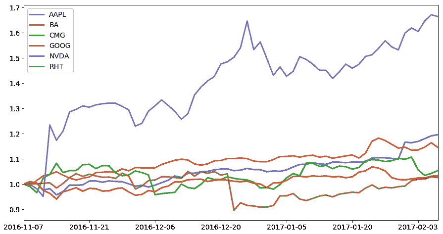
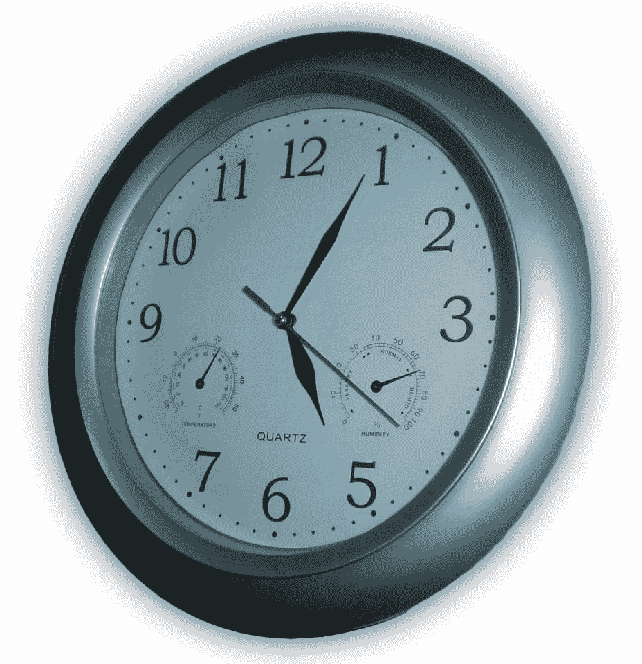
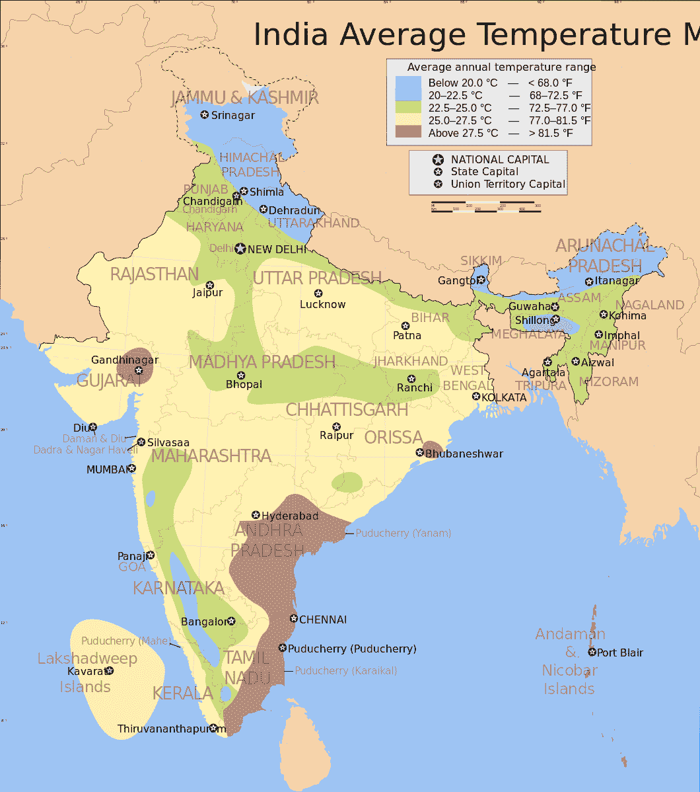
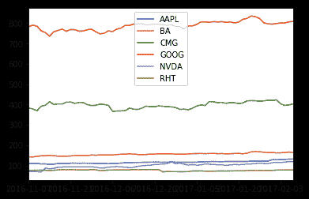
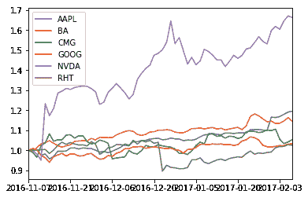
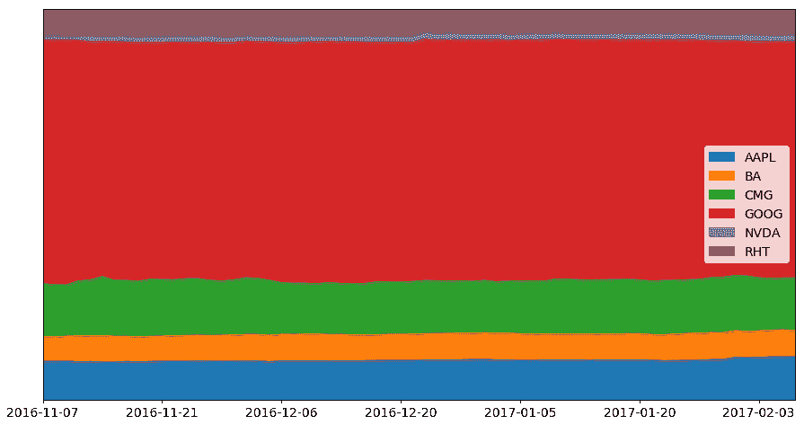
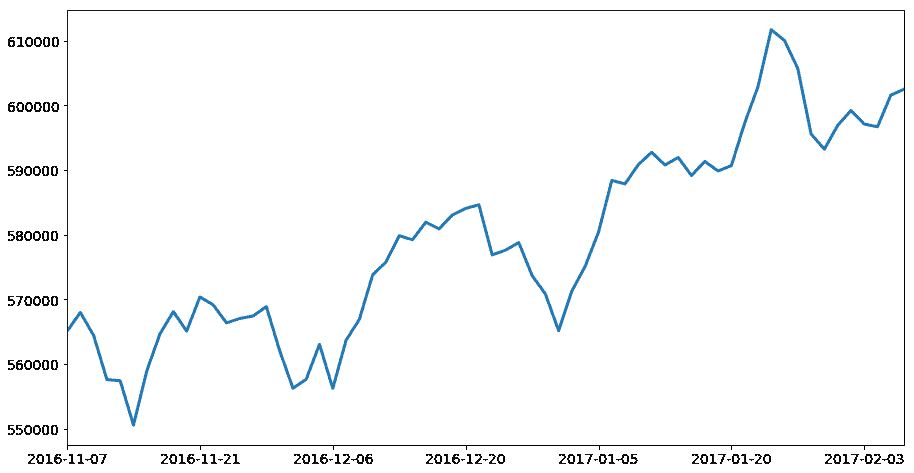

# Python 中有效数据可视化的 1 个技巧

> 原文：<https://www.dataquest.io/blog/how-to-communicate-with-data/>

February 9, 2017Yes, you read correctly — this post will only give you 1 tip. I know most posts like this have 5 or more tips. I once saw a post with *15* tips, but I may have been daydreaming at the time. You’re probably wondering what makes this 1 tip so special. “Vik”, you may ask, “I’ve been reading posts that have 7 tips all day. Why should I spend the time and effort to read a whole post for only 1 tip?” I can only answer that data visualization is about quality, not quantity. Like me, you probably spent hours learning about all the various charts that are out there — pie charts, line charts, bar charts, horizontal bar charts, and millions of others. Like me, you thought you understood data visualization. But we were wrong. Because **data visualization isn’t about making different types of fancy charts. It’s about understanding your audience and helping them achieve their goals.** Oh, this is embarrassing — I just gave away the tip. Well, if you keep reading, I promise that you’ll learn all about making effective data visualization, and why this one tip is useful. By the end, you’ll be able to make useful plots like this: 

先说一些日常生活中可能会让你惊讶的数据可视化。你知道吗，每当你在电视上看到天气图，查看挂钟上的时间，或者在红绿灯前停下来，你看到的都是数字数据的可视化表示。不相信我？让我们更深入地了解一下挂钟是如何显示时间的。当时机成熟时

你看不到时钟上的实际时间。而是你看到一只小“手”指向`5`，一只大“手”指向`1`，像这样:

我们被训练将数据的视觉表现转化为时间，

`5:05`。不幸的是，挂钟是数据可视化的一个例子，这使得理解底层数据变得更加困难。解析挂钟的时间比解析数字钟的时间要花费更多的脑力。在数字显示器上显示时间成为可能之前，挂钟就已经出现了，所以唯一的解决方案就是通过两个“指针”来显示时间。让我们来看一个更容易理解底层数据的可视化工具，即天气图。让我们以这张地图为例:

看着上面的地图，你可以立刻看出安得拉邦和泰米尔纳德邦的海岸是印度最热的地方。阿鲁纳恰尔邦和查谟和克什米尔是最冷的地区。我们可以看到较高平均温度过渡到较低平均温度的“线”。该地图非常适合查看地理温度趋势，尽管地图存在显示问题-一些标注溢出了它们的框，或者太亮。如果我们将它表示为一个表，我们将会“丢失”大量的数据。例如，从地图上，我们可以很快看出海德拉巴比安得拉邦的海岸更冷。为了传达地图中的所有信息，我们需要一个充满印度每个地方温度数据的表格，如下所示，但要长一些:

|  | 城市 | 年平均温度 |
| --- | --- | --- |
| Zero | 海得拉巴 | Twenty-seven |
| one | 金奈 | Twenty-nine point five |
| Two | 赖布尔 | Twenty-six |
| three | 新德里 | Twenty-three |

这张桌子很难从地理角度来考虑。表中相邻的两个城市可能在地理上相邻，也可能相距甚远。当你一次查看一个城市时，很难弄清楚地理趋势，所以这个表对于查看高层次的地理温度变化没有用。然而，这个表格对于查找你所在城市的平均温度非常有用——比地图有用得多。你可以立刻看出海德拉巴的年平均温度是

`27.0`摄氏度。理解哪些数据表示在哪些上下文中是有用的，对于创建有效的数据可视化是至关重要的。

### 到目前为止我们所了解到的

*   在表示数据方面，可视化并不总是比数字更好。
*   即使是看起来不怎么样的可视化，如果和受众的目标相匹配，也是有效果的。
*   有效的可视化可以让观众发现他们用数字表示永远找不到的模式。

在本帖中，我们将学习如何通过可视化我们投资组合的表现来进行有效的可视化。我们将用几种不同的方法来表示数据，并讨论每种方法的优缺点。太多教程都是从制作图表开始，却从来不讨论

为什么制作这些图表？在这篇文章的最后，你会对什么样的图表在什么情况下有用有更多的了解，并且能够更有效地使用数据进行交流。如果你想更深入地了解，你应该试试我们关于[探索性数据可视化](https://www.dataquest.io/course/exploratory-data-visualization/)和[通过数据可视化讲故事](https://www.dataquest.io/course/storytelling-data-visualization)的课程。我们将使用 [Python 3.5](https://www.python.org/downloads/release/python-350/) 和 [Jupyter notebook](https://jupyter.org/) 以防你想跟进。

## 数据的表格表示

假设我们持有一些股票，我们想跟踪它们的表现:

*   `AAPL` — 500 股
*   `GOOG` — 450 股
*   `BA` — 250 股
*   `CMG` — 200 股
*   `NVDA` — 100 股
*   `RHT` — 500 股

我们在 2016 年 11 月 7 日购买了所有股票，我们希望跟踪他们迄今为止的表现。我们首先需要下载每日股价数据，这可以通过

雅虎财经套餐。我们可以使用`pip install yahoo-finance`来安装包。在下面的代码中，我们:

*   导入`yahoo-finance`包。
*   设置要下载的符号列表。
*   遍历每个符号
    *   下载从`2016-11-07`到前一天的数据。
    *   提取每天的收盘价。
*   创建一个包含所有价格数据的数据框架。
*   显示数据帧。

```
 from yahoo_finance import Share
import pandas as pd
from datetime import date, timedelta

symbols = ["AAPL", "GOOG", "BA", "CMG", "NVDA", "RHT"]

data = {}
days = []
for symbol in symbols:
    share = Share(symbol)
    yesterday = (date.today() - timedelta(days=1)).strftime("%Y-%m-%d")
    prices = share.get_historical('2016-11-7', yesterday)
    close = [float(p["Close"]) for p in prices]
    days = [p["Date"] for p in prices]
    data[symbol] = close

stocks = pd.DataFrame(data, index=days)
stocks.head() 
```

|  | AAPL | 钡 | 圣迈克尔与圣乔治三等爵士 | 谷歌 | NVDA | RHT |
| --- | --- | --- | --- | --- | --- | --- |
| 2017-02-08 | 132.039993 | 163.809998 | 402.940002 | 808.380005 | 118.610001 | 78.660004 |
| 2017-02-07 | 131.529999 | 166.500000 | 398.640015 | 806.969971 | 119.129997 | 78.860001 |
| 2017-02-06 | 130.289993 | 163.979996 | 395.589996 | 801.340027 | 117.309998 | 78.220001 |
| 2017-02-03 | 129.080002 | 162.399994 | 404.079987 | 801.489990 | 114.379997 | 78.129997 |
| 2017-02-02 | 128.529999 | 162.259995 | 423.299988 | 798.530029 | 115.389999 | 77.709999 |

正如您在上面看到的，这给了我们一个表格，其中每一列是一个股票代码，每一行是一个日期，每个单元格是该股票代码在该日期的价格。整个数据帧有

`62`成排。如果我们想在特定的一天查找特定股票的价格，这是非常好的。例如，我可以很快知道 2017 年 2 月 1 日收盘时`AAPL`股票的价格是`128.75`。然而，我们可能只关心我们是否从每个股票代码中赚钱或赔钱。我们可以找到每股买入时的价格和当前价格之间的差额。在下面的代码中，我们从当前股票价格中减去买入时的价格。

```
 change = stocks.loc["2017-02-06"] - stocks.loc["2016-11-07"]
change 
```

```
 AAPL    19.879989
BA      20.949997
CMG     13.100006
GOOG    18.820007
NVDA    46.040001
RHT      1.550003
dtype: float64 
```

太好了！看起来我们每笔投资都赚了钱。然而，我们无法知道我们的投资增加了多少。我们可以用一个稍微复杂一点的公式来实现:

```
 pct_change = (stocks.loc["2017-02-06"] - stocks.loc["2016-11-07"]) / stocks.loc["2016-11-07"]
pct_change 
```

```
 AAPL    0.180056
BA      0.146473
CMG     0.034249
GOOG    0.024051
NVDA    0.645994
RHT     0.020217
dtype: float64 
```

看起来我们的投资在百分比上表现得非常好。但是很难说我们总共赚了多少钱。让我们将价格变化乘以我们的股份数，看看我们赚了多少:

```
 import numpy as np
share_counts = np.array([500, 250, 200, 450, 100, 500])
portfolio_change = change * share_counts
portfolio_change 
```

```
 AAPL    9939.99450
BA      5237.49925
CMG     2620.00120
GOOG    8469.00315
NVDA    4604.00010
RHT      775.00150
dtype: float64 
```

最后，我们可以合计一下我们总共赚了多少:

```
sum(portfolio_change)
```

```
31645.49969999996
```

看看我们的购买价格，看看我们赚了多少百分比:

```
sum(stocks.loc["2016-11-07"] * share_counts)
```

```
565056.50745000003
```

我们在数字数据表示方面已经走得很远了。我们能够计算出我们的投资组合价值增加了多少。在许多情况下，数据可视化是不必要的，一些数字可以表达你想分享的一切。在本节中，我们了解到:

*   数据的数字表示足以讲述一个故事。
*   在转向可视化之前，尽可能简化表格数据是一个好办法。
*   理解受众的目标对于有效地展示数据非常重要。

当您想要在数据中找到模式或趋势时，数字表示就不再适用了。假设我们想弄清楚 12 月份是否有股票波动更大，或者是否有股票下跌然后回升。我们可以尝试使用一些措施，比如

标准偏差，但他们不会告诉我们全部情况:

```
stocks.std()
```

```
 AAPL     6.135476
BA       6.228163
CMG     15.352962
GOOG    21.431396
NVDA    11.686528
RHT      3.225995
dtype: float64 
```

以上告诉我们

在我们的时间段内，`AAPL`的`68%`收盘股价在均价的`5.54`范围内。不过，很难说这表明波动性是低还是高。也不好说`AAPL`最近有没有涨价。在下一节中，我们将弄清楚如何可视化我们的数据，以确定这些难以量化的趋势。

## 绘制我们所有的股票符号

我们可以做的第一件事是对每个股票系列做一个绘图。我们可以通过使用

熊猫。DataFrame.plot 方法。这将为每个股票代码创建一个每日收盘价线图。我们需要首先对数据帧进行逆序排序，因为目前它是按日期的降序排序的，我们希望它按升序排序:

```
 stocks = stocks.iloc[::-1]
stocks.plot() 
```

```
<matplotlib.axes._subplots.AxesSubplot at 0x1105cd048>
```



上面的情节是一个好的开始，我们已经在很短的时间内走了很远。不幸的是，图表有点混乱，很难说出一些低价符号的总体趋势。让我们将图表标准化，将每天的收盘价显示为起始价的一部分:

```
 normalized_stocks = stocks / stocks.loc["2016-11-07"]
normalized_stocks.plot() 
```

```
<matplotlib.axes._subplots.AxesSubplot at 0x10f81b8d0>
```



该图更适合于查看每只股票价格的相对趋势。每条线都向我们展示了股票的价值相对于其购买价格是如何变化的。这向我们展示了哪些股票在百分比的基础上增加了，哪些没有。我们可以看到

我们买下它后，股票价格迅速上涨，并持续增值。`RHT`12 月底似乎损失了不少价值，但价格一直在稳步回升。不幸的是，这个情节有一些视觉问题，使情节难以阅读。这些标签挤在一起，很难看出`GOOG`、`CMG`、`RHT`、`BA`和`AAPL`发生了什么，因为这些线捆在一起了。我们将使用`figsize`关键字参数增加绘图的大小，并增加线条的宽度来解决这些问题。我们还将增加轴标签和轴字体大小，使它们更容易阅读。

```
 import matplotlib.pyplot as plt

normalized_stocks.plot(figsize=(15,8), linewidth=3, fontsize=14)
plt.legend(fontsize=14)
```

```
<matplotlib.legend.Legend at 0x10eaba160>
```


在上面的图中，从视觉上分离线条要容易得多，因为我们有更多的空间，而且线条更粗。标签也更容易阅读，因为它们更大。比方说，我们想知道随着时间的推移，每只股票占我们总投资组合价值的百分比是多少。我们需要首先用我们持有的股票数量乘以每个股票价格系列，然后除以总投资组合价值，然后绘制面积图。这将让我们看到一些股票的涨幅是否足以构成我们整个投资组合中更大的份额。在下面的代码中，我们:

*   将每只股票的价格乘以我们持有的股份数量，得到我们拥有的每种符号的股份总价值。
*   将每行除以当日投资组合的总价值，计算出每只股票占投资组合价值的百分比。
*   在面积图中绘制数值，其中 y 轴从`0`到`1`。
*   隐藏 y 轴标签。

```
 portfolio = stocks * share_counts
portfolio_percentages = portfolio.apply(lambda x: x/sum(x), axis=1)
portfolio_percentages.plot(kind="area", ylim=(0,1), figsize=(15,8), fontsize=14)
plt.yticks([])
plt.legend(fontsize=14)
```

```
<matplotlib.legend.Legend at 0x10ea8cda0>
```



正如你在上面看到的，我们投资组合的大部分价值在

`GOOG`股票。自从我们购买股票以来，每个股票代码的美元总分配没有太大变化。从另一个角度来看之前的数据，我们知道`NVDA`的价格在过去几个月里增长很快，但是从这个角度来看，我们可以看到它的总价值在我们的投资组合中并不算多。这意味着，尽管`NVDA`的股价大幅上涨，但它并没有对我们的整体投资组合价值产生巨大影响。请注意，上面的图表很难解析，也很难看出。这是一个图表的例子，通常最好是一系列数字，显示每只股票占投资组合价值的平均百分比。思考这个问题的一个好方法是“这个图表比其他图表能更好地回答什么问题？”如果答案是“没有问题”，那么你可能会更喜欢别的东西。为了更好地把握我们的整体投资组合价值，我们可以绘制出:

```
portfolio.sum(axis=1).plot(figsize=(15,8), fontsize=14, linewidth=3)
```

```
<matplotlib.axes._subplots.AxesSubplot at 0x110dede48>
```



当看上面的图时，我们可以看到我们的投资组合在 11 月初、12 月底和 1 月底损失了很多钱。当我们查看以前的一些地块时，我们会发现这主要是由于价格的下降

这是我们投资组合的大部分价值。能够从不同角度可视化数据有助于我们理清整个投资组合的故事，并更明智地回答问题。例如，制作这些图表帮助我们发现:

*   整体投资组合价值趋势。
*   哪些股票占我们投资组合价值的百分比。
*   个股的走势。

如果不理解这三点，我们就无法理解为什么我们的投资组合的价格会变化。让我们回到开始这篇文章时的技巧，理解你的读者和他们会问的问题会帮助你设计出符合他们目标的可视化效果。有效可视化的关键是确保它能帮助您的受众更容易地理解复杂的表格数据。

## 后续步骤

在这篇文章中，你学到了:

*   如何简化数字数据？
*   哪些问题可以用数字数据来回答，哪些问题需要可视化。
*   如何设计视觉效果来回答问题？
*   为什么我们首先要进行可视化？
*   为什么有些图表对我们的观众没那么有用。

如果您想更深入地了解如何探索数据并使用数据讲述故事，您应该查看我们在

[探索性数据可视化](https://www.dataquest.io/course/exploratory-data-visualization/)和[通过数据可视化讲故事](https://www.dataquest.io/course/storytelling-data-visualization)。