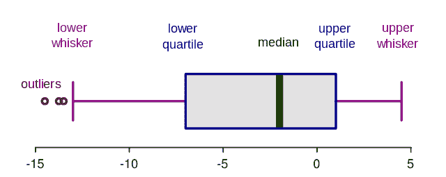
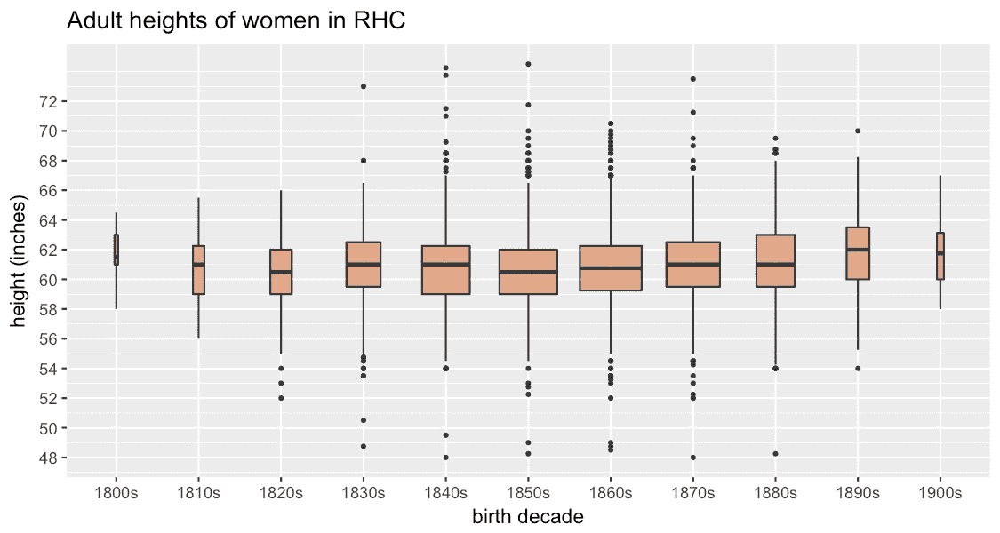
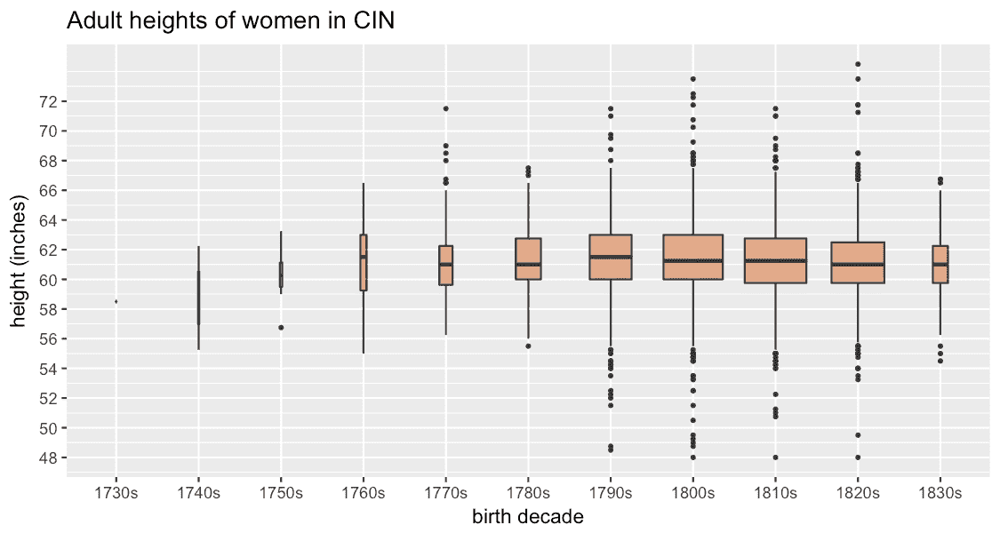
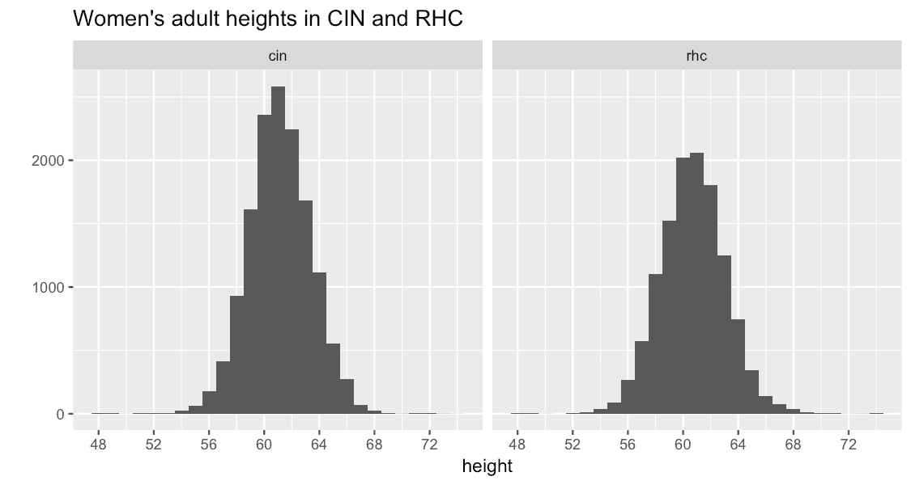
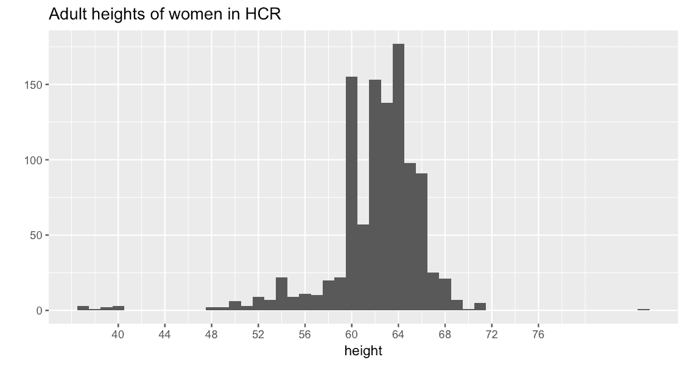

# 利用箱线图探索女性身高数据

> 原文：<https://www.dataquest.io/blog/box-plots-womens-heights/>

April 25, 2018

我最近一直在从事数字全景监狱(Digital Panopticon)的工作，这是一个数字历史项目，收集(并创建)了大量关于 19 世纪英国囚犯和罪犯的数据，包括几个数据集，其中包括女性的 T2 高度。儿童时期的环境因素对成年人的身高影响很大，其中最重要的因素是营养。所以，

> 因此，过去人口的身高可以告诉历史学家很多关于个人在成长过程中遇到的情况。只要有足够的数据，就可以窥见家庭内部的情况，从而拼凑出工资下降、物价上涨、卫生条件改善和家庭规模缩小对成年人平均身高影响的历史。

然而，在 18 世纪和 19 世纪的英国，许多关于身高和营养的研究都集中在军事记录上，因此很少涉及女性。在 19 世纪的刑事记录中使用丰富的男性和女性(以及儿童)身高记录是最近的事情。

今天的帖子将着眼于四个数字全景视觉数据集的高度模式，主要使用一种许多历史学家不熟悉的可视化方法:箱线图。如果你看过它们，但没有真正理解它们，没关系——直到最近我也没有一点头绪！所以，在我开始研究实际数据之前，我会先解释一下我学到了什么。

箱线图，或称盒须图，是一种非常集中的可视化方式，统计学家称之为数据集的“五位数摘要”:

1.  [中位数](https://en.wikipedia.org/wiki/Median)平均值；
2.  上四分位数(中间值和最大值的中间值)；
3.  下[四分位数](https://www.bbc.co.uk/schools/gcsebitesize/maths/statistics/representingdata3hirev4.shtml)(中间值和最小值的中间值)；
4.  最小值；和
5.  最大值。

这里有一个图表:

中间的绿色粗条标记了**中值**值。与此平行的两条蓝线(又名“铰链”)显示了**的上下四分位数**。从盒子中延伸出来的粉红色水平线是胡须。在这个版本的方框图中，**须**不一定延伸到最小值和最大值。相反，它们被计算以排除离群值**,这些离群值随后被绘制为胡须末端以外的单个点。**

 **那么这一切有什么意义呢？假设有两个数据集:一个包含值 **4，4，4，4，4，4，4，4** ，另一个包含值 **1，3，3，4，4，4，6，7** 。这两个数据集具有相同的平均值，但是值的分布非常不同。箱线图有助于更仔细地观察数据集中的这种变化，或者比较不同的数据集，如果只考虑平均值，这些数据集可能看起来非常相似。

这是四个数据集:

*   HCR，内政部犯罪记录 1790-1801，关押在纽盖特监狱等待审判的囚犯(总共 1226 人，1061 人年龄超过 19 岁)
*   [CIN](https://www.digitalpanopticon.org/Convict_Indents_(Ship_and_Arrival_Registers)_1788-1868) ，囚犯契约 1820-1853，囚犯被运送到澳洲(17183 高地，14181 超过 19)
*   [PLF](https://www.digitalpanopticon.org/UK_Licences_for_the_Parole_of_Convicts_1853-1925) ，女性监狱执照 1853-1884，女性罪犯被判处劳役刑(571 高地，535 超过 19)
*   [RHC](https://www.digitalpanopticon.org/Metropolitan_Police_Register_of_Habitual_Criminals_1881-1925) ，1881-1925 年惯犯登记册，出狱后受警方监管的惯犯(12599 高地，12118 超过 19)

对于每个数据集，我只包括有出生年份的女性，或者出生年份可以通过年龄和日期以及身高来计算的女性。(上面我说“高度”是因为我不能保证他们都是独一无二的个体；但几乎所有人都应该如此。)在下面所有的图表中，我只包括 19 岁以上的成年女性。

当你绘制 RHC 每个出生十年的身高时，会发生这样的情况。

(这是使用 R 包 [ggplot2](https://ggplot2.tidyverse.org/reference/geom_boxplot.html) 生成的，它看起来与您将在网上看到的许多示例略有不同，因为 ggplot 有一个很好的功能，可以根据数据组的大小改变框的宽度。)

我首先寻找的是可能暗示数据有问题的不一致之处，总体来说看起来不错——这些方框基本上是对称的，没有一个异常值在可能性范围之外(最高的女性是 74.5 英寸，或 6 英尺 2 1/2，最短的是 48 英寸)，尽管我有点怀疑这个数据集中是否有出生于 19 世纪的女性，这个数据开始于 19 世纪 80 年代；尽管如此，他们是一个非常小的数字，所以不太可能扭曲事情的整体。由于数据乍一看似乎还不错，有趣的是，从 19 世纪 50 年代开始，女性越来越高，19 世纪 90 年代出生的女性比 19 世纪 80 年代出生的女性高很多。这与 Deb Oxley 对相同数据的(更精细的)观察相当一致。

这是 CIN:

同样，我们有一个合理的身高分布，幸运的是有极少数轻微问题的早产。(碰巧的是，这些数据是手动转录的，而 RHC 是用光学字符识别创造的——但另一方面，RHC 的来源是打印的，比手写的凹痕清晰得多。)暂且忽略 18 世纪 70 年代之前的极小群体，该数据中最高的十年女性群体是那些出生于 18 世纪 90 年代的人，此后她们一直变矮。

让我们把所有四个数据集放在一起！(点击图片查看大图。)

[T2】](https://earlymodernnotes.files.wordpress.com/2018/03/heights_17501899_boxplot1.png)

我已经过滤掉了 1750 年之前和 1899 年之后出生的女性，因为这些数字非常小，还有一些极端的异常值(后面会有更多关于这些的……)。然后我在 19 世纪 20 年代的中间值(中点)添加了一个指南，因为我认为它有助于看到趋势。

乍一看，18 世纪晚期的 HCR 女性比 19 世纪 90 年代之前的任何一批女性都要高，这似乎令人惊讶。然而，这里的趋势与罗德里克·弗洛德等人对 1740 年至 1914 年间英国男人和男孩的开创性研究大体一致。他们认为“英国男性连续出生队列的平均身高在 1740 年至 1840 年间增加，在 1840 年至 1850 年间下降，从 19 世纪 50 年代起再次增加”(哈里斯，“健康、身高和历史”)。在 19 世纪的大部分时间里，英国人口吃得不太好(因为食物资源难以跟上人口的快速增长)，结果人口变少了。然而，1850 年后，我们的女性增长可能比男性慢(直到 19 世纪 90 年代)；也许女性比男性需要更长的时间才能重新开始生长。

不过，最后，我必须对 HCR 的数据提出一个重大警告。我提到我从上面的图表中排除了一些极端的异常值。HCR 是迄今为止最糟糕的罪犯，如果你仔细观察 HCR 所覆盖的 18 世纪人群，这些盒子并不像 19 世纪的盒子那样对称。如果我们使用直方图(另一种检查数据集中值的分布的简便方法)将其可视化，我们可以更清楚地看到有什么事情发生了。人口中的“正常”身高分布应该看起来像一条[“钟形曲线”——非常紧密且对称地围绕平均值](https://www.usablestats.com/lessons/normal)。CIN 和 RHC 很近:

但这就是 HCR 的样子。这可不好。

如果我们幸运的话，大部分问题可能是数据中的错误，这些错误是可以修复的。毕竟，它至少是大致正确的形状！然而，60 英寸(5 英尺)的高峰敲响了警钟。这看起来让人想起我们在数字全景监狱的大部分年龄数据中遇到的一个问题，称为“[堆积](https://sites.dartmouth.edu/censushistory/2015/12/26/age-heaping-in-the-u-s-census/)”，倾向于将年龄四舍五入到最接近的 0 或 5(人们通常不知道他们的确切出生日期)。与这个峰值相比，年龄堆积是非常温和的，所以我认为这很可能是转录或用于提取高度的方法的另一个问题。但如果事实证明不是这样，这可能会很成问题。我们假设这些囚犯被适当地测量过，但是我们对所使用的设备一无所知。就我们所知，它可能经常在很大程度上是猜测工作。最终，我们可能会发现 HCR 根本不足以用于人口统计分析。18 世纪出生的女性身高数据很少，所以这是一个潜在的非常重要的来源。但是如果不能胜任工作呢？

[GitHub 上的数据](https://github.com/sharonhoward/whm18)

### 进一步阅读

*   约翰·坎宁(John Canning)，[人文学科统计](https://statisticsforhumanities.net/book/) (2014)，尤其是第三章。
*   [统计简介:箱线图](https://courses.lumenlearning.com/introstats1/chapter/box-plots/)
*   [正态分布](https://www.usablestats.com/lessons/normal)
*   [H Maxwell-Stewart](https://www.lawcrimehistory.org/journal/vol.5%20issue1%202015/Maxwell-Stewart%20Height.pdf) ，K Inwood 和 M Cracknell，《高度、犯罪与殖民历史》，《法律、犯罪与历史》(2015)。
*   黛博拉·奥克斯利(Deborah Oxley)、大卫·梅雷迪思(David Meredith)和萨拉·霍雷尔(Sara Horrell)，《19 世纪英国生活水平和性别不平等的人体测量》，当地人口研究，2007 年。
*   黛博拉·奥克斯利、[生物识别](https://www.digitalpanopticon.org/Biometrics)、【https://www.digitalpanopticon.org】T2(2017)。
*   伯纳德·哈里斯，“健康、身高和历史:人体测量史近期发展综述”，医学社会史(1994)。
*   [Jessica M. Perkins](https://www.ncbi.nlm.nih.gov/pmc/articles/PMC4892290/) 等人，《成人身高、营养和人群健康》，营养评论(2016 年)。

*编者按:这最初是[发布在早期现代笔记](https://earlymodernnotes.wordpress.com/2018/03/17/whm18-womens-heights-in-the-digital-panopticon/?utm_source=dataquest&utm_medium=blog)上，作为我们关注女性历史月的一部分，已经被 perlesson 转载。作者[莎伦·霍华德](https://sharonhoward.org/?utm_source=dataquest&utm_medium=blog)在谢菲尔德大学担任数字历史项目的项目经理。***