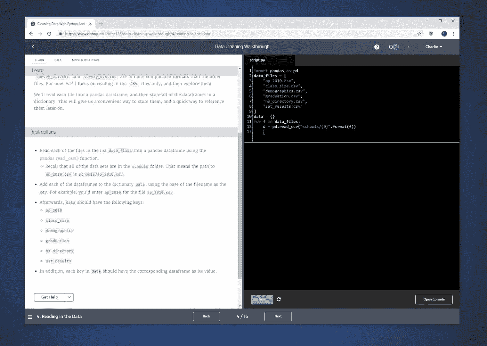

# 一位人文学科教师如何通过 Dataquest 学习数据科学

> 原文：<https://www.dataquest.io/blog/humanities-learn-data-science/>

February 4, 2019

Greg Iannarella 生动地证明了学习数据科学不需要数学、科学或编程背景。

“我的整个学术背景都是非常严格的人文学科，”他说。“没有数学或科学或类似的东西。我一直对这些东西很感兴趣。但你知道学校是如何运作的:如果你在某方面没有完全的天赋，有时你会被劝退。”

因此，格雷格在大学时专注于人文学科，然后在研究生院再次。但是当他在那里的时候，他遇到了一位教授，他正在做有趣的语言学工作:统计特定的单词在文本中出现的频率，“并就这似乎如何告知我们对文学如何工作的更大文化理解进行辩论。”

这位教授没有进行任何数据科学编程——事实上，格雷格说，他正在用手计算单词*——但分析数字数据以更好地理解文献的想法很有趣。在格雷格看来，分析方法可以与他读到的一个更广泛的趋势相结合:数字人文，使用数字工具和分析来解决人文问题。*

 *尽管如此，仅凭这一点还不足以让 Greg 投身于数据科学。是什么最终把他推到了悬崖边？打赌。

他的哥哥是一名计算机科学家，在一次旅行中，两人就哪门课程更难展开了辩论:格雷格的英语硕士和他哥哥的计算机科学硕士。他们决定用一个赌注来解决这场争论:格雷格将学习计算机科学，他的兄弟将学习英国文学。

## 使用 Dataquest 学习

尽管 Greg 认为学习数据科学编程很有意义，但他不确定具体从哪里开始。“我只是在寻找我可以开始使用的免费工具，”他说。

“在我找到[Dataquest]之前，我已经浏览了 Codecademy 的所有免费内容，”他说。“我找到了 Dataquest，轻松地通过了免费部分和免费课程，[我]尝试了许多其他竞争对手。”

“将我带回 Dataquest 的是您的 shell，在您的 shell 中工作并拥有并排视图。感觉很舒服。”

<figure id="63ad7b30d2e05" aria-labelledby="figcaption_63ad7b30d2e05" class="wp-caption ">

<figcaption id="figcaption_63ad7b30d2e05" class="wp-caption-text">学以致用，在 Dataquest 平台上并肩前行。</figcaption>

</figure>

他还喜欢 Dataquest 平台解释了*为什么*以及*如何*。“我认为这是你们应该关注的一件事，”格雷格说，“这就是我们为什么要这么做，这就是我们下一步该怎么做。这很有帮助。这对我帮助很大。”

“不是每个服务都这样做，”他补充道。“有时候他们真的会把你扔进深水区。那就是你了。游来游去。”

Greg 从我们的数据科学途径的 [Python 开始。但他并没有就此止步。他还在其他网站上学习课程，在 EdX 上了一堂生物信息学课后，他也开始用 Dataquest](https://www.dataquest.io/path/data-scientist) 钻研[学习 R。](https://www.dataquest.io/path/data-analyst-r)

## 面向所有人的数据科学

在学习的同时，Greg 还在思考如何将新的数据科学知识应用到工作中:在 Seton Hall 大学为新生教授英语和文学。

“我认识到的一件事是，有时候……这是关于改变你对提问的想法，”他说。"然后我如何把它应用到教人们如何写文章上？"

他想出的是一个将更多“数字人文”融入西顿霍尔大学新生英语课程的计划。

当然，他没有要求大一的英语学生学习编程，但他给了他们一个数据分析工具，让他们可以绘制和查看数据，如给定位置的公民医疗支出或教育水平。使用这个工具，学生们可以自己进行数据分析，然后写文章反思他们的发现。

格雷格说，这个项目“非常成功”，数字人文学科正在流行起来。他将在今年春天展示他的成果，试图鼓励更多类似的工作。他还发现了一群对数据研究感兴趣的其他人文学者。“是英语系、宗教系和历史系的人，我们都在学习 R，讨论如何使用 R 来参与我们的学习。这很酷，”他说。“我把很多人推向 Dataquest，作为一种尝试的方式。”

这种编程、科学、数学和人文学科的综合对 Greg 来说很自然。“我总觉得这种奇怪的感觉，人文和科学一开始就被分开了。它们看起来像是相互补充、相互补充的东西。沃森和克里克关于双螺旋的论文和著作都充满了难以置信的诗意。还有英国的浪漫派和维多利亚派，他们都在探索科学。”

他还认为拥抱数据和技术是人文学科研究的下一个明显进步。“我认为很多不用技术就能完成的人文学科的工作已经完成了，”他说。“我认为，未来将着眼于我们使用技术的方式。”

## 寻找成功

学习数据科学并不总是一帆风顺。Greg 面临的最大挑战之一是在本地进行设置，这样他就可以在自己的计算机上编写代码。“我可以在 Dataquest 的外壳上做一些事情，但我无法让我的电脑做这些事情。在那个时候，我准备把我的电脑扔出窗外，完全放弃它。但是你必须深呼吸，认识到答案就在某个地方。你只需要愿意研究并有耐心。”

你还需要认识到这将是一个漫长的旅程。“我什么时候和我哥哥一起去旅行的？那一定是两年前了。这会花你很长时间。”

“你只需要保持一致，不要气馁，”他说。

如果你想快速进步，格雷格建议你要专注于接触，让自己沉浸在所学的东西中。“有一件事很有帮助，当我不能在电脑前时，我会在手机上下载免费的 PDF 书籍，”格雷格说。"试着流利地使用这种语言，并继续让自己接触它."

至于计算机科学和英语孰优孰劣？

格雷格说:“(我哥哥)仍然阅读有趣和优秀的文学作品，但我肯定不是计算机科学或数据科学的硕士。”。“但我一直朝着它努力。”

“所以是啊。我想我们大概扯平了。”

*无论你的学术背景如何，你也可以学习数据科学。点击这里[免费上手 Python](https://www.dataquest.io/course/python-for-data-science-fundamentals) 或[R](https://www.dataquest.io/course/introduction-to-data-analysis-in-r/)T5。**