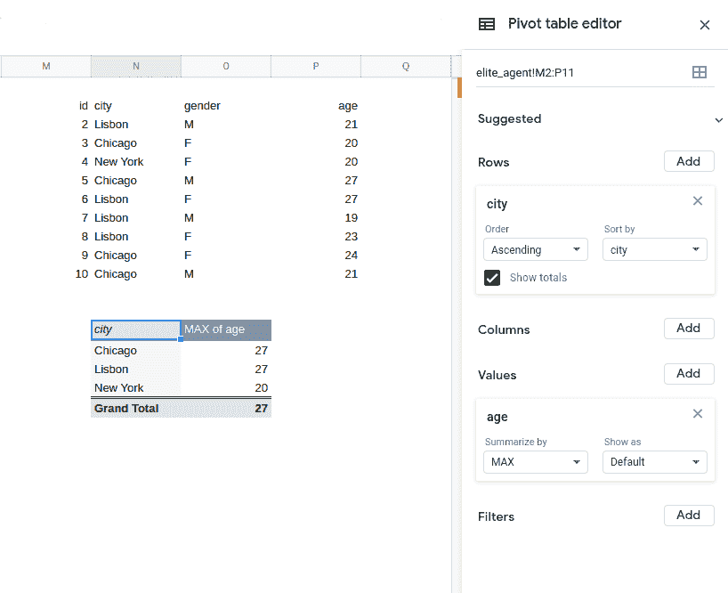

# SQL 教程:选择没有聚合函数的未分组列

> 原文：<https://www.dataquest.io/blog/sql-tutorial-selecting-ungrouped-columns-without-aggregate-functions/>

January 12, 2021

什么时候一个返回正确答案的 SQL 查询实际上是错误的？在本教程中，我们将仔细看看一个非常常见的错误。它实际上会返回正确的答案，但它仍然是一个必须避免的错误。

这听起来可能相当神秘，所以让我们开始吧。我们将举例说明您可能甚至不知道自己正在犯的 SQL 错误，并强调如何正确处理这个问题。

## 问题:正确的答案，但错误的 SQL 查询

在 Dataquest，我们最喜欢用来教授 SQL 的数据库之一是[Chinook](https://github.com/lerocha/chinook-database)——一个虚拟在线音乐商店记录的数据库。在[我们使用的一门课程](https://www.dataquest.io/course/sql-joins-relations/)中，学员们被要求从每个国家中找出花钱最多的顾客。

他们经常最终创造出下面的 [CTE](https://en.wikipedia.org/wiki/Hierarchical_and_recursive_queries_in_SQL#Common_table_expression) 。它包含每个客户的一行，其中包含他们的姓名、国家和消费总额:

| 国家 | 客户名称 | 总计 _ 已购买 |
| --- | --- | --- |
| 阿根廷 | 迭戈·古铁雷斯 | Thirty-nine point six |
| 澳大利亚 | 马克·泰勒 | Eighty-one point one eight |
| 奥地利 | 阿斯特丽德·格鲁伯 | Sixty-nine point three |
| 比利时 | 好了，伙计们 | Sixty point three nine |
| 巴西 | 路易斯·贡萨尔维斯 | One hundred and eight point nine |
| 加拿大 | 弗朗索瓦·特伦布莱 | Ninety-nine point nine nine |
| 辣椒 | 路易斯·罗哈斯 | Ninety-seven point zero two |
| 捷克共和国 | 卫曲德人 | One hundred and forty-four point five four |
| 丹麦 | 卡拉·尼尔森 | Thirty-seven point six two |
| 芬兰 | 你好蜘蛛侠 | Seventy-nine point two |
| 法国 | 怀亚特吉拉德 | Ninety-nine point nine nine |
| 德国 | Fynn Zimmermann | Ninety-four point zero five |
| 匈牙利 | Ladislav Kovács | Seventy-eight point two one |
| 印度 | Manoj Pareek 先生 | One hundred and eleven point eight seven |
| 爱尔兰 | 休·奥莱利 | One hundred and fourteen point eight four |
| 意大利 | 卢卡斯·曼奇尼 | Fifty point four nine |
| 荷兰 | 约翰内斯·范德伯格 | Sixty-five point three four |
| 挪威 | Bjørn Hansen | Seventy-two point two seven |
| 波兰 | 我的天 | Seventy-six point two three |
| 葡萄牙 | 约翰·费尔南德斯 | One hundred and two point nine six |
| 西班牙 | 恩里克·穆尼奥斯 | Ninety-eight point zero one |
| 瑞典 | 乔金约翰森 | Seventy-five point two four |
| 美利坚合众国 | 杰克·史密斯 | Ninety-eight point zero one |
| 联合王国 | 菲尔·休斯 | Ninety-eight point zero one |

我们称之为 CTE。

通常，他们会使用以下查询获得正确的输出:

```
SELECT country, customer_name,
       MAX(total_purchased)
  FROM customer_country_purchases
 GROUP BY country;
```

英文:选择国家，该国家的最高消费金额，并包括客户的姓名。

这是一个非常自然的尝试，它会产生正确的输出！然而，正如您可能已经从我的措辞中预料到的那样，这个解决方案并不像看上去那样简单。

## 这有什么不好？

这篇文章的目的是澄清什么是反对上述方法。为了更容易直观地看到正在发生的事情，我们将放弃 Chinook，使用一个更小的表。我们将使用`elite_agent`表。

(这也是虚构的数据库；可以把它想象成一个按城市、性别和年龄排列的特工表)。

| 身份证明（identification） | 城市 | 性别 | 年龄 |
| one | 里斯本 | M | Twenty-one |
| Two | 芝加哥 | F | Twenty |
| three | 纽约 | F | Twenty |
| four | 芝加哥 | M | Twenty-seven |
| five | 里斯本 | F | Twenty-seven |
| six | 里斯本 | M | Nineteen |
| seven | 里斯本 | F | Twenty-three |
| eight | 芝加哥 | F | Twenty-four |
| nine | 芝加哥 | M | Twenty-one |

如果你想尝试一下，这里有一个包含这个表的 SQLite 数据库。

如果我们将该表与我们使用的 Chinook 表进行比较，我们会发现它们在如何处理每列中的数据方面非常相似:

*   `country`在奇努克数据库中类似于城市
*   `name`类似于性别
*   `total_purchased`类似于年龄

考虑到这一点，我们可以为这个新表构造一个查询，这个查询本质上与我们在 Chinook 中看到的有问题的查询相同:

```
SELECT city, gender,
       MAX(age) AS max_age
  FROM elite_agent
 GROUP BY city;
```

在代码方面，这些查询是等效的。

那么他们有什么问题呢？让我们开始回答这个问题。

据推测，这个查询的目标是确定最老的代理的年龄。如果我们不想要名字，我们将运行下面的查询。

```
SELECT city,
       MAX(age) AS max_age
  FROM elite_agent
 GROUP BY city;
```

下面是使用 SQLite 引擎的输出:

| 城市 | 经营 |
| --- | --- |
| 芝加哥 | Twenty-seven |
| 里斯本 | Twenty-seven |
| 纽约 | Twenty |

因为我们是按`city`分组的，每行代表一个城市。我们还包括了每个组的最大年龄。

如果我们包括`gender`，我们将重现我们看到的这个表的第一个查询——不正确的那个。

为什么在这个查询中包含性别很重要？我们的结果是每组一行——在本例中，每个城市一行。城市没有性别，所以我们可以说在这个查询中包含性别在概念层面上没有意义。

但这不是这里的实际问题。***T2】***

 **### 用正确的方法学习 SQL！

*   编写真正的查询
*   使用真实数据
*   就在你的浏览器里！

当你可以 ***边做边学*** 的时候，为什么要被动的看视频讲座？

[Sign up & start learning!](https://app.dataquest.io/signup)

## “空列”问题

我们将调用在`SELECT`中的列/表达式，这些列/表达式不在[聚合函数](https://en.wikipedia.org/wiki/Aggregate_function)中，也不在`GROUP BY`、**和**、**列**中。换句话说，如果我们的结果包括一个我们没有分组的列，我们也没有对它执行任何类型的聚合或计算，这就是一个空列。

在上面的查询中，`gender`将生成一个空列——我们没有按性别分组，也没有对性别数据进行任何类型的聚合。这里的性别数据点本质上是“逢场作戏”

现在，在我们的课程中，我们使用的是 [SQLite](https://sqlite.org/index.html) ，这在现实工作中也很常见。尽管空列不会给查询增加意义，但 SQLite 确实允许它们存在:

```
SELECT city, gender,
       MAX(age) AS max_age
  FROM elite_agent
 GROUP BY city;
```

| 城市 | 性别 | 经营 |
| --- | --- | --- |
| 芝加哥 | M | Twenty-seven |
| 里斯本 | F | Twenty-seven |
| 纽约 | F | Twenty |

有了这些结果，人们可能会认为这个查询是有意义的，因为包含`gender`意味着包含年龄等于`max_age`的代理的`gender`。

但是，当我们不用最大年龄来计算平均值这样的统计数据时，这种辩护就站不住脚了:

```
SELECT city, gender,
       AVG(age) AS mean_age
  FROM elite_agent
 GROUP BY city;
```

| 城市 | 性别 | 平均年龄 |
| --- | --- | --- |
| 芝加哥 | M | Twenty-three |
| 里斯本 | F | Twenty-two point five |
| 纽约 | F | Twenty |

在这里，我们看到一个城市，该城市中代理的平均年龄，以及性别。但是这个性别栏是什么意思呢？

检查表格，我们看到对于每个给定的城市，**没有代理人的年龄等于他们城市的平均值**。在这种情况下，输出完全是无意义的。

即使有年龄等于平均值的代理，也不会使输出正确。

我们还可以看到，这在电子表格的数据透视表世界中是不正确的。



在上面的数据透视表中，如果我们将`gender`作为一个值，我们将被迫选择一个聚合函数，如果我们将它作为一行，我们将得到下表:


它为每一个现有的城市和性别的组合创造了一个群体，这不是我们想要的。

那么，为什么下面的查询运行良好呢？

```
SELECT city, gender,
       MAX(age) AS max_age
  FROM elite_agent
 GROUP BY city;
```

由于 SQLite 中的一个特殊特性，这个查询成功了(即，它输出了正确的结果)。来自[文档](https://sqlite.org/lang_select.html#resultset):

> 当在聚合查询中使用 [min()](https://sqlite.org/lang_aggfunc.html#maxggunc) 或 [max()](https://sqlite.org/lang_aggfunc.html#minggunc) 聚合函数时，结果集中的所有空列都从包含最小值或最大值的输入行中获取值

## 避免 SQL 查询中的空列

虽然 SQLite 以这种方式处理问题，并因此输出正确的结果，尽管包含了空列，**这种行为在不同的数据库中并没有标准化**。因此，如果我们决定依赖它，我们应该小心——在 SQLite 之外的东西上运行相同的查询可能会产生不同的结果。

更广泛地说，这是 SQL 约定:**查询不应该有空列**。这个约定是[在](https://crate.io/docs/sql-99/en/latest/chapters/33.html#group-by-clause) [SQL:1999](https://en.wikipedia.org/wiki/SQL:1999) 中引入的——一套关于 SQL 应该如何工作的规则。根据该标准:

> 此外，当`SELECT`语句包含`GROUP BY`时，该语句的选择列表可能只包含对每个组都是单值的列的引用——这意味着选择列表不能包含对不包含在`GROUP BY`子句中的中间结果列的引用，除非该列是 set 函数之一的参数(`AVG`、`COUNT`、`MAX`、`MIN`、`SUM`、`EVERY`、`ANY`、`SOME`)。其中的每一个都将来自一列的值的集合缩减为单个值)。

避免裸露的色谱柱有以下好处:

*   它允许代码移植到其他数据库。一些 SQL 引擎不接受空列作为有效查询。运行它的人可能会表现出意想不到的行为。
*   它使代码更具可读性:如果不使用空列，没有 SQLite 经验的人会更容易理解代码。
*   它使代码更加直观——正如我们在上面看到的，空列通常没有意义，所以包含它们会使数据更难解释。

第一点可能是最重要的。例如， [T-SQL](https://en.wikipedia.org/wiki/Transact-SQL) 会对同一个查询产生以下错误:

`Column 'elite_agent.gender' is invalid in the select list because it is not contained in either an aggregate function or the GROUP BY clause.`

同样， [Postgres](https://en.wikipedia.org/wiki/PostgreSQL) 会给我们`ERROR: column "elite_agent.gender" must appear in the GROUP BY clause or be used in an aggregate function Position: 14`。

最后，[甲骨文](https://en.wikipedia.org/wiki/Oracle_Database)给了我们`ORA-00979: not a GROUP BY expression`。

这个错误信息并不特别详细，但是[文档](https://docs.oracle.com/cd/B10501_01/server.920/a96525/e900.htm#1000623%5D(https://docs.oracle.com/cd/B10501_01/server.920/a96525/e900.htm#1000623))告诉我们:

> GROUP BY 子句不包含 SELECT 子句中的所有表达式。GROUP BY 子句中必须列出未包含在组函数中的选择表达式，如 AVG、计数、最大值、最小值、总和、标准偏差或方差。

MySQL 是上述第一点的另一个很好的例子，因为这种查询的结果并不总是相同的(与 SQLite 相反)。另一个是 [SAS](https://en.wikipedia.org/wiki/SAS_(software)) ，它为每个结果重复性别值:

| 城市 | 性别 | 年龄 |
| --- | --- | --- |
| 芝加哥 | F | Twenty-three |
| 芝加哥 | M | Twenty-three |
| 里斯本 | F | Twenty-two point five |
| 里斯本 | M | Twenty-two point five |
| 纽约 | F | Twenty |

## 我们如何解决它？

让我们回到最初的查询，回顾一下为什么它会有问题，尽管它确实产生了正确的输出(至少在使用 SQLite 时):

```
SELECT country, customer_name,
       MAX(total_purchased)
  FROM customer_country_purchases
 GROUP BY country;
```

我们现在可以做如下观察:

*   当每行(组)代表一个国家时，包含`customer_name`是没有意义的。
*   这种解决方案在技术上最终是正确的，但这只是因为 SQLite 处理这类查询的方式不同于标准方式。
*   主要的要点是:**使用`GROUP BY`子句的查询不应该有空列。**

经过这一切，我们仍然没有提供一个适当的方法来解决这个问题。有一种方法可以从战略上分解如下:

*   创建一个表格，查找每个国家的最大花费金额。
*   将`customer_country_purchases`与上面在 amount 列上创建的表连接起来。

```
SELECT ccp.country,
       ccp.customer_name,
       ccp.total_purchases AS total_purchased
  FROM customer_country_purchases AS ccp
 INNER JOIN (SELECT country,
                    MAX(total_purchases) AS max_purchase
               FROM customer_country_purchases
              GROUP BY 1) AS cmp
    ON ccp.country = cmp.country
       AND ccp.total_purchases = cmp.max_purchase
 ORDER BY ccp.country;
```

在[社区](https://community.dataquest.io/)的[这个](https://community.dataquest.io/t/190-8-why-did-the-anser-took-a-much-longer-complex-road/48327/2?u=bruno)帖子里可以找到这个练习的完整解决方案。虽然解决方案是由这篇博文的作者写的，但主要观点是由我们的一位学习者提出的！

您可能会发现另一个有用的资源:[我们的 SQL 备忘单](https://www.dataquest.io/blog/sql-cheat-sheet/)，可以在线获得，也可以下载 PDF。

### 用正确的方法学习 SQL！

*   编写真正的查询
*   使用真实数据
*   就在你的浏览器里！

当你可以 ***边做边学*** 的时候，为什么要被动的看视频讲座？

[Sign up & start learning!](https://app.dataquest.io/signup)**