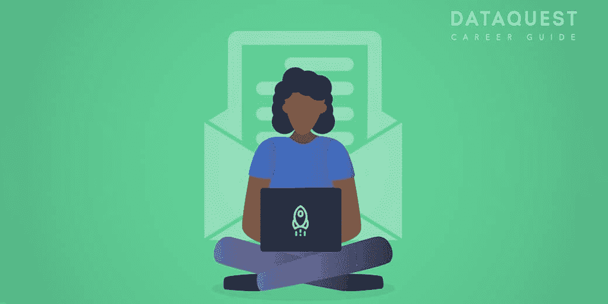

# 如何填写工作申请表以及何时申请

> 原文：<https://www.dataquest.io/blog/career-guide-data-science-application-forms/>

March 29, 2019

我们已经介绍了[简历](https://www.dataquest.io/blog/how-data-science-resume-cv)和[项目组合](https://www.dataquest.io/blog/career-guide-data-science-projects-portfolio)，这是任何数据科学工作申请中最重要的两个方面。但是你可能会被要求提供一些其他的申请材料，以及在申请数据科学工作时需要考虑的其他事情。

( **本文是我们深入数据科学职业指南的一部分。要阅读其他文章，请参考* [<u>*目录*</u>](https://www.dataquest.io/blog/data-science-career-guide/) *或这篇文章后面的链接。* )*

## 在线数据科学职位申请表

在你花了那么多时间制作一份看起来很酷的简历之后，为你申请的每家公司填写不同的在线表格可能会很烦人。

不幸的是，这往往是一个必要的邪恶。即使你已经亲自建立了联系，有时你也会被要求在线填写申请表，以便进入官方系统。

由于在求职过程中无法避免这些问题，所以在填写在线申请表时，你需要考虑以下几点:

#### 如果可能的话，避免通过大型求职网站申请

如果你在 LinkedIn，或者 AngelList 等大型招聘网站上看到一份招聘信息。并且被要求在那里填写一份申请表，那么先花些时间看看这份工作是否在其他地方发布是值得的。

通常，你会发现在该公司的网站上有一种更直接的方式来申请这份工作，这种方式允许你直接提交 PDF 格式的简历，而不必在网上表格中输入所有内容。

即使你在公司网站上遇到另一个在线表格，填写公司网站上直接引用的申请几乎肯定是一个比使用 LinkedIn 上的“轻松申请”或大型求职网站上的任何“轻松”申请功能更好的主意。

这些功能确实让你很容易快速地向几十个不同的职位提交相同的申请材料，但从一份不是专门为该职位量身定制的申请中获得回应是不太可能的。

此外，一些招聘经理和招聘人员在通过大型网站提交的申请上花费的时间更少，因为对于技能型技术职位来说，这些网站通常比其他招聘渠道产生的申请人质量更低。

因此，即使你在 LinkedIn 上找到了一份工作，如果该公司的网站上有一份不同申请表格或流程的工作列表，那么最好还是通过该公司的网站申请。

#### 根据工作量身定制你的答案，包括关键词

在典型的申请表上，你必须填写简历上的大部分或全部信息。

不要把这当成一个无聊的复制粘贴任务，而是以此为借口，重新审视你的简历，在你进入简历时，根据你申请的具体工作修改每一部分(当然，同时保持对你的资历的诚实，避免打字错误)。

尤其是那些会吸引大量申请者的初级职位，你的表格很有可能会在人看到之前被机器审查。

这也是许多公司需要这种表格输入工作申请的部分原因:机器扫描这些回复比扫描数百个不同大小和格式的 pdf 要容易得多。

你的简历和申请表的回复应该考虑到人类读者，但是也要考虑到机器人。从职位描述中找出重要的关键词，并确保在填写表格时包含这些关键词。

如果雇主在寻找一个特定的技能，他们可能会自动拒绝任何没有提到这个关键词的申请。

事实上，即使是招聘人员也会这么做。“在第一轮筛选中，”SharpestMinds 联合创始人爱德华·哈里斯(Edouard Harris)说，“看你简历的人几乎只是在做愚蠢的关键词匹配。你需要尽可能多的关键词重叠。”

不过，包含这些关键词应该不是什么难事。你在任何申请表格中所包含的内容都应该是你技能的真实体现。

如果你很难将职位描述中的关键词融入到申请材料中，这可能是一个信号，表明你不适合这份工作，你的时间可以更好地用在其他申请上。

## 分享和准备社交媒体账户

许多工作申请表会要求你分享社交媒体链接，如果你有的话。一般来说，是否分享取决于你自己，但对于许多数据科学职位来说，你可能需要分享两个网络，你可能需要做一些准备工作。

#### 开源代码库

对于大多数数据科学和数据分析师的工作来说，这是必须的。这可能是你展示你的项目的地方，雇主无论如何都会想看一看，以确保你积极参与到数据科学的工作中。在分享你的 GitHub 之前，有几件事你需要仔细检查:

*   任何你不想让雇主看到的库都应该设为私有。
*   你应该有一张看起来相当专业的个人资料照片或图片。
*   你应该有一个听起来相当专业的用户名。
*   你的贡献活动应该表明你正在积极从事数据科学相关的工作。

#### 商务化人际关系网

你没有绝对的权利分享一个 LinkedIn 账户，但是因为潜在的雇主可能会在 LinkedIn 上查找你，即使你没有在申请中分享你的链接，最好花一些时间来确保你的 LinkedIn 看起来是正确的(或者如果你没有账户，建立一个账户)。

具体来说，仔细检查:

*   你的技能、工作经历、教育经历和其他材料与你简历上所说的相符
*   你有一张相当专业的照片。照片不一定要专业*质量*——智能手机摄像头就可以——但你必须让*看起来*专业。LinkedIn 有[一个快速视频指南](https://www.youtube.com/watch?v=jrD_iFl7QcA)，如果你需要的话，还会提供一些拍照建议。
*   您的个人资料标题和摘要与您的数据科学技能和职业规划相关。如果你要转行，你不希望雇主对你现在做什么感到困惑(数据分析、数据科学或数据工程)。
*   如果您没有专业的数据科学经验，您的项目将链接到您的“项目”部分(您可以使用个人资料页面上的“添加个人资料部分”按钮添加项目部分)。
*   你的课程证书(如 Dataquest 证书)和任何数据科学相关的技能认证或推荐都在页面上。如果你没有很多数据科学工作经验，因为你刚刚毕业或转行，你希望确保你的个人资料传达的信息是明确的:“我是一名数据科学家。”技能、认可、推荐和证书都有助于传达这一信息。

#### 其他社交媒体网站

通常情况下，你是否向雇主提供你的其他社交账户取决于你自己。但是，即使你不提供链接，潜在雇主也很容易发现你的在线状态。

注意你的账户的隐私设置，并做好相应的计划。你可能会决定在求职期间最好将个人账户设为私人账户，或者你可能会决定让一切都开放(也许在提交申请之前做一点清理，以防万一)。

这两个决定都是正确的，但是你应该在做决定的时候知道，潜在的雇主可能会看到你公开的任何事情。

他们可能寻找的东西之一是对数据科学的真正兴趣。始终通过社交媒体*与其他数据科学家合作并分享工作是个好主意，但这在你求职时可能尤为重要。*

例如，浏览你的 Twitter 的潜在雇主可能会很高兴看到你是那里数据科学社区的积极参与者。

如果潜在雇主*要求*访问你的私人社交媒体账户，你必须决定是否愿意提供。

这种要求在美国的一些州是非法的，但即使法律保护你，向潜在雇主指出这一点也不太可能让你被雇佣。

在很多情况下，最好是拒绝请求，继续找工作——在招聘过程中不尊重你隐私的雇主在你被录用后也不太可能尊重你的隐私。

但是在某些情况下，这样的要求可能是合理的。例如，如果你申请的工作需要政府的高度安全许可，你可能必须愿意接受比平时更多的审查。

## 你应该附上求职信吗？

许多在线申请表会询问你是否想在申请中附上一封求职信。除非职位公告中特别要求附信，否则您应该认为这是可选的。

我们在制作这份职业指南时采访过的所有数据科学招聘人员都说求职信不常见。大多数数据科学职位申请人不包括他们。

至于你*是否应该*包括一个，意见不一。“简短的求职信，是的，的确很重要，” [Gramener](https://www.gramener.com/) 的联合创始人兼分析主管 Ganes Kesari 说。

他发现，除了候选人的简历之外，他们还能提供一些信息，“比如他们为什么对这个行业感兴趣，是什么让他们进入这个行业，是什么驱使他们这样做。”但他警告说，任何求职信都不要超过两段。

Pramp 首席执行官 Refael Zikavashvili 有不同的看法:“我认为求职信已经过时了，”他说。“你不会经常见到他们，我也不会建议任何人这么做。”

Stephanie Leuck 是 84.51(T1)的大学招生人员，她看到了大量(T2)的入门级数据分析应用程序，她说，虽然求职信会有所帮助，但这是一个危险的游戏。“也许 20 个候选人中就有一个会有求职信，”她说，“我通常不会看它们。”

当她*看着*的时候，大多数求职者可能希望她没有看:“我经常看到这实际上伤害了求职者，因为这太模糊了，他们列出了错误的公司，或者这实际上让我问:‘你知道你想做什么吗？’"

简而言之:你可以附上一封求职信，它可以帮助你(与一些招聘人员)。但是你应该意识到它可能不会被发现，你也应该意识到它会伤害你。换句话说:*如果你要附上一封求职信，最好是好的。*

斯蒂芬妮对求职信的建议？“确保它是为公司量身定制的，”她说。“并且确保里面有一些有价值的信息。这个想法是，除了简历上的内容之外，求职信还应该为你说话。不用给我重复简历了。”

她说，对于初级申请人来说，一封好的求职信“可以解释你为什么想转行，或者你在大学主修英语，然后你攻读了数据科学的高级学位，或者通过不同的课程做了一些兼职，并解释你如何为自己在数据科学领域的职业生涯做准备。我认为这是求职信更有价值的用途。”

Ewa Zakrzewska 是波兰 Zety 公司的人力资源专家和招聘人员，她说，当她看求职信时，她在寻找“将你可衡量的成就与工作描述联系起来，并解释你能带来什么”的申请人

“说你没有经验，但你愿意在工作中学习，这可能不是一个好主意，”她补充道。

#### 直接接触而不是求职信

Pramp 首席执行官 Refael Zikavashvili 推荐的另一种方法是通过电子邮件直接联系首席数据科学家、招聘经理或招聘人员，而不是发送求职信。

“如果候选人主动给我发电子邮件，告诉我，‘我相信你有这个业务挑战，这是我将如何着手解决的’，那将会给我留下非常深刻的印象，”Refael 说。

“如果有人能够根据公开信息发现问题，并能更进一步，提出解决问题的方法，那将让我大吃一惊。那个人得到了我的即时采访。不问任何问题。在这一点上，我甚至会跳过简历。”

这种方法在[关于寻找数据科学工作的章节](https://www.dataquest.io/blog/career-guide-find-data-science-jobs)中有更详细的讨论，所以请参考那里的相关章节，了解如何正确执行这种方法的更多信息。

然而，我们要在这里重申，这是一个高风险、高回报的策略，你发送的内容必须非常仔细地为你的收件人和相关公司量身定制，否则很可能会损害你的机会，而不是帮助他们。

## 申请工作的日期和时间

作为一名数据分析师或数据科学家，当你得知数据显示你申请工作的时间很重要时，你不会感到惊讶。

同样的工作申请在周六晚上 11 点或周一早上 9 点发出，可能会产生完全不同的结果。

不同的数据集产生的结果略有不同，但大多数分析的一般信息是相同的:

你应该在周一到周四(T2)之间申请，最好是在周一。而且你应该在早上 6 点到 10 点之间在窗口敷。

如果你申请的工作在其他时区，考虑招聘人员的时区，以及他们什么时候会看到申请，而不是你什么时候发送申请。

甚至一年中的时间也可能很重要，尽管一年中的时间不是你总能控制的。也没有简单的规则可循——季节性招聘模式会因行业和当地假期等因素而异。

出于实用目的，这些差异可能没多大关系。如果你看到你感兴趣的工作，不管什么季节，你都应该去申请。但了解你所在地区的季节性招聘模式仍然是有帮助的，这样，如果你看到工作岗位短缺，你就能知道这是季节性放缓还是你所在地区没有多少工作。

## 我准备好申请了吗？

这是本指南的最后一节，讲述了在点击“申请”按钮之前应该做什么，所以让我们来回答一个许多申请人都在纠结的大问题:我*真的*准备好这份工作了吗？

很有可能你不够资格。如果一份工作需要 Python 和 SQL 技能，而你两者都不具备，那么在你花时间写简历或填写申请表之前，[花更多时间学习](https://www.dataquest.io/path/data-scientist/)可能是个好主意。

但是记住冒名顶替综合症是真实存在的也很重要。获得数据科学工作的 Dataquest 学生经常与我们分享的一条建议是，学生应该在感觉完全准备好之前申请。

例如，Carlos 在刚刚完成一半[我们的数据科学家之路](https://www.dataquest.io/path/data-scientist/)后，突发奇想决定申请工作。他并不认为自己真的准备好了。令他惊讶的是，他最终得到了*三份不同的全职工作邀请。*

当然，并不是每一份工作申请都以被录用而告终。从统计数据来看，即使是优秀的候选人，被拒的机会也可能比面试的机会多。

重要的是不要把这些拒绝放在心上，记住申请不会让你失去太多。最糟糕的情况是你得不到一份你已经没有的工作。

此外，即使你没有得到这份工作，你也会经常得到有价值的反馈，帮助你改进下一份工作申请，或者弄清楚你需要增加什么技能来使自己成为更有竞争力的申请人。

你发出的每一份申请，不管得到的回应如何，都会给你提供另一个数据点，帮助你更准确地评估自己在就业市场中的位置。

这就是为什么我们说: ***有疑问的时候，套用*** 。你没什么可失去的，而且你可能会对你准备做的事情感到惊讶！

*本文是我们深入的数据科学职业指南的一部分。*

*   [<u>简介及目录</u>](https://www.dataquest.io/blog/data-science-career-guide/)
*   [<u>在你申请之前:考虑你的选项</u>](https://www.dataquest.io/blog/career-guide-data-science-options)
*   [<u>如何以及在哪里找到数据科学工作</u>](https://www.dataquest.io/blog/career-guide-find-data-science-jobs)
*   [<u>如何写一份数据科学简历</u>](https://www.dataquest.io/blog/how-data-science-resume-cv)
*   [<u>如何创建数据科学项目组合</u>](https://www.dataquest.io/blog/career-guide-data-science-projects-portfolio)
*   如何填写申请表，何时申请，以及其他注意事项— **你在这里。**
*   [<u>准备数据科学的工作面试</u>](https://www.dataquest.io/blog/career-guide-data-science-job-interview)
*   [<u>评估和协商工作机会</u>](https://www.dataquest.io/blog/career-guide-data-science-job-offer-negotation)

## 获取免费的数据科学资源

免费注册获取我们的每周时事通讯，包括数据科学、 **Python** 、 **R** 和 **SQL** 资源链接。此外，您还可以访问我们免费的交互式[在线课程内容](/data-science-courses)！

[SIGN UP](https://app.dataquest.io/signup)