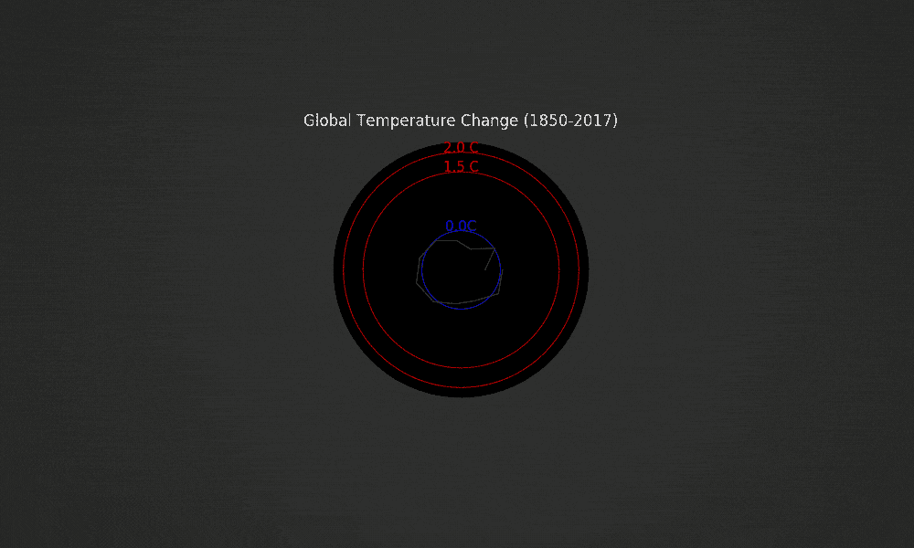
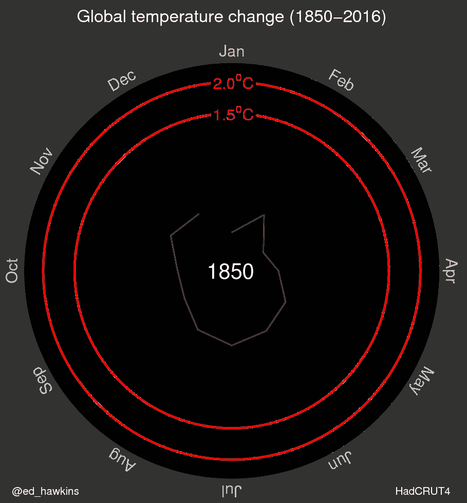

# 在 Python 中生成气候温度螺旋

> 原文：<https://www.dataquest.io/blog/climate-temperature-spirals-python/>

May 21, 2018

气候科学家埃德·霍金斯(Ed Hawkins)在 2017 年发布了以下动画可视化效果，吸引了全世界的目光:


*[https://www.youtube.com/embed/wXrYvd-LBu0?feature=oembed](https://www.youtube.com/embed/wXrYvd-LBu0?feature=oembed)*

 *这个图像显示了 1850 年到 1900 年间平均温度的偏差。这个视频在推特和脸书上被转发了数百万次，甚至在里约奥运会开幕式上展示了它的一个版本。这一可视化效果非常引人注目，因为它有助于观众了解过去 30 年中温度的变化波动以及平均温度的急剧上升。你可以在埃德·霍金斯的网站上阅读更多关于这一可视化背后的动机。在这篇博文中，我们将介绍如何用 Python 重新创建这个动画可视化。我们将特别使用 pandas(用于表示和管理数据)和 matplotlib(用于可视化数据)。如果你不熟悉 matplotlib，我们建议你参加[探索性数据可视化](https://www.dataquest.io/course/exploratory-data-visualization/)和[通过数据可视化讲述故事](https://www.dataquest.io/course/storytelling-data-visualization/)课程。在本文中，我们将使用以下库:

*   Python 3.6
*   熊猫 0.22
*   Matplotlib 2.2.2

## 数据清理

基础数据是由英国气象局发布的，该机构在天气和气候预报方面工作出色。数据集可以直接下载

[此处](https://www.metoffice.gov.uk/hadobs/hadcrut4/data/current/time_series/HadCRUT.4.6.0.0.monthly_ns_avg.txt)。Github 上的 [openclimatedata](https://github.com/openclimatedata) repo 在[这个笔记本](https://github.com/openclimatedata/climate-spirals/blob/master/data/Climate%20Spirals%20Data.ipynb)中包含了一些有用的数据清理代码。你需要向下滚动到标题为**全球温度**的部分。以下代码将文本文件读入 pandas 数据框:

```
hadcrut = pd.read_csv(
    "HadCRUT.4.5.0.0.monthly_ns_avg.txt",
    delim_whitespace=True,
    usecols=[0, 1],
    header=None)
```

然后，我们需要:

*   将第一列拆分为`month`和`year`列
*   将`1`列重命名为`value`
*   选择并保存除第一列(`0`)以外的所有列

```
hadcrut['year'] = hadcrut.iloc[:, 0].apply(lambda x: x.split("/")[0]).astype(int)
hadcrut['month'] = hadcrut.iloc[:, 0].apply(lambda x: x.split("/")[1]).astype(int)
hadcrut = hadcrut.rename(columns={1: "value"})hadcrut = hadcrut.iloc[:, 1:]
hadcrut.head()
```

|  | 价值 | 年 | 月 |
| Zero | -0.700 | One thousand eight hundred and fifty | one |
| one | -0.286 | One thousand eight hundred and fifty | Two |
| Two | -0.732 | One thousand eight hundred and fifty | three |
| three | -0.563 | One thousand eight hundred and fifty | four |
| four | -0.327 | One thousand eight hundred and fifty | five |

来保存我们的数据

[整理](https://cran.r-project.org/web/packages/tidyr/vignettes/tidy-data.html)，让我们删除包含 2018 年数据的行(因为这是唯一一年有 3 个月的数据，而不是所有 12 个月)。

```
hadcrut = hadcrut.drop(hadcrut[hadcrut['year'] == 2018].index)
```

最后，让我们计算 1850 年至 1900 年全球气温的平均值，并从整个数据集中减去该值。为了简化这一过程，我们将创建一个

[使用`year`和`month`列的多索引](https://pandas.pydata.org/pandas-docs/stable/advanced.html):

```
hadcrut = hadcrut.set_index(['year', 'month'])
```

这样，我们只修改

值栏(实际温度值)。最后，计算并减去 1850 年至 1900 年的平均温度，并将指数重置回之前的水平。

```
hadcrut -= hadcrut.loc[1850:1900].mean()
hadcrut = hadcrut.reset_index()
hadcrut.head()
```

|  | 年 | 月 | 价值 |
| Zero | One thousand eight hundred and fifty | one | -0.386559 |
| one | One thousand eight hundred and fifty | Two | 0.027441 |
| Two | One thousand eight hundred and fifty | three | -0.418559 |
| three | One thousand eight hundred and fifty | four | -0.249559 |
| four | One thousand eight hundred and fifty | five | -0.013559 |

## 笛卡尔与极坐标系统

重建 Ed 的 GIF 有几个关键阶段:

*   学习如何在极坐标系统上绘图
*   为极坐标可视化转换数据
*   定制剧情的审美
*   一年一年地进行可视化，并将绘图转换成 GIF

我们将开始在一个

[极坐标系统](https://en.wikipedia.org/wiki/Polar_coordinate_system)。你可能见过的大多数图(条形图、箱线图、散点图等。)住在[笛卡尔坐标系](https://en.wikipedia.org/wiki/Cartesian_coordinate_system)中。在这个系统中:

*   `x`和`y`(以及`z`)的范围可以从负无穷大到正无穷大(如果我们坚持用实数的话)
*   中心坐标是(0，0)
*   我们可以认为这个系统是矩形的

相比之下，极坐标系统是圆形的，使用`r`和`theta`。`r`坐标指定了距中心的距离，范围从 0 到无穷大。`theta`坐标指定从原点的角度，范围从 0 到 2*pi。要了解更多关于极坐标系统的信息，我建议进入以下链接:

*   [维基百科:极坐标系统](https://en.wikipedia.org/wiki/Polar_coordinate_system)
*   [NRICH:极坐标介绍](https://nrich.maths.org/2755)

## 为极坐标绘图准备数据

让我们先来了解一下这些数据是如何绘制在艾德·霍金斯的原始气候螺旋图中的。一年的温度值几乎跨越了一个完整的螺旋线/圆。您会注意到这条线是如何从 1 月跨越到 12 月，但又不连接到 1 月的。这是来自 GIF 的 1850 年的照片:

这意味着我们需要按年份划分数据子集，并使用以下坐标:

*   `r`:给定月份的温度值，调整后不含负值。
    *   Matplotlib 支持绘制负值，但不是以你想的方式。我们希望-0.1 比 0.1 更靠近中心，这不是默认的 matplotlib 行为。
    *   我们还希望在绘图原点周围留出一些空间，以便将年份显示为文本。
*   `theta`:生成 12 个等间距的角度值，范围从 0 到 2*pi。

让我们深入了解如何在 matplotlib 中只绘制 1850 年的数据，然后扩展到所有年份。如果您不熟悉在 matplotlib 中创建图形和轴对象，我推荐我们的

[探索性数据可视化课程](https://www.dataquest.io/course/exploratory-data-visualization)。要生成使用极坐标系统的 matplotlib Axes 对象，我们需要在创建它时将参数`projection`设置为`"polar"`。

```
fig = plt.figure(figsize=(8,8))
ax1 = plt.subplot(111, projection='polar')
```

默认的极坐标图如下所示:

要调整数据使其不包含负温度值，我们需要首先计算最低温度值:

```
hadcrut['value'].min()
```

```
-0.66055882352941175
```

让我们补充一下

`1`所有温度值，因此它们将是正的，但原点周围仍有一些空间用于显示文本:


让我们也生成从 0 到 2*pi 的 12 个均匀间隔的值，并将前 12 个用作`theta`值:

```
import numpy as np
hc_1850 = hadcrut[hadcrut['year'] == 1850]
fig = plt.figure(figsize=(8,8))
ax1 = plt.subplot(111, projection='polar')
r = hc_1850['value'] + 1
theta = np.linspace(0, 2*np.pi, 12)
```

为了在极轴投影上绘制数据，我们仍然使用

`Axes.plot()`方法，但是现在第一个值对应于`theta`值的列表，第二个值对应于 r 值的列表。

```
ax1.plot(theta, r)
```

这个图看起来是这样的:


## 调整美学

为了让我们的情节更接近艾德·霍金斯，让我们调整一下审美。在笛卡尔坐标系中正常绘图时，我们习惯使用的大多数其他 matplotlib 方法仍然有效。在内部，matplotlib 认为

`theta`为`x`，`r`为`y`。要查看实际情况，我们可以使用以下方法隐藏两个轴的所有刻度标签:

```
ax1.axes.get_yaxis().set_ticklabels([])
ax1.axes.get_xaxis().set_ticklabels([])
```

现在，让我们调整颜色。我们需要极坐标图中的背景颜色为黑色，极坐标图周围的颜色为灰色。我们实际上使用了一个图像编辑工具来找到准确的黑色和灰色值，如

[十六进制值](https://en.wikipedia.org/wiki/Web_colors):

*   格雷:#323331
*   黑色:#000100

我们可以使用

`fig.set_facecolor()`设置前景色，`Axes.set_axis_bgcolor()`设置绘图的背景色:

```
fig.set_facecolor("#323331")
ax1.set_axis_bgcolor('#000100')
```

接下来，让我们使用

`Axes.set_title()`:

```
ax1.set_title("Global Temperature Change (1850-2017)", color='white', fontdict={'fontsize': 30})
```

最后，让我们在中心添加文本，指定当前显示的年份。我们希望这个文本在原点

`(0,0)`，我们希望文本是白色的，有一个大的字体，并且水平居中对齐。

```
ax1.text(0,0,"1850", color='white', size=30, ha='center')
```

这是现在的情节(回想一下，这只是 1850 年的情况)。


## 绘制剩余年份

要绘制剩余年份的螺旋图，我们需要重复刚才的操作，但要针对数据集中的所有年份。这里我们应该做的一个调整是手动设置

`r`(或 matplotlib 中的`y`)。这是因为 matplotlib 会根据使用的数据自动缩放绘图的大小。这就是为什么在最后一步中，我们发现只有 1850 年的数据显示在绘图区域的边缘。让我们计算整个数据集中的最高温度值，并添加大量填充(以匹配 Ed 所做的)。

```
hadcrut['value'].max()
```

```
1.4244411764705882
```

我们可以使用手动设置 y 轴限值

`Axes.set_ylim()`

```
ax1.set_ylim(0, 3.25)
```

现在，我们可以使用 for 循环来生成其余的数据。让我们暂时忽略生成中心文本的代码(否则每年都会在同一点生成文本，这将非常混乱):

```
fig = plt.figure(figsize=(14,14))
ax1 = plt.subplot(111, projection='polar')

ax1.axes.get_yaxis().set_ticklabels([])
ax1.axes.get_xaxis().set_ticklabels([])
fig.set_facecolor("#323331")
ax1.set_ylim(0, 3.25)

theta = np.linspace(0, 2*np.pi, 12)

ax1.set_title("Global Temperature Change (1850-2017)", color='white', fontdict={'fontsize': 20})
ax1.set_axis_bgcolor('#000100')

years = hadcrut['year'].unique()

for year in years:
    r = hadcrut[hadcrut['year'] == year]['value'] + 1
     # ax1.text(0,0, str(year), color='white', size=30, ha='center')
    ax1.plot(theta, r)
```

这个图看起来是这样的:


## 自定义颜色

现在，颜色感觉有点随机，与最初可视化传达的气候逐渐变暖不相符。在最初的视觉化中，颜色从蓝色/紫色过渡到绿色，再到黄色。

这种配色方案被称为[顺序色图](https://matplotlib.org/tutorials/colors/colormaps.html#sequential)，因为颜色的渐变反映了数据的一些含义。虽然在 matplotlib 中创建散点图时很容易指定颜色图(使用来自`Axes.scatter()`的`cm`参数)，但是在创建线图时没有直接的参数来指定颜色图。Tony Yu 有一篇关于如何在生成散点图时使用色图的精彩短文，我们将在这里使用。本质上，我们在调用`Axes.plot()`方法时使用`color`(或`c`)参数，并从`plt.cm.<colormap_name>(index)`绘制颜色。下面是我们如何使用`viridis`颜色图:

```
ax1.plot(theta, r, c=plt.cm.viridis(index)) # Index is a counter variable
```

这将导致绘图具有从蓝色到绿色的连续颜色，但要得到黄色，我们实际上可以将计数器变量乘以

`2`:

```
ax1.plot(theta, r, c=plt.cm.viridis(index*2))
```

让我们重新格式化我们的代码来合并这个顺序色图。

```
fig = plt.figure(figsize=(14,14))
ax1 = plt.subplot(111, projection='polar')

ax1.axes.get_yaxis().set_ticklabels([])
ax1.axes.get_xaxis().set_ticklabels([])
fig.set_facecolor("#323331")

for index, year in enumerate(years):
    r = hadcrut[hadcrut['year'] == year]['value'] + 1
    theta = np.linspace(0, 2*np.pi, 12)

    ax1.grid(False)
    ax1.set_title("Global Temperature Change (1850-2017)", color='white', fontdict={'fontsize': 20})

    ax1.set_ylim(0, 3.25)
    ax1.set_axis_bgcolor('#000100')
     # ax1.text(0,0, str(year), color='white', size=30, ha='center')
    ax1.plot(theta, r, c=plt.cm.viridis(index*2))
```

下面是结果图的样子:


## 添加温度环

虽然我们现在的图很漂亮，但观众实际上根本无法理解底层数据。可视化中没有任何潜在温度值的指示。最初的可视化在 0.0、1.5 和 2.0 摄氏度下有完整、均匀的环来帮助实现这一点。因为我们添加了

对于每个温度值，我们在绘制这些均匀的环时也需要做同样的事情。蓝色的环最初是在 0.0 摄氏度，所以我们需要在`r=1`处生成一个环。第一个红圈原来在 1.5，所以我们需要在 2.5 出图。最后一个是 2.0，所以应该是 3.0。

```
full_circle_thetas = np.linspace(0, 2*np.pi, 1000)
blue_line_one_radii = [1.0]*1000
red_line_one_radii = [2.5]*1000
red_line_two_radii = [3.0]*1000

ax1.plot(full_circle_thetas, blue_line_one_radii, c='blue')
ax1.plot(full_circle_thetas, red_line_one_radii, c='red')
ax1.plot(full_circle_thetas, red_line_two_radii, c='red')
```

最后，我们可以添加指定环的温度值的文本。所有这 3 个文本值都位于 0.5 *π角度，距离值各不相同:

```
ax1.text(np.pi/2, 1.0, "0.0 C", color="blue", ha='center', fontdict={'fontsize': 20})
ax1.text(np.pi/2, 2.5, "1.5 C", color="red", ha='center', fontdict={'fontsize': 20})
ax1.text(np.pi/2, 3.0, "2.0 C", color="red", ha='center', fontdict={'fontsize': 20})
```

因为“0.5°C”的文本被数据遮挡，我们可能要考虑在静态绘图版本中隐藏它。

## 生成 GIF 动画

现在我们准备从这个图生成一个 GIF 动画。动画是快速连续显示的一系列图像。我们将使用

[`matplotlib.animation.FuncAnimation`](https://matplotlib.org/api/_as_gen/matplotlib.animation.FuncAnimation.html#matplotlib.animation.FuncAnimation) 功能帮我们解决了这个问题。为了利用这个函数，我们需要编写代码:

*   定义基本地块的外观和特性
*   用新数据更新每帧之间的绘图

调用时，我们将使用以下必需的参数

`FuncAnimation()`:

*   `fig`:matplotlib 图形对象
*   `func`:每帧之间调用的更新函数
*   `frames`:帧数(我们希望每年有一个)
*   `interval`:每帧显示的毫秒数(一秒钟有 1000 毫秒)

该函数将返回一个

对象，它有一个我们可以用来将动画写到 GIF 文件的方法。下面是一些反映我们将使用的工作流的框架代码:

```
# To be able to write out the animation as a GIF file
import sysfrom matplotlib.animation import FuncAnimation
# Create the base plot
fig = plt.figure(figsize=(8,8))
ax1 = plt.subplot(111, projection='polar')
def update(i):
    # Specify how we want the plot to change in each frame.
    # We need to unravel the for loop we had earlier.
    year = years[i]
    r = hadcrut[hadcrut['year'] == year]['value'] + 1
    ax1.plot(theta, r, c=plt.cm.viridis(i*2))
    return ax1

anim = FuncAnimation(fig, update, frames=len(years), interval=50)

anim.save('climate_spiral.gif', dpi=120, writer='imagemagick', savefig_kwargs={'facecolor': '#323331'})
```

现在剩下的就是重新格式化我们之前的代码，并将其添加到上面的框架中。我们鼓励你自己去做，用 matplotlib 练习编程。

这里是最终动画在低分辨率下的样子(为了减少加载时间)。

## 后续步骤

在这篇文章中，我们探讨了:

*   如何在极坐标系统上绘图
*   如何自定义极坐标图中的文本
*   如何通过插值多个图来生成 GIF 动画

你可以在很大程度上重现 GIF Ed Hawkins 最初发布的优秀气候螺旋。以下是我们没有探究的几个关键问题，但我们强烈建议您自己去探究:

*   将月份值添加到极坐标图的外缘/
*   创建动画时，在绘图中心添加当前年份值。
    *   如果您尝试使用`FuncAcnimation()`方法来实现这一点，您会注意到年份值堆叠在彼此之上(而不是清除前一年的值并显示新的年份值)。
*   将文本签名添加到图的左下角和右下角。
*   调整 0.0°C、1.5°C 和 2.0°C 的文本如何与静态温度环相交。*