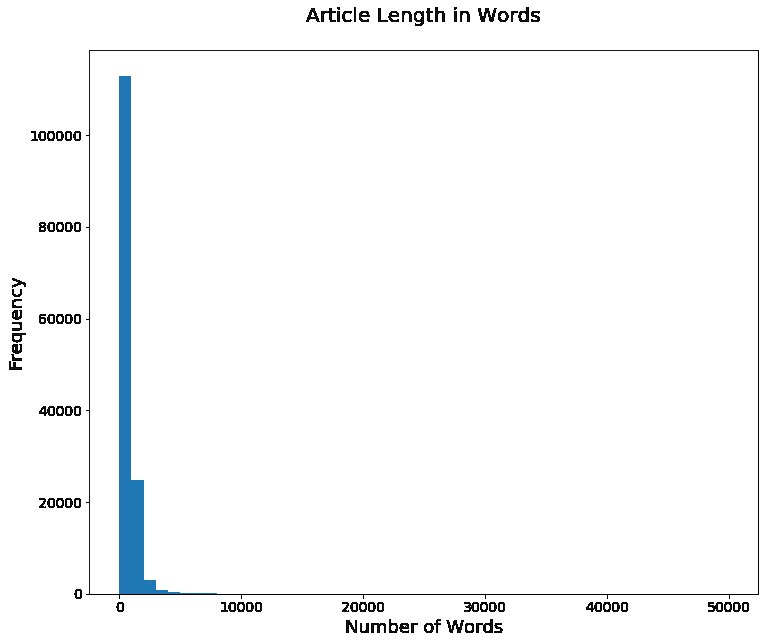
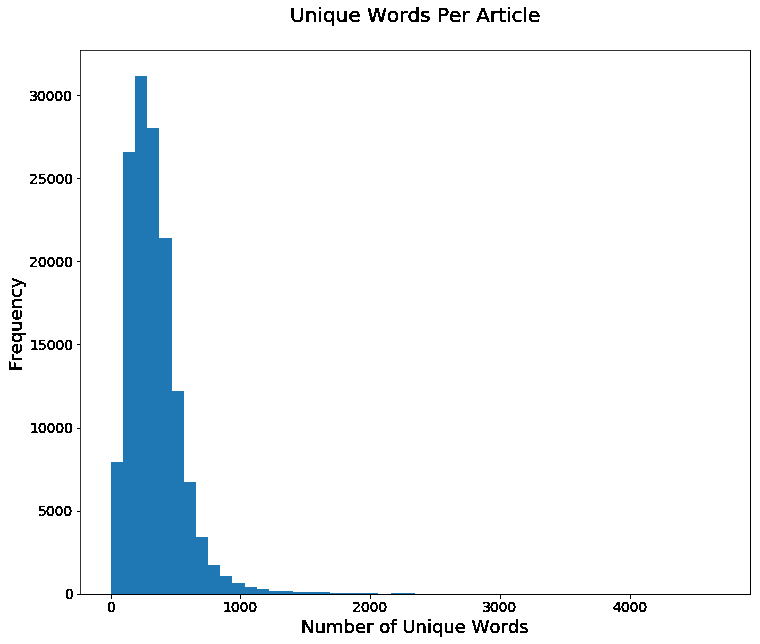
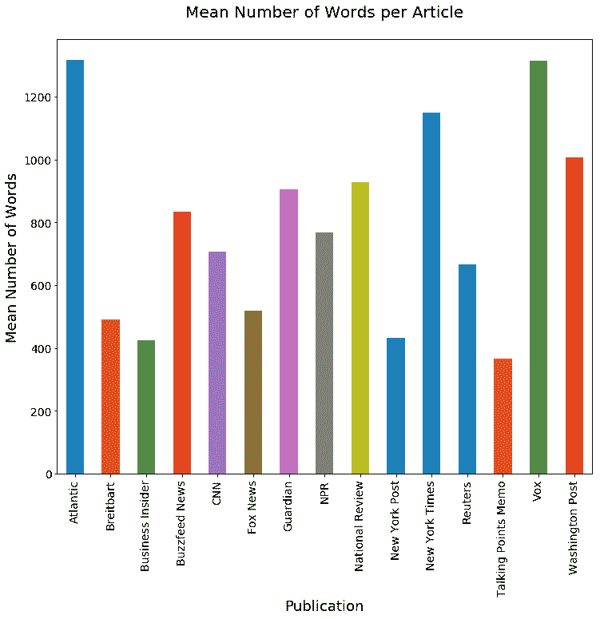
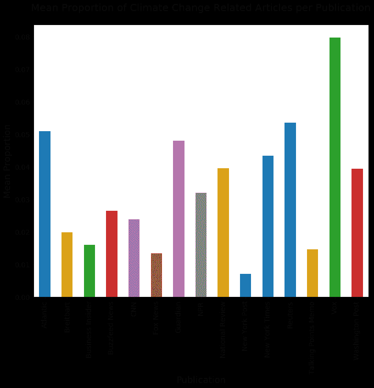
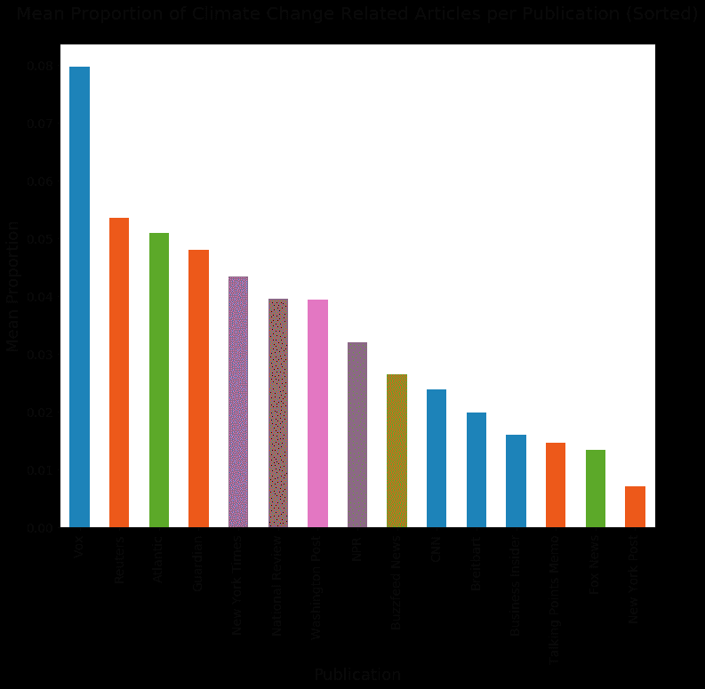
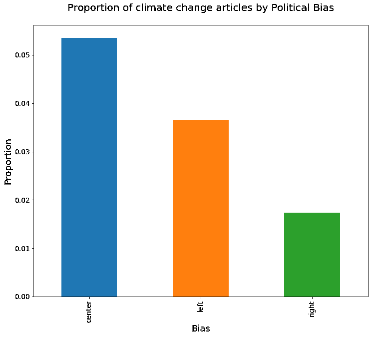
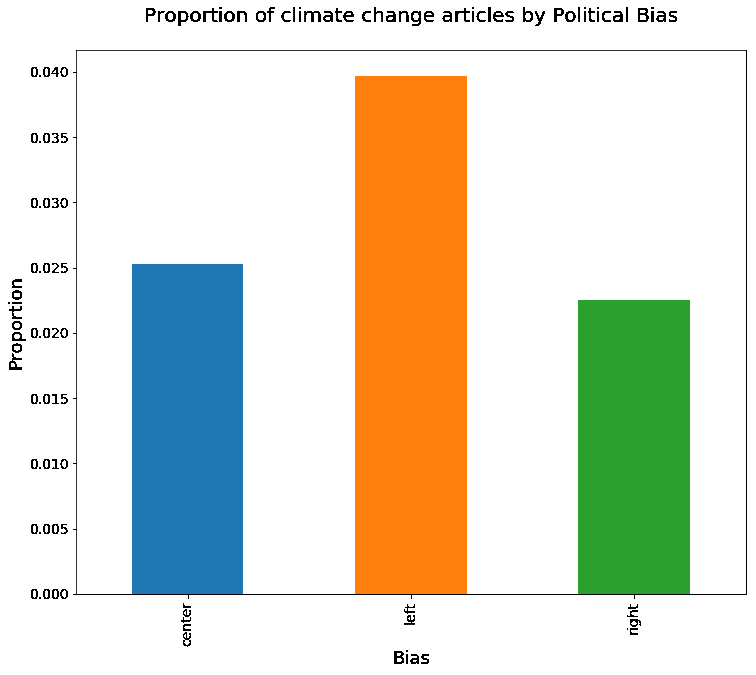

# 教程:用 Python 进行文本分析以测试假设

> 原文：<https://www.dataquest.io/blog/tutorial-text-analysis-python-test-hypothesis/>

May 16, 2019

人们经常抱怨新闻对重要话题报道太少。其中一个主题是气候变化。科学界的共识是，这是一个重要的问题，显而易见，越多的人意识到这个问题，我们解决这个问题的机会就越大。但是我们如何评估各种媒体对气候变化的报道有多广泛呢？我们可以用 Python 做一些文本分析！

具体来说，在本帖中，我们将尝试回答一些关于哪些新闻媒体对气候变化报道最多的问题。同时，我们将学习一些在 Python 中分析文本数据和测试与该数据相关的假设所需的编程技巧。

本教程假设您非常熟悉 Python 和流行的数据科学包 pandas。如果你想温习熊猫，请查看[这篇](https://www.dataquest.io/blog/pandas-python-tutorial/)帖子，如果你需要建立一个更全面的基础， [Dataquest 的数据科学课程](https://www.dataquest.io/path/data-scientist/)更深入地涵盖了 Python 和熊猫的所有基础知识。

## 寻找和探索我们的数据集

在这篇文章中，我们将使用 Andrew Thompson 提供的来自 [Kaggle](https://www.kaggle.com/) 的[新闻数据集](https://www.kaggle.com/snapcrack/all-the-news/)(无关系)。该数据集包含来自 15 个来源的超过 142，000 篇文章，主要来自 2016 年和 2017 年，并被分成三个不同的 csv 文件。以下是 Andrew 在 Kaggle 概览页面上显示的文章数量:


稍后我们将致力于复制我们自己的版本。但是，值得关注的一件事是，这些新闻媒体的特征与它们发表的气候变化相关文章的比例之间是否存在关联。

我们可以关注的一些有趣的特征包括所有权(独立、非营利或公司)和政治倾向(如果有的话)。下面，我做了一些初步的研究，从维基百科和提供商自己的网页上收集信息。

我还发现了两个网站，allsides.com 和 mediabiasfactcheck.com，对出版物的自由和保守倾向进行评级，所以我从那里收集了一些关于政治倾向的信息。

*   大西洋:
    *   业主:大西洋传媒；多数股权最近卖给了艾默生集体公司，这是一家由史蒂夫·乔布斯的遗孀鲍威尔·乔布斯创立的非盈利组织
    *   向左倾斜
*   布莱巴特:
    *   所有者:Breitbart 新闻网络有限责任公司
    *   由一位保守派评论员创立
    *   对吧
*   商业内幕:
    *   所有者:Alex Springer SE(欧洲出版社)
    *   居中/左居中
*   Buzzfeed 新闻:
    *   私人，Jonah Peretti 首席执行官兼执行主席 Kenneth Lerer(后者也是《赫芬顿邮报》的联合创始人)
    *   向左倾斜
*   CNN:
    *   特纳广播系统，大众媒体
    *   TBS 本身为时代华纳所有
    *   向左倾斜
*   福克斯新闻频道:
    *   福克斯娱乐集团，大众传媒
    *   向右/向右倾斜
*   卫报:
    *   卫报媒体集团(英国)，大众传媒
    *   归斯科特信托有限公司所有
    *   向左倾斜
*   国家评论:
    *   国家评论协会，一个非盈利机构
    *   由小威廉·F·巴克利创建
    *   对吧
*   纽约邮报:
    *   新闻集团，大众媒体
    *   右/右居中
*   纽约时报:
    *   纽约时报公司
    *   向左倾斜
*   NPR:
    *   非营利组织
    *   居中/左居中
*   路透社:
    *   汤森路透公司(加拿大跨国大众媒体)
    *   中心
*   谈话要点备忘录:
    *   乔希·马歇尔，独立报
    *   左边的
*   华盛顿邮报:
    *   纳什控股有限责任公司，由 j .贝佐斯控制
    *   向左倾斜
*   Vox:
    *   Vox 媒体，跨国公司
    *   向左/向左倾斜

回顾这一点，我们可能会假设，例如，右倾的布莱巴特，与气候相关的文章比例会低于 NPR。

我们可以把它变成一个正式的假设陈述，我们会在后面的文章中这样做。但首先，让我们更深入地研究数据。术语注释:在计算语言学和 NLP 社区中，像这样的文本集合被称为**语料库**，所以在讨论我们的文本数据集时，我们将在这里使用该术语。

探索性数据分析(EDA)是任何数据科学项目的重要组成部分。它通常涉及以各种方式分析和可视化数据，以在进行更深入的分析之前寻找模式。不过，在这种情况下，我们处理的是文本数据而不是数字数据，这就有点不同了。

例如，在数值探索性数据分析中，我们经常想要查看数据特征的平均值。但是在文本数据库中没有所谓的“平均”单词，这使得我们的任务有点复杂。然而，仍然有定量和定性的探索，我们可以执行健全检查我们的语料库的完整性。

首先，让我们复制上面的图表，以确保我们没有遗漏任何数据，然后按文章数量排序。我们将从覆盖所有的导入开始，读取数据集，并检查其三个部分的长度。

```
# set up and load data, checking we've gotten it all

import pandas as pd
import numpy as np
import string
import re
from collections import Counter
from nltk.corpus import stopwords

pt1= pd.read_csv('data/articles1.csv.zip',
compression='zip', index_col=0)

pt1.head()
```

|  | 身份证明（identification） | 标题 | 出版 | 作者 | 日期 | 年 | 月 | 全球资源定位器(Uniform Resource Locator) | 内容 |
| --- | --- | --- | --- | --- | --- | --- | --- | --- | --- |
| Zero | Seventeen thousand two hundred and eighty-three | 众议院共和党人担心赢得他们的头… | 纽约时报 | 卡尔·赫尔斯 | 2016-12-31 | Two thousand and sixteen | Twelve | 圆盘烤饼 | 华盛顿——国会共和党人已经… |
| one | Seventeen thousand two hundred and eighty-four | 警官和居民之间的裂痕就像杀戮… | 纽约时报 | 本杰明·穆勒和艾尔·贝克 | 2017-06-19 | Two thousand and seventeen | Six | 圆盘烤饼 | 子弹壳数完之后，血… |
| Two | Seventeen thousand two hundred and eighty-five | 泰勒斯黄，'小鹿斑比'艺术家受阻于种族… | 纽约时报 | 玛格丽特·福克斯 | 2017-01-06 | Two thousand and seventeen | One | 圆盘烤饼 | 当华特·迪士尼的《斑比》在 1942 年上映时，克里… |
| three | Seventeen thousand two hundred and eighty-six | 在 2016 年的死亡人数中，流行音乐死亡人数最多… | 纽约时报 | 威廉·麦克唐纳 | 2017-04-10 | Two thousand and seventeen | Four | 圆盘烤饼 | 死亡可能是最好的均衡器，但它不是… |
| four | Seventeen thousand two hundred and eighty-seven | 金正恩称朝鲜正准备进行核试验 | 纽约时报 | 让他转到匈牙利 | 2017-01-02 | Two thousand and seventeen | One | 圆盘烤饼 | 韩国首尔——朝鲜领导人…… |

```
len(pt1)
```

```
50000
```

```
pt2 = pd.read_csv('data/articles2.csv.zip',compression='zip',index_col=0)
len(pt2)
```

```
49999
```

```
pt3 = pd.read_csv('data/articles3.csv.zip',compression='zip',index_col=0)
len(pt3)
```

```
42571
```

不过，处理三个独立的数据集并不方便。我们将把所有三个数据帧合并成一个，这样我们可以更容易地处理整个语料库:

```
articles = pd.concat([pt1,pt2,pt3])
len(articles)
```

```
142570
```

接下来，我们将确保我们拥有与原始数据集中相同的出版物名称，并检查文章的最早和最新年份。

```
articles.publication.unique()
```

```
array(['New York Times', 'Breitbart', 'CNN', 'Business Insider',
       'Atlantic', 'Fox News', 'Talking Points Memo', 'Buzzfeed News',
       'National Review', 'New York Post', 'Guardian', 'NPR', 'Reuters',
       'Vox', 'Washington Post'], dtype=object)
```

```
print(articles['year'].min())
articles['year'].max()
```

```
2000.0
2017.0
```

像我们上面看到的那样将日期存储为浮点数是不常见的，但这就是它们在 CSV 文件中的存储方式。我们不打算在任何太重要的事情上使用日期，所以出于本教程的目的，我们将把它们作为浮点数。但是，如果我们正在进行不同的分析，我们可能希望将它们转换成不同的格式。

先来快速看一下我们的文章是从什么时候开始使用熊猫的`value_counts()`功能的。

```
articles['year'].value_counts()
```

```
2016.0    85405
2017.0    50404
2015.0     3705
2013.0      228
2014.0      125
2012.0       34
2011.0        8
2010.0        6
2009.0        3
2008.0        3
2005.0        2
2004.0        2
2003.0        2
2007.0        1
2000.0        1
Name: year, dtype: int64
```

我们可以看到大部分是最近几年的，但也包括一些旧的文章。这正好符合我们的目的，因为我们最关心的是过去几年的报道。

现在，让我们按名称对出版物进行排序，以再现来自 Kaggle 的原始情节。

```
ax = articles['publication'].value_counts().sort_index().plot(kind='bar', fontsize=14, figsize=(12,10))
ax.set_title('Article Count\n', fontsize=20)
ax.set_xlabel('Publication', fontsize=18)
ax.set_ylabel('Count', fontsize=18);
```

[](https://www.dataquest.io/wp-content/uploads/2019/05/Text_Hyp_Test-Updated_21_0.png)

如果你想快速找到一个特定的出口，这种图的顺序是很有帮助的，但是对我们来说，按文章数量排序可能更有帮助，这样我们可以更好地了解我们的数据来自哪里。

```
ax = articles['publication'].value_counts().plot(kind='bar', fontsize=14, figsize=(12,10))
ax.set_title('Article Count - most to least\n', fontsize=20)
ax.set_xlabel('Publication', fontsize=18)
ax.set_ylabel('Count', fontsize=18);
```


[](https://www.dataquest.io/wp-content/uploads/2019/05/Text_Hyp_Test-Updated_21_0.png)

我们想要检查平均文章长度，但是同样重要的是这些单词的多样性。让我们两个都看看。

我们将从定义一个函数开始，该函数删除标点并将所有文本转换为小写。(我们没有做任何复杂的句法分析，所以我们不需要保留句子结构或大写)。

```
def clean_text(article):
    clean1 = re.sub(r'['+string.punctuation + '’—”'+']', "", article.lower())
    return re.sub(r'\W+', ' ', clean1)
```

现在，我们将在 dataframe 中创建一个新列，其中包含已清理的文本。

```
articles['tokenized'] = articles['content'].map(lambda x: clean_text(x))
```

```
articles['tokenized'].head()
```

```
0    washington congressional republicans have a ne...
1    after the bullet shells get counted the blood ...
2    when walt disneys bambi opened in 1942 critics...
3    death may be the great equalizer but it isnt n...
4    seoul south korea north koreas leader kim said...
Name: tokenized, dtype: object
```

上面，我们可以看到，我们已经成功地从语料库中删除了大写和标点符号，这将使我们更容易识别和统计独特的单词。

让我们看看每篇文章的平均字数，以及数据集中最长和最短的文章。

```
articles['num_wds'] = articles['tokenized'].apply(lambda x: len(x.split()))
articles['num_wds'].mean()
```

```
732.36012485095046
```

```
articles['num_wds'].max()
articles['num_wds'].min()
```

```
49902
0
```

一篇没有单词的文章对我们没有任何用处，所以让我们看看有多少单词。我们希望从数据集中删除没有单词的文章。

```
len(articles[articles['num_wds']==0])
```

```
97
```

让我们去掉那些空文章，然后看看这对我们数据集中每篇文章的平均字数有什么影响，以及我们新的最小字数是多少。

```
articles = articles[articles['num_wds']>0]
articles['num_wds'].mean()
articles['num_wds'].min()
```

```
732.85873814687693
1
```

在这一点上，它可能有助于我们可视化文章字数的分布，以了解异常值对我们的平均值的影响程度。让我们生成另一个图来看看:

```
ax=articles['num_wds'].plot(kind='hist', bins=50, fontsize=14, figsize=(12,10))
ax.set_title('Article Length in Words\n', fontsize=20)
ax.set_ylabel('Frequency', fontsize=18)
ax.set_xlabel('Number of Words', fontsize=18);
```



Python 文本分析的下一步:探索文章的多样性。我们将使用每篇文章中独特单词的数量作为开始。为了计算这个值，我们需要从文章中的单词中创建一个**集合**，而不是一个列表。我们可以认为集合有点像列表，但是集合会忽略重复的条目。

在官方文档中有更多关于集合和它们如何工作的信息[，但是让我们先来看一个创建集合如何工作的基本例子。请注意，虽然我们从两个`b`条目开始，但是在我们创建的集合中只有一个条目:](https://docs.python.org/3/library/stdtypes.html#set-types-set-frozenset)

```
set('b ac b'.split())
```

```
{'ac', 'b'}
```

接下来，我们要立刻做几件事:

对我们之前创建的来自`tokenized`列的系列进行操作，我们将从`string`库中调用`split`函数。然后我们将从我们的系列中获取集合以消除重复的单词，然后用`len()`测量集合的大小。

最后，我们将把结果添加为一个新列，其中包含每篇文章中唯一单词的数量。

```
articles['uniq_wds'] = articles['tokenized'].str.split().apply(lambda x: len(set(x)))
articles['uniq_wds'].head()
```

```
0     389
    1    1403
    2     920
    3    1037
    4     307
    Name: uniq_wds, dtype: int64
```

我们还想看看每篇文章的平均独立字数，以及最小和最大独立字数。

```
articles['uniq_wds'].mean()
articles['uniq_wds'].min()
articles['uniq_wds'].max()
```

```
336.49826282874648
1
4692
```

当我们将其绘制成图表时，我们可以看到，虽然唯一单词的分布仍然是倾斜的，但它看起来比我们之前生成的基于总字数的分布更像正态(高斯)分布。

```
ax=articles['uniq_wds'].plot(kind='hist', bins=50, fontsize=14, figsize=(12,10))
ax.set_title('Unique Words Per Article\n', fontsize=20)
ax.set_ylabel('Frequency', fontsize=18)
ax.set_xlabel('Number of Unique Words', fontsize=18);
```



让我们来看看这两种衡量文章长度的方法在不同的出版物上有什么不同。

为此，我们将使用 pandas 的`groupby`功能。关于这个强大函数的完整文档可以在[这里](https://pandas.pydata.org/pandas-docs/version/0.22/groupby.html)找到，但是为了我们的目的，我们只需要知道它允许我们`aggregate`，或者以不同的方式，通过另一列的值合计不同的指标。

在这种情况下，该列是`publication`。第一个图通过在`len`上聚合，仅使用每个组中的对象数量。我们可以在下面的代码中使用除了`title`之外的任何其他列。

```
art_grps = articles.groupby('publication')

ax=art_grps['title'].aggregate(len).plot(kind='bar', fontsize=14, figsize=(12,10))
ax.set_title('Articles per Publication (repeated)\n', fontsize=20)
ax.set_ylabel('Number of Articles', fontsize=18)
ax.set_xlabel('Publication', fontsize=18);
```


现在，我们将分别合计平均单词数和唯一单词数。

```
ax=art_grps['num_wds'].aggregate(np.mean).plot(kind='bar', fontsize=14, figsize=(12,10))
ax.set_title('Mean Number of Words per Article\n', fontsize=20)
ax.set_ylabel('Mean Number of Words', fontsize=18)
ax.set_xlabel('Publication', fontsize=18);
```



```
ax=art_grps['uniq_wds'].aggregate(np.mean).plot(kind='bar', fontsize=14, figsize=(12,10))
ax.set_title('Mean Number of Unique Words per Article\n', fontsize=20)
ax.set_ylabel('Mean Number of Unique Words', fontsize=18)
ax.set_xlabel('Publication', fontsize=18);
```


最后，让我们看看整个语料库中最常见的单词。

我们将使用 Python `Counter`，它是一种特殊的字典，为每个键值假定整数类型。这里，我们使用文章的标记化版本遍历所有文章。

```
wd_counts = Counter()
for i, row in articles.iterrows():
    wd_counts.update(row['tokenized'].split())
```

然而，当我们统计最常见的单词时，我们不想把所有的单词都包括在内。在英语书面语中有许多非常常见的单词，在任何分析中它们都可能成为最常见的单词。对它们进行计数不会告诉我们关于文章内容的任何信息。在自然语言处理和文本处理中，这些词被称为“停用词”常见的英语停用词列表包括“and”、“or”和“The”等词

还记得我们在这个项目开始的时候从`nltk.corpus`中导入了模块`stopwords`，所以现在让我们来看看这个预先做好的`stopwords`列表中包含了哪些单词:

```
wd_counts = Counter()
for i, row in articles.iterrows():
    wd_counts.update(row['tokenized'].split())
```

```
['i',
     'me',
     'my',
     'myself',
     'we',
     'our',
     'ours',
     'ourselves',
     'you',
     "you're",
     "you've",
     "you'll",
     "you'd",
     'your',
     'yours',
     'yourself',
     'yourselves',
     'he',
     'him',
     'his',
     'himself',
     'she',
     "she's",
     'her',
     'hers',
     'herself',
     'it',
     "it's",
     'its',
     'itself',
     'they',
     'them',
     'their',
     'theirs',
     'themselves',
     'what',
     'which',
     'who',
     'whom',
     'this',
     'that',
     "that'll",
     'these',
     'those',
     'am',
     'is',
     'are',
     'was',
     'were',
     'be',
     'been',
     'being',
     'have',
     'has',
     'had',
     'having',
     'do',
     'does',
     'did',
     'doing',
     'a',
     'an',
     'the',
     'and',
     'but',
     'if',
     'or',
     'because',
     'as',
     'until',
     'while',
     'of',
     'at',
     'by',
     'for',
     'with',
     'about',
     'against',
     'between',
     'into',
     'through',
     'during',
     'before',
     'after',
     'above',
     'below',
     'to',
     'from',
     'up',
     'down',
     'in',
     'out',
     'on',
     'off',
     'over',
     'under',
     'again',
     'further',
     'then',
     'once',
     'here',
     'there',
     'when',
     'where',
     'why',
     'how',
     'all',
     'any',
     'both',
     'each',
     'few',
     'more',
     'most',
     'other',
     'some',
     'such',
     'no',
     'nor',
     'not',
     'only',
     'own',
     'same',
     'so',
     'than',
     'too',
     'very',
     's',
     't',
     'can',
     'will',
     'just',
     'don',
     "don't",
     'should',
     "should've",
     'now',
     'd',
     'll',
     'm',
     'o',
     're',
     've',
     'y',
     'ain',
     'aren',
     "aren't",
     'couldn',
     "couldn't",
     'didn',
     "didn't",
     'doesn',
     "doesn't",
     'hadn',
     "hadn't",
     'hasn',
     "hasn't",
     'haven',
     "haven't",
     'isn',
     "isn't",
     'ma',
     'mightn',
     "mightn't",
     'mustn',
     "mustn't",
     'needn',
     "needn't",
     'shan',
     "shan't",
     'shouldn',
     "shouldn't",
     'wasn',
     "wasn't",
     'weren',
     "weren't",
     'won',
     "won't",
     'wouldn',
     "wouldn't"]
```

正如我们所看到的，这是一个相当长的列表，但这些单词中没有一个能真正告诉我们一篇文章的意思。让我们使用这个列表来删除`Counter`中的停用词。

```
for sw in stopwords.words('english'):
    del wd_counts[sw]
```

为了进一步筛选出有用的信息，`Counter`有一个方便的`most_common`方法，我们可以用它来查看找到的最常用的单词。使用这个函数，我们可以指定想要看到的结果的数量。在这里，我们将要求它列出前 20 个最常用的单词。

```
wd_counts.most_common(20)
```

```
[('said', 571476),
 ('trump', 359436),
 ('would', 263184),
 ('one', 260552),
 ('people', 246748),
 ('new', 205187),
 ('also', 181491),
 ('like', 178532),
 ('president', 161541),
 ('time', 144047),
 ('could', 143626),
 ('first', 132971),
 ('years', 131219),
 ('two', 126745),
 ('even', 124510),
 ('says', 123381),
 ('state', 118926),
 ('many', 116965),
 ('u', 116602),
 ('last', 115748)]
```

上面，我们可以看到一些相当容易预测的单词，但也有点令人惊讶:单词 *u* 显然是最常见的。这可能看起来很奇怪，但它来自于这样一个事实，即像“美国”和“联合国”这样的缩写词在这些文章中频繁使用。

这有点奇怪，但请记住，目前我们只是在探索数据。我们想要测试的实际假设是，气候变化报道可能与媒体的某些方面相关，如其所有权或政治倾向。在我们的语料库中， *u* 作为一个单词的存在根本不可能影响这个分析，所以我们可以让它保持原样。

我们还可以在其他领域对这个数据集进行更多的清理和提炼，但这可能是不必要的。相反，让我们进入下一步:测试我们最初的假设是否正确。

#### 文本分析:检验我们的假设

我们如何检验我们的假设？首先，我们必须确定哪些文章在谈论气候变化，然后我们必须比较不同类型文章的覆盖范围。

我们如何判断一篇文章是否在谈论气候变化？有几种方法可以做到这一点。我们可以使用高级文本分析技术来识别概念，比如聚类或主题建模。但是为了本文的目的，让我们保持简单:让我们只识别可能与主题相关的关键字，并在文章中搜索它们。只要头脑风暴一些感兴趣的单词和短语就可以了。

当我们列出这些短语时，我们必须小心避免诸如“环境”或“可持续发展”等含糊不清的词语。这些可能与环保主义有关，但也可能与政治环境或商业可持续性有关。甚至“气候”也可能不是一个有意义的关键词，除非我们能确定它与“变化”密切相关。

我们需要做的是创建一个函数来确定一篇文章是否包含我们感兴趣的单词。为此，我们将使用正则表达式。如果你需要复习的话，这篇博客文章[中会更详细地介绍 Python 中的正则表达式。除了这个正则表达式之外，我们还将搜索在`cc_wds`参数中定义的其他几个短语的精确匹配。](https://www.dataquest.io/blog/regular-expressions-data-scientists/)

在寻找有关气候变化的信息时，我们必须小心一点。我们不能用“改变”这个词，因为那样会排除像“改变”这样的相关词。

所以我们要这样过滤它:我们希望字符串`chang`后跟 1 到 5 个单词内的字符串`climate`(在正则表达式中，`\w+`匹配一个或多个单词字符，`\W+`匹配一个或多个非单词字符)。

我们可以用`|` is 来表示一个逻辑**或者**，所以我们也可以在 1 到 5 个单词内匹配字符串`climate`后跟字符串`chang`。1 到 5 个单词的部分是正则表达式的一部分，看起来像这样:`(?:\w+\W+){1,5}?`。

总之，搜索这两个字符串应该有助于我们识别任何提到气候变化、气候变化等的文章。

```
def find_cc_wds(content, cc_wds=['climate change','global warming', 'extreme weather', 'greenhouse gas'
                                 'clean energy', 'clean tech', 'renewable energy']
):
    found = False
    for w in cc_wds:
        if w in content:
            found = True
            break

    if not found:
        disj = re.compile(r'(chang\w+\W+(?:\w+\W+){1,5}?climate) | (climate\W+(?:\w+\W+){1,5}?chang)')
        if disj.match(content):
            found = True
    return found
```

下面我们来仔细看看这个函数的各个部分是如何工作的:

```
disj = re.compile(r'(chang\w+\W+(?:\w+\W+){1,5}?climate)|(climate\W+(?:\w+\W+){1,5}?chang)')
```

```
disj.match('climate is changing')
```

```
<_sre.SRE_Match object; span=(0, 16), match='climate is chang'>
```

```
disj.match('change in extreme  climate')
```

```
<_sre.SRE_Match object; span=(0, 26), match='change in extreme  climate'>
```

```
disj.match('nothing changing here except the weather')
```

正如我们所看到的，这正如预期的那样起作用——它与气候变化的真实参考相匹配，而不是被其他上下文中使用的术语“变化”所抛弃。

现在，让我们使用我们的函数创建一个新的布尔字段，指示我们是否找到了相关的单词，然后查看在我们的数据集的前五篇文章中是否有任何关于气候变化的内容:

```
articles['cc_wds'] = articles['tokenized'].apply(find_cc_wds)
articles['cc_wds'].head()
```

```
0    False
1    False
2    False
3    False
4    False
Name: cc_wds, dtype: bool
```

我们数据集中的前五篇文章没有提到气候变化，但我们知道我们的功能正在按照我们之前测试的意图工作，所以现在我们可以开始对新闻报道进行一些分析。

回到我们比较不同来源的气候变化主题的最初目标，我们可能会考虑统计每个来源发表的气候相关文章的数量，并比较不同来源。但是，当我们这样做时，我们需要考虑文章总数的差异。来自一个渠道的大量气候相关文章可能仅仅是因为总体上发表了大量的文章。

我们需要做的是统计气候相关文章的相对比例。我们可以对布尔字段(如`cc_wds`)使用`sum`函数来计算真值的数量，然后除以发表的文章总数来得到我们的比例。

让我们先来看看所有来源的总比例，给我们自己一个比较每个渠道的基线:

```
articles['cc_wds'].sum() / len(articles)
```

```
0.030826893516666315
```

我们看到气候报道占所有文章的比例是 3.1%，这是相当低的，但从统计学的角度来看没有问题。

接下来我们要计算每组的相对比例。让我们通过查看每个出版物来源的比例来说明这是如何工作的。我们将再次使用 groupby 对象和`sum`，但是这一次我们想要每组的文章数，这是从`count`函数中获得的:

```
art_grps['cc_wds'].sum()
```

```
publication
    Atlantic               366.0
    Breitbart              471.0
    Business Insider       107.0
    Buzzfeed News          128.0
    CNN                    274.0
    Fox News                58.0
    Guardian               417.0
    NPR                    383.0
    National Review        245.0
    New York Post          124.0
    New York Times         339.0
    Reuters                573.0
    Talking Points Memo     76.0
    Vox                    394.0
    Washington Post        437.0
    Name: cc_wds, dtype: float64
```

```
art_grps.count()
```

|  | 身份证明（identification） | 标题 | 作者 | 日期 | 年 | 月 | 全球资源定位器(Uniform Resource Locator) | 内容 | 符号化 | S7-1200 可编程控制器 | unique _ WDS 函数 | cc_wds |
| --- | --- | --- | --- | --- | --- | --- | --- | --- | --- | --- | --- | --- |
| 出版 |  |  |  |  |  |  |  |  |  |  |  |  |
| --- | --- | --- | --- | --- | --- | --- | --- | --- | --- | --- | --- | --- |
| 大西洋的 | Seven thousand one hundred and seventy-eight | Seven thousand one hundred and seventy-eight | Six thousand one hundred and ninety-eight | Seven thousand one hundred and seventy-eight | Seven thousand one hundred and seventy-eight | Seven thousand one hundred and seventy-eight | Zero | Seven thousand one hundred and seventy-eight | Seven thousand one hundred and seventy-eight | Seven thousand one hundred and seventy-eight | Seven thousand one hundred and seventy-eight | Seven thousand one hundred and seventy-eight |
| 布莱巴特 | Twenty-three thousand seven hundred and eighty-one | Twenty-three thousand seven hundred and eighty-one | Twenty-three thousand seven hundred and eighty-one | Twenty-three thousand seven hundred and eighty-one | Twenty-three thousand seven hundred and eighty-one | Twenty-three thousand seven hundred and eighty-one | Zero | Twenty-three thousand seven hundred and eighty-one | Twenty-three thousand seven hundred and eighty-one | Twenty-three thousand seven hundred and eighty-one | Twenty-three thousand seven hundred and eighty-one | Twenty-three thousand seven hundred and eighty-one |
| 商业内幕 | Six thousand six hundred and ninety-five | Six thousand six hundred and ninety-five | Four thousand nine hundred and twenty-six | Six thousand six hundred and ninety-five | Six thousand six hundred and ninety-five | Six thousand six hundred and ninety-five | Zero | Six thousand six hundred and ninety-five | Six thousand six hundred and ninety-five | Six thousand six hundred and ninety-five | Six thousand six hundred and ninety-five | Six thousand six hundred and ninety-five |
| Buzzfeed 新闻 | Four thousand eight hundred and thirty-five | Four thousand eight hundred and thirty-five | Four thousand eight hundred and thirty-four | Four thousand eight hundred and thirty-five | Four thousand eight hundred and thirty-five | Four thousand eight hundred and thirty-five | Four thousand eight hundred and thirty-five | Four thousand eight hundred and thirty-five | Four thousand eight hundred and thirty-five | Four thousand eight hundred and thirty-five | Four thousand eight hundred and thirty-five | Four thousand eight hundred and thirty-five |
| 美国有线新闻网；卷积神经网络 | Eleven thousand four hundred and eighty-five | Eleven thousand four hundred and eighty-five | Seven thousand and twenty-four | Eleven thousand four hundred and eighty-five | Eleven thousand four hundred and eighty-five | Eleven thousand four hundred and eighty-five | Zero | Eleven thousand four hundred and eighty-five | Eleven thousand four hundred and eighty-five | Eleven thousand four hundred and eighty-five | Eleven thousand four hundred and eighty-five | Eleven thousand four hundred and eighty-five |
| 福克斯新闻频道 | Four thousand three hundred and fifty-one | Four thousand three hundred and fifty-one | One thousand one hundred and seventeen | Four thousand three hundred and forty-nine | Four thousand three hundred and forty-nine | Four thousand three hundred and forty-nine | Four thousand three hundred and forty-eight | Four thousand three hundred and fifty-one | Four thousand three hundred and fifty-one | Four thousand three hundred and fifty-one | Four thousand three hundred and fifty-one | Four thousand three hundred and fifty-one |
| 监护人 | Eight thousand six hundred and eighty | Eight thousand six hundred and eighty | Seven thousand two hundred and forty-nine | Eight thousand six hundred and forty | Eight thousand six hundred and forty | Eight thousand six hundred and forty | Eight thousand six hundred and eighty | Eight thousand six hundred and eighty | Eight thousand six hundred and eighty | Eight thousand six hundred and eighty | Eight thousand six hundred and eighty | Eight thousand six hundred and eighty |
| 噪声功率比(noise power ratio) | Eleven thousand nine hundred and ninety-two | Eleven thousand nine hundred and ninety-two | Eleven thousand six hundred and fifty-four | Eleven thousand nine hundred and ninety-two | Eleven thousand nine hundred and ninety-two | Eleven thousand nine hundred and ninety-two | Eleven thousand nine hundred and ninety-two | Eleven thousand nine hundred and ninety-two | Eleven thousand nine hundred and ninety-two | Eleven thousand nine hundred and ninety-two | Eleven thousand nine hundred and ninety-two | Eleven thousand nine hundred and ninety-two |
| 国家评论 | Six thousand one hundred and ninety-five | Six thousand one hundred and ninety-five | Six thousand one hundred and ninety-five | Six thousand one hundred and ninety-five | Six thousand one hundred and ninety-five | Six thousand one hundred and ninety-five | Six thousand one hundred and ninety-five | Six thousand one hundred and ninety-five | Six thousand one hundred and ninety-five | Six thousand one hundred and ninety-five | Six thousand one hundred and ninety-five | Six thousand one hundred and ninety-five |
| 纽约邮报 | Seventeen thousand four hundred and ninety-three | Seventeen thousand four hundred and ninety-three | Seventeen thousand four hundred and eighty-five | Seventeen thousand four hundred and ninety-three | Seventeen thousand four hundred and ninety-three | Seventeen thousand four hundred and ninety-three | Seventeen thousand four hundred and ninety-three | Seventeen thousand four hundred and ninety-three | Seventeen thousand four hundred and ninety-three | Seventeen thousand four hundred and ninety-three | Seventeen thousand four hundred and ninety-three | Seventeen thousand four hundred and ninety-three |
| 纽约时报 | Seven thousand eight hundred and three | Seven thousand eight hundred and three | Seven thousand seven hundred and sixty-seven | Seven thousand eight hundred and three | Seven thousand eight hundred and three | Seven thousand eight hundred and three | Zero | Seven thousand eight hundred and three | Seven thousand eight hundred and three | Seven thousand eight hundred and three | Seven thousand eight hundred and three | Seven thousand eight hundred and three |
| 路透社 | Ten thousand seven hundred and ten | Ten thousand seven hundred and nine | Ten thousand seven hundred and ten | Ten thousand seven hundred and ten | Ten thousand seven hundred and ten | Ten thousand seven hundred and ten | Ten thousand seven hundred and ten | Ten thousand seven hundred and ten | Ten thousand seven hundred and ten | Ten thousand seven hundred and ten | Ten thousand seven hundred and ten | Ten thousand seven hundred and ten |
| 谈话要点备忘录 | Five thousand two hundred and fourteen | Five thousand two hundred and thirteen | One thousand six hundred and seventy-six | Two thousand six hundred and fifteen | Two thousand six hundred and fifteen | Two thousand six hundred and fifteen | Five thousand two hundred and fourteen | Five thousand two hundred and fourteen | Five thousand two hundred and fourteen | Five thousand two hundred and fourteen | Five thousand two hundred and fourteen | Five thousand two hundred and fourteen |
| 声音 | Four thousand nine hundred and forty-seven | Four thousand nine hundred and forty-seven | Four thousand nine hundred and forty-seven | Four thousand nine hundred and forty-seven | Four thousand nine hundred and forty-seven | Four thousand nine hundred and forty-seven | Four thousand nine hundred and forty-seven | Four thousand nine hundred and forty-seven | Four thousand nine hundred and forty-seven | Four thousand nine hundred and forty-seven | Four thousand nine hundred and forty-seven | Four thousand nine hundred and forty-seven |
| 华盛顿邮报 | Eleven thousand one hundred and fourteen | Eleven thousand one hundred and fourteen | Eleven thousand and seventy-seven | Eleven thousand one hundred and fourteen | Eleven thousand one hundred and fourteen | Eleven thousand one hundred and fourteen | Eleven thousand one hundred and fourteen | Eleven thousand one hundred and fourteen | Eleven thousand one hundred and fourteen | Eleven thousand one hundred and fourteen | Eleven thousand one hundred and fourteen | Eleven thousand one hundred and fourteen |

现在，让我们把它分成几个部分，并对列表进行排序，这样我们就可以快速地一目了然哪些媒体对气候变化的报道最多:

```
proportions = art_grps['cc_wds'].sum() / art_grps['cc_wds'].count()
proportions.sort_values(ascending=True)
proportions
```

```
publication
    New York Post          0.007089
    Fox News               0.013330
    Talking Points Memo    0.014576
    Business Insider       0.015982
    Breitbart              0.019806
    CNN                    0.023857
    Buzzfeed News          0.026474
    NPR                    0.031938
    Washington Post        0.039320
    National Review        0.039548
    New York Times         0.043445
    Guardian               0.048041
    Atlantic               0.050989
    Reuters                0.053501
    Vox                    0.079644
    Name: cc_wds, dtype: float64
```

比例从《纽约邮报》的 0.7%到 Vox 的 8%不等。让我们绘制这个图，先按出版物名称排序，然后再按值排序。

```
ax=proportions.plot(kind='bar', fontsize=14, figsize=(12,10))
ax.set_title('Mean Proportion of Climate Change Related Articles per Publication\n', fontsize=20)
ax.set_ylabel('Mean Proportion', fontsize=18)
ax.set_xlabel('Publication', fontsize=18);
```



```
ax=proportions.sort_values(ascending=False).plot(kind='bar', fontsize=14, figsize=(12,10))
ax.set_title('Mean Proportion of Climate Change Related Articles per Publication (Sorted)\n', fontsize=20)
ax.set_ylabel('Mean Proportion', fontsize=18)
ax.set_xlabel('Publication', fontsize=18);
```



我们可以在这里做各种其他的探索性数据分析，但是让我们暂时把它放在一边，继续我们的目标，测试关于我们的语料库的假设。

## 检验假设

在这篇文章中，我们不会对假设检验及其微妙之处做一个完整的概述；关于 Python 中概率的概述，请访问[这篇文章](https://www.dataquest.io/blog/basic-statistics-in-python-probability/)，关于统计假设检验的细节，[维基百科](https://en.wikipedia.org/wiki/Statistical_hypothesis_testing)是个不错的地方。

我们将在这里举例说明假设检验的一种形式。

回想一下，我们一开始非正式地假设，出版物的特征可能与它们发表的气候相关文章的优势相关。这些特征包括政治倾向和所有权。例如，我们的与政治倾向相关的零假设非正式地说，当比较具有不同政治倾向的文章时，在气候变化提及方面没有差异。让我们更正式一点。

如果我们观察出版物的左与右的政治倾向，并将左倾的出版物组称为“左”，将右倾的出版物组称为“右”，我们的零假设是左的人口气候变化文章比例等于右的人口气候变化文章比例。我们的另一个假设是两个人口比例不相等。我们可以用其他人群分组和陈述类似的假设来代替其他政治倾向比较或其他出版物特征。

让我们从政治倾向开始。你可以重温这篇文章的顶部，提醒自己我们是如何收集关于媒体政治倾向的信息的。下面的代码使用一个字典，根据我们收集的信息为每个出版物名称分配`left`、`right`和`center`值。

```
#liberal, conservative, and center
bias_assigns = {'Atlantic': 'left', 'Breitbart': 'right', 'Business Insider': 'left', 'Buzzfeed News': 'left', 'CNN': 'left', 'Fox News': 'right',
                'Guardian': 'left', 'National Review': 'right', 'New York Post': 'right', 'New York Times': 'left',
                'NPR': 'left', 'Reuters': 'center', 'Talking Points Memo': 'left', 'Washington Post': 'left', 'Vox': 'left'}
articles['bias'] = articles['publication'].apply(lambda x: bias_assigns[x])
articles.head()
```

|  | 身份证明（identification） | 标题 | 出版 | 作者 | 日期 | 年 | 月 | 全球资源定位器(Uniform Resource Locator) | 内容 | 标记器 | S7-1200 可编程控制器 | unique _ WDS 函数 | cc_wds | 偏见 |
| --- | --- | --- | --- | --- | --- | --- | --- | --- | --- | --- | --- | --- | --- | --- |
| Zero | Seventeen thousand two hundred and eighty-three | 众议院共和党人担心赢得他们的头… | 纽约时报 | 卡尔·赫尔斯 | 2016-12-31 | Two thousand and sixteen | Twelve | 圆盘烤饼 | 华盛顿——国会共和党人已经… | 华盛顿国会共和党人有一个新的… | Eight hundred and seventy-six | Three hundred and eighty-nine | 错误的 | 左边的 |
| one | Seventeen thousand two hundred and eighty-four | 警官和居民之间的裂痕就像杀戮… | 纽约时报 | 本杰明·穆勒和艾尔·贝克 | 2017-06-19 | Two thousand and seventeen | Six | 圆盘烤饼 | 子弹壳数完之后，血… | 子弹壳数完之后，血… | Four thousand seven hundred and forty-three | One thousand four hundred and three | 错误的 | 左边的 |
| Two | Seventeen thousand two hundred and eighty-five | 泰勒斯黄，'小鹿斑比'艺术家受阻于种族… | 纽约时报 | 玛格丽特·福克斯 | 2017-01-06 | Two thousand and seventeen | One | 圆盘烤饼 | 当华特·迪士尼的《斑比》在 1942 年上映时，克里… | 当沃尔特·迪斯尼的《斑比》在 1942 年上映时，评论家们… | Two thousand three hundred and fifty | Nine hundred and twenty | 错误的 | 左边的 |
| three | Seventeen thousand two hundred and eighty-six | 在 2016 年的死亡人数中，流行音乐死亡人数最多… | 纽约时报 | 威廉·麦克唐纳 | 2017-04-10 | Two thousand and seventeen | Four | 圆盘烤饼 | 死亡可能是最好的均衡器，但它不是… | 死亡可能是最好的均衡器，但它不是… | Two thousand one hundred and four | One thousand and thirty-seven | 错误的 | 左边的 |
| four | Seventeen thousand two hundred and eighty-seven | 金正恩称朝鲜正准备进行核试验 | 纽约时报 | 让他转到匈牙利 | 2017-01-02 | Two thousand and seventeen | One | 圆盘烤饼 | 韩国首尔——朝鲜领导人…… | 韩国首尔朝鲜领导人金说… | Six hundred and ninety | Three hundred and seven | 错误的 | 左边的 |

我们再次使用`groupby()`来找出每个政治团体中气候变化文章的比例。

```
bias_groups = articles.groupby('bias')
bias_proportions = bias_groups['cc_wds'].sum() / bias_groups['cc_wds'].count()
```

让我们看看每组有多少篇文章，并用图表表示出来:

```
bias_groups['cc_wds'].count()
```

```
bias
    center    10710
    left      79943
    right     51820
    Name: cc_wds, dtype: int64
```

```
ax=bias_proportions.plot(kind='bar', fontsize=14, figsize=(12,10))
ax.set_title('Proportion of climate change articles by Political Bias\n', fontsize=20)
ax.set_xlabel('Bias', fontsize=18)
ax.set_ylabel('Proportion', fontsize=18);
```



从上面的图表来看，很明显，不同的政治倾向群体的气候变化相关文章的比例是不同的，但是让我们正式检验一下我们的假设。为此，对于给定的一对文章分组，我们提出零假设，即假设气候相关文章的总体比例没有差异。让我们也为我们的测试建立一个 95%的置信度。

一旦我们收集了统计数据，我们就可以使用 P 值或置信区间来确定我们的结果是否具有统计学意义。这里我们将使用置信区间，因为我们感兴趣的是差值的范围可能反映人口比例的差异。我们假设检验中感兴趣的统计数据是两个样本中气候变化文章比例的差异。回想一下，置信区间和显著性检验之间有密切的关系。具体来说，如果统计值在 0.05 水平显著不同于零，则 95%置信区间将不包含 0。

换句话说，如果零在我们计算的置信区间内，那么我们不会拒绝零假设。但如果不是，我们可以说相关文章比例的差异在统计学上是显著的。我想借此机会指出置信区间中的一个常见误解:95%的区间给出了一个区域，如果我们重新进行抽样，那么在 95%的时间里，区间将包含真实的(总体)比例差异。不是说 95%的样本都在区间内。

为了计算置信区间，我们需要一个点估计和一个误差幅度；后者由临界值乘以标准误差组成。对于比例差异，我们对差异的点估计是 p<sub>1</sub>——p<sub>2</sub>，其中 p <sub>1</sub> 和 p <sub>2</sub> 是我们的两个样本比例。对于 95%的置信区间，1.96 是我们的临界值。接下来，我们的标准误差是:

")

最后，置信区间为*(点估计临界值 X 标准误差)*，或者:

")

让我们用一些辅助函数将我们的数字代入这些公式。

```
def standard_err(p1, n1, p2, n2):
    return np.sqrt((p1* (1-p1) / n1) + (p2 * (1-p2) / n2))
```

```
def ci_range(diff, std_err, cv=1.96):
    return (diff - cv * std_err, diff + cv * std_err)
```

最后，`calc_ci_range`函数将所有东西放在一起。

```
def calc_ci_range(p1, n1, p2, n2):
    std_err = standard_err(p1, n1, p2, n2)
    diff = p1-p2
    return ci_range(diff, std_err)
```

让我们计算我们倾向组的置信区间，首先看左边和右边。

```
center = bias_groups.get_group('center')
left = bias_groups.get_group('left')
right = bias_groups.get_group('right')
```

```
calc_ci_range(bias_proportions['left'], len(left), bias_proportions['right'], len(right))
```

```
(0.017490570656831184, 0.02092806371626154)
```

观察左与右出版物的比例差异，我们的置信区间在 1.8%到 2.1%之间。这是一个相当窄的范围，相对于比例差异的总体范围而言，远远不是零。所以拒绝零假设是显而易见的。类似地，中心对左侧的范围是 1.3%到 2.1%:

```
calc_ci_range(bias_proportions['center'], len(center), bias_proportions['left'], len(left))
```

```
(0.012506913377622272, 0.021418820332295894)
```

因为将出版物归入 bias slant 有些主观，这里有另一个变体，将 Business Insider、NY Post 和 NPR 归入`center`。

```
bias_assigns = {'Atlantic': 'left', 'Breitbart': 'right', 'Business Insider': 'center', 'Buzzfeed News': 'left', 'CNN': 'left', 'Fox News': 'right',
                'Guardian': 'left', 'National Review': 'right', 'New York Post': 'center', 'New York Times': 'left',
                'NPR': 'center', 'Reuters': 'center', 'Talking Points Memo': 'left', 'Washington Post': 'left', 'Vox': 'left'}
articles['bias'] = articles['publication'].apply(lambda x: bias_assigns[x])
bias_groups = articles.groupby('bias')
bias_proportions = bias_groups['cc_wds'].sum() / bias_groups['cc_wds'].count()
```

```
ax=bias_proportions.plot(kind='bar', fontsize=14, figsize=(12,10))
ax.set_title('Proportion of climate change articles by Political Bias\n', fontsize=20)
ax.set_xlabel('Bias', fontsize=18)
ax.set_ylabel('Proportion', fontsize=18);
```



```
center = bias_groups.get_group('center')
left = bias_groups.get_group('left')
right = bias_groups.get_group('right')
calc_ci_range(bias_proportions['left'], len(left), bias_proportions['right'], len(right))
```

```
(0.014934299280171939, 0.019341820093654233)
```

```
calc_ci_range(bias_proportions['left'], len(left), bias_proportions['center'], len(center))
```

```
(0.012270972859506818, 0.016471711767773518)
```

```
calc_ci_range(bias_proportions['center'], len(center), bias_proportions['right'], len(right))
```

```
(0.0006482405387969359, 0.0048851942077489004)
```

接下来，我们可以使用相同的方法来查看发布所有权。我们将我们的人口分为四组，有限责任公司，公司，非营利组织和私人。

```
own_assigns = {'Atlantic': 'non-profit', 'Breitbart': 'LLC', 'Business Insider': 'corp', 'Buzzfeed News': 'private',
               'CNN': 'corp', 'Fox News': 'corp',
                'Guardian': 'LLC', 'National Review': 'non-profit', 'New York Post': 'corp', 'New York Times': 'corp',
                'NPR': 'non-profit', 'Reuters': 'corp', 'Talking Points Memo': 'private', 'Washington Post': 'LLC', 'Vox': 'private'}
articles['ownership'] = articles['publication'].apply(lambda x: own_assigns[x])
owner_groups = articles.groupby('ownership')
owner_proportions = owner_groups['cc_wds'].sum() / owner_groups['cc_wds'].count()
```

现在让我们绘制这些数据，看看不同类型的公司是否以不同的比例报道气候变化。

```
ax=owner_proportions.plot(kind='bar', fontsize=14, figsize=(12,10))
ax.set_title('Proportion of climate change articles by Ownership Group\n', fontsize=20)
ax.set_xlabel('Ownership', fontsize=18)
ax.set_ylabel('Proportion', fontsize=18);
```


或许不出所料，看起来私营公司和非营利组织比公司和有限责任公司更关注气候变化。但是让我们更仔细地看看前两者，有限责任公司和股份有限公司之间的比例差异:

```
llc = owner_groups.get_group('LLC')
corp = owner_groups.get_group('corp')
non_profit = owner_groups.get_group('non-profit')
private = owner_groups.get_group('private')

calc_ci_range(owner_proportions['LLC'], len(llc), owner_proportions['corp'], len(corp))
```

```
(0.0031574852345019415, 0.0072617257208337279)
```

这里，置信区间是 0.3%到 0.7%，比我们之前的差异更接近于零，但仍然不包括零。我们预计非营利到有限责任区间也不包括零:

```
calc_ci_range(owner_proportions['non-profit'], len(non_profit), owner_proportions['LLC'], len(llc))
```

```
(0.0058992390642172241, 0.011661788182388525)
```

非营利组织对有限责任公司的置信区间为 0.6%至 1.2%。最后，看看私人与非营利组织，我们发现一个-0.3%到 0.5%的置信区间:

```
calc_ci_range(owner_proportions['private'], len(private), owner_proportions['non-profit'], len(non_profit))
```

```
(-0.003248922257497777, 0.004627808917174475)
```

因此，在这种情况下，我们可以得出结论，与我们比较过的其他人群不同，这两个人群中与气候变化相关的文章比例没有显著差异。

## 概要:测试假设的文本分析

在本文中，我们对大量新闻文章进行了文本分析，并测试了一些关于内容差异的假设。具体来说，使用 95%的置信区间，我们估计了不同新闻来源群体在气候变化讨论中的差异。

我们发现了一些有趣的差异，这些差异也具有统计学意义，包括右倾新闻来源对气候变化的报道较少，公司和有限责任公司对气候变化的报道往往少于非营利和私营机构。

然而，就使用这些语料库而言，我们还仅仅触及了冰山一角。您可以尝试用这些数据进行许多有趣的分析，所以[为自己从 Kaggle](https://www.kaggle.com/snapcrack/all-the-news/) 下载数据，并开始编写自己的文本分析项目！

#### 延伸阅读:

在线新闻和社交媒体中事件报道的比较:气候变化案例。第九届国际网络和社交媒体 AAAI 会议论文集。2015.

## 这个教程有帮助吗？

选择你的道路，不断学习有价值的数据技能。

[Python Tutorials](/python-tutorials-for-data-science/)

在我们的免费教程中练习 Python 编程技能。

[Data science courses](/data-science-courses/)

<small class="font-weight-bold">通过我们的交互式浏览器数据科学课程，投入到 Python、R、SQL 等语言的学习中。</small>