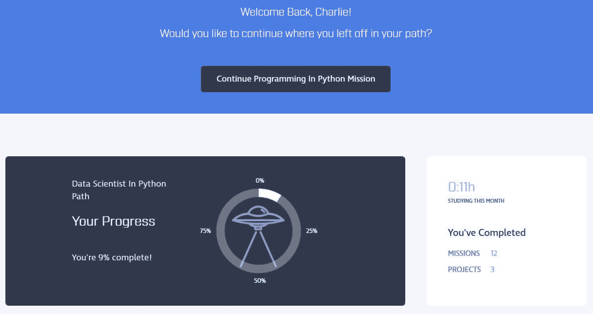
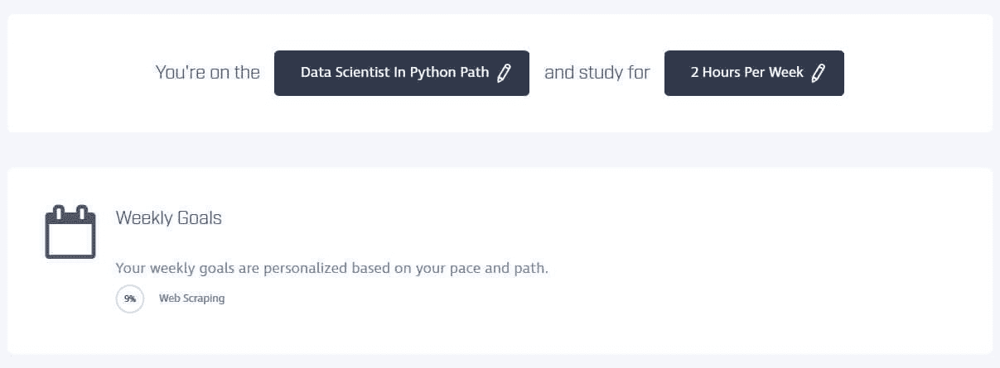
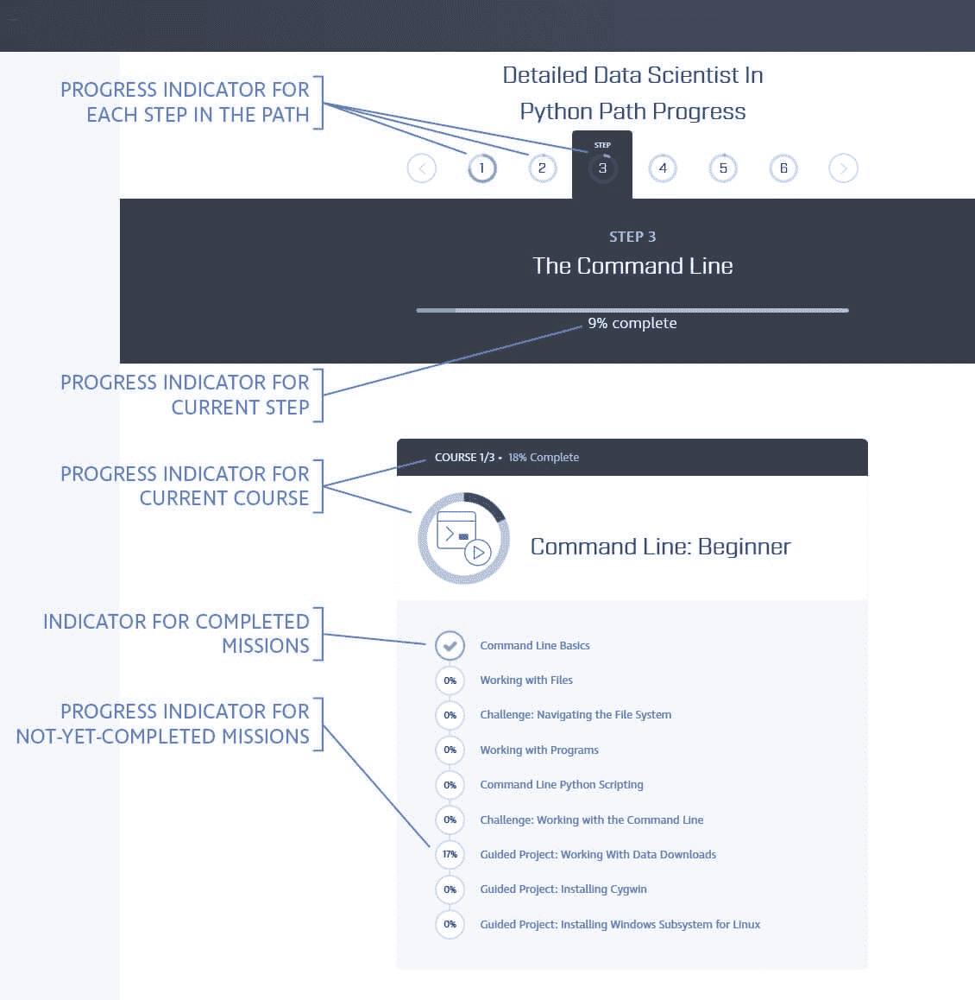
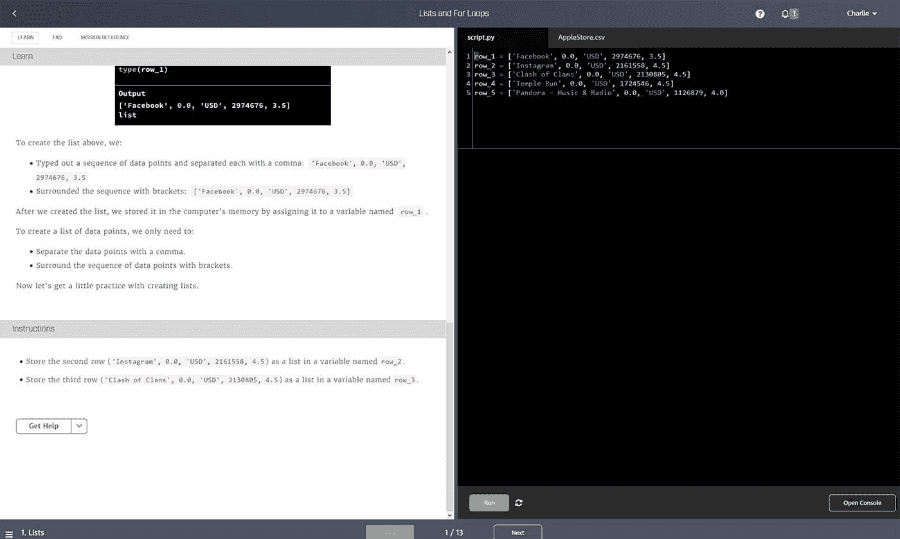
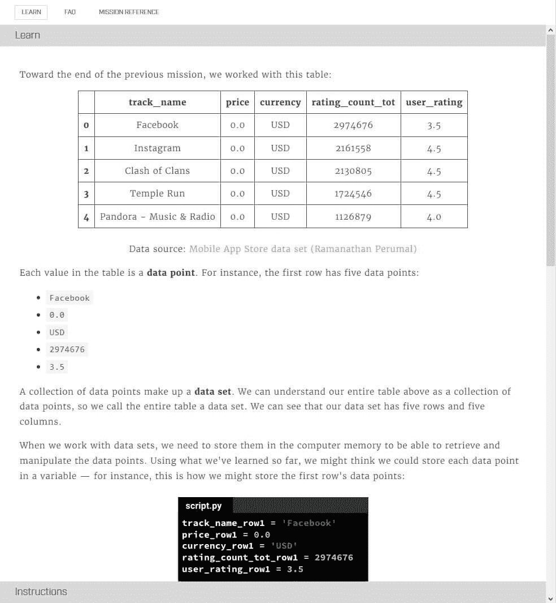
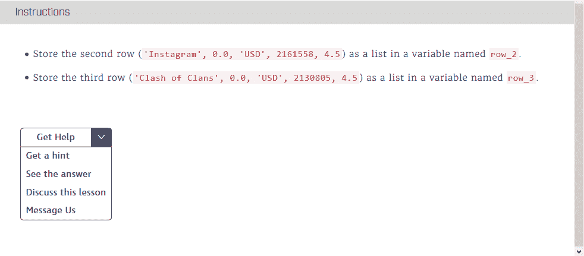
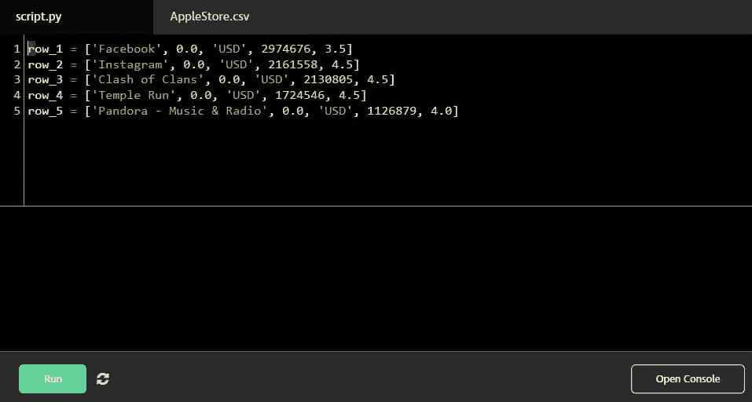
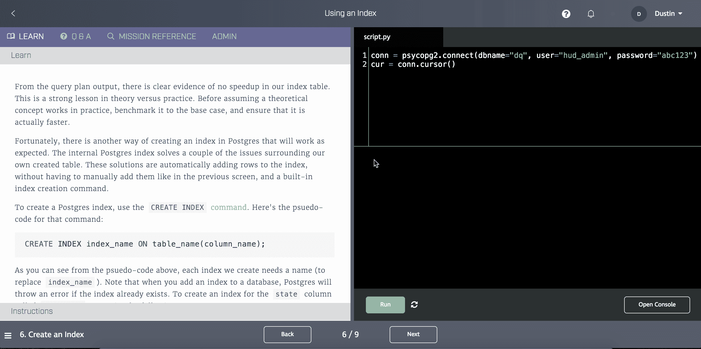
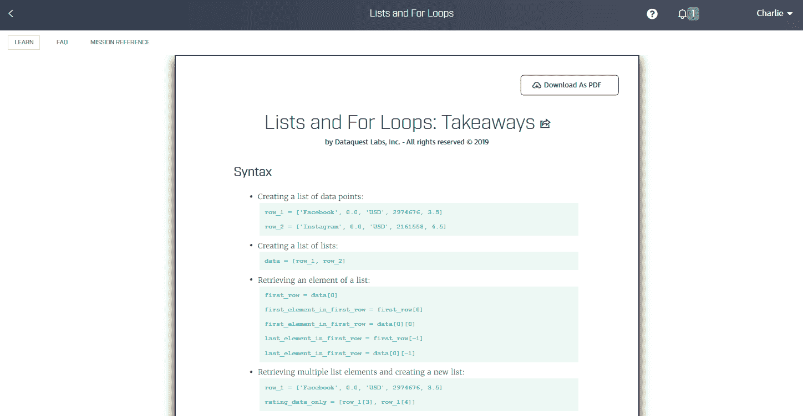

# 如何使用 Dataquest

> 原文：<https://www.dataquest.io/blog/how-to-use-dataquest/>

March 1, 2019

Dataquest 的学习平台非常用户友好，如果你愿意，你可以直接进入其中。但是如果你是那种喜欢先浏览用户手册的人，这篇文章就是为你准备的！

在本课程中，我们将介绍 Dataquest 平台的基本功能，并传递一些有用的提示和技巧，让您在学习过程中更加高效！

## Dataquest 基础:路径、课程和教训

Dataquest 的学习内容分为(按从大到小的顺序)路径、步骤、课程、课程和指导项目以及屏幕。

T2】

**路径**是围绕特定职位和编码语言组织的特定课程序列，如 Python 中的[数据科学家](https://www.dataquest.io/path/data-scientist)或 R 中的[数据分析师。](https://www.dataquest.io/path/data-analyst-r)

您可以随时在路径之间切换，并且不必先完成前面的课程，然后再开始后面的课程。不过，我们还是建议您尝试按顺序完成这些路径。

路径被分成**个步骤**，这些步骤是专注于特定技能的更小的课程序列。例如，Python 路径中的数据科学家路径的第一步包括两门课程，涵盖了用 Python 进行数据科学编程的基础知识，以及几个引导性项目，挑战您应用和扩展这些技能。

一旦你完成了一个步骤，你就可以进入下一步的课程，下一步的课程将着重于帮助你建立一套不同的技能，这样到最后，你已经完成了多个步骤，每个步骤都帮助你在先前所学的基础上发展重要的新技能。

步骤被分成**个课程**，通常每个步骤会有 2-5 个课程。每门课程都专注于一个较小的特定主题。例如，在数据科学家道路的第二步中，第一门课程重点讲述如何使用 pandas 和 numpy 库来完成数据科学任务。

每门课程都有几节**课**，更小的学习单元集中在课程主题的副主题上。例如，在前面提到的关于熊猫和 numpy 的课程中，有一节课介绍了熊猫，一节课介绍了用熊猫探索数据，一节课介绍了 numpy，等等。课程把课程分成容易理解的部分。对许多学生来说，在一次学习中完成一节课应该是可能的。

指导性项目通常在每门课程结束时进行，它们的目的是让你在学习课程的过程中应用学到的新技能。指导性项目在长度和复杂程度上各不相同，并且相对开放，以鼓励你应用你的技能和创造力。

最后，**屏幕**是 Dataquest 上最小的学习单元，每个课程或指导项目被分解成一系列屏幕。通常，一个屏幕在屏幕的左侧呈现一个新概念，然后通过在屏幕的右侧编写代码来挑战你应用他们刚刚学到的东西。然后将这些代码与正确的答案进行核对，这样您就可以立即得到关于您是否已经掌握了这个概念的反馈。

T2】

你总能在目录的[中找到 Dataquest 的所有课程，点击任何路径或课程都会带你到一个页面，上面有它包含的详细内容。](https://www.dataquest.io/data-science-courses-directory/)

## 仪表板:您的学习中心

仪表板是您在 Dataquest 上的大本营，是跟踪和衡量您的 Dataquest 进度的最佳位置。当您登录 Dataquest 时，这将是您看到的第一个屏幕，但是只要您已经登录，您也可以在[www.dataquest.io/dashboard](https://app.dataquest.io/login)访问它。

您将在仪表板中看到的第一件事是提示您从上次停止学习的地方开始。下面是一个进度跟踪器，显示您所选择的路径已完成的百分比(所选路径上方的绿色条)。这一部分还显示了你在过去的一个月里在这个网站上花了多少时间，以及你完成了多少课程和项目。

注意:由于我们一直在添加新课程，您可能会偶尔看到您的完成率略有下降，因为我们在您的道路上添加了一门新课程。

T2】

您可以随时通过点按“当前路径”旁边的铅笔图标来更改您所在的路径无论您选择哪条路径，您的进度都将被保存，因此可以随意来回切换！

在这一部分下面，您将看到您的学习时间表，以及基于您的计划时间表和路径进度的每周日程。这是用来为你设定每周学习目标的。你可以通过点击铅笔图标随时改变你计划学习的小时数，你的日程会相应地自动调整。

T2】

在这下面，你会看到一个更详细的可视化的你的每一步的进展情况。例如，在下图中，您可以看到该学生已经完成了该路径的步骤 1，目前正在学习步骤 2 中的第二门课程[探索性数据可视化课程](https://www.dataquest.io/course/exploratory-data-visualization/)。

T2】

## 学习界面

当你进入任何 Dataquest 课程时，你可能会看到一个介绍性的文本屏幕，但你会很快从那里转到一个双窗口屏幕，如下图所示。

该屏幕布局是 Dataquest 学习体验的基础，它允许您在左侧窗口中阅读新概念，然后在右侧窗口中立即试验和应用您所学的内容。

T2】

这个屏幕包含了很多功能，让我们仔细看看。

#### 学习界面:顶部栏

T2】

沿着屏幕的顶部，你会看到一个灰色的菜单栏。从左到右，这包含:

*   返回仪表板的仪表板按钮
*   您当前正在学习的第*课*的标题
*   指示虚拟代码运行器状态的页面图标。如果这是一个绿色的勾号，你就可以运行代码了！您可以单击此图标了解有关您的连接和虚拟机状态的更多详细信息。
*   答？按钮，帮助您解决问题，并与我们的支持团队联系
*   一个钟形图标，将显示您从平台收到的任何通知
*   帐户图标。点击此按钮将打开一个菜单，链接到重要页面，如您的仪表板、您的帐户页面、您当前的 Dataquest 计划、您的 Dataquest 个人资料等。

#### 学习界面:左侧窗口

T2】

在左侧窗口的顶部，您会注意到两个标签:**学习**和**课程参考**。

默认情况下，该窗口将显示 **Learn** 选项卡，在这里您将看到新的概念。在**学习**选项卡中，您将通读一个新概念的简单解释，通常包括代码示例和图表。当你到达这个解释的末尾时，你将滚动到标签的一个叫做**指令**的部分，它将解释你需要在右边的编码窗口中做什么来完成屏幕。

T2】

如果您遇到问题，您可以进一步向下滚动并单击“获取帮助”按钮来查看自定义提示、正确答案或联系支持人员。

**课程参考**选项卡打开一个搜索栏，允许您从已经完成的课程和屏幕中快速搜索信息。如果您忘记了以前学过的内容，需要快速复习，您可以在“课程参考”标签中找到相关内容并快速轻松地复习。

#### 学习界面:右侧窗口

T2】

屏幕右侧是您编写代码以完成屏幕左侧概述的指令的地方。

这里通常有两个选项卡。默认选项卡是一个脚本选项卡，通常称为 script.py 或 script.r，这是您编写代码的地方。但是通常还有第二个选项卡，它将以您正在处理的数据集命名。单击此选项卡会以表格形式显示标题行和数据集的前五个条目，因此您可以轻松地参考数据的外观。

在 scripting 选项卡中，当您打开每个新屏幕时，您通常会看到为您编写的一些代码。您在之前的屏幕中编写的代码将被保存，以便您在回顾该屏幕时可以看到您所做的事情。虽然这不是必需的，但是在编写代码的时候给代码添加注释是一个好主意，这样当你回头看的时候，你就可以阅读你自己对代码所做事情的解释。

当您编写代码时，您会注意到您的文本会根据您所编写的内容改变颜色。这被称为[语法突出显示](https://en.wikipedia.org/wiki/Syntax_highlighting)，它帮助你区分代码中不同的语法元素。您还会注意到，该窗口会根据您所写的内容自动缩进代码，并且会提示您自动完成诸如变量名之类的内容，而不是必须键入它们。这些节省时间的特性使得编写代码更加高效。

另请注意，一旦您在一个屏幕中定义了一个变量，该变量将在本课程的其余部分中存储，因此您不必在每次来到新屏幕时都重新定义它。例如，如果您在第一个屏幕中创建一个名为 my_dataset 的列表变量列表，您将能够在第二个屏幕中编写一个 for 循环来遍历 my_dataset，而不必在第二个屏幕中重新生成所有 my_dataset 代码。

在右侧窗口的底部，您会看到四个按钮。从左到右依次是:运行代码、提交答案、重置代码、打开控制台。

**运行代码**按钮做的正是你所期望的:运行你的代码。在准备提交答案之前，您可以使用此按钮运行代码片段并进行实验。

**提交答案**按钮运行您的代码，并将其作为您的答案提交给我们的答案检查系统进行检查。单击此按钮有三种可能的结果:

1.  你的代码是正确的。在这种情况下，您将听到一声欢快的“乒”声，并看到一个提示，提示您进入下一个屏幕。
2.  您的代码工作正常，但不正确。在这种情况下，您已经编写了工作代码，但是它没有产生我们期望的答案，并且您将得到一个错误显示，显示哪些变量或元素与答案检查器期望的不同。
3.  你的代码不起作用。您可能有语法错误，或者您编写代码的方式有其他问题，您将会看到基于您使用的编码语言的错误消息。

**重置代码**按钮会将该屏幕上的代码重置为默认状态——无论您第一次打开该屏幕时显示的是什么。

**打开控制台**按钮会打开一个小的子窗口，您可以在其中键入并运行小的代码片段，而不会影响您正在上面编写的脚本。这对实验很有用。

#### 学习界面:底部栏

T2】

沿着屏幕底部，您会看到另一个灰色条。在左手边，你会看到你正在操作的当前*屏幕*的名称，以及一个三明治菜单按钮，如果你点击它，它会打开一个带有链接和当前课程中每个屏幕名称的菜单。

在该栏的右侧，您会看到一个计数器，指示您当前的屏幕编号和该课程的屏幕总数(即，1/10 表示您在该课程的 10 个屏幕中的第 1 个屏幕上)。在这个计数器的两边是**后退**和**下一步**按钮，如果点击的话，将分别带你到上一个屏幕或下一个屏幕。

## 快捷键

我们已经介绍了我们学习平台的所有视觉功能，但如果你想以最高效率工作，你不需要使用按钮。您还可以使用键盘快捷键快速浏览平台。将鼠标停留在每个按钮上可以查看快捷方式:

T2】

下面是所有可用键盘快捷键的表格，便于参考。您也可以在我们的知识库中访问这些信息[。](https://help.www.dataquest.io/article/93-do-you-have-keyboard-shortcuts)

| Windows/Linux | 苹果个人计算机 |
| --- | --- |
| 运行您的代码 | alt +空格 | 选项+空格 |
| 提交答案 | alt + Enter | option + Enter |
| 上一个屏幕 | alt + b | 选项+ b |
| 下一个屏幕 | alt + n | 选项+ n |
| 恢复到初始代码 | alt + r | 选项+ r |
| 将代码转换为注释 | ctrl + / | 选项+ / |

下面是代码转换快捷方式在实践中的样子。如果您用光标在一行中输入快捷方式，该行将被注释掉。如果用光标高亮显示多行，当您输入快捷方式时，所有的行将被注释掉。

T2】

您还可以使用此快捷方式将注释快速转换回代码。

## 定制学习界面

如果您想在 Dataquest 上定制您的体验，您可以做几件事情。首先，可以拖动左右窗口之间的中间栏来调整这些窗口的大小，根据您的喜好，为您提供更多的阅读空间或代码空间。

您还可以在默认的“亮模式”和“暗模式”之间切换，用于界面的左窗口和右窗口。此设置可在您的帐户页面的“设置”区域访问，分别位于左侧和右侧窗口的“文本主题”和“编辑器主题”下。(默认情况下，文本主题设置为浅色，编辑器主题设置为深色)。

T2】

### 学习界面:其他情况

虽然我们的大部分课程都使用了上面描述的界面，但也有一些课程略有不同。例如，命令行课程利用屏幕右侧的虚拟命令行环境(而不是 Python 或 R 编码环境)。一些课程和项目将使用嵌入式版本的 Jupyter 笔记本。

当你遇到这些替代界面时，课程说明会解释如何使用它们。但是特别是 Jupyter 笔记本，有一些你需要注意的复杂情况。

首先是一些 ISP 阻止或过滤用于连接 Juptyer 笔记本的连接类型，所以如果你遇到问题，请参考我们关于 jup tyer[不加载](https://help.www.dataquest.io/article/80-jupyter-not-loading)或[频繁断开](https://help.www.dataquest.io/article/81-my-jupyter-notebook-keeps-disconnecting-and-or-the-kernel-is-dying)的支持文章。

第二，如果你使用我们网站上嵌入的 Jupyter 笔记本，你的代码不会自动永久保存。如果你想长期保存它，**你应该点击顶栏**上的“下载”按钮来下载你的笔记本。也就是说，我们建议您安装 Anaconda，以便您可以习惯在本地使用 Jupyter 笔记本，这将使您更容易在 Dataquest 网站之外承担项目。

T2】

还要注意，如果您需要帮助或者只是希望保存它以供将来参考，单击顶部栏中的按键按钮将允许您访问和下载解决方案文件。

## 外卖食品

虽然每节课中的大多数屏幕都使用上述学习界面，但每节课的最后一个屏幕将为您提供一个可下载的 PDF，我们称之为外卖。每一课都总结了你在本课中学到的重要概念，并提供了它们的用法和语法的例子。

T2】

这些要点旨在成为快速简单的参考。您可以在编写代码的任何时候(在 Dataquest 或其他地方)参考它们，重温您所学到的知识。它们也是有用的快速学习指南或复习工具。例如，如果您将它们加载到您的移动设备上，您可以翻阅它们，并从任何地方获得一点数据科学研究。

## 提示和技巧

Dataquest 平台非常简单，但这里有一些关键的提示和技巧，可以帮助您更有效地使用 Dataquest:

1.  不要忘记提示、答案和常见问题 **。**如果你真的需要支持，它会帮助你，但很多时候你可以利用这些资源解决自己的问题。
2.  **键盘快捷键很好玩** **。**只需几秒钟就能学会它们，它们将加快您浏览 Dataquest 的速度。
3.  注释你的代码。虽然这不是大多数课程的必修课，但这是一个很好的练习，将来会对你有所帮助。因为您为每个屏幕编写的代码都保存在那个屏幕上，所以如果您对它进行了注释，您可以回过头来查看您自己对代码所做工作的解释。
4.  **下载外卖**。它们非常有助于快速查阅，你可以将它们加载到移动设备上，像便笺一样翻阅它们，以便在旅途中进行学习。