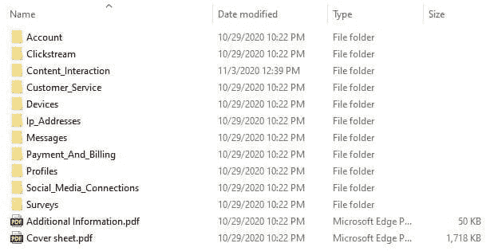
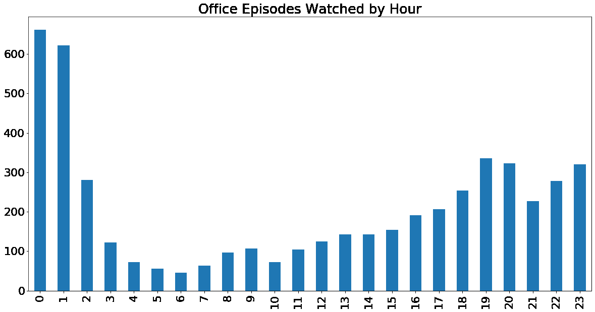

# Python 初学者教程:分析您的个人网飞数据

> 原文：<https://www.dataquest.io/blog/python-tutorial-analyze-personal-netflix-data/>

November 5, 2020

***我花了多少时间看办公室？*T3】**

这是我多年来反复思考的问题。很长一段时间以来，这部受人喜爱的情景喜剧一直是我首选的“舒适秀/背景噪音”。

这曾经是一个我无法回答的问题，因为网飞允许用户下载的关于他们活动的数据极其有限。

不过，现在网飞允许你下载一个名副其实的账户数据宝库。通过一点 Python 和 pandas 编程，我们现在可以得到这个问题的具体答案:*我花了多少时间看办公室？*

想知道你花了多少时间看《办公室》或网飞的其他节目吗？

在本教程中，我们将带你一步一步地了解如何去做！

有一点 Python 和熊猫的经验对本教程会有帮助，但不是绝对必要的。你可以注册并免费试用[我们面向初学者的交互式 Python 课程](https://www.dataquest.io/course/python-for-data-science-fundamentals/)。

但首先，让我们回答一个简单的问题。。。

## 我就不能用 Excel 吗？为什么我需要写代码？

根据你看《网飞》的时间和你使用这项服务的时间长短，你*可能*能够使用 Excel 或其他电子表格软件来分析你的数据。

但是很有可能会很艰难。

你将从网飞获得的数据集包括每隔时间播放的*的任意*长度的视频*——这包括当你浏览你的列表时自动播放的那些预告片。*

因此，如果你经常使用网飞或者已经使用流媒体服务很长时间了，你正在处理的文件可能会非常大。例如，我自己的观看活动数据超过 27，000 行。

*在 Excel 中打开*那么大的文件没问题。但是为了进行分析，我们需要进行一系列的过滤和计算。有了这么多的数据，Excel 可能会陷入严重的停顿，尤其是如果您的计算机不是特别强大的话。

在如此庞大的数据集中滚动，试图找到特定的单元格和公式也会很快变得令人困惑。

Python 可以更流畅地处理像这样的大型数据集和计算，因为它不必可视化地呈现一切。因为我们只用几行代码就可以做所有的事情，所以看到我们正在做的一切真的很容易，而不必滚动一个大的电子表格来寻找带有公式的单元格。

## 步骤 1:下载你的网飞数据

出于本教程的目的，我将使用我自己的网飞数据。要获取您自己的，请确保您已登录网飞，然后[访问此页面](https://www.netflix.com/account/getmyinfo)。在网飞主屏幕上，您也可以通过点击右上角的您的帐户图标，点击“帐户”，然后在加载的页面上点击“下载您的个人信息”来找到此页面。

在下一页，您应该会看到:


*点击红色按钮提交您的数据下载请求。*

单击“提交请求”网飞将向您发送一封确认电子邮件，您需要点击该邮件。

那么，不幸的是，你必须等待。网飞说准备你的数据报告可能需要 30 天。我曾经在 24 小时内收到一份报告，但另一份报告需要几周时间。考虑给这个页面添加书签，这样一旦你得到了你的数据，你就可以回来了。

如果你愿意，我还从我自己的数据中制作了一个小样本，可以在这里下载。如果你愿意，你可以下载这个文件并在这个项目中使用它。然后，当您自己的数据变得可用时，只需用您的文件替换相同的数据，再次运行您的代码，您将几乎立即得到您的答案！


当网飞说可能需要一个月才能得到你的数据时。

当你的报告可供下载时，网飞会发电子邮件给你。如果是这样的话，赶快行动吧，因为下载会在几个星期后“过期”并再次消失！

下载文件将以. zip 文件的形式到达，该文件包含大约十几个文件夹，其中大部分包含。csv 格式。此外，还有两个 pdf 文件，其中包含有关数据的附加信息。

## 第二步:熟悉数据

这是数据分析过程中的一个关键步骤。我们对数据理解得越好，产生有意义的分析的机会就越大。

让我们看看我们有什么。当我们解压缩文件时，我们将看到以下内容:



我们的目标是计算出我花了多少时间看网飞。似乎是最有可能包含这些数据的文件夹。如果我们打开它，我们会发现一个名为`ViewingActivity.csv`的文件，看起来正是我们想要的——记录了我们在帐户历史中查看的所有内容。


数据看起来像电子表格的一个例子。

看着这些数据，我们可以很快发现一个潜在的挑战。有一个单独的列`Title`，它包含了节目*和*的剧集标题，所以我们需要做一些额外的工作，只过滤掉*办公室*的剧集。

在这一点上，使用这些数据进行分析是很诱人的，但是让我们先确保我们理解了这些数据！在下载的 zip 文件中，有一个名为`Cover sheet.pdf`的文件，其中包含所有。csv 文件，包括`ViewingActivity.csv`。

这个数据字典可以帮助我们回答问题，避免错误。例如，查询字典中的`ViewingActivity.csv`，我们可以看到列`Start Time`使用了[的 UTC 时区](https://www.timeanddate.com/worldclock/timezone/utc)。例如，如果我们想分析一天中我们最常观看网飞的时间，我们需要将该列转换为我们的本地时区。

在进入下一步之前，花些时间查看一下`ViewingActivity.csv`中的数据和`Cover sheet.pdf`中的数据字典！

## 第三步:将你的数据载入 Jupyter 笔记本

在本教程中，我们将在 Jupyter 笔记本中使用 Python 和 pandas 来分析我们的数据。如果你还没有设置好，你可以在本教程的开头找到一个快速的、对初学者友好的指南，或者查看[为初学者提供的更深入的 Jupyter 笔记本帖子](https://www.dataquest.io/blog/jupyter-notebook-tutorial/)。

打开笔记本后，我们将导入 pandas 库，并将我们的网飞数据 CSV 读入 pandas 数据帧，我们称之为`df`:

```
import pandas as pd

df = pd.read_csv('ViewingActivity.csv')
```

现在，让我们快速预览一下数据，确保一切正常。我们将从`df.shape`开始，它将告诉我们刚刚创建的数据帧中的行数和列数。

```
df.shape
```

```
(27354, 10)
```

这个结果意味着我们有 27，353 行和 10 列。现在，让我们通过使用`df.head()`预览前几行数据来看看它是什么样子的。

为了保护隐私，我将在`.head()`括号内添加额外的参数`1`，这样在这篇博文中只有一行打印出来。然而，在您自己的分析中，您可以使用默认的`.head()`来打印前五行。

```
df.head(1)
```

|  | 配置文件名称 | 开始时间 | 持续时间 | 属性 | 标题 | 补充视频类型 | 设备类型 | 书签 | 最新书签 | 国家 |
| --- | --- | --- | --- | --- | --- | --- | --- | --- | --- | --- |
| Zero | 傻瓜 | 2020-10-29 3:27:48 | 0:00:02 | 圆盘烤饼 | 办公室(美国):第七季:最后通牒(Episod… | 圆盘烤饼 | 索尼 PS4 | 0:00:02 | 0:00:02 | 美国(美国) |

完美！

## 步骤 4:准备用于分析的数据

在我们进行数字运算之前，让我们稍微整理一下这些数据，使其更容易处理。

### 删除不必要的列(可选)

首先，我们将从删除不打算使用的列开始。这完全是可选的，对于大规模或正在进行的项目来说，这可能不是一个好主意。但是对于像这样的小规模个人项目，使用只包含我们实际使用的*列的 dataframe 可能会更好。*

在这种情况下，我们计划在观察完*办公室*后，分析*有多少*和*，因此我们需要保留`Start Time`、`Duration`和`Title`列。其他的都可以去。*

为此，我们将使用`df.drop()`并向它传递两个参数:

1.  我们要删除的列的列表
2.  `axis=1`，告诉熊猫放下柱子

它看起来是这样的:

```
df = df.drop(['Profile Name', 'Attributes', 'Supplemental Video Type', 'Device Type', 'Bookmark', 'Latest Bookmark', 'Country'], axis=1)
df.head(1)
```

|  | 开始时间 | 持续时间 | 标题 |
| --- | --- | --- | --- |
| Zero | 2020-10-29 3:27:48 | 0:00:02 | 办公室(美国):第七季:最后通牒(Episod… |

太好了！接下来，让我们处理时间数据。

### 在 Pandas 中将字符串转换为日期时间和时间增量

我们的两个与时间相关的列中的数据看起来当然是正确的，但是这些数据实际上是以什么格式存储的呢？我们可以使用`df.dtypes`获得数据帧中每一列的数据类型的快速列表:

```
df.dtypes
```

```
Start Time    object
Duration      object
Title         object
dtype: object
```

正如我们在这里看到的，所有三列都存储为`object`，这意味着它们是字符串。这对于`Title`列来说没问题，但是我们需要将这两个与时间相关的列转换成正确的数据类型，然后才能使用它们。

具体来说，我们需要做到以下几点:

*   将`Start Time`转换为日期时间(一种熊猫可以理解并执行计算的数据和时间格式)
*   将`Start Time`从 UTC 转换为我们的本地时区
*   将`Duration`转换为时间增量(一种熊猫可以理解并执行计算的持续时间格式)

所以，让我们按照这个顺序来处理这些任务，首先使用 pandas 的`pd.to_datetime()`将`Start Time`转换成 datetime。

我们还将添加可选参数`utc=True`,以便我们的日期时间数据附加了 UTC 时区。这很重要，因为我们需要在下一步将它转换成不同的时区。

然后，我们将再次运行`df.dtypes`来确认这是否如预期的那样工作。

```
df['Start Time'] = pd.to_datetime(df['Start Time'], utc=True)
df.dtypes
```

```
Start Time    datetime64[ns, UTC]
Duration                   object
Title                      object
dtype: object
```

现在我们已经得到了正确格式的列，是时候改变时区了，这样当我们进行分析时，我们将看到当地时间的所有内容。

我们可以使用`.tz_convert()`将日期时间转换为任何时区，并向它传递一个参数，该参数包含我们要转换到的时区的字符串。在这种情况下，那就是`'US/Eastern'`。为了找到你的具体时区，[这里有一个方便的参考 TZ 时区选项](https://en.wikipedia.org/wiki/List_of_tz_database_time_zones)。

这里比较棘手的一点是，我们只能在 DatetimeIndex 上使用`.tz_convert()`，所以在执行转换之前，我们需要使用`set_index()`将我们的`Start Time`列设置为索引。

在本教程中，我们随后将使用`reset_index()`将其转换回常规列。根据您的偏好和目标，这可能不是必需的，但是为了简单起见，我们将尝试使用列中的所有数据进行分析，而不是将其中的一些数据作为索引。

将所有这些放在一起看起来像这样:

```
# change the Start Time column into the dataframe's index
df = df.set_index('Start Time')

# convert from UTC timezone to eastern time
df.index = df.index.tz_convert('US/Eastern')

# reset the index so that Start Time becomes a column again
df = df.reset_index()

#double-check that it worked
df.head(1)
```

|  | 开始时间 | 持续时间 | 标题 |
| --- | --- | --- | --- |
| Zero | 2020-10-28 23:27:48-04:00 | 0:00:02 | 办公室(美国):第七季:最后通牒(Episod… |

我们可以看到这是正确的，因为我们的数据集中先前的第一行有一个`2020-10-29 03:27:48`的`Start Time`。在夏令时期间，美国东部时区比 UTC 晚四个小时，因此我们可以看到我们的转换是正确的！

现在，让我们来处理我们的`Duration`专栏。顾名思义，这是一个持续时间——一个对时间*长度*的度量。因此，我们需要将其转换为 timedelta，而不是将其转换为 datetime，time delta 是熊猫能够理解的持续时间的度量。

这与我们在转换`Start Time`列时所做的非常相似。我们只需要使用`pd.to_timedelta()`并将我们想要转换的列作为参数传递给它。

我们将再次使用`df.dtypes`来快速检查我们的工作。

```
df['Duration'] = pd.to_timedelta(df['Duration'])
df.dtypes
```

```
Start Time    datetime64[ns, US/Eastern]
Duration                 timedelta64[ns]
Title                             object
dtype: object
```

完美！但是我们还有一个数据准备任务要处理:过滤`Title`列，这样我们就可以只分析*办公室*的视图。

### 使用 str.contains 在 pandas 中按子串过滤字符串

我们有很多方法可以过滤*办公室*的观点。不过，出于我们的目的，我们将创建一个名为`office`的新数据帧，并只在其中的`Title`列包含`'The Office (U.S.)'`的行中填充数据。

我们可以使用 [`str.contains()`](https://pandas.pydata.org/pandas-docs/stable/reference/api/pandas.Series.str.contains.html) 来做到这一点，给它两个参数:

*   `'The Office (U.S.)'`，这是我们用来挑选《办公室*剧集的子字符串。*
*   `regex=False`，告诉函数前面的参数是字符串，不是正则表达式。

实际情况是这样的:

```
# create a new dataframe called office that that takes from df
# only the rows in which the Title column contains 'The Office (U.S.)'
office = df[df['Title'].str.contains('The Office (U.S.)', regex=False)]
```

一旦我们做到了这一点，有几种方法可以让我们复查我们的工作。例如，我们可以使用`office.sample(20)`来检查新的`office`数据帧的随机十行。如果所有 20 行都包含 Office 剧集，我们可以非常自信地认为事情会按预期进行。

不过，为了在本教程中保留一点隐私，我将运行`office.shape`来检查新数据帧的大小。由于这个数据帧应该只包含*的*我对*办公室*的看法，我们应该期望它的行数比 27，000+行`df`的数据集少得多。

```
office.shape
```

```
(5479, 3)
```

### 使用时间增量 [](https://localhost:8903/notebooks/datasets/Netflix%20Analysis%20Tut-edit.ipynb#Filtering-Out-Short-Durations-Using-Timedelta) 过滤掉短持续时间

在我们真正深入研究和分析之前，我们可能应该采取最后一个步骤。我们在数据探索中注意到，当像剧集预览这样的东西在主页上自动播放时，它在我们的数据中算作一个视图。

然而，当你滚动过去的时候看两秒钟的预告片和实际看一集是不一样的！因此，让我们进一步过滤我们的`office`数据帧，将它限制为仅包含`Duration`值大于一分钟的行。这应该有效地计算部分观看剧集的观看时间，同时过滤掉那些短暂的、不可避免的“预览”视图。

同样，`office.head()`或`office.sample()`是检查我们工作的好方法，但是为了保持一些隐私，我将再次使用`df.shape`来确认一些行已经从数据帧中删除。

```
office = office[(office['Duration'] > '0 days 00:01:00')]
office.shape
```

```
(5005, 3)
```

这看起来不错，所以让我们继续有趣的东西！

## 分析数据


当你意识到你花了多少时间看同一个节目时。

### 我花了多少时间看办公室？

首先，我们来回答一个大问题:我花了多少时间看*办公室*？

因为我们已经有了熊猫可以计算的格式的`Duration`栏，回答这个问题相当简单。我们可以使用`.sum()`来合计总持续时间:

```
office['Duration'].sum()
```

```
Timedelta('58 days 14:03:33')
```

所以，我总共花了 58 天 14 小时 3 分 33 秒看《网飞的办公室》。那就是。。。很多。

在我看来，那是在十年的过程中，其中很大一部分时间没有花在积极观看上！当我在做脑力劳动、健身、玩旧电子游戏等的时候。我会经常打开办公室的背景噪音，这样我就可以进出办公室了。我也曾经在睡着的时候把它当作一种白噪音。

但我们不是来为我糟糕的生活方式找借口的！既然我们已经回答了这个大问题，让我们更深入地挖掘一下我的*办公室*——观看习惯:

### 我什么时候看办公室？

让我们用两种不同的方式来回答这个问题:

*   我在一周的哪几天看了最多的 *Office* 集？
*   我在一天中的哪几个小时最常开始看*办公室*集？

我们将从一点准备工作开始，这将使这些任务更加简单:为“工作日”和“小时”创建新列。

我们可以使用`Start Time`列上的`.dt.weekday`和`.dt.hour`方法来实现这一点，并将结果分配给名为`weekday`和`hour`的新列:

```
office['weekday'] = office['Start Time'].dt.weekday
office['hour'] = office['Start Time'].dt.hour

# check to make sure the columns were added correctly
office.head(1)
```

|  | 开始时间 | 持续时间 | 标题 | 工作日 | 小时 |
| --- | --- | --- | --- | --- | --- |
| one | 2020-10-28 23:09:43-04:00 | 0 天 00:18:04 | 办公室(美国):第七季:优雅的圣诞节:… | Two | Twenty-three |

现在，我们来做一点分析！这些结果在视觉上更容易理解，所以我们将开始使用`%matplotlib inline`魔法让我们的图表显示在我们的 Jupyter 笔记本上。然后，我们再导入`matplotlib`。

```
%matplotlib inline
import matplotlib
```

现在，让我们按一周中的每一天来绘制我的观看习惯的图表。为此，我们需要完成几个步骤:

*   告诉 pandas 我们希望使用`pd.Categorical`来绘制日期的顺序——默认情况下，它会根据每天观看的剧集数量以降序绘制它们，但当查看图表时，以周一至周日的顺序查看数据会更直观。
*   统计我每天观看的剧集总数
*   对数据进行分类和绘图

(当然，我们还有许多其他方法来分析和可视化这些数据。)

让我们一步一步来看看它是怎样的:

```
# set our categorical and define the order so the days are plotted Monday-Sunday
office['weekday'] = pd.Categorical(office['weekday'], categories=
    [0,1,2,3,4,5,6],
    ordered=True)

# create office_by_day and count the rows for each weekday, assigning the result to that variable
office_by_day = office['weekday'].value_counts()

# sort the index using our categorical, so that Monday (0) is first, Tuesday (1) is second, etc.
office_by_day = office_by_day.sort_index()

# optional: update the font size to make it a bit larger and easier to read
matplotlib.rcParams.update({'font.size': 22})

# plot office_by_day as a bar chart with the listed size and title
office_by_day.plot(kind='bar', figsize=(20,10), title='Office Episodes Watched by Day')
```


办公室白天看风景，周一至周日。

正如我们所看到的，我实际上在工作日比周末更倾向于观察办公室。根据我的习惯，这是有意义的，因为它经常是晚上工作、锻炼时的背景噪音。

现在，让我们按小时来看一下同样的数据。这里的过程与我们刚才所做的非常相似:

```
# set our categorical and define the order so the hours are plotted 0-23
office['hour'] = pd.Categorical(office['hour'], categories=
    [0,1,2,3,4,5,6,7,8,9,10,11,12,13,14,15,16,17,18,19,20,21,22,23],
    ordered=True)

# create office_by_hour and count the rows for each hour, assigning the result to that variable
office_by_hour = office['hour'].value_counts()

# sort the index using our categorical, so that midnight (0) is first, 1 a.m. (1) is second, etc.
office_by_hour = office_by_hour.sort_index()

# plot office_by_hour as a bar chart with the listed size and title
office_by_hour.plot(kind='bar', figsize=(20,10), title='Office Episodes Watched by Hour')
```



*办公室查看时间，上午-下午*

从数据来看，看起来 12 点和 1 点是我最常开始看《办公室里的 T1》的时间。这是由于我睡觉时把节目当作白噪音的(不健康)习惯——这些剧集中的许多可能是在我已经睡着的时候自动播放的！

除此之外，毫不奇怪，我的大部分观看都发生在晚上。

(注意:这个数据实际上可能没有很好地反映我的真实习惯，因为我在网飞账户所有权的很大一部分时间里都住在中国。我们在本教程中没有考虑这一点，因为这是一种独特的情况，不适用于大多数人。如果您在使用网飞期间花费了大量时间在不同的时区，那么您可能需要在分析之前的数据清理阶段进行一些额外的日期过滤和时区转换。)

## 下一步是什么？

在本教程中，我们快速浏览了一些网飞的个人数据，并了解到——除了别的以外——我看了太多的《办公室》。但是从这里你可以去很多地方！以下是为你自己扩展这个项目的一些想法:

*   为另一个节目做相同或相似的分析。
*   看看您是否可以使用正则表达式为节目标题和剧集标题创建单独的列[在我们的[高级数据清理课程](https://www.dataquest.io/course/python-data-cleaning-advanced/)中学习使用它们]
*   找出你看得最多和最少的特定剧集
*   创建更漂亮的图表(我们的[数据可视化讲故事课程](https://www.dataquest.io/course/storytelling-data-visualization/)可以在这方面提供帮助)


当你意识到你在网飞的观看习惯让你完成了一个很酷的项目。

你也可以用自己的个人数据尝试一些其他有趣的项目。例如:

*   使用 Python 找出[你在亚马逊上花了多少钱](https://www.dataquest.io/blog/how-much-spent-amazon-data-analysis/)
*   使用 Python 来[分析你的脸书发帖习惯](https://www.dataquest.io/blog/analyze-facebook-data-python/)

想学着自己做这种项目，什么时候都行？我们的[交互式数据科学课程](https://www.dataquest.io/path/data-scientist/)将教你做所有这些事情，甚至更多！—就在您的浏览器窗口中。


*[https://www.youtube.com/embed/6a5jbnUNE2E?rel=0](https://www.youtube.com/embed/6a5jbnUNE2E?rel=0)*

 *提升您的数据技能。

[查看计划](/subscribe)*