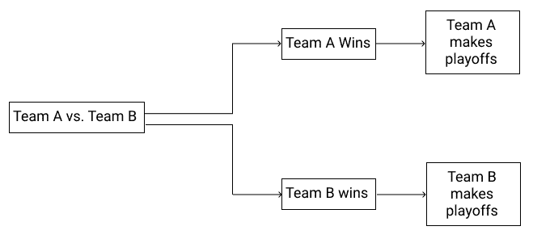
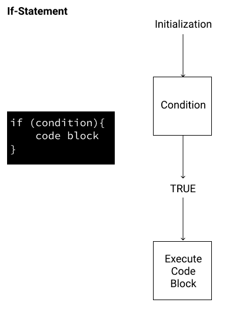
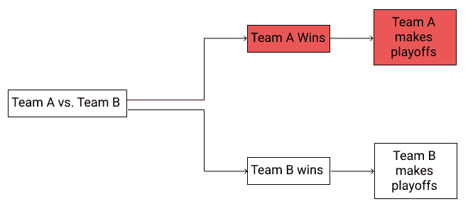
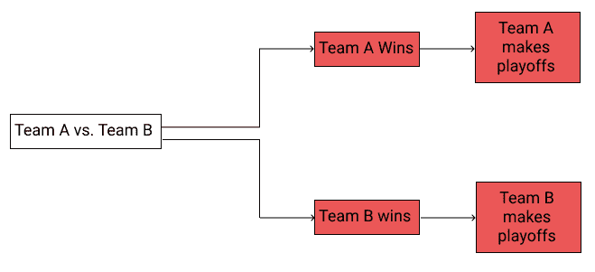
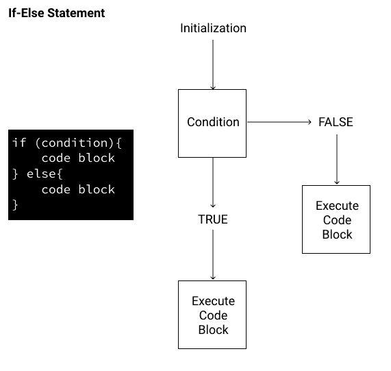
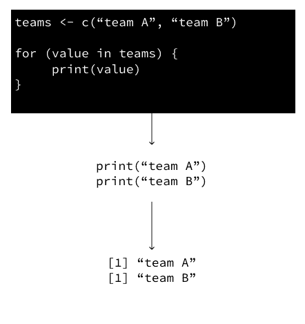
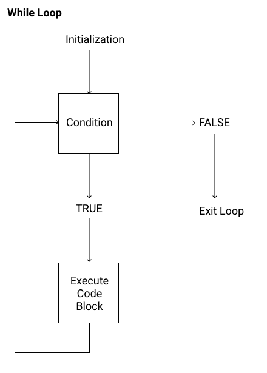
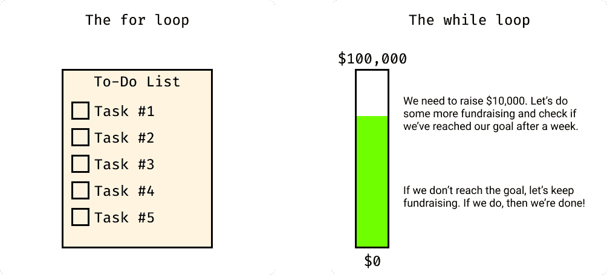

# 如何在 R 中使用 If-Else 语句和循环

> 原文：<https://www.dataquest.io/blog/control-structures-in-r-using-loops-and-if-else-statements/>

September 1, 2020

当我们用 R(或者其他语言)编程时，我们经常想要控制*何时*和*如何*执行我们代码的特定部分。我们可以使用**控制结构**来实现，比如 if-else 语句、for 循环和 while 循环。

控制结构是代码块，它根据指定的参数确定如何执行其他代码段。你可以认为这些有点像父母离家前给孩子的指示:

"如果我晚上 8 点还没回家，你就给自己做晚饭。"

控制结构设置一个条件，并告诉 R 当条件满足或不满足时做什么。不像有些孩子，R 会永远做我们让它做的事！如果你愿意，你可以在 R 文档中了解更多关于控制结构[的信息。](https://www.rdocumentation.org/packages/base/versions/3.6.0/topics/Control)

在本教程中，我们假设您熟悉基本的数据结构和 r 中的算术运算。

还没到那一步？查看我们的[介绍性 R 编程课程](https://www.dataquest.io/course/introduction-to-data-analysis-in-r/)，这是我们的[数据分析师在 R](https://www.dataquest.io/path/data-analyst-r/) 路径中的一部分。开始学习是免费的，没有任何先决条件，也不需要安装任何东西—您现在就可以在浏览器中开始学习。

[thrive _ leads id = ' 21036 ']

(本教程是基于我们的中级 R 编程课程的，所以也来看看吧！它是交互式的，允许你在浏览器中编写和运行代码。)

## R 中的比较运算符

为了使用控制结构，我们需要创建结果为`TRUE`或`FALSE`的语句。在上面的孩子的例子中，陈述“现在是晚上 8 点。我父母回来了吗？”产量`TRUE`(“是”)或`FALSE`(“否”)。在 R 中，将某物评估为`TRUE`或`FALSE`的最基本方式是通过**比较运算符**。

下面是在 R 中使用控制结构的六个基本比较运算符:

*   `==`意思是平等。被框成问题的语句`x == a`表示“`x`的值等于`a`的值吗？”
*   `!=`意为“不相等”。语句`x == b`表示“`x`的值不等于`b`的值吗？”
*   `<`意为“小于”。语句`x < c`的意思是“`x`的值小于`c`的值吗？”
*   `<=`意为“小于或等于”。语句`x <= d`表示“`x`的值是否小于或等于`d`的值？”
*   `>`意为“大于”。语句`x >` e 的意思是“T2 的值是否大于 T3 的值？”
*   `>=`意为“大于或等于”。语句`x >= f`表示“`x`的值是否大于或等于`f`的值？”

## 理解 R 中的 If-Else

假设我们正在观看一场决定哪支球队进入季后赛的体育比赛。我们可以用这个树形图来想象可能的结果:



正如我们在树形图中看到的，只有两种可能的结果。如果 A 队赢了，他们就进入季后赛。如果 B 队赢了，他们就走。

让我们从尝试用 r 表示这个场景开始。我们可以使用一个 **if 语句**来编写一个程序，打印出获胜的团队。

如果条件返回`TRUE`，If 语句告诉 R 运行一行代码。if 语句在这里是一个很好的选择，因为它允许我们根据发生的结果来控制打印哪个语句。

下图显示了条件流程图和 if 语句的基本语法:



我们的 if 语句的条件应该是一个计算结果为`TRUE`或`FALSE`的表达式。如果表达式返回 TRUE，那么程序将执行括号`{ }`之间的所有代码。如果为 FALSE，则不会执行任何代码。

了解了这一点，让我们来看一个 if 语句的例子，它打印获胜队的名字。

```
team_A <- 3 # Number of goals scored by Team A
team_B <- 1 # Number of goals scored by Team B
if (team_A > team_B){
  print ("Team A wins")
}
```

```
"Team A wins" 
```

成功了！因为 A 队比 B 队有更多的进球，我们的条件语句(`team_A > team_B`)计算为`TRUE`，所以它下面的代码块运行，打印 A 队赢得比赛的消息。

## 在 R 中添加 else 语句

在前面的练习中，我们根据我们的表情打印了将进入季后赛的球队的名称。让我们来看一场新的比分对决。如果 A 队 1 球，B 队 3 球呢？我们的 team_A > team_B 条件将评估为`FALSE`。因此，如果我们运行我们的代码，什么都不会被打印出来。因为 if 语句的计算结果为 false，所以不执行 if 语句中的代码块:

```
team_A <- 1 # Number of goals scored by Team A
team_B <- 3 # Number of goals scored by Team B
if (team_A > team_B){
    print ("Team A will make the playoffs")
} 
```

如果我们回到最初的流程图，我们可以看到我们只为两种可能性中的一种编写了分支代码:



理想情况下，我们希望让我们的程序考虑到这两种可能性，并且如果表达式评估为 FALSE，则“B 队将进入季后赛”。换句话说，我们希望能够处理两个条件分支:



为此，我们将添加一个 else 语句，将它转换成通常所说的 **if-else 语句**。在 R 中，如果条件语句是`TRUE`，if-else 语句告诉程序运行一个代码块，如果条件语句是`FALSE`，则运行一个*不同的*代码块。下面以流程图的形式和 R 语法的形式直观地展示了这一过程:

* * * * ** * *

概括来说，R 中的 if-else 需要三个参数:

1.  评估为真或假的语句(例如比较运算符)。
2.  如果比较运算符为 TRUE，R 应返回的值。
3.  如果比较运算符为 FALSE，R 应返回的值。

因此，在我们的例子中，我们需要添加一段代码，如果我们的条件表达式`team_A > team_B`返回`FALSE`，这段代码就会运行。我们可以通过在 r 中添加一个`else`语句来做到这一点。如果我们的比较运算符评估为 FALSE，让我们打印“B 队将进入季后赛”

```
 team_A <- 1 # Number of goals scored by Team A
team_B <- 3# Number of goals scored by Team B
if (team_A > team_B){
    print ("Team A will make the playoffs")
} else {
    print ("Team B will make the playoffs")
} 
```

```
"Team B will make the playoffs" 
```

概括一下:

*   if 语句的本质特征是它帮助我们在代码中创建一个分支路径。
*   R 中的关键字`if`和`else`后面都是花括号`{ }`，花括号定义了代码块。
*   每个代码块代表图中所示的一条路径。
*   r 并不两者都运行，它使用比较运算符来决定运行哪个代码块。

## 超越两个分支

到目前为止，我们一直假设我们的控制结构中的每个决策只有两个分支:一个对应于`TRUE`，另一个对应于`FALSE`。很多时候，我们会有两个以上的选择，因为有些决定不能归结为“是”还是“不是”。

假设我们正在观看一场可能以平局收场的体育比赛。我们上一个例子中的控制结构没有考虑到这一点。幸运的是，R 提供了一种方法，可以用关键字`else if`在一个`if`语句中合并两个以上的分支。else if 关键字提供了另一个在`if`语句中使用的代码块，我们可以有任意多个合适的代码块。这看起来是这样的:

```
 team_A <- 2 # Number of goals scored by Team A
team_B <- 2# Number of goals scored by Team B
if (team_A > team_B){
  print ("Team A won")
} else if (team_A < team_B){
  print ("Team B won")
} else {
  "Team A & B tied"
} 
```

```
"Team A & B tied" 
```

每个潜在的游戏结果都有自己的分支。代码块有助于我们应对任何平局的情况。

## 在 R 中使用 for 循环

既然我们已经在 R 中使用 if-else 来显示一个匹配的结果，那么如果我们想要查找多个匹配的结果呢？假设我们有一个包含匹配结果的向量列表:`matches <- list(c(2,1),c(5,2),c(6,3))`。

记住，索引时我们必须使用`[[]]`,因为我们想要返回列表中每个列表的单个值，而不是列表对象的值。用`[]`索引将返回一个*列表对象*，而不是值。

因此，例如，在我们上面的代码中，`matches[[2]][1]`正在调用*第二*列表的*第一*索引(即第二场比赛中 A 队的得分)。

假设团队 A 的目标列在第一位(向量的第一个索引)，团队 B 的目标列在第二位，我们可以在 R 中使用 if-else 找到结果，如下所示:

```
 if (matches[[1]][1] > matches[[1]][2]){
    print ("Win")
} else {
    print ("Loss")
} 

if (matches[[2]][1] > matches[[2]][2]){
   print ("Win")
} else { 
    print ("Loss")
} 

if (matches[[3]][1] > matches[[3]][2]){
   print ("Win")
} else { 
   print ("Loss")
} 
```

这将打印:

```
"Win"
"Win"
"Win" 
```

这段代码可以工作，但是如果我们观察这种方法，很容易发现问题。为*三个*游戏写出这个已经很麻烦了。如果我们有一个 100 或 1000 个游戏的列表来评估会怎么样？

我们可以通过使用 r 中的 **for 循环**执行相同的操作来改进我们的代码。for 循环为对象中的每个*元素*多次重复一段代码。这允许我们编写更少的代码(这意味着出错的可能性更小)，并且可以更好地表达我们的意图。这里有一个流程图表示，以及 R 中的语法(看起来非常类似于 if 语法)。


在此图中，对于序列中的每个值，循环将执行代码块。当序列中没有更多的值时，这将返回`FALSE`并退出循环。

我们来分析一下这是怎么回事。

*   **序列**:这是一组对象。例如，这可能是数字 c(1，2，3，4，5)的向量。
*   **value** :这是一个迭代器变量，用于引用序列中的每个值。有关有效的变量名，请参见第一课中的变量命名约定。
*   **代码块**:这是被求值的表达式。

我们来看一个具体的例子。我们将编写一个快速循环来打印列表中项目的值，我们将创建一个包含两个项目的短列表:Team A 和 Team B。

```
 teams <- c("team_A","team_B")
for (value in teams){
    print(value)
} 
```

```
"team_A" 
"team_B" 
```

由于`teams`有两个值，我们的循环将运行两次。这是正在发生的事情的视觉表现



一旦循环显示了第一次迭代的结果，循环将查看该位置的下一个值。因此，它将经历另一次迭代。由于序列中没有更多的值，循环将在“team_B”之后退出。

总的来说，最终结果将如下所示:

```
"team_A" 
"team_B" 
```

## 将循环的结果添加到 R 中的对象

既然我们已经写出了我们的循环，我们将希望在我们的循环中存储每次迭代的每个结果。在本文中，我们将把我们的值存储在一个向量中，因为我们处理的是单一的数据类型。

从我们的 [R 基础课程](https://www.dataquest.io/course/introduction-to-data-analysis-in-r/)中你可能已经知道，我们可以使用`c()`函数组合向量。我们将使用相同的方法来存储 for 循环的结果。

我们从这个 for 循环开始:

```
 for (match in matches){
    print(match)
} 
```

现在，假设我们想得到一场比赛中的总进球数，并将它们存储在 vector 中。我们需要做的第一步是将列表中的每个分数加在一起，这可以使用`sum()`函数来完成。我们将让代码循环通过`matches`来计算每场比赛的总进球数。

```
 matches <- list(c(2,1),c(5,2),c(6,3))
for (match in matches){
    sum(match)
}
```

但是我们实际上还没有在任何地方保存这些进球总数！如果我们想保存每场比赛的总目标，我们可以初始化一个新的向量，然后将每个额外的计算附加到该向量上，如下所示:

```
 matches <- list(c(2,1),c(5,2),c(6,3))
total_goals <- c()
for (match in matches){
    total_goals <- c(total_goals, sum(match))
}
```

## 在 R 中的 for 循环中使用 if-else 语句

现在我们已经学习了 R 中的 if-else 和 R 中的 for 循环，我们可以更进一步，在 for 循环中使用 if-else 语句来给出多个*匹配的结果。*

为了组合两个控制结构，我们将把一个控制结构放在另一个控制结构的括号`{ }`之间。

我们从 team_A 的比赛结果开始:

```
matches <- list(c(2,1),c(5,2),c(6,3)) 
```

然后我们将创建一个 for 循环来遍历它:

```
for (match in matches){
} 
```

这一次，我们不打印结果，而是将 if-else 语句添加到 for 循环中。

在我们的场景中，我们希望程序打印出 A 队是赢了还是输了比赛。假设 A 队的目标是每对值中的第一个，对手是第二个指标，我们需要使用一个比较运算符来比较这些值。在我们进行这个比较之后，如果 team_A 的得分更高，我们将打印“Win”。如果没有，我们就印“输”。

当索引到 iterable 变量 match 时，我们可以使用`[]`或`[[]]`，因为 iterable 是一个向量，而不是一个列表。

```
 matches <- list(c(2,1),c(5,2),c(6,3))
for (match in matches){
    if (match[1] > match[2]){
        print("Win")
    } else {
        print ("Lose")
    }
} 
```

```
"Win"
"Win"
"Win" 
```

## 打破 R 中的 for 循环

现在我们已经添加了一个 if-else 语句，让我们看看如何基于某个条件停止 R 中的 for 循环。在我们的例子中，我们可以使用一个`break`语句来停止循环，只要我们看到 A 队赢得了一场比赛。

使用我们上面写的 for 循环，我们可以在 if-else 语句中插入 break 语句。

```
 matches <- list(c(2,1),c(5,2),c(6,3))
for (match in matches){
    if (match[1] > match[2]){
        print("Win")
        break
    } else {
        print("Lose")
    }
}
```

```
"Win" 
```

[thrive _ leads id = ' 19015 ']

## 在 R 中使用 while 循环

在前面的练习中，我们在 R 中使用了一个 for 循环来重复一段代码，这段代码给出了匹配的结果。现在我们已经返回了每场比赛的结果，如果我们想计算胜利的数量来确定他们是否进入季后赛，会怎么样呢？返回前四个游戏结果的一种方法是在 r 中使用一个 **while** 循环。

R 中的 while 循环是 R 中 for 循环的近亲，然而，while 循环将检查逻辑条件，并且只要条件为真就继续运行循环。while 循环的语法如下所示:

```
while(condition){
    expression
}
```

以流程图的形式:



如果 R 中 while 循环的条件是*始终*为真，那么 while 循环将是一个无限循环，我们的程序永远不会停止运行。这是我们绝对要避免的事情！在 R 中编写 while 循环时，我们希望确保在某个时刻条件为假，这样循环就可以停止运行。

让我们以一支赛季初零胜的球队为例。他们需要赢得 10 场比赛才能进入季后赛。我们可以编写一个 while 循环来告诉我们球队是否进入了季后赛:

```
wins <- 0
while (wins < 10){
    print ("Does not make playoffs")
    wins <- wins + 1
}
```

```
"Does not make playoffs"
"Does not make playoffs"
"Does not make playoffs"
"Does not make playoffs"
"Does not make playoffs"
"Does not make playoffs"
"Does not make playoffs"
"Does not make playoffs"
"Does not make playoffs"
"Does not make playoffs" 
```

当 wins 达到 10 时，我们的循环将停止运行。请注意，我们不断地给 win 总数加 1，所以最终，win < 10 的条件将返回`FALSE`。结果，循环退出。

如果整个过程看起来令人生畏，不要担心，虽然 R 中的循环需要时间来理解，但一旦掌握，它们就是强大的工具。有许多不同的变量需要处理，但是理解 while 循环的关键是要知道这些变量在每次循环运行时是如何变化的。

让我们在 R 中编写第一个 while 循环，计算 A 队获胜！

## 在 R 中的 while 循环中使用 if-else 语句

既然我们已经打印了球队没有足够胜利时的状态，我们将添加一个特性来指示他们何时进入季后赛。

为此，我们需要在 while 循环中添加一个 if-else 语句。将 if-else 语句添加到 while 循环中与将其添加到 R 中的 for 循环中是一样的，我们已经完成了这一步。回到我们的场景，10 场胜利允许 A 队进入季后赛，让我们添加一个 if-else 条件。

if-else 条件将放在 while 循环的括号之间，与我们之前将它放入 for 循环的位置相同。

```
 wins <- 0
while (wins <= 10){
    if (wins < 10){
        print("does not make playoffs")
    } else {
        print ("makes playoffs")
    }
    wins <- wins + 1
}
```

```
"does not make playoffs"
"does not make playoffs"
"does not make playoffs"
"does not make playoffs"
"does not make playoffs"
"does not make playoffs"
"does not make playoffs"
"does not make playoffs"
"does not make playoffs"
"makes playoffs" 
```

## 打破 R 中的 while 循环

假设一支球队在一个赛季中最多能赢 15 场。为了进入季后赛，我们仍然需要 10 场胜利，所以一旦 A 队达到这个数字，我们就可以结束我们的循环。

为此，我们可以使用另一个`break`语句。同样，这在 while 循环中的作用与在 for 循环中的作用相同；一旦满足条件并执行`break`，循环结束。

```
 wins <- 0
playoffs <- c()
while (wins <= 15){
    if (wins < 10){
        print("does not make playoffs")
        playoffs <- c(playoffs, "does not make playoffs")
    } else {
        print ("makes playoffs")
        playoffs <- c(playoffs, "makes playoffs")
        break
    }
    wins <- wins + 1
}
```

```
"does not make playoffs"
"does not make playoffs"
"does not make playoffs"
"does not make playoffs"
"does not make playoffs"
"does not make playoffs"
"does not make playoffs"
"does not make playoffs"
"does not make playoffs"
"does not make playoffs"
"makes playoffs" 
```

## while 循环背后的直觉

R 中的 for 循环可能是你最常处理的循环。但是了解 while 循环还是很有用的。

为了区分这两种类型的循环，将 for 循环视为处理家务清单是很有用的。这个想法是你有一定数量的杂务要完成，一旦你完成了所有的杂务，你就完成了。这里的关键是我们需要在 for 循环中循环一定数量的项。

另一方面，while 循环就像试图达到一个里程碑，就像为慈善活动筹集目标金额的资金。对于慈善活动，你通常会表演和做一些事情来为你的事业筹集资金，比如跑步或为人们提供服务。你做这些任务，直到你达到你的目标，从一开始就不清楚你需要做多少任务才能达到目标。这是 while 循环背后的关键思想:重复一些动作(读:一个代码块)*直到满足一个条件或目标*。



而循环在模拟和优化等繁重的分析任务中起着重要作用。优化是寻找一组参数的行为，这些参数可以最大化或最小化某个目标。

在其他数据分析任务中，如清理数据或计算统计数据，while 循环就不那么有用了。这些任务构成了你在 R 路径中遇到的[数据分析师以及你的职业生涯的主要内容，但是作为一名程序员，知道什么工具对你是可用的总是好的。](https://www.dataquest.io/path/data-analyst-r/)

## 获取免费的数据科学资源

免费注册获取我们的每周时事通讯，包括数据科学、 **Python** 、 **R** 和 **SQL** 资源链接。此外，您还可以访问我们免费的交互式[在线课程内容](/data-science-courses)！

[SIGN UP](https://app.dataquest.io/signup)

## 后续步骤

在本教程中，我们将一个基本的 if 语句开发成一个更复杂的程序，该程序根据逻辑条件执行代码块。

这些概念是 R 编程的重要方面，它们将帮助您编写更加强大的代码。但是我们仅仅触及了 R 力量的表面！

要学习编写更高效的 R 代码，请查看我们的 [R 中级](https://www.dataquest.io/course/control-flow-iteration-and-functions-in-r/)课程。您可以直接在浏览器中编写代码(并得到检查)!

在本课程中，您将学习:

*   如何以及为什么应该使用矢量化函数和泛函
*   如何编写自己的函数
*   `tidyverse`包`dplyr`和`purrr`如何帮助你写出更高效、更易读的代码
*   如何使用`stringr`包来操作字符串

简而言之，这些是帮助你将 R 代码从实用提升到美观的基本技能。准备好开始了吗？

## 获取免费的数据科学资源

免费注册获取我们的每周时事通讯，包括数据科学、 **Python** 、 **R** 和 **SQL** 资源链接。此外，您还可以访问我们免费的交互式[在线课程内容](/data-science-courses)！

[SIGN UP](https://app.dataquest.io/signup)