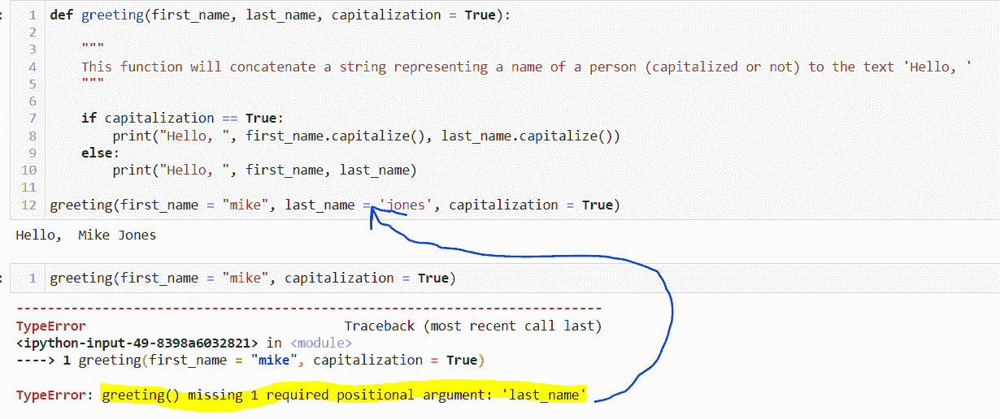
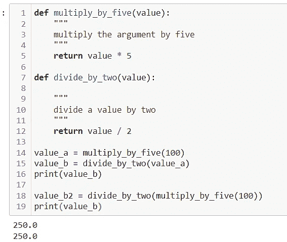
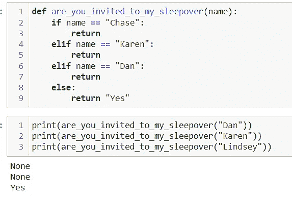
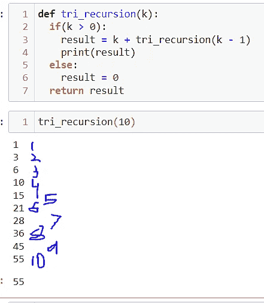
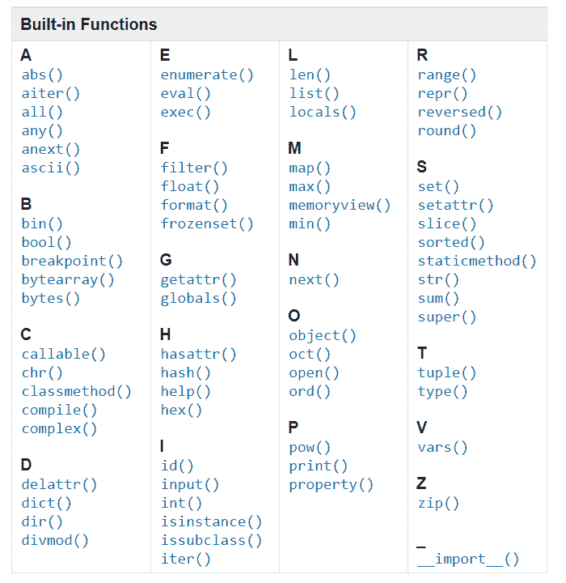
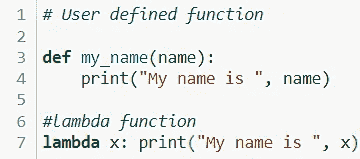
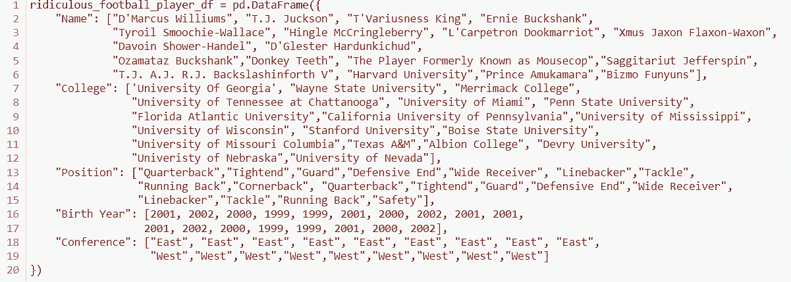
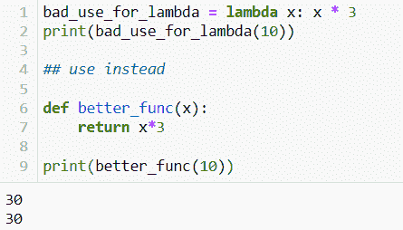

# 教程:揭开 Python 中函数的神秘面纱

> 原文：<https://www.dataquest.io/blog/tutorial-demystifying-functions-in-python/>

January 10, 2022

在数据科学之旅中前进意味着遇到和处理越来越复杂的任务。为了做到这一点，您将需要一些东西来“接收”数据，以某种方式处理它，然后返回一些输出。我们可以通过使用函数来完成这个多阶段的过程。

## 什么是功能？

如果你需要[给你的面试官](https://www.dataquest.io/blog/career-guide-data-science-job-interview/)留下深刻印象，总结一个功能的最好方法是“一个自包含的代码块，由用于完成某些特定任务的相关语句组成。”在 Python 中，这些函数以三种类型之一存在:

1.  [Python 语言自带的内置函数](https://data-flair.training/blogs/python-built-in-functions/)
2.  用户定义的函数，在使用它们的上下文和它们作用的数据中是特定的
3.  λ函数是未定义的，在短期内使用(即，不能在单一实例之外使用)

我们将在下面逐一分析这些类型。但在这之前，有必要问一个重要的问题。

## 为什么要使用函数？

函数因许多原因而受到高度重视。首先，使用函数主要使您能够避免在应用程序中的多个位置复制您经常使用的特定代码段。当然，您可以只进行复制和粘贴，但是如果您需要在任何时候[修改代码段](https://www.dataquest.io/course/python-advanced-functions/)，您必须为每个实例重复这个过程。

这可以节省时间并消除潜在的错误。另外，如果你在一个协作元素中工作，这意味着避免任何混乱或复杂的代码。

(一)

*“做一些你能做得更少的事情来达到同样的结果会好得多”*

除了减少一段代码的冗余，它还使我们在概念化和处理复杂任务时能够模块化(即，将复杂的过程分解成单独的步骤)。直觉上，我们在日常生活中这样做(*比方说，准备一个大型晚宴*)，我们将活动的必要任务分解成所有必要的步骤。这使得我们更容易计划、扩展和调试。

[T2】](https://www.dataquest.io/wp-content/uploads/2022/01/girl-holding-python-functions-code.webp)

(摘自安德烈娅·皮亚卡迪奥的《Pexel》

## Python 中的函数是如何工作的？

在这种情况下，我们将讨论用户定义的函数。在最基本的层面上，这涉及几个组件:

| 成分 | 描述 |
| 定义
函数名
参数
自变量
:
语句* | 通知 Python 您正在定义一个函数的关键字
您正在调用什么函数[满足命名约定](https://www.python.org/dev/peps/pep-0008/#function-and-variable-names)在 Python 中
传递给函数的可选输入调整函数如何作用于参数
值传递给函数时分配给参数的值
表示函数头结束的标点符号
无论何时调用函数都将执行函数的语句块 |

**语句组成了函数的主体，用缩进*
来表示。下面是一个我们如何定义函数的简单例子

*注意:作为一个良好的实践，当创建一个用户定义的函数时，应用一个[文档字符串](https://www.pythonforbeginners.com/basics/python-docstrings)来解释这个函数做什么。*

在这种情况下，第一行使用“def”关键字向 Python 表明正在定义一个新函数(greeting ),它接受一个参数(name)和一个参数(大写)。缩进的下一行表示执行任务的函数体。在这里，我们看到参数调整了这个执行，如果它为真，它将打印出一个字符串，并对参数应用大写方法。否则，它不会。同样，在上面的例子中，我们有一个默认值附加到大写参数上，除非另有说明，否则它通常被设置为 True。

默认情况下，调用函数时必须使用正确数量的参数。这意味着如果一个函数需要一定数量的参数输入才能运行，那么你就需要这个数量的参数。否则，您将得到类似这样的结果:

[T2】](https://www.dataquest.io/wp-content/uploads/2022/01/python-functions-typeerror.webp)

有时，在计划您希望函数做什么时，您可能不确定输出应该是什么。在这些情况下，运行该函数但不产生输出或错误消息可能是有用的。为此，我们使用如下所示的 pass 语句:

[T2】](https://www.dataquest.io/wp-content/uploads/2022/01/python-functions-myfunction.webp)

我们可能需要应用这一点的另一种情况是，当需要为特定输出创建一个条件时，我们也可以使用 pass 语句。

在上面的两个场景中，我们都有一个返回打印值的输出。有时，我们可能只需要返回值，以便在另一个上下文中使用(比如，进入另一个函数)。在这种情况下，我们可以使用 return 来代替。这里的 return 语句有两个目的:

1.  它会立即终止函数，并将执行控制权返回给调用者
2.  它为函数提供了一种将数据传递回调用者的机制

[T2】](https://www.dataquest.io/wp-content/uploads/2022/01/python-functions-defmultiply.webp)

现在，由于 return 语句可以终止一个函数，我们可以在检查潜在错误的情况下应用它，在满足该条件的情况下，我们返回某种指示错误的输出。

[T2】](https://www.dataquest.io/wp-content/uploads/2022/01/python-functions-definvited.webp)

有趣的是，对于函数，我们可以定义函数调用本身，这使得数据能够循环。但是，这应该小心进行，因为如果操作不当，可能会创建一个永远不会终止的函数。
[T3】](https://www.dataquest.io/wp-content/uploads/2022/01/python-functions-defrecursion.webp)

*注意函数将如何继续与后续值合并，直到最后一次输入。*

## 关于争论

正如有不同类型的函数一样，有两种主要类型的参数:关键字参数和位置参数。在上面的例子中，输入到函数中的值可以通过特定的名称( *first_name，last_name* )来识别，该名称是关键字参数。对于关键字参数，关键字参数出现在函数中的什么位置并不重要，因为它已经用特定的名称“映射”出来了。

[T2】](https://www.dataquest.io/wp-content/uploads/2022/01/python-functions-defgreeting.webp)

这里有三种方法来写出一个函数，它们都产生相同的输出。

另一种类型的参数是位置参数，它是根据函数定义过程中参数的排列顺序传递给函数的值。在这里，这些参数没有如上所示定义；相反，它们被输入到函数中，并根据函数中的参数进行操作。
[T3】](https://www.dataquest.io/wp-content/uploads/2022/01/python-functions-defgreeting2.webp)

请注意，在没有确定哪个值代表什么的情况下，我们会看到函数中的默认值。

到目前为止，我们一直在处理固定参数(即，预先知道输入到函数中的参数数量)。然而，有时我们可能不确定应该添加哪些参数。在某些情况下，这些值可能会超过先前设置的值。因此，为了解决这个问题，我们可以使用任意参数，这些参数是传递给函数的未定义的值。为了表示这些类型的参数，我们在参数前添加了一个“* ”(* args 表示非关键字/位置参数；*kwargs 用于关键字参数)。

[T2】](https://www.dataquest.io/wp-content/uploads/2022/01/python-functions-defteam.webp)

## 什么是内置函数？

与任何其他编程语言一样，Python 语言内置了一组函数，用于执行与操作数据相关的常见任务，或者构建其他函数来执行更复杂的任务，例如某些模块中的任务。这些功能有很多，你可以在这里[和这里](https://www.w3schools.com/python/python_ref_functions.asp)和[进行探索。](https://docs.python.org/3/library/functions.html)
[T7】](https://www.dataquest.io/wp-content/uploads/2022/01/built-in-functions-table.webp)

## 什么是 lambda 函数？

因此，lambda 函数(也称为匿名函数)与我们到目前为止所讨论的并没有太大的不同，因为它们为给定的参数执行一个表达式。唯一的区别是，与用户定义的函数不同，这些函数是未定义的(即，没有与此函数相关联的特定名称)。

[T2】](https://www.dataquest.io/wp-content/uploads/2022/01/python-functions-lambda.webp)

*注意用户定义的函数如何使用“def”作为关键字，而不是使用*的匿名函数

在上面的例子中，我们看到参数( *x* )在通过 lambda 函数后被求值并返回。这与接受参数(*名*)的用户定义函数没有太大区别。然而，这个函数实际上并没有被设计成多次使用，因为没有办法再次调用它。

现在你可能会想，“*为什么不总是使用用户定义的函数*？”虽然你当然可以这样做，但它会产生低效的编码，其中单次使用的函数会使内容难以阅读——而且不必要的长。我们的想法是尽可能提高效率。使用匿名函数，您可以在执行简单的逻辑操作时替代这种需要，例如上面显示的，您知道输出只是将 x 参数连接到字符串的末尾。

例如，我们可以简单地将 lambda 函数应用于一个值，如下所示:

[T2】](https://www.dataquest.io/wp-content/uploads/2022/01/python-functions-lambda-b.webp)

或者，我们可以使用 python 的一些内置函数(如 filter()或 map())将它应用于值列表，如下所示:

[T2】](https://www.dataquest.io/wp-content/uploads/2022/01/list-of-values-python-functions.webp)

我们通常看到这些 lambda 函数用于系列对象或数据帧。例如，假设我们有一个即将到来的 NFL 选秀的几个顶级选秀候选人的列表:

[T2】](https://www.dataquest.io/wp-content/uploads/2022/01/python-functions-lambda-c.webp)

[T2】](https://www.dataquest.io/wp-content/uploads/2022/01/football-player-table.webp)

*如果您获得推荐，奖励积分*

假设我们希望应用一个函数来计算每个潜在候选人的年龄；我们可以简单地使用 apply()函数或 map()函数:

[T2】](https://www.dataquest.io/wp-content/uploads/2022/01/football-player-table2.webp)

或者，我们也可以在有条件元素的情况下应用 lambda 函数。例如，假设我们希望为基于技能和非基于技能的职位(即四分卫、外接球手、跑卫和边锋)建立预计的第一年工资。我们可以将 if/else 语句与 lambda 函数结合使用:

[T2】](https://www.dataquest.io/wp-content/uploads/2022/01/football-player-table3.webp)

lambda 函数的这些示例通常被认为是这些函数的“合理”使用。然而，有些情况下我们可以使用 lambda 函数，但是由于风格的原因，通常不鼓励这样做。

1.将名称应用于 lambda 函数，因为这将允许给定函数的可重用性。因为 lambda 函数通常是一次性使用的，所以更合适的用法是创建一个用户定义的函数。
[T3】](https://www.dataquest.io/wp-content/uploads/2022/01/python-function-bad-use-lambda.webp)

2.一个 lambda 函数对应多行代码——这可能会使事情变得过于复杂和难以阅读，每当需要修改或更正时，这都会成为问题。

[T2】](https://www.dataquest.io/wp-content/uploads/2022/01/football-player-table4.webp)

* * *

通过消除大块代码的重复输入来简化代码，使其更容易阅读和解释。虽然 Python 语言和其他模块中有各种内置函数，但我们也可以为给定的任务创建自己的函数，我们可以定义或不定义。根据手头的任务，制作这些可以相当简单或复杂。

每种功能都有其优点和缺点，了解如何以及何时应用每种功能将使您在数据科学的道路上走得更远。如果您想在实践环境中了解更多信息，请查看 Dataquest 的[功能模块。](https://app.dataquest.io/m/315)