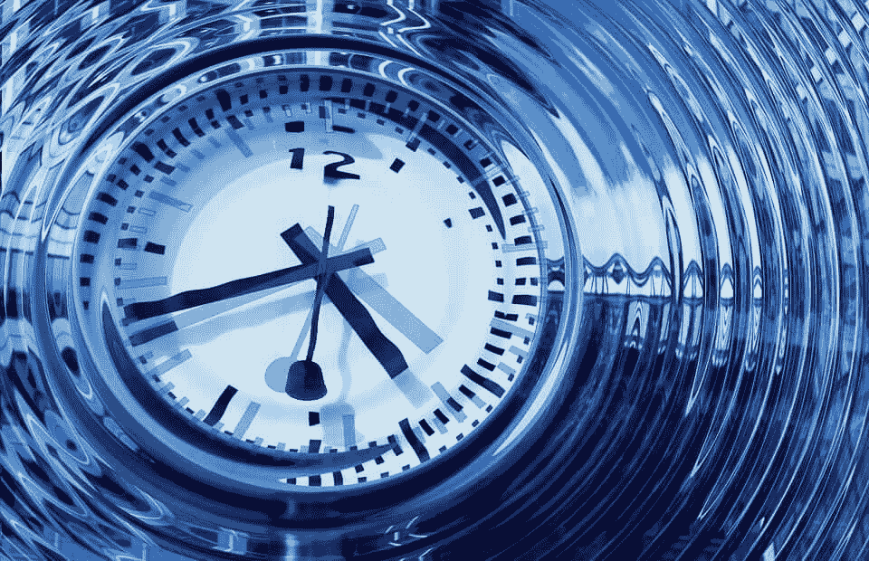
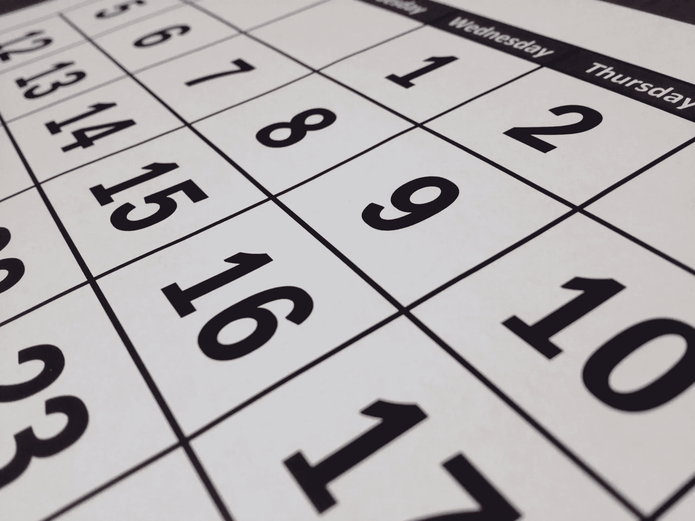

# Python 日期时间教程:操作时间、日期和时间跨度

> 原文：<https://www.dataquest.io/blog/python-datetime-tutorial/>

October 31, 2019

在 Python 中处理日期和时间可能会很麻烦。幸运的是，有一个内置的方法可以让它变得更简单:Python datetime 模块。

帮助我们识别和处理与时间相关的元素，如日期、小时、分钟、秒、星期几、月、年等。它提供各种服务，如管理时区和夏令时。它可以处理时间戳数据。它可以从字符串中提取一周中的某一天、一个月中的某一天以及其他日期和时间格式。

简而言之，这是在 Python 中处理任何与日期和时间相关的事情的一种非常强大的方式。所以让我们开始吧！

在本教程中，我们将详细了解 python 日期时间函数，包括:

*   创建日期对象
*   从日期中获取年和月
*   从日期获取月日和工作日
*   从日期中获取小时和分钟
*   从日期获取一年中的第几周
*   将日期对象转换为时间戳
*   将 UNIX 时间戳字符串转换为日期对象
*   处理 timedelta 对象
*   获取两个日期和时间之间的差异
*   格式化日期:strftime()和 strptime()
*   处理时区
*   使用熊猫日期时间对象
    *   获取年、月、日、小时和分钟
    *   获取工作日和一年中的某一天
    *   将日期对象转换为数据帧索引

当您学习本教程时，我们鼓励您在自己的机器上运行代码。或者，如果你想在浏览器中运行代码，并以互动的方式通过检查答案来学习，以确保你做对了，我们的 [Python 中级课程](https://www.dataquest.io/course/python-for-data-science-intermediate/)有[一节关于 Python](https://app.dataquest.io/m/353) 中的日期时间的课，我们推荐。你可以通过[注册一个免费用户账户](https://app.dataquest.io/signup)开始学习。

## Python 日期时间类

在开始编写代码之前，有必要看一下在`datetime`模块中使用的五个主要对象类。根据我们要做的事情，我们可能需要使用一个或多个不同的类:

*   **datetime**–允许我们一起操作时间和日期(月、日、年、小时、秒、微秒)。
*   **日期**–允许我们操纵独立于时间的日期(月、日、年)。
*   **时间**–允许我们操纵独立于日期的时间(小时、分钟、秒、微秒)。
*   **时间增量** —用于操纵日期和测量的一段*持续时间*。
*   **tzinfo** —处理时区的抽象类。

如果这些区别还没有意义，不要担心！让我们深入`datetime`并开始使用它来更好地理解这些是如何应用的。

## 创建日期对象

首先，让我们仔细看看一个`datetime`物体。由于`datetime`既是一个模块又是该模块中的一个类，我们将从从`datetime`模块导入`datetime`类开始。

然后，我们将打印当前的日期和时间，以便更仔细地看一看`datetime`对象中包含了什么。我们可以使用`datetime`的`.now()`功能来实现。我们将打印我们的 datetime 对象，然后使用`type()`打印它的类型，这样我们可以更仔细地查看。

```
# import datetime class from datetime module
from datetime import datetime

# get current date
datetime_object = datetime.now()
print(datetime_object)
print('Type :- ',type(datetime_object))
```

```
2019-10-25 10:24:01.521881
Type :-  'datetime.datetime' 
```

从上面的结果我们可以看出，`datetime_object`确实是`datetime`类的一个`datetime`对象。这包括年、月、日、小时、分钟、秒和微秒。

## 从日期中提取年和月

现在我们已经看到了什么组成了一个`datetime`对象，我们大概可以猜测出`date`和`time`对象的样子，因为我们知道`date`对象就像没有时间数据的`datetime`，而`time`对象就像没有日期数据的`datetime`。

我们也可以解决一些问题。例如，在大多数数据集中，日期和时间信息以字符串格式存储！此外，我们可能不*想要*所有这些日期和时间数据——如果我们正在做类似每月销售分析的事情，按微秒细分不会非常有用。

所以现在，让我们开始深入研究数据科学中的一个常见任务:使用`datetime`从字符串中只提取我们真正想要的元素。

为此，我们需要做几件事。

## 用 strptime()和 strftime()处理日期和时间字符串

幸运的是，`datetime`包含了两个方法，`strptime()`和`strftime()`，用于将对象从字符串转换为`datetime`对象，反之亦然。`strptime()`可以读取带有日期和时间信息的字符串并将其转换成`datetime`对象，而`strftime()`将日期时间对象转换回字符串。

当然，`strptime()`不是魔术——它不能把*任何*字符串变成日期和时间，它需要我们的一点帮助来解释它所看到的！但是它能够读取日期和时间数据的最传统的字符串格式(更多细节参见[文档](https://docs.python.org/2/library/datetime.html#strftime-and-strptime-behavior))。我们给它一个 YYYY-MM-DD 格式的日期字符串，看看它能做什么！

```
my_string = '2019-10-31'

# Create date object in given time format yyyy-mm-dd
my_date = datetime.strptime(my_string, "%Y-%m-%d")

print(my_date)
print('Type: ',type(my_date))
```

```
2019-10-31 00:00:00 Type:  'datetime.datetime' 
```

注意，`strptime()`有两个参数:字符串(`my_string`)和`"%Y-%m-%d"`，另一个字符串告诉`strptime()`如何解释输入字符串`my_string`。例如，`%Y`告诉它字符串的前四个字符是年份。

这些模式的完整列表可以在[文档](https://docs.python.org/2/library/datetime.html#strftime-and-strptime-behavior)中找到，我们将在本教程的后面更深入地研究这些方法。

您可能还注意到日期中添加了一个时间`00:00:00`。这是因为我们创建了一个`datetime`对象，它必须包含日期*和时间*。`00:00:00`是默认的时间，如果我们输入的字符串中没有指定时间，它就会被指定。

无论如何，我们希望分离出特定的日期元素来进行分析。一种方法是使用 datetime 对象的内置类属性，如`.month`或`.year`:

```
print('Month: ', my_date.month) # To Get month from date
print('Year: ', my_date.year) # To Get month from year
```

```
Month:  10 Year:  2019 
```

## 用正确的方法学习 Python。

从第一天开始，就在你的浏览器窗口中通过编写 Python 代码来学习 Python。这是学习 Python 的最佳方式——亲自看看我们 60 多门免费课程中的一门。


[尝试 Dataquest](https://app.dataquest.io/signup)

## 从日期中获取一个月中的某一天和一周中的某一天

让我们再做一些提取，因为这是一个非常常见的任务。这一次，我们将尝试从`my_date`中获取一个月中的某一天和一周中的某一天。Datetime 将使用它的`.weekday()`函数以数字的形式给出一周中的某一天，但是我们可以使用`calendar`模块和一个叫做`day_name`的方法将它转换成文本格式(即星期一、星期二、星期三……)。

我们先导入`calendar`，然后在`my_date`上使用`.day`和`.weekday()`。从那里，我们可以得到文本格式的星期几，如下所示:

```
# import calendar module
import calendar
print('Day of Month:', my_date.day)

# to get name of day(in number) from date
print('Day of Week (number): ', my_date.weekday())

# to get name of day from date
print('Day of Week (name): ', calendar.day_name[my_date.weekday()])
```

```
Day of Month: 31 Day of Week (number):  3 Day of Week (name):  Thursday 
```

等一下，这看起来有点奇怪！一周的第三天应该是星期三，而不是星期四，对吗？

让我们使用 for 循环仔细看看那个`day_name`变量:

```
j = 0
for i in calendar.day_name:
    print(j,'-',i)
    j+=1
```

```
0 - Monday 1 - Tuesday 2 - Wednesday 3 - Thursday 4 - Friday 5 - Saturday 6 - Sunday 
```

现在我们可以看到 Python 从周一开始数周，从索引 0 开始计数，而不是从 1 开始。因此，正如我们在上面看到的，数字 3 被转换为“星期四”是有意义的。

## 从 Python Datetime 对象获取小时和分钟

现在让我们深入研究时间，从 datetime 对象中提取小时和分钟。就像我们在上面对月和年所做的一样，我们可以使用类属性`.hour`和`.minute`来获得一天中的小时和分钟。

让我们使用`.now()`功能设置一个新的日期和时间。截至本文写作时，时间是 2019 年 10 月 25 日上午 10:25。当然，根据您选择运行这段代码的时间，您会得到不同的结果！

```
from datetime import datetime todays_date = datetime.now()

# to get hour from datetime
print('Hour: ', todays_date.hour)

# to get minute from datetime
print('Minute: ', todays_date.minute)
```

```
Hour:  10 Minute:  25 
```

## 从 Datetime 对象中获取一年中的星期

我们还可以用`datetime`做更奇妙的事情。例如，如果我们想知道这是一年中的第几周呢？

我们可以用`.isocalendar()`函数从一个`datetime`对象中获得年份、星期和星期几。

具体来说，`isocalendar()`返回一个包含 ISO 年、周数和工作日的元组。 [ISO 日历](https://en.wikipedia.org/wiki/ISO_week_date)是一种广泛使用的基于公历的标准日历。你可以在那个链接上读到更多的细节，但是为了我们的目的，我们需要知道的是它作为一个常规的日历工作，从每周的星期一开始。

```
# Return a 3-tuple, (ISO year, ISO week number, ISO weekday).
todays_date.isocalendar()
```

```
(2019, 43, 5) 
```

注意，在 ISO 日历中，一周从 1 开始计数，所以这里的 5 代表一周中正确的一天:星期五。

从上面我们可以看到，这是一年中的第 43 周，但是如果我们想要隔离这个数字，我们可以像对任何其他 Python 列表或元组一样通过索引来实现:

```
todays_date.isocalendar()[1]
```

```
43
```

## 将日期对象转换成 Unix 时间戳，反之亦然

在编程中，经常会遇到将时间和日期数据存储为时间戳的情况，或者希望将自己的数据存储为 [Unix 时间戳格式](https://en.wikipedia.org/wiki/Unix_time)。

我们可以使用 datetime 的内置`timestamp()`函数来实现这一点，该函数将一个`datetime`对象作为参数，并以时间戳格式返回日期和时间:

```
#import datetime
from datetime import datetime
# get current date
now = datetime.now()

# convert current date into timestamp
timestamp = datetime.timestamp(now)

print("Date and Time :", now)
print("Timestamp:", timestamp)
```

```
Date and Time : 2019-10-25 10:36:32.827300 Timestamp: 1572014192.8273 
```

同样，我们可以使用`fromtimestamp()`进行反向转换。这是一个`datetime`函数，它以时间戳(浮点格式)作为参数，并返回一个`datetime`对象，如下所示:

```
#import datetime
from datetime import datetime
timestamp = 1572014192.8273

#convert timestamp to datetime object
dt_object = datetime.fromtimestamp(timestamp)

print("dt_object:", dt_object)
print("type(dt_object): ", type(dt_object))
```

```
dt_object: 2019-10-25 10:36:32.827300 type(dt_object):  <class 'datetime.datetime'> 
```


## 使用 Timedelta 对象测量时间跨度

通常，我们可能希望使用 Python datetime 来度量一段时间，或者一个持续时间。我们可以用它内置的`timedelta`类来做到这一点。一个`timedelta`对象表示两个日期或时间之间的时间。我们可以用它来测量时间跨度，或者通过加减来操作日期或时间，等等。

默认情况下，timedelta 对象的所有参数都设置为零。让我们创建一个新的两周长的 timedelta 对象，看看它是什么样子:

```
#import datetime
from datetime import timedelta
# create timedelta object with difference of 2 weeks
d = timedelta(weeks=2)

print(d)
print(type(d))
print(d.days)
```

```
14 days, 0:00:00 <class 'datetime.timedelta'> 14 
```

注意，我们可以通过使用`timedelta`类属性`.days`来获得以天为单位的持续时间。正如我们可以在[的文档](https://docs.python.org/2/library/datetime.html#timedelta-objects)中看到的，我们也可以得到这个以秒或微秒为单位的持续时间。

让我们创建另一个时间增量持续时间来进行更多的练习:

```
year = timedelta(days=365)
print(year)
```

```
365 days, 0:00:00 
```

现在让我们开始使用 timedelta 对象和 datetime 对象来做一些数学运算！具体来说，让我们给当前时间和日期加上几个不同的持续时间，看看 15 天后是什么日期，两周前是什么日期。

为此，我们可以使用`+`或`-`操作符将 timedelta 对象添加到 datetime 对象中，或者从其中减去 time delta 对象。结果将是 datetime 对象加上或减去在 timedelta 对象中指定的持续时间。很酷，对吧？

(注:下面的代码中，是 10 月 25 日上午 11:12；您的结果将根据您运行代码的时间而有所不同，因为我们正在使用`.now()`函数获取我们的`datetime`对象。

```
#import datetime
from datetime import datetime, timedelta
# get current time
now = datetime.now()
print ("Today's date: ", str(now))

#add 15 days to current date
future_date_after_15days = now + timedelta(days = 15)
print('Date after 15 days: ', future_date_after_15days)

#subtract 2 weeks from current date
two_weeks_ago = now - timedelta(weeks = 2)
print('Date two weeks ago: ', two_weeks_ago)
print('two_weeks_ago object type: ', type(two_weeks_ago))
```

```
Today's date:  2019-10-25 11:12:24.863308 Date after 15 days:  2019-11-09 11:12:24.863308 Date two weeks ago:  2019-10-11 11:12:24.863308 two_weeks_ago object type:  <class 'datetime.datetime'> 
```

注意，这些数学运算的输出仍然是一个`datetime`对象。

## 找出两个日期和时间之间的差异

类似于我们上面所做的，我们也可以使用 datetime 从一个日期减去另一个日期，以找到它们之间的时间跨度。

因为这个数学的结果是一个*持续时间*，当我们从一个日期中减去另一个日期时产生的对象将是一个`timedelta`对象。

这里，我们将创建两个`date`对象(请记住，这些对象的工作方式与`datetime`对象相同，只是它们不包含时间数据),并将其中一个减去另一个，以获得持续时间:

```
# import datetime
from datetime import date
# Create two dates
date1 = date(2008, 8, 18)
date2 = date(2008, 8, 10)

# Difference between two dates
delta = date2 - date1
print("Difference: ", delta.days)
print('delta object type: ', type(delta))
```

```
Difference:  -8 delta object type:  <class 'datetime.timedelta'> 
```

上面，为了清楚起见，我们只使用了日期，但是我们可以对`datetime`对象做同样的事情来获得更精确的测量，包括小时、分钟和秒:

```
# import datetime
from datetime import datetime
# create two dates with year, month, day, hour, minute, and second
date1 = datetime(2017, 6, 21, 18, 25, 30)
date2 = datetime(2017, 5, 16, 8, 21, 10)

# Difference between two dates
diff = date1-date2
print("Difference: ", diff)
```

```
Difference:  36 days, 10:04:20 
```



## 格式化日期:关于 strftime()和 strptime()的更多信息

我们之前简单地提到了`strftime()`和`strptime()`，但是让我们更仔细地看看这些方法，因为它们对于 Python 中的数据分析工作来说通常很重要。

`strptime()`是我们之前使用的方法，您应该还记得，它可以将文本字符串格式的日期和时间转换为 datetime 对象，格式如下:

`time.strptime(string, format)`

请注意，它需要两个参数:

*   字符串-我们要转换的字符串格式的时间
*   format——字符串中时间的特定格式，以便 strptime()可以正确解析它

这次让我们尝试转换一种不同的日期字符串。[这个网站](https://strftime.org/)对于寻找帮助`strptime()`解释我们的字符串输入所需的格式化代码是一个非常有用的参考。

```
# import datetime
from datetime import datetime
date_string = "1 August, 2019"

# format date
date_object = datetime.strptime(date_string, "%d %B, %Y")

print("date_object: ", date_object)
```

```
date_object:  2019-08-01 00:00:00 
```

现在让我们做一些更高级的事情来练习到目前为止我们所学的一切！我们将从字符串格式的日期开始，将其转换为 datetime 对象，并研究几种不同的格式化方法(dd/mm 和 mm/dd)。

然后，坚持 mm/dd 格式，我们将把它转换成 Unix 时间戳。然后我们将它转换回一个`datetime`对象，并使用几个不同的 [strftime 模式](https://strftime.org/)将那个转换回字符串，以控制输出:

```
# import datetime
from datetime import datetime
dt_string = "12/11/2018 09:15:32"
# Considering date is in dd/mm/yyyy format
dt_object1 = datetime.strptime(dt_string, "%d/%m/%Y %H:%M:%S")
print("dt_object1:", dt_object1)
# Considering date is in mm/dd/yyyy format
dt_object2 = datetime.strptime(dt_string, "%m/%d/%Y %H:%M:%S")
print("dt_object2:", dt_object2)

# Convert dt_object2 to Unix Timestamp
timestamp = datetime.timestamp(dt_object2)
print('Unix Timestamp: ', timestamp)

# Convert back into datetime
date_time = datetime.fromtimestamp(timestamp)
d = date_time.strftime("%c")
print("Output 1:", d)
d = date_time.strftime("%x")
print("Output 2:", d)
d = date_time.strftime("%X")
print("Output 3:", d)
```

```
dt_object1: 2018-11-12 09:15:32 dt_object2: 2018-12-11 09:15:32 Unix Timestamp:  1544537732.0 Output 1: Tue Dec 11 09:15:32 2018 Output 2: 12/11/18 Output 3: 09:15:32 
```

这里有一个图像，您可以用一个备忘单保存，用于常见的、有用的 strptime 和 strftime 模式:

让我们多练习一下如何使用这些:

```
# current date and time
now = datetime.now()

# get year from date
year = now.strftime("%Y")
print("Year:", year)

# get month from date
month = now.strftime("%m")
print("Month;", month)

# get day from date
day = now.strftime("%d")
print("Day:", day)

# format time in HH:MM:SS
time = now.strftime("%H:%M:%S")
print("Time:", time)

# format date
date_time = now.strftime("%m/%d/%Y, %H:%M:%S")
print("Date and Time:",date_time)
```

```
Year: 2019 Month; 10 Day: 25 Time: 11:56:41 Date and Time: 10/25/2019, 11:56:41 
```

## 处理时区

当涉及时区时，在 Pythin 中处理日期和时间会变得更加复杂。谢天谢地，`pytz`模块的存在是为了帮助我们处理跨时区转换。它还处理使用夏令时的地方的夏令时。

我们可以使用`localize`函数向 Python datetime 对象添加时区位置。然后我们可以使用函数`astimezone()`将现有的本地时区转换成我们指定的任何其他时区(它将我们想要转换成的时区作为一个参数)。

例如:

```
# import timezone from pytz module
from pytz import timezone
# Create timezone US/Eastern
east = timezone('US/Eastern')
# Localize date
loc_dt = east.localize(datetime(2011, 11, 2, 7, 27, 0))
print(loc_dt)

# Convert localized date into Asia/Kolkata timezone
kolkata = timezone("Asia/Kolkata")
print(loc_dt.astimezone(kolkata))

# Convert localized date into Australia/Sydney timezone
au_tz = timezone('Australia/Sydney')
print(loc_dt.astimezone(au_tz))
```

```
2011-11-02 07:27:00-04:00 2011-11-02 16:57:00+05:30 2011-11-02 22:27:00+11:00 
```

当处理包含多个不同时区的数据集时，此模块有助于简化工作。

## 使用熊猫日期时间对象

数据科学家喜欢`pandas`有很多原因。其中之一是它包含了处理时间序列数据的大量功能和特性。很像`datetime`本身，pandas 有`datetime`和`timedelta`对象分别用于指定日期、时间和持续时间。

我们可以使用以下函数将日期、时间和持续时间文本字符串转换成 pandas Datetime 对象:

*   **to_datetime()** :将字符串日期和时间转换为 Python datetime 对象。
*   **to_timedelta()** :根据日、小时、分钟和秒查找时间差异。

正如我们将看到的，这些函数实际上非常擅长通过自动检测字符串的格式来将字符串转换为 Python datetime 对象，而不需要我们使用 strftime 模式来定义它。

让我们看一个简单的例子:

```
# import pandas module as pd
import pandas as pd
# create date object using to_datetime() function
date = pd.to_datetime("8th of sep, 2019")
print(date)
```

```
2019-09-08 00:00:00 
```

请注意，即使我们给它一个带有一些复杂因素的字符串，如“th”和“Sep”而不是“sep .”或“junior”，pandas 也能够正确地解析该字符串并返回格式化的日期。

我们还可以使用 pandas(及其一些附属的 numpy 功能)自动创建日期范围作为 pandas 系列。例如，在下面，我们从上面定义的日期开始创建一系列 12 个日期。然后，我们使用`pd.date_range()`从预定义的日期开始创建一系列不同的日期:

```
# Create date series using numpy and to_timedelta() function
date_series = date + pd.to_timedelta(np.arange(12), 'D')
print(date_series)

# Create date series using date_range() function
date_series = pd.date_range('08/10/2019', periods = 12, freq ='D')
print(date_series)
```

```
DatetimeIndex(['2019-09-08', '2019-09-09', '2019-09-10', '2019-09-11',                '2019-09-12', '2019-09-13', '2019-09-14', '2019-09-15',                '2019-09-16', '2019-09-17', '2019-09-18', '2019-09-19'],               dtype='datetime64[ns]', freq=None) DatetimeIndex(['2019-08-10', '2019-08-11', '2019-08-12', '2019-08-13',                '2019-08-14', '2019-08-15', '2019-08-16', '2019-08-17',                '2019-08-18', '2019-08-19', '2019-08-20', '2019-08-21'],               dtype='datetime64[ns]', freq='D') 
```

#### 获得熊猫的年、月、日、小时、分钟

使用所有列的`dt`属性，我们可以很容易地从 pandas 数据帧的一列日期中获得年、月、日、小时或分钟。例如，我们可以使用`df['date'].dt.year`从包含完整日期的熊猫列中只提取年份。

为了探索这一点，让我们使用上面创建的一个系列制作一个快速数据框架:

```
# Create a DataFrame with one column date
df = pd.DataFrame()
df['date'] = date_series df.head()
```

| 日期 |
| --- |
| Zero | 2019-08-10 |
| one | 2019-08-11 |
| Two | 2019-08-12 |
| three | 2019-08-13 |
| four | 2019-08-14 |

现在，让我们使用相关的 Python datetime(通过`dt`访问)属性为日期的每个元素创建单独的列:

```
# Extract year, month, day, hour, and minute. Assign all these date component to new column.
df['year'] = df['date'].dt.year
df['month'] = df['date'].dt.month
df['day'] = df['date'].dt.day
df['hour'] = df['date'].dt.hour
df['minute'] = df['date'].dt.minute
df.head()
```

| 日期 | 年 | 月 | 天 | 小时 | 分钟 |
| --- | --- | --- | --- | --- | --- |
| Zero | 2019-08-10 | Two thousand and nineteen | eight | Ten | Zero | Zero |
| one | 2019-08-11 | Two thousand and nineteen | eight | Eleven | Zero | Zero |
| Two | 2019-08-12 | Two thousand and nineteen | eight | Twelve | Zero | Zero |
| three | 2019-08-13 | Two thousand and nineteen | eight | Thirteen | Zero | Zero |
| four | 2019-08-14 | Two thousand and nineteen | eight | Fourteen | Zero | Zero |

#### 获取工作日和一年中的某一天

Pandas 还能够从其 datetime 对象中获取其他元素，如一周中的某一天和一年中的某一天。同样，我们可以使用`dt`属性来做到这一点。注意，在这里，通常在 Python 中，一周从索引 0 开始，所以一周的第 5 天是*星期六*。

```
# get Weekday and Day of Year. Assign all these date component to new column.
df['weekday'] = df['date'].dt.weekday
df['day_name'] = df['date'].dt.weekday_name
df['dayofyear'] = df['date'].dt.dayofyear
df.head()
```

| 日期 | 年 | 月 | 天 | 小时 | 分钟 | 工作日 | 日名 | dayofyear |
| --- | --- | --- | --- | --- | --- | --- | --- | --- |
| Zero | 2019-08-10 | Two thousand and nineteen | eight | Ten | Zero | Zero | five | 星期六 | Two hundred and twenty-two |
| one | 2019-08-11 | Two thousand and nineteen | eight | Eleven | Zero | Zero | six | 星期日 | Two hundred and twenty-three |
| Two | 2019-08-12 | Two thousand and nineteen | eight | Twelve | Zero | Zero | Zero | 星期一 | Two hundred and twenty-four |
| three | 2019-08-13 | Two thousand and nineteen | eight | Thirteen | Zero | Zero | one | 星期二 | Two hundred and twenty-five |
| four | 2019-08-14 | Two thousand and nineteen | eight | Fourteen | Zero | Zero | Two | 星期三 | Two hundred and twenty-six |

### 将日期对象转换为数据帧索引

我们还可以使用 pandas 在数据帧的索引中创建一个 datetime 列。这对于探索性数据可视化等任务非常有帮助，因为 matplotlib 会识别 DataFrame 索引是一个时间序列，并相应地绘制数据。

为此，我们所要做的就是重新定义`df.index`:

```
# Assign date column to dataframe index
df.index = df.date
df.head()
```

| 日期 | 年 | 月 | 天 | 小时 | 分钟 | 工作日 | 日名 | dayofyear |
| --- | --- | --- | --- | --- | --- | --- | --- | --- |
| 日期 |
| --- |
| 2019-08-10 | 2019-08-10 | Two thousand and nineteen | eight | Ten | Zero | Zero | five | 星期六 | Two hundred and twenty-two |
| 2019-08-11 | 2019-08-11 | Two thousand and nineteen | eight | Eleven | Zero | Zero | six | 星期日 | Two hundred and twenty-three |
| 2019-08-12 | 2019-08-12 | Two thousand and nineteen | eight | Twelve | Zero | Zero | Zero | 星期一 | Two hundred and twenty-four |
| 2019-08-13 | 2019-08-13 | Two thousand and nineteen | eight | Thirteen | Zero | Zero | one | 星期二 | Two hundred and twenty-five |
| 2019-08-14 | 2019-08-14 | Two thousand and nineteen | eight | Fourteen | Zero | Zero | Two | 星期三 | Two hundred and twenty-six |

## 结论

在本教程中，我们深入研究了 Python datetime，还使用 pandas 和日历模块做了一些工作。我们已经讲了很多，但是请记住:学习的最好方法是自己写代码！

如果你想练习编写带有交互式答案检查的`datetime`代码，请查看我们的 [Python 中级课程](https://www.dataquest.io/course/python-for-data-science-intermediate/)的[一节关于 Python](https://app.dataquest.io/m/353) 中的日期时间的课，带有交互式答案检查和浏览器内代码运行。

## 你能从培养新技能中获益吗？

下面挑一个技能**点击免费报名**即刻开始学习！

[*Advanced Pandas*](https://app.dataquest.io/signup?lesson=343&)*[*Data Visualization*](https://app.dataquest.io/signup?lesson=142)*[*Probability & Statistics*](https://app.dataquest.io/signup?lesson=283)**