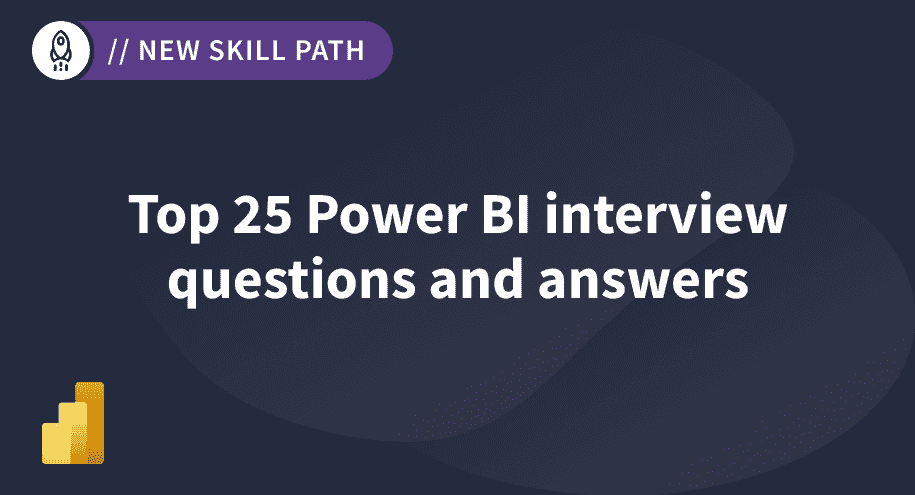
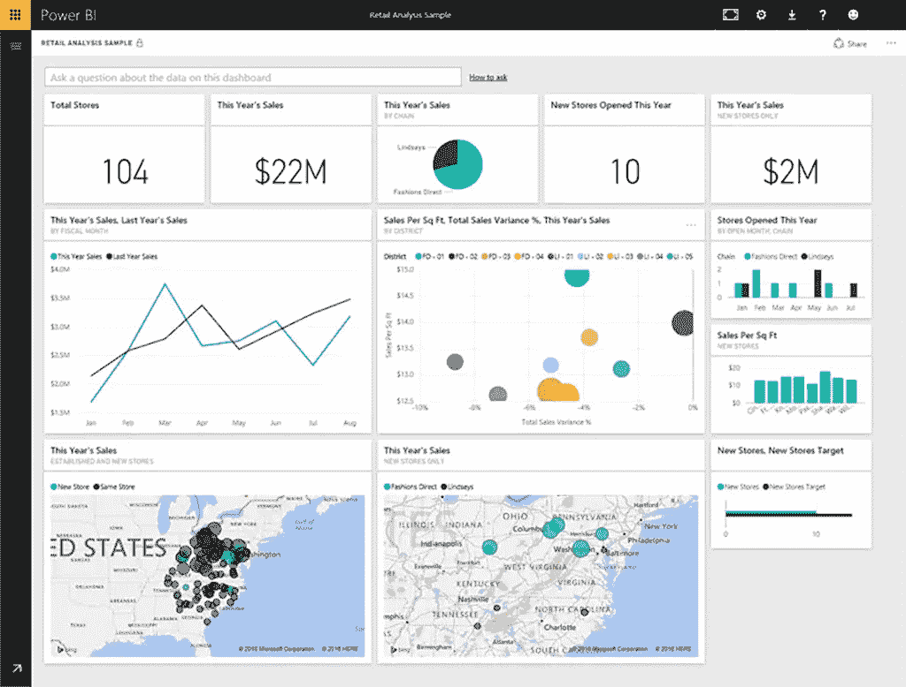
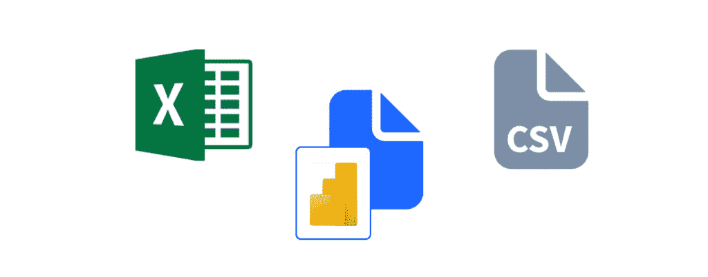
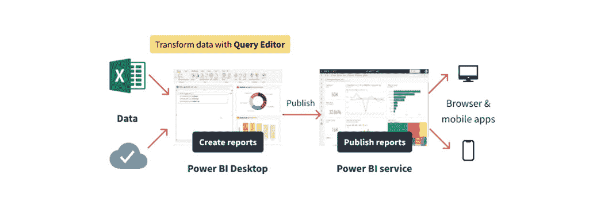
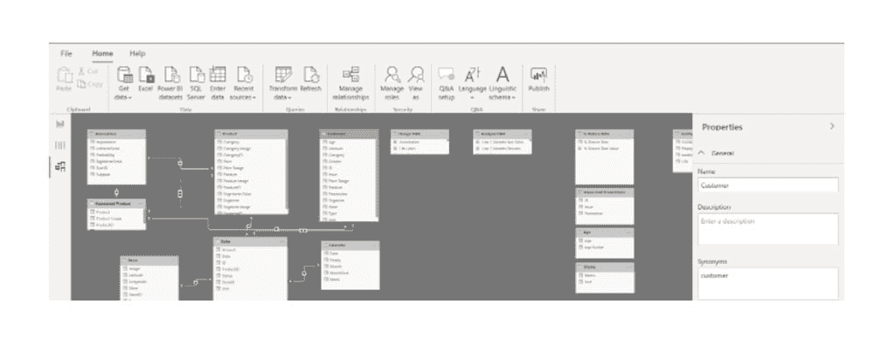
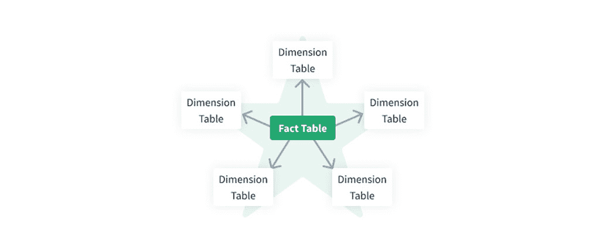
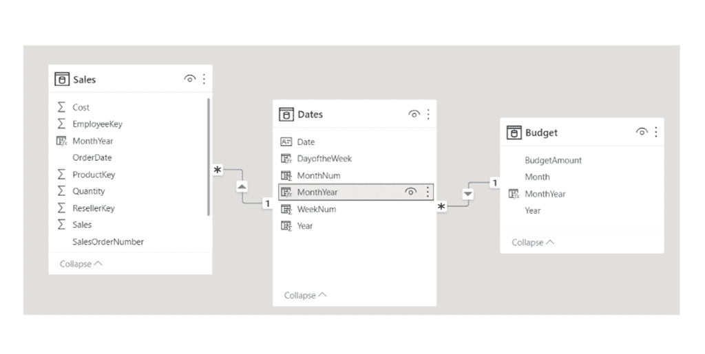

# 25 个必知的权力 BI 面试问答(2022)

> 原文：<https://www.dataquest.io/blog/power-bi-interview-questions-and-answers/>

April 27, 2022

### **Power BI 面试问题:初级**

先说最基本的问题。虽然这些问题对你来说可能很简单，但为每个问题准备一个自信、全面、简洁的答案总是一个好主意。

<figure class="wp-block-image size-full"></figure>

#### **1。什么是 Power BI？**

[Power BI](https://powerbi.microsoft.com/en-au/) 是一款基于云的商业智能和数据可视化软件，由微软开发，用于从各种来源获取原始数据，对其进行转换和分析，从中提取有意义的见解，构建反映这些见解的交互式仪表盘和报告，并与相关的数据消费者群体(您的同事、经理或股东)共享结果，以做出明智的数据驱动型商业决策。

<figure class="wp-block-image size-full">

<figcaption>
*A **visualization** (sometimes also referred to as a visual) is a visual representation of data, like a chart, a color-coded map, or other interesting graphical displays you can create in Microsoft Power BI to represent your data.*</figcaption>

</figure>

#### **2。Power BI 有什么优势？**

Power BI 有许多使其成为优秀商业智能软件的优势特性:

*   它很容易使用，即使是非技术人员。
*   它有一个强大的工具包来执行 ETL(提取、转换和加载数据)。
*   它有助于与数据消费者分享来自数据的见解。
*   它可以快速更新数据源中正在使用的数据。
*   它配备了模板仪表板和 SaaS 解决方案报告。
*   它允许实时仪表板和报告更新。
*   它允许在各种设备(电脑、平板电脑和手机)上显示结果。
*   它确保快速安全地连接到云中或本地的数据源。
*   它支持使用自然语言处理的数据查询。
*   它提供混合配置和智能部署。

#### **3。Power BI 有哪些缺点？**

需要记住的 Power BI 的主要缺点包括:

*   这个软件对初学者来说不是很直观。
*   仪表板和报告共享受到限制:只有具有相同电子邮件域的用户才能访问结果。
*   大多数数据源不支持实时连接来支持 BI 交互式仪表板和报告。
*   免费用户的 Power BI 不能处理大于 1 GB 的数据集。
*   我们无法在节能 BI 可视报告筛选器中存储调整后的筛选器。此外，过滤器总是显示在报告上，这并不总是方便的

然而，Power Bi 正处于不断发展和改进的过程中，因此我们可以期待该软件能够克服它的一些或所有限制。

<figure class="wp-block-image size-full">

<figcaption>*Power BI consists of three main elements: Power BI Desktop, the Power BI service, and Power BI Mobile. These work together to let you create, interact with, share, and consume your data however you want.*</figcaption>

</figure>

#### **4。Power BI 中常见的工作流是什么？**

标准的 Power BI 工作流程包括以下四个步骤:

*   将数据提取到 Power BI 桌面，清理和处理数据，并创建报告。
*   将报告发布到 Power BI 服务并构建仪表板。
*   与您的同事、经理或股东共享仪表板。
*   与 Power BI 移动应用中的最终仪表盘和报告进行交互，以获取业务洞察。

#### **5。Power BI 的主要业务应用有哪些？**

因为 Power BI 是一个商业智能应用程序，所以我们可以将它应用于一系列商业领域。其最重要的应用包括:

*   从可用的原始数据中提取有意义的商业见解
*   创建引人注目的实时报告和见解深刻的交互式仪表盘
*   识别不同部门或项目的当前状态
*   跟踪不同部门或项目的进度和关键绩效指标
*   从项目绩效的角度发现项目的优势和劣势
*   在团队内部分配角色
*   向相关团队成员授予对仪表板和报告的访问权限
*   在许多不同的应用程序和网站上以对潜在客户有利的方式显示特定业务的各种统计数据

#### **6。什么样的专家通常使用 Power BI？**

以下角色构成了大多数高级 BI 用户:

*   项目经理
*   商业分析员
*   数据分析师
*   数据科学家
*   信息技术专家
*   数据管理员
*   开发商
*   报告消费者

<figure class="wp-block-image size-full">

<figcaption>*Power BI Desktop allows you to retrieve data from many types of files. You can find a list of the available options when you use the Get data feature in Power BI Desktop. *</figcaption>

</figure>

#### 7 .**。Power BI 中的仪表板是什么？**

Power BI 中的仪表板也称为画布，是从报告中选取的最具洞察力的可视化内容的单页选择，这些内容共享了数据驱动的故事中最重要的亮点。Power BI 仪表板的最终用户可以从各种设备(包括移动电话)访问它们，与它们交互以提取有价值的业务见解，掌握业务或项目的全局(以及整体中不同部分之间的关系)。

#### **8。什么是 Power BI 桌面？**

Power BI Desktop 是一个免费的开源微软应用程序，它可以连接到各种数据源，获取数据，清理和转换数据，构建数据模型，并创建具有有意义的视觉效果的报告和仪表板。它还允许用户通过 Power BI 服务将最终报告和仪表板发布到云中，并与其他人共享。

#### **9。什么是电力查询？**

Power Query 是由 Microsoft Excel 开发的商业智能 ETL(提取-加载-转换)工具，可在 Power BI 桌面中通过 Power Query 编辑器获得。借助该工具，用户可以加载和组合来自不同数据源的数据，如 SQL、Oracle、Excel 或 CSV 文件、社交媒体等。，然后使用超级查询编辑器，用户可以清理、整形、转换和分析数据。Power Query 有一个直观的界面，它使用了 M 语言。我们也可以(尽管我们不需要)应用这种语言来自己编写和修改代码。

<figure class="wp-block-image size-full">

<figcaption>*The Power Query Editor ribbon contains many buttons you can use to **select, view, and shape** your data. *</figcaption>

</figure>

#### 10。什么是权力支点？

Power Pivot 是 Microsoft Excel 2010 的内置组件，旨在扩展应用程序的分析能力。我们可以使用它从多个数据源导入数据，在单个 Excel 电子表格中存储压缩数据，使用 DAX(数据分析表达式)语言构建表格数据模型，定义不同表格之间的关系，编写公式，计算新列，创建数据透视表和数据透视图，应用各种级别的筛选器，以及分析数据。

### **Power BI 面试问题:Power BI 结构**

在本节中，我们将考虑一些与功率 BI 相关的典型问题。它们大多是基本的，但有时可能会产生误导。事实上，术语经常会混淆，比如 Power BI 的“构建模块”、“组件”、“视图”或“元素”。有些术语甚至可以互换使用，或者没有标准术语(例如，“格式”或“版本”)。幸运的是，问题本身通常会提供一些关于问题的背景。

#### **11。Power BI 包的主要元素是什么？**

Power BI 封装有三个主要元素:

*   **Power BI Desktop** —一款微软 Windows 桌面应用程序，用于创建交互式仪表盘和报告，以便进一步共享
*   **Power BI Service** —一种在线 SaaS(软件即服务)，用于将报告发布到云
*   **Power BI 移动应用** —可在任何设备上使用，具有适用于 Windows、iOS 和 Android 的原生移动 BI 应用，因此 Power BI 的移动用户可以查看见解

<figure class="wp-block-image size-full">

<figcaption>*On the **Model** tab, we can edit specific column and table properties by selecting a table or columns, and we can transform the data by using the **Transform Data** button, which takes us to Power Query Editor.*</figcaption>

</figure>

#### **12。Power BI 的构建模块是什么？**

我们在 Power BI 中所做的一切都可以分解为以下基本构件:

*   **可视化。**可视化是底层数据的可视化表示，旨在提供难以从原始表格或文本数据中辨别的业务上下文和洞察力。在 Power BI 中，我们有各种各样的可视化，比如条形图、饼图、折线图、渐变颜色图、气泡图等。
*   **数据集。**数据集是数据的集合，可能从不同的数据源获取，用于创建可视化和报告。数据集可以是 Excel 表、CSV 文件、Oracle 或 SQL server 表等。
*   **报道。**报告是在一个或多个页面上排列在一起的一组相互关联的可视化内容，用于展示从同一数据集中提取的各种业务洞察。一些例子是产品销售报告、营销活动报告和按公司分支机构的销售报告。
*   **仪表盘。**仪表板或画布是从一页报告中选择的最引人注目的视觉效果。它为我们将要向同事、经理或股东讲述的数据故事提供了见解。仪表板的消费者可以从各种设备上查看它，并与之交互以获得他们需要的信息。
*   **瓷砖。**平铺是报表或仪表板中被其他平铺包围的矩形块中包含的单个可视内容，例如，仪表板上的单个条形图或任何其他可视内容。

#### 13。Power BI 工具包的主要组件是什么？

以下是 Power BI 工具包的主要组件，以及我们使用它们的目的:

*   **Power Query:** 从各种来源收集数据并进行转换
*   **动力中枢:**建立数据模型
*   **Power View:** 创建数据可视化
*   **Power Map:** 创建 3D 地理空间数据可视化
*   Power Q & A: 使用自然语言从最终报告中获取答案

#### **14。Power BI 中有哪些不同的连接模式？**

Power BI 中有三种连接模式:

*   **导入方式**，又名 **SQL Server 导入**。这是 Power BI 中的默认连接模式，因为它比其他两种使用得更频繁，而且它还提供了最快的性能。在这种模式下，我们可以将数据导入 Power BI 桌面以供进一步查询。但是，除非我们有 Power BI premium，否则我们无法导入大于 1 GB 的数据集。
*   **直接查询模式。**此模式连接到特定数据源的数据，在导入大型数据时特别有效。Power BI 本身并不存储数据；它存储其元数据并对数据执行直接查询。这种连接模式的缺点是，在这种情况下，我们可以执行哪些操作来操作数据是有限制的。
*   **直播连接模式。**在这种连接模式下，数据副本也不会存储在 Power BI 模型中。而是每次直接从 Power BI 查询数据源。我们只能使用这种模式访问三个数据源:SQL Server Analysis Services、Azure Analysis Services 和 Power BI 数据集

<figure class="wp-block-image size-full">

<figcaption>*Every Power BI data analyst should understand the star schema. In a star schema, each table within your dataset is defined as a dimension or a fact table.*</figcaption>

</figure>

#### 15。Power BI 可以连接哪些类型的数据源？

Power BI 可以连接的各种数据源分为以下几组:

*   **文件。**这些可以是 Excel、CSV、文本或 Power BI 桌面文件。
*   **内容包。**这些可以来自服务提供商或组织(即由我们公司的其他人共享)。
*   **连接器。**这些连接到数据库和数据集，如 Azure SQL 或 SQL Server Analysis Services。

#### 16。Power BI 桌面中有哪些不同的视图？

*   **报表视图。**默认视图，显示报告的交互视觉效果。在这个视图中，我们可以添加和操作各种模板的报告页面，添加和调整可视化，以及发布最终报告。
*   **数据视图。**在该视图中，我们可以通过查询编辑器工具实现数据整形和转换，创建新的计算列，并在数据被馈送到模型后以表格格式查看数据。
*   **关系视图**，又名**模型视图。**我们使用它来探索、比较和管理数据模型或其子集之间的复杂关系。

### **Power BI 面试问题:中级**

最后一套问题比较高级；如果你想找更高级的工作，这可能会有帮助。

#### **17。Power BI 中的数据存储在哪里？**

Power BI 中的数据以事实表(定量的，通常是非规范化的数据)或维度表(与事实表中的数据相关的属性和维度)的形式存储在以下两个云存储库中:

*   **微软 Azure Blob 存储:**包含用户上传的数据
*   **微软 Azure SQL 数据库:**包含系统的所有元数据和工件

对于这两者，加密和密码保护数据。

<figure class="wp-block-image size-full">

<figcaption>*Power BI automatically detects relationships, but you can also go to **Manage Relationships** > **New** and create the relationship on the  `Date` column. This will ensure that the granularity is the same between your different tables.*</figcaption>

</figure>

#### 18。力量 BI 和 Tableau 有什么区别？

虽然 Power BI 和 [Tableau](https://www.tableau.com/) 都是用于业务数据争论、数据分析和数据可视化的商业智能(BI)应用程序，但它们之间存在一些显著差异:

*   Power BI 使用 DAX(数据分析表达式)进行计算，Tableau 使用 MDX(多维表达式)。
*   Power BI 可以处理相对有限的数据量，而 Tableau 可以轻松处理海量数据。
*   Power BI 有一个相对简单易学的界面，专业人士和初学者都可以使用。Tableau 界面更具挑战性，因此不太适合初学者。
*   与 Tableau 相比，Power BI 可连接的数据源范围较小。
*   Power BI 比 Tableau 便宜很多。
*   Power BI 是一个完美的报告工具，而 Tableau 擅长数据可视化。

#### **19。Power BI 中的 M 语言是什么？**

M 语言或 M 代码是一种功能性的、区分大小写的编程语言，在 Power BI 的 Power Query 编辑器中使用，通过查询过滤和组合数据。

#### 20。Power BI 中的 DAX 是什么？

DAX 是数据分析表达式的缩写。它是 Power BI 的一种函数式编程语言，提供了一组函数、运算符和常数，我们可以在公式中使用它们来计算列、度量和表格，以及从可用数据中提取新信息。DAX 支持各种数据类型:整数和小数、布尔值、文本、日期、货币和 N/A。

#### **21。自助商业智能(SSBI)是什么意思？**

SSBI 是一套方法和工具，使最终用户——甚至是那些没有任何 BI 背景的人(例如，销售或营销团队、产品开发人员等)。)—以直观的方式访问、操作、分析和可视化数据，以做出战略性的、数据驱动的业务决策。

<figure class="wp-block-image size-full">

<figcaption>*A smaller data model uses less memory and achieves faster data refreshing, calculations, and rendering of visuals in reports. Therefore, the performance optimization process involves minimizing the size of the data model and making the most efficient use of the data in the model.*</figcaption>

</figure>

#### **22。Power BI 中的内容包是什么？**

内容包是 Power BI 相关文档的包，例如仪表板、报告和数据集，它们存储为一个组。在 Power BI 中，有两种类型的包:来自 Google Analytics、Marketo、MailChimp 或 Twilio 等服务提供商的服务内容包，我们可以通过键入我们的帐户数据来访问；以及由我们公司的用户创建并与整个组织或选定的一组人共享的组织内容包。

#### **23。在 Power BI Desktop 中，我们如何定义数据模型中两个表之间的关系？**

有两种方法:

*   **手动:**使用主键和外键
*   **自动:**如果自动检测功能开启，则自动识别关系

要定义两个表之间的关系，数据中不应有任何空值或重复行。此外，表之间可能有多个关系(用虚线表示)，但其中只有一个是活动的(用实线表示)。

#### **24。Power BI 中有哪些不同的刷新选项？**

Power BI 中有四个刷新选项:

*   **包刷新:**在 Power BI 服务和 OneDrive 或 SharePoint Online 之间同步 Power BI 桌面，而不从数据源获取数据。
*   **模型刷新**，又名**数据刷新**:用原始数据源中的数据刷新 Power BI 服务中可用的数据集。
*   **Tile refresh:** 每次数据改变时，更新仪表板上 Power BI 中 Tile 的缓存(大约每 15 分钟一次，或者我们也可以强制更新)。
*   **可视化容器刷新:**一旦数据发生变化，刷新可视化容器并更新缓存的报表视图。

#### **25。我们可以在 Power BI 报告中使用哪些类型的过滤器？**

Power BI 中的过滤器可以是以下类型之一，根据其适用范围，按降序排列:

*   **报表级过滤器:**应用于整个报表
*   **页面级过滤器:**应用于报告的特定页面
*   **可视化级别过滤器:**应用于单个可视化

### **结论**

在这篇文章中，我们讨论了在商务智能面试中最常见的问题，以及如何回答这些问题。希望这些信息能帮助你准备面试，让你更加自信。

觉得在开始找工作之前，你需要温习一下你的商务智能技能吗？想准备 PL-300 认证？或者也许你正在寻找从零开始发展力量 BI 技能？在所有这些情况下，我们的创新技能途径[使用 Microsoft Power BI](https://www.dataquest.io/path/analyzing-data-with-microsoft-power-bi-skill-path/) 分析数据，是开始您学习之旅的正确地方！

在这条道路上，我们提供了第一个交互式 Power BI 课程，您可以在浏览器中使用完整的 Power BI 界面，通过练习和完成练习来学习，并构建项目。在课程结束时，您将建立一个项目组合，并为 PL-300 认证考试做好准备，并在 Power BI 中找到您的第一份工作！