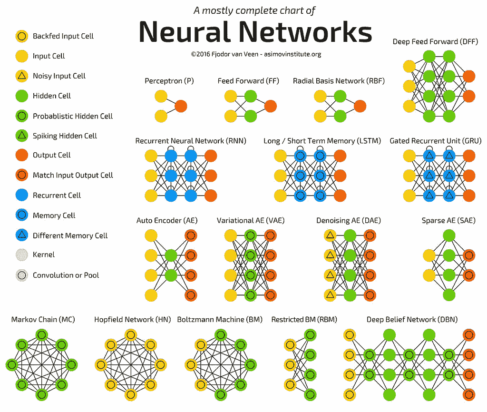
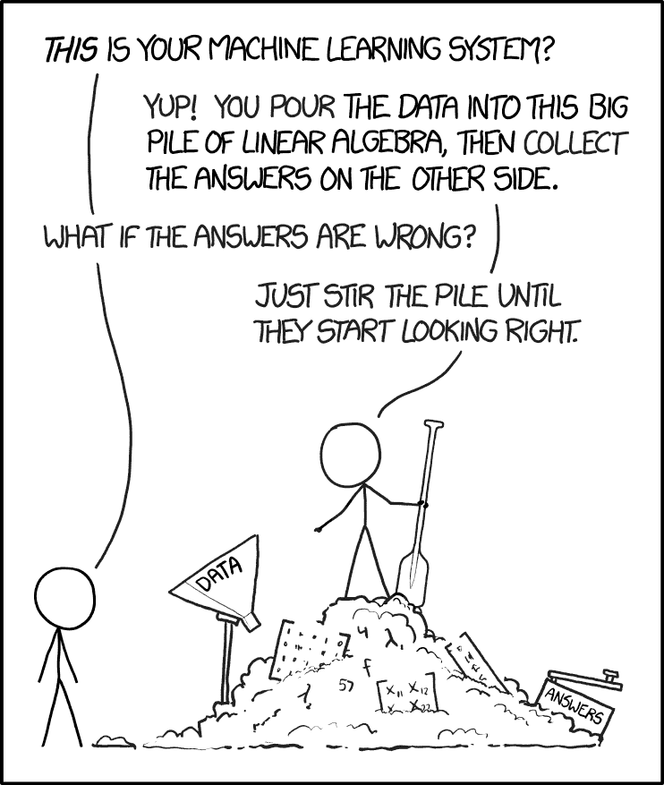

# 数据科学中的数学

> 原文：<https://www.dataquest.io/blog/math-in-data-science/>

November 30, 2018

数学就像一只章鱼:它的触角可以触及几乎所有的学科。虽然有些受试者只是轻轻一刷，但其他受试者却像蛤蜊一样被触手紧紧抓住。数据科学属于后一类。如果你想从事数据科学，你将不得不与数学打交道。如果你已经完成了一个数学学位或其他一些强调定量技能的学位，你可能想知道你为获得学位所学的一切是否是必要的。我知道我做到了。如果你*没有*那样的背景，你可能会想:做数据科学*真的*需要多少数学知识？

在本帖中，我们将探讨数据科学的含义，并讨论开始时需要了解多少数学知识。先说“数据科学”实际上是什么意思。你可能会问十几个人，得到十几个不同的答案！在 Dataquest，我们将数据科学定义为使用数据和高级统计学进行预测的学科。这是一门专业学科，专注于从有时杂乱和分散的数据中创造理解(尽管数据科学家处理的具体内容因雇主而异)。统计学是我们在那个定义中提到的唯一的数学学科，但是数据科学也经常涉及数学中的其他领域。学习统计学是一个很好的开始，但数据科学也使用算法来进行预测。这些算法被称为机器学习算法，实际上有数百种。深入讨论每种算法需要多少数学知识不在这篇文章的范围之内，我将讨论你需要了解以下每种常用算法的多少数学知识:

*   朴素贝叶斯
*   线性回归
*   逻辑回归
*   神经网络
*   k 均值聚类
*   决策树

现在让我们来看看每一个都需要多少数学知识！

* * *

## 朴素贝叶斯分类器

**它们是什么**:朴素贝叶斯分类器是一系列算法，基于一个共同的原则，即特定特征的值独立于任何其他特征的值。它们使我们能够根据我们所知道的有关事件的情况来预测事件发生的概率。名字来源于 [**贝叶斯定理**](https://en.wikipedia.org/wiki/Bayes%27_theorem) ，数学上可以这样写:$ $ P(A \ mid B)= \ frac { P(B \ mid A)P(A)} { P(B)} $ $其中\(A\)和\(B\)是事件且\(P(B)\)不等于 0。这看起来很复杂，但是我们可以把它分解成很容易管理的部分:

*   \(P(A|B)\)是条件概率。具体来说，假设\(B\)为真，事件 A 发生的可能性。
*   \(P(B|A)\)也是条件概率。具体来说，给定(A)的情况下，事件(B)发生的可能性为真。
*   \(P(A)\)和\(P(B)\)是相互独立地观察到\(A\)和\(B\)的概率。

**数学我们需要**:如果你想了解朴素贝叶斯分类器是如何工作的，你需要了解概率和条件概率的基本原理。为了获得概率的介绍，你可以查看我们的概率的[课程。你也可以看看我们关于条件概率的](https://www.dataquest.io/course/probability-fundamentals)[课程](https://www.dataquest.io/course/conditional-probability)，以彻底理解贝叶斯定理，以及如何从头开始编写朴素贝叶斯。

## 线性回归

**什么是**:线性回归是最基本的回归类型。它允许我们理解两个连续变量之间的关系。在简单线性回归的情况下，这意味着获取一组数据点并绘制一条趋势线，可用于预测未来。线性回归就是参数化机器学习的一个例子。在参数机器学习中，训练过程最终使机器学习算法成为一个数学函数，它最接近在训练集中找到的模式。这个数学函数可以用来预测未来的预期结果。在机器学习中，数学函数被称为模型。在线性回归的情况下，模型可以表示为:$ $ y = a _ 0+a _ 1 x _ 1+a _ 2 x _ 2+\ ldots+a _ I x _ I $ $其中\(a_1\)，\(a_2\)，\(\ldots\)，\(a_n\)表示特定于数据集的参数值，\(x_1\)，\(x_2\)，\(\ldots\)，\(x_n\)表示我们选择的特征列线性回归的目标是找到最能描述功能列和目标列之间关系的最佳参数值。换句话说:找到数据的最佳拟合线，以便可以外推趋势线来预测未来的结果。为了找到线性回归模型的最佳参数，我们希望最小化模型的残差平方和。残差通常被称为误差，它描述了预测值和真实值之间的差异。残差平方和的公式可以表示为:$ $ RSS =(y _ 1–\hat{y_1})^{2}+(y _ 2–\hat{y_2})^{2}+\ ldots+(y _ n–\hat{y_n})^{2} $ $(其中\(\hat{y}\)是目标列的预测值，y 是真实值。)**我们需要的数学**:如果你想浅尝辄止，一门初级统计学课程就可以了。如果你想在概念上有更深的理解，你可能想知道残差平方和的公式是如何推导出来的，你可以在大多数高级统计的课程中学到。

## 逻辑回归

**什么是**:逻辑回归侧重于估计因变量为二元(即只有两个值 0 和 1 代表结果)的情况下事件发生的概率。像线性回归一样，逻辑回归是参数化机器学习的一个例子。因此，这些机器学习算法的训练过程的结果是最接近训练集中的模式的数学函数。但是线性回归模型输出实数，逻辑回归模型输出概率值。正如线性回归算法生成线性函数模型一样，逻辑回归算法生成逻辑函数模型。你也可能听说过它被称为 sigmoid 函数，它压缩所有的值以产生一个介于 0 和 1 之间的概率结果。sigmoid 函数可以表示如下:$$ y = \frac{1}{1+e^{-x}} $$那么为什么 sigmoid 函数总是返回 0 到 1 之间的值呢？请记住，从代数的角度来看，将任何一个数提升到负指数就等于将该数的倒数提升到相应的正指数。**我们需要的数学**:我们已经在这里讨论了指数和概率，你会希望对代数和概率有一个坚实的理解，以获得逻辑算法中正在发生的工作知识。如果你想得到深入的概念理解，我会推荐你学习概率论以及离散数学或者实分析。

## 神经网络

**它们是什么**:神经网络是机器学习模型，非常松散地受到人脑中神经元结构的启发。这些模型是通过使用一系列被称为神经元的激活单元来预测某些结果而构建的。神经元接受一些输入，应用一个转换函数，然后返回一个输出。神经网络擅长捕捉数据中的非线性关系，并在音频和图像处理等任务中帮助我们。虽然有许多不同种类的神经网络(递归神经网络、前馈神经网络、递归神经网络等。)，它们都依赖于将输入转换为输出的基本概念。当观察任何一种神经网络时，我们会注意到到处都是线条，将每个圈与另一个圈连接起来。在数学中，这就是所谓的图，一种由边(表示为线)连接的节点(表示为圆)组成的数据结构。)请记住，我们这里所指的图表不同于线性模型或其他方程的图表。如果你熟悉[旅行推销员问题](https://en.wikipedia.org/wiki/Travelling_salesman_problem)，你可能也熟悉图的概念。在其核心，神经网络是一个系统，接受一些数据，执行一些线性代数，然后输出一些答案。线性代数是理解神经网络幕后发生的事情的关键。线性代数是数学的一个分支，它涉及诸如(y=mx+b)的线性方程及其通过矩阵和向量空间的表示。因为线性代数涉及通过矩阵来表示线性方程，所以矩阵是你开始理解神经网络核心部分时需要知道的基本概念。矩阵是由按行或列排列的数字、符号或表达式组成的矩形数组。矩阵以下列方式描述:一行一列。例如，下面的矩阵:

is called a 3 by 3 matrix because it has three rows and three columns. With dealing with neural networks, each feature is represented as an input neuron. Each numerical value of the feature column multiples to a weight vector that represents your output neuron. Mathematically, the process is written like this: $$ \hat{y} = Xa^{T} + b$$ where \(X\) is an \(m x n\) matrix where \(m\) is the number of input neurons there are and \(n\) is the number of neurons in the next layer. Our weights vector is denoted as \(a\), and \(a^{T}\) is the transpose of \(a\). Our bias unit is represented as \(b\). Bias units are units that influence the output of neural networls by shifting the sigmoid function to the left or right to give better predictions on some data set. Transpose is a Linear Algebra term and all it means is the rows become columns and columns become rows. We need to take the transpose of \(a\) because the number columns of the first matrix must equal the number of rows in the second matrix when multiplying matrices. For example, if we have a \(3×3\) matrix and a weights vector that is a \(1×3\) vector, we can’t multiply outright because three does not equal one. However, if we take the transpose of the \(1×3\) vector, we get a \(3×1\) vector and we can successfully multiply our matrix with the vector. After all of the feature columns and weights are multiplied, an activation function is called that determines whether the neuron is activated. There are three main types of activation functions: the RELU function, the sigmoid function, and the hyperbolic tangent function. We’re already familiar with the sigmoid function. The RELU function is a neat function that takes an input x and outputs the same number if it is greater than 0; however, it’s equal to 0 if the input is less than 0\. The hyperbolic tangent function is essentially the same as the sigmoid function except that it constrains any value between -1 and 1\.

**我们需要的数学**:我们已经在概念方面讨论了很多！如果你想对这里介绍的数学有一个基本的理解，离散数学课程和线性代数课程是一个很好的起点。对于深入的概念理解，我推荐图论、矩阵理论、多元微积分和实分析的课程。如果你对学习线性代数基础感兴趣，你可以从我们的[线性代数机器学习课程](https://www.dataquest.io/course/linear-algebra-for-machine-learning)开始。

## k-均值聚类

**什么是**:K 均值聚类算法是一种无监督的机器学习，用于对未标记的数据进行分类，即没有定义类别或组的数据。该算法的工作原理是在数据中查找组，组的数量由变量 k 表示。然后，它遍历数据，根据提供的特征将每个数据点分配到 k 个组中的一个组。K-means 聚类依靠算法中的距离概念将数据点“分配”给一个聚类。如果你不熟悉距离的概念，它指的是两个给定物品之间的距离。在数学中，任何描述集合中任意两个元素之间距离的函数都称为距离函数或度量。有两种度量:欧几里德度量和出租车度量。欧几里德度量定义如下:$$ d( (x_1，y_1)，(x_2，y _ 2))= \ sqrt {(x _ 2–x_1)^{2}+(y _ 2–y_1)^{2}} $ $其中\((x_1，y_1)\)和\((x_2，y_2)\)是笛卡尔平面上的坐标点。虽然欧几里德度量是足够的，但在某些情况下它不起作用。假设你正在一个大城市散步；如果有一座巨大的建筑挡住了你的去路，说“我离目的地还有 6.5 个单位”是没有意义的。为了解决这个问题，我们可以使用出租车度量标准。出租车度量如下:$$ d( (x_1，y_1)，(x_2，y _ 2))= | x _ 1–x _ 2 |+| y _ 1–y _ 2 | $ $其中\((x_1，y_1)\)和\((x_2，y_2)\)是笛卡尔平面上的坐标点。**我们需要的数学**:这个有点复杂；实际上，你只需要知道加减法，理解代数的基础，这样你就能掌握距离公式。但是，为了更好地理解每一种度量所存在的基本几何类型，我推荐一门几何课，它涵盖了欧几里德和非欧几里德几何。为了深入理解度量和度量空间的含义，我会阅读数学分析并参加一个真正的分析课程。

## 决策树

**什么是**:决策树是一种类似流程图的树形结构，使用分支方法来说明决策的每一种可能结果。树中的每个节点代表一个特定变量的测试——每个分支都是该测试的结果。决策树依靠一种叫做信息论的理论来决定它们是如何构建的。在信息论中，一个人对一个话题了解得越多，他能知道的新信息就越少。信息论中的一个关键指标是熵。熵是对给定变量的不确定性进行量化的一种度量。熵可以这样写:$ $ \ hbox { entropy } = -\sum_{i=1}^{n}p(x_i)\log_b p(x _ I)$ $在上面的等式中，\(P(x)\)是特征出现在数据集中的概率。应该注意，任何底数 b 都可以用于对数；但是，常见的值是 2、(e\) (2.71)和 10。你可能已经注意到了这个看起来像“S”的奇特符号。这是求和符号，它意味着尽可能多次地连续相加求和之外的函数。你相加的次数由总和的上限和下限决定。在计算熵之后，我们可以使用信息增益开始构造决策树，它告诉我们哪个分裂将最大程度地减少熵。信息增益的公式写为:$$ IG(T，A)= \ hbox { Entropy }(T)–\ sum _ { v \ in A } \ frac { | T _ v | } { | T | } \ cdot \ hbox { Entropy }(T _ v)$ $信息增益衡量一个人可以获得多少“比特”的信息。在决策树的情况下，我们可以计算数据集中每一列的信息增益，以便找到哪一列将为我们提供最大的信息增益，然后在该列上进行拆分。**我们需要的数学**:基本的代数和概率是你真正需要的，来了解决策树的表面。如果你想对概率和对数有深刻的概念理解，我会推荐概率论和代数课程。

## 最终想法

如果你还在上学，我强烈推荐你选修一些纯数学和应用数学的课程。它们有时肯定会令人生畏，但你可以感到安慰的是，当你遇到这些算法并知道如何最好地应用它们时，你会有更好的准备。如果你现在不在学校，我建议你去最近的书店，阅读这篇文章中强调的主题。如果你能找到涉及概率、统计和线性代数的书籍，我强烈建议你挑选那些深入涵盖这些主题的书籍，以便真正感受一下这篇文章中涉及的和这篇文章中没有涉及的机器算法背后发生的事情。

* * *

数学在数据科学中无处不在。虽然一些数据科学算法有时感觉像魔术一样，但我们可以理解许多算法的来龙去脉，而不需要比代数和基本概率统计更多的东西。不想学什么数学？从技术上来说，你
*可以依靠 scikit 这样的机器学习库——学会为你做这一切。但是，对于数据科学家来说，对这些算法背后的数学和统计学有一个坚实的理解是非常有帮助的，这样他们就可以为他们的问题和数据集选择最佳算法，从而做出更准确的预测。所以拥抱痛苦，投入到数学中去吧！这并不像您想象的那么难，我们甚至针对其中几个主题开设了课程来帮助您入门:*

 **   [概率与统计](https://www.dataquest.io/course/probability-statistics-intermediate)
*   [用于机器学习的线性代数](https://www.dataquest.io/course/linear-algebra-for-machine-learning)*