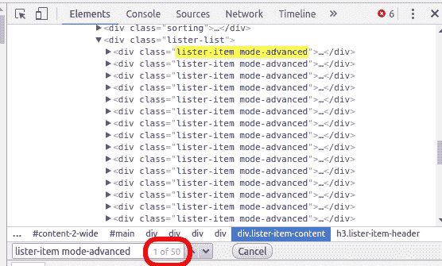
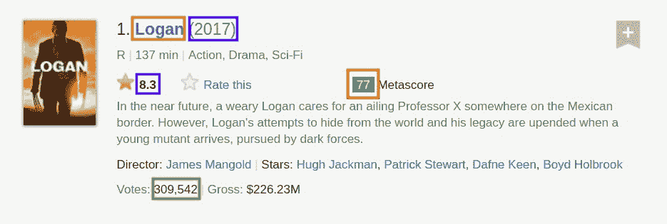
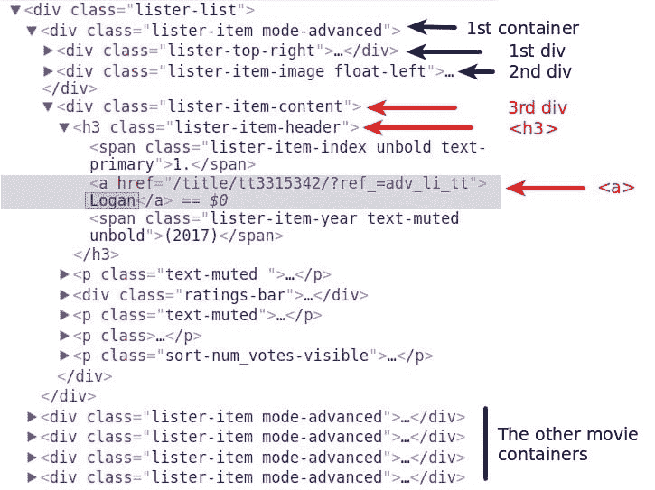
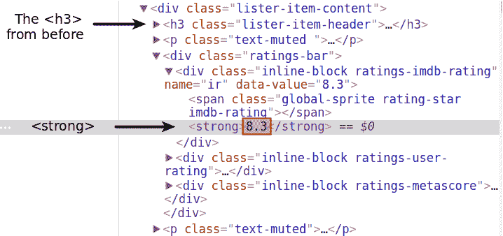
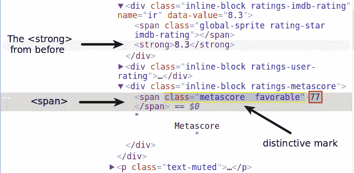
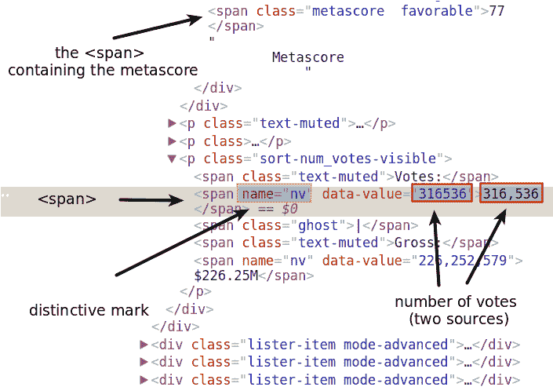
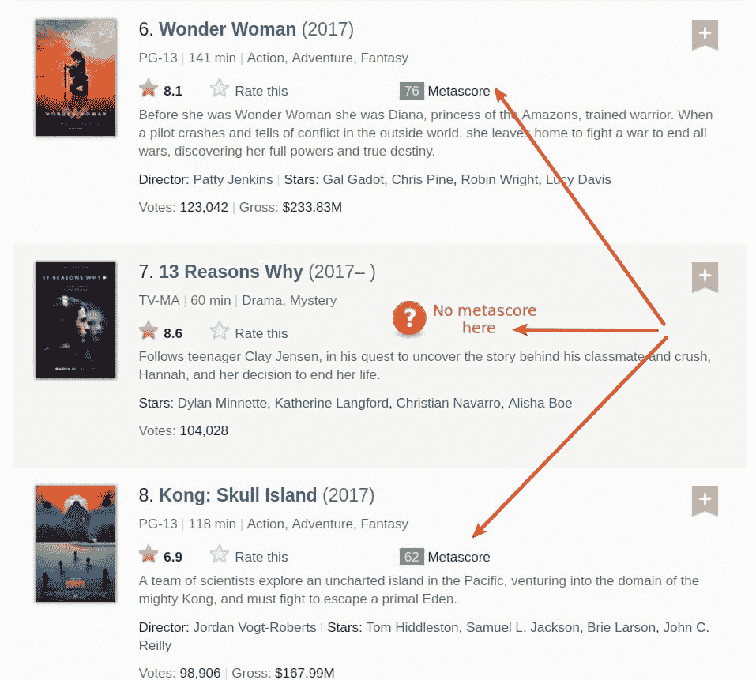
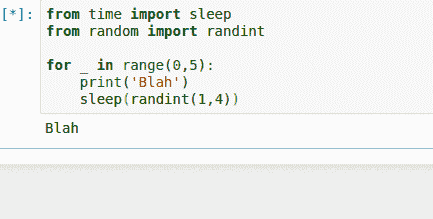

# 教程:网页抓取和美化

> 原文：<https://www.dataquest.io/blog/web-scraping-beautifulsoup/>

June 29, 2017

为了获取数据科学项目的数据，你通常会依赖于 [SQL](https://en.wikipedia.org/wiki/SQL) 和 [NoSQL](https://en.wikipedia.org/wiki/NoSQL) 数据库、[API](https://en.wikipedia.org/wiki/Application_programming_interface)或现成的 CSV 数据集。

问题是你不能总是找到关于你的主题的数据集，数据库不能保持最新，API 要么很贵，要么有使用限制。

然而，如果你要找的数据在网页上，那么所有这些问题的解决方案就是**网络抓取**。

在本教程中，我们将学习使用 [BeautifulSoup](https://www.crummy.com/software/BeautifulSoup/) 和[请求](https://docs.python-requests.org/en/master/)用 Python 抓取多个网页。然后我们将使用[熊猫](https://pandas.pydata.org/pandas-docs/stable/index.html)和 [matplotlib](https://matplotlib.org/) 执行一些简单的分析。

你应该已经对 HTML 有了一些基本的了解，对 Python 的基础有了很好的掌握，对什么是 web 抓取有了一个大概的概念。如果你对这些不放心，我推荐这本[初学网页抓取教程](https://www.dataquest.io/blog/web-scraping-tutorial-python/)。

## 收集 2000 多部电影的数据

我们想分析一下 [IMDB](https://www.imdb.com/) 和 [Metacritic](https://www.metacritic.com/) 电影评分的分布，看看我们是否能发现什么有趣的东西。为此，我们将首先收集 2000 多部电影的数据。

从一开始就确定我们刮擦的目标是至关重要的。编写一个抓取脚本会花费很多时间，尤其是当我们想要抓取多个网页的时候。我们希望避免花费数小时编写脚本来抓取我们实际上并不需要的数据。

## 计算要刮哪一页

一旦我们确立了目标，我们就需要确定一组有效的页面来抓取。

我们希望找到一个需要相对较少请求的页面组合。一个[请求](https://youtu.be/kBXQZMmiA4s?t=1m11s)是每当我们访问一个网页时发生的事情。我们从服务器“请求”页面的内容。我们发出的请求越多，脚本运行的时间就越长，服务器的压力就越大。

获取我们需要的所有数据的一种方法是编译一个电影名称列表，并使用它来访问 IMDB 和 Metacritic 网站上每部电影的网页。


由于我们希望从 IMDB 和 Metacritic 获得超过 2000 个评级，我们必须发出至少 4000 个请求。如果我们每秒发出一个请求，我们的脚本将需要一个多小时来发出 4000 个请求。正因为如此，有必要尝试找出更有效的方法来获取我们的数据。

如果我们浏览 IMDB 网站，我们可以发现将请求数量减半的方法。IMDB movie 页面上显示了 Metacritic 评分，因此我们可以通过一个请求获得两个评分:


如果我们进一步研究 IMDB 站点，我们可以发现如下所示的页面。它包含了我们需要的 50 部电影的所有数据。考虑到我们的目标，这意味着我们只需要做大约 40 个请求，比我们的第一个选项少 100 倍。让我们进一步探讨最后一个选项。


## 识别 URL 结构

我们现在面临的挑战是，当我们想要抓取的页面发生变化时，要确保我们理解 URL 的逻辑。如果我们不能充分理解这个逻辑，那么我们就可以用代码来实现它，然后我们就会走进死胡同。

如果你上 IMDB 的高级搜索[页面](https://www.imdb.com/search/)，你可以按[年份](https://www.imdb.com/year/)浏览电影:


我们按 2017 年来浏览，第一页的电影按票数排序，然后切换到下一页。我们将到达这个[网页](https://www.imdb.com/search/title?release_date=2017&sort=num_votes,desc&page=2&ref_=adv_nxt)，它有这个 URL:


在上图中，您可以看到 URL 在问号后面有几个参数:

*   `release_date` —仅显示特定年份上映的电影。
*   `sort` —对页面上的电影进行排序。`sort=num_votes,desc`翻译成*按票数降序排序*。
*   `page` —指定页码。
*   `ref_` —将我们带到下一页或上一页。参考是我们当前所在的页面。`adv_nxt`和`adv_prv`是两个可能的值。它们分别翻译为*前进到下一页*，和*前进到上一页*。

如果浏览这些页面并观察 URL，您会注意到只有参数值发生了变化。这意味着我们可以编写一个脚本来匹配变化的逻辑，并发出更少的请求来抓取我们的数据。

让我们通过请求这个单个网页的内容来开始编写脚本:`[https://www.imdb.com/search/title?release_date=2017&sort=num_votes,desc&page=1](https://www.imdb.com/search/title?release_date=2017&amp;sort=num_votes,desc&amp;page=1)`。在下面的代码单元中，我们将:

*   从`requests`模块导入`get()`函数。
*   将网页的地址分配给一个名为`url`的变量。
*   使用`get()`向服务器请求网页内容，并将服务器的响应存储在变量`response`中。
*   通过访问`.text`属性打印`response`的一小部分内容(`response`现在是一个`Response`对象)。

```
from requests import get
url = 'https://www.imdb.com/search/title?release_date=2017&sort=num_votes,desc&page=1'
response = get(url)
print(response.text[:500])
```

```
<!DOCTYPE html><
htmlxmlns:og="https://ogp.me/ns#"xmlns:fb="https://www.facebook.com/2008/fbml">
<head>
<meta charset="utf-8">
<meta http-equiv="X-UA-Compatible" content="IE=edge">
<meta name="apple-itunes-app" content="app-id=342792525, app-argument=imdb:///?src=mdot">
<script type="text/javascript">
var ue_t0=window.ue_t0||+new Date();</script>
<script type="text/javascript">
var ue_mid = "A1EVAM02EL8SFB";
```

## 理解单个页面的 HTML 结构

从`response.text`的第一行可以看到，服务器给我们发来了一个 HTML 文档。该文档描述了该网页的整体结构，以及它的特定内容(这是该特定网页的独特之处)。

我们要抓取的所有页面都有相同的整体结构。这意味着它们也有相同的整体 HTML 结构。因此，要编写我们的脚本，只需要理解一个页面的 HTML 结构就足够了。为此，我们将使用浏览器的**开发工具**。

如果你使用 [Chrome](https://developer.chrome.com/devtools) ，右击你感兴趣的网页元素，然后点击 *Inspect* 。这将把您带到对应于该元素的 HTML 行:


右键点击电影名称，然后左键*检查*。以灰色突出显示的 HTML 行对应于用户在网页上看到的电影名称。

你也可以同时使用 [Firefox](https://developer.mozilla.org/en-US/docs/Learn/Common_questions/What_are_browser_developer_tools) 和 [Safari](https://developer.apple.com/safari/tools/) DevTools 来完成这项工作。

注意，每部电影的所有信息，包括海报，都包含在一个`div`标签中。


每个`div`标签中都嵌套了许多 HTML 行。您可以通过点击对应于每个`div`的 HTML 行左边的灰色小箭头来探索它们。在这些嵌套的标签中，我们将找到我们需要的信息，比如电影的分级。


每页显示 50 部电影，所以每个电影都应该有一个`div`容器。让我们通过解析前面请求中的 HTML 文档来提取所有这 50 个容器。

## 使用 BeautifulSoup 解析 HTML 内容

为了解析我们的 HTML 文档并提取 50 个`div`容器，我们将使用一个名为 [BeautifulSoup](https://www.crummy.com/software/BeautifulSoup/bs4/doc/) 的 Python 模块，这是 Python 最常见的 web 抓取模块。

在下面的代码单元中，我们将:

*   从包`bs4`中导入`BeautifulSoup`类创建器。
*   通过创建一个`BeautifulSoup`对象来解析`response.text`，并将这个对象分配给`html_soup`。`'html.parser'`参数表明我们想要使用 [Python 的内置 HTML 解析器](https://www.crummy.com/software/BeautifulSoup/bs4/doc/#specifying-the-parser-to-use)来进行解析。

```
from bs4 import BeautifulSoup
html_soup = BeautifulSoup(response.text, 'html.parser')
type(html_soup)
```

```
bs4.BeautifulSoup
```

在提取 50 个`div`容器之前，我们需要找出它们与页面上其他`div`元素的区别。通常，与众不同的标志存在于`class` [属性](https://www.w3schools.com/Tags/att_global_class.asp)中。如果您检查感兴趣的容器的 HTML 行，您会注意到`class`属性有两个值:`lister-item`和`mode-advanced`。这种组合是这些`div`容器所独有的。我们可以通过快速搜索(`Ctrl + F`)来了解这一点。我们有 50 个这样的容器，所以我们预计只看到 50 个匹配:



现在让我们使用`find_all()` [方法](https://www.crummy.com/software/BeautifulSoup/bs4/doc/#find-all)提取所有具有`lister-item mode-advanced`的`class`属性的`div`容器:

```
movie_containers = html_soup.find_all('div', class_ = 'lister-item mode-advanced')
print(type(movie_containers))
print(len(movie_containers))
```

```
<class 'bs4.element.ResultSet'>
50
```

`find_all()`返回一个`ResultSet`对象，它是一个包含我们感兴趣的所有 50 个`divs`的列表。

现在我们将只选择第一个容器，并依次提取每个感兴趣的项目:

*   电影的名字。
*   发行年份。
*   IMDB 评级。
*   Metascore。
*   票数。



## 提取单部电影的数据

我们可以通过在`movie_containers`上使用列表符号来访问第一个容器，它包含关于一部电影的信息。

```
first_movie = movie_containers[0]
first_movie
```

```
<div class="lister-item mode-advanced">
<div class="lister-top-right">
<div class="ribbonize" data-caller="filmosearch" data-tconst="tt3315342"></div>
</div>
<div class="lister-item-image float-left">
<a href="/title/tt3315342/?ref_=adv_li_i"> 
</a> </div>
<div class="lister-item-content">
<h3 class="lister-item-header">
<span class="lister-item-index unbold text-primary">1.</span>
<a href="/title/tt3315342/?ref_=adv_li_tt">Logan</a>
<span class="lister-item-year text-muted unbold">(2017)</span>
</h3>
<p class="text-muted ">
<span class="certificate">R</span>
<span class="ghost">|</span>
<span class="runtime">137 min</span>
<span class="ghost">|</span>
<span class="genre">
Action, Drama, Sci-Fi </span>
</p>
<div class="ratings-bar">
<div class="inline-block ratings-imdb-rating" data-value="8.3" name="ir">
<span class="global-sprite rating-star imdb-rating"></span>
<strong>8.3</strong>
</div>
<div class="inline-block ratings-user-rating">
<span class="userRatingValue" data-tconst="tt3315342" id="urv_tt3315342">
<span class="global-sprite rating-star no-rating"></span>
<span class="rate" data-no-rating="Rate this" data-value="0" name="ur">Rate this</span>
</span>
<div class="starBarWidget" id="sb_tt3315342">
<div class="rating rating-list" data-auth="" data-ga-identifier="" data-starbar-class="rating-list" data-user="" id="tt3315342|imdb|8.3|8.3|||search|title" itemprop="aggregateRating" itemscope="" itemtype="https://schema.org/AggregateRating" title="Users rated this 8.3/10 (320,428 votes) - click stars to rate">
<meta content="8.3" itemprop="ratingValue"/>
<meta content="10" itemprop="bestRating"/>
<meta content="320428" itemprop="ratingCount"/>
<span class="rating-bg"> </span>
<span class="rating-imdb " style="width: 116.2px"> </span>
<span class="rating-stars">
<a href="/register/login?why=vote&ref_=tt_ov_rt" rel="nofollow" title="Register or login to rate this title"><span>1</span></a>
<a href="/register/login?why=vote&ref_=tt_ov_rt" rel="nofollow" title="Register or login to rate this title"><span>2</span></a>
<a href="/register/login?why=vote&ref_=tt_ov_rt" rel="nofollow" title="Register or login to rate this title"><span>3</span></a>
<a href="/register/login?why=vote&ref_=tt_ov_rt" rel="nofollow" title="Register or login to rate this title"><span>4</span></a>
<a href="/register/login?why=vote&ref_=tt_ov_rt" rel="nofollow" title="Register or login to rate this title"><span>5</span></a>
<a href="/register/login?why=vote&ref_=tt_ov_rt" rel="nofollow" title="Register or login to rate this title"><span>6</span></a>
<a href="/register/login?why=vote&ref_=tt_ov_rt" rel="nofollow" title="Register or login to rate this title"><span>7</span></a>
<a href="/register/login?why=vote&ref_=tt_ov_rt" rel="nofollow" title="Register or login to rate this title"><span>8</span></a>
<a href="/register/login?why=vote&ref_=tt_ov_rt" rel="nofollow" title="Register or login to rate this title"><span>9</span></a>
<a href="/register/login?why=vote&ref_=tt_ov_rt" rel="nofollow" title="Register or login to rate this title"><span>10</span></a>
</span>
<span class="rating-rating "><span class="value">8.3</span><span class="grey">/</span><span class="grey">10</span></span>
<span class="rating-cancel "><a href="/title/tt3315342/vote?v=X;k=" rel="nofollow" title="Delete"><span>X</span></a></span>
</div>
</div>
</div>
<div class="inline-block ratings-metascore">
<span class="metascore favorable">77 </span>
Metascore
</div>
</div>
<p class="text-muted">
In the near future, a weary Logan cares for an ailing Professor X somewhere on the Mexican border. However, Logan's attempts to hide from the world and his legacy are upended when a young mutant arrives, pursued by dark forces.</p>
<p class="">
Director:
<a href="/name/nm0003506/?ref_=adv_li_dr_0">James Mangold</a>
<span class="ghost">|</span>
Stars:
<a href="/name/nm0413168/?ref_=adv_li_st_0">Hugh Jackman</a>,
<a href="/name/nm0001772/?ref_=adv_li_st_1">Patrick Stewart</a>,
<a href="/name/nm6748436/?ref_=adv_li_st_2">Dafne Keen</a>,
<a href="/name/nm2933542/?ref_=adv_li_st_3">Boyd Holbrook</a>
</p>
<p class="sort-num_votes-visible">
<span class="text-muted">Votes:</span>
<span data-value="320428" name="nv">320,428</span>
<span class="ghost">|</span> <span class="text-muted">Gross:</span>
<span data-value="226,264,245" name="nv">$226.26M</span>
</p>
</div>
</div>
```

如您所见，一个容器的 HTML 内容非常长。为了找出特定于每个数据点的 HTML 行，我们将再次使用 DevTools。

### 电影的名字

我们从电影的名字开始，通过使用 DevTools 找到它对应的 HTML 行。您可以看到该名称包含在锚标记(`<a>`)中。这个标签嵌套在一个 header 标签中(`<h3>`)。`<h3>`标签嵌套在`<div>`标签中。这个`<div>`是嵌套在第一部电影的容器中的第三个`divs`。我们将这个容器的内容存储在`first_movie`变量中。



`first_movie`是一个`Tag` [对象](https://www.crummy.com/software/BeautifulSoup/bs4/doc/#kinds-of-objects)，其中的各种 HTML 标签被存储为其属性。我们可以像访问 Python 对象的任何属性一样访问它们。但是，使用标签名称作为属性只会选择该名称的第一个标签。如果我们运行`first_movie.div`，我们只得到第一个`div`标签的内容:

```
first_movie.div
```

```
<div class="lister-top-right">
<div class="ribbonize" data-caller="filmosearch" data-tconst="tt3315342"></div></div>
```

访问第一个锚标签(`<a>`)不会将我们带到电影的名称。第一个`<a>`在第二个`div`的某个地方:

```
first_movie.a
```

```
<a href="/title/tt3315342/?ref_=adv_li_i"> </a>
```

然而，访问第一个`<h3>`标签使我们非常接近:

```
first_movie.h3
```

```
<h3 class="lister-item-header">
<span class="lister-item-index unbold text-primary">1.</span>
<a href="/title/tt3315342/?ref_=adv_li_tt">Logan</a
><span class="lister-item-year text-muted unbold">(2017)</span>
</h3>
```

从这里开始，我们可以使用属性符号来访问`<h3>`标签中的第一个`<a>`:

```
first_movie.h3.a
```

```
<a href="/title/tt3315342/?ref_=adv_li_tt">Logan</a>
```

现在只需要从那个`<a>`标签中访问文本:

```
first_name = first_movie.h3.a.text
first_name
```

```
'Logan'
```

### 电影上映的年份

我们继续提取年份。该数据存储在包含名称的`<a>`下面的`<span>`标记中。


点符号将只访问第一个`span`元素。我们将通过第二个`<span>`的特殊标记进行搜索。我们将使用`find()` [方法](https://www.crummy.com/software/BeautifulSoup/bs4/doc/#find)，它与`find_all()`几乎相同，只是它只返回第一个匹配。事实上，`find()`相当于`find_all(limit = 1)`。`limit` [参数](https://www.crummy.com/software/BeautifulSoup/bs4/doc/#the-limit-argument)将输出限制为第一个匹配。

区别标记由分配给`class`属性的值`lister-item-year text-muted unbold`组成。因此，我们在`<h3>`标记中寻找具有这些值的第一个`<span>`:

```
first_year = first_movie.h3.find('span', class_ = 'lister-item-year text-muted unbold')
first_year
```

```
<span class="lister-item-year text-muted unbold">(2017)</span>
```

从这里开始，我们只需使用属性符号来访问文本:

```
first_year = first_year.text
first_year
```

```
'(2017)'
```

我们可以很容易地清理输出并将其转换为整数。但是如果你浏览更多的页面，你会注意到，对于一些电影来说，年份是不可预测的值，比如(2017)(I)或(2015)(V)。刮完后再做清洁会更有效率，因为那时我们会知道所有的年值。

### IMDB 评级

我们现在集中于提取第一部电影的 IMDB 评级。

有几种方法可以做到这一点，但我们将首先尝试最简单的一种。如果您使用 DevTools 检查 IMDB 评级，您会注意到评级包含在标签 T4 中。



让我们使用属性符号，希望第一个`<strong>`也是包含评级的那个。

```
first_movie.strong
```

```
<strong>8.3</strong>
```

太好了！我们将访问文本，将其转换为`float`类型，并将其赋给变量`first_imdb`:

```
first_imdb = float(first_movie.strong.text)
first_imdb
```

```
8.3
```

### 金属核心

如果我们使用 DevTools 检查 Metascore，我们会注意到我们可以在一个`span`标签中找到它。



属性符号显然不是一个解决方案。在那之前还有很多`<span>`标签。您可以在`<strong>`标签的正上方看到一个。我们最好使用`class`属性的独特值(`metascore favorable`)。

*注意，如果你从 DevTools 的标签中复制粘贴这些值，在`metascore`和`favorable`之间会有两个空格。确保在将值作为参数传递给`class_`参数时，只有一个空白字符。否则，`find()`什么也找不到。*

```
first_mscore = first_movie.find('span', class_ = 'metascore favorable')
first_mscore = int(first_mscore.text)
print(first_mscore)
```

```
77
```

`favorable`值表示高 Metascore，并将评级的背景色设置为绿色。另外两个可能的值是`unfavorable`和`mixed`。然而，所有 Metascore 评级所特有的只是`metascore`值。当我们为整个页面编写脚本时，我们将使用这个脚本。

### 票数

投票数包含在一个`<span>`标签中。它与众不同的标志是一个值为`nv`的`name`属性。



`name`属性不同于`class`属性。使用 BeautifulSoup，我们可以通过任何属性访问元素。`find()`和`find_all()`函数有一个名为`attrs`的参数。为此，我们可以传递我们作为字典搜索的属性和值:

```
first_votes = first_movie.find('span', attrs = {'name':'nv'})
first_votes
```

```
<span data-value="320428" name="nv">320,428</span>
```

我们可以使用`.text`符号来访问`<span>`标签的内容。如果我们访问`data-value`属性的值会更好。这样，我们可以将提取的数据点转换成一个`int`，而不必去掉逗号。

你可以像对待字典一样对待一个`Tag`对象。HTML 属性是字典的关键字。HTML 属性的值就是字典的键值。这就是我们如何访问`data-value`属性的值:

```
first_votes['data-value']
```

```
'320428'
```

让我们将该值转换为一个整数，并将其赋给`first_votes`:

```
first_votes = int(first_votes['data-value'])
```

就是这样！我们现在可以轻松地编写一个脚本来抓取单个页面。

## 单页的脚本

在将我们到目前为止所做的事情拼凑在一起之前，我们必须确保我们将只从具有 Metascore 的容器中提取数据。



我们需要添加一个条件来跳过没有 Metascore 的电影。

再次使用 DevTools，我们看到 Metascore 部分包含在一个`<div>`标记中。`class`属性有两个值:`inline-block`和`ratings-metascore`。与众不同的显然是`ratings-metascore`。


我们可以使用`find()`在每个电影容器中搜索具有该独特标记的`div`。当`find()`没有找到任何东西时，它返回一个`None`对象。我们可以在`if`语句中使用这个结果来控制一部电影是否被删除。

让我们在[网页](https://www.imdb.com/search/title?release_date=2017&sort=num_votes,desc&page=1)上搜索一个没有 Metascore 的电影容器，看看`find()`返回什么。

重要提示:当我运行下面的代码时，第八个容器没有 Metascore。然而，这是一个移动的目标，因为每部电影的投票数不断变化。为了获得与我在下一个演示代码单元中所做的相同的输出，您应该在运行代码时搜索一个没有 Metascore 的容器。

```
eighth_movie_mscore = movie_containers[7].find('div', class_ = 'ratings-metascore')
type(eighth_movie_mscore)
```

```
NoneType
```

现在让我们把上面的代码放在一起，并尽可能地压缩它，但只是在它仍然易于阅读的范围内。在下一个代码块中，我们:

*   声明一些`list`变量来存储提取的数据。
*   遍历`movie_containers`(包含所有 50 个电影容器的变量)中的每个容器。
*   仅当容器具有元得分时，才提取感兴趣的数据点。

```
# Lists to store the scraped data in
names = []
years = []
imdb_ratings = []
metascores = []
votes = []
# Extract data from individual movie container
for container in movie_containers:
# If the movie has Metascore, then extract:
    if container.find('div', class_ = 'ratings-metascore') is not None:
# The name
    name = container.h3.a.text
    names.append(name)
# The year
    year = container.h3.find('span', class_ = 'lister-item-year').text
    years.append(year)
# The IMDB rating
    imdb = float(container.strong.text)
    imdb_ratings.append(imdb)
# The Metascore
    m_score = container.find('span', class_ = 'metascore').text
    metascores.append(int(m_score))
# The number of votes
    vote = container.find('span', attrs = {'name':'nv'})['data-value']
    votes.append(int(vote))
```

让我们检查一下目前收集的数据。熊猫让我们很容易看到我们是否成功地收集了数据。

```
import pandas as pd
test_df = pd.DataFrame({'movie': names,
'year': years,
'imdb': imdb_ratings,
'metascore': metascores,
'votes': votes
})
print(test_df.info())
test_df
```

```
<class 'pandas.core.frame.DataFrame'>
RangeIndex: 32 entries, 0 to 31
Data columns (total 5 columns):
imdb 32 non-null float64
metascore 32 non-null int64
movie 32 non-null object
votes 32 non-null int64
year 32 non-null object
dtypes: float64(1), int64(2), object(2)
memory usage: 1.3+ KB
None
```

|  | imdb 中 | 金属芯 | 电影 | 投票 | 年 |
| --- | --- | --- | --- | --- | --- |
| Zero | Eight point three | Seventy-seven | 洛根 | Three hundred and twenty thousand four hundred and twenty-eight | (2017) |
| one | Eight point one | Sixty-seven | 银河守护者第二卷 | One hundred and seventy-five thousand four hundred and forty-three | (2017) |
| Two | Eight point one | Seventy-six | 《神奇女侠》 | One hundred and fifty-two thousand and sixty-seven | (2017) |
| three | Seven point seven | Seventy-five | 约翰·威克:第二章 | One hundred and forty thousand seven hundred and eighty-four | (2017) |
| four | Seven point five | Sixty-five | 《美女与野兽》 | One hundred and thirty-seven thousand seven hundred and thirteen | (2017) |
| five | Seven point eight | Eighty-four | 滚出去 | One hundred and thirty-six thousand four hundred and thirty-five | ㈠(2017 年) |
| six | Six point eight | Sixty-two | 孔:骷髅岛 | One hundred and twelve thousand and twelve | (2017) |
| seven | Seven | fifty-six | 狂怒者的命运 | Ninety-seven thousand six hundred and ninety | (2017) |
| eight | Six point eight | Sixty-five | 异形：契约 | Eighty-eight thousand six hundred and ninety-seven | (2017) |
| nine | Six point seven | Fifty-four | 生活 | Eighty thousand eight hundred and ninety-seven | ㈠(2017 年) |
| Ten | Seven | Thirty-nine | 加勒比海盗:死无对证 | Seventy-seven thousand two hundred and sixty-eight | (2017) |
| Eleven | Six point six | fifty-two | 壳里的幽灵 | Sixty-eight thousand five hundred and twenty-one | (2017) |
| Twelve | Seven point four | Seventy-five | 乐高蝙蝠侠电影 | Sixty-one thousand two hundred and sixty-three | (2017) |
| Thirteen | Five point two | forty-two | xXx:史云光·凯奇的回归 | Fifty thousand six hundred and ninety-seven | (2017) |
| Fourteen | Four point six | Thirty-three | 黑暗五十度 | Fifty thousand and twenty-two | (2017) |
| Fifteen | Seven point four | Sixty-seven | T2 猜火车 | Forty-eight thousand one hundred and thirty-four | (2017) |
| Sixteen | Six point three | forty-four | 力量游骑兵 | Forty-four thousand seven hundred and thirty-three | (2017) |
| Seventeen | Five point eight | Thirty-four | 木乃伊 | Thirty-four thousand one hundred and seventy-one | (2017) |
| Eighteen | Six point four | Fifty | 老板宝贝 | Thirty-two thousand nine hundred and seventy-six | (2017) |
| Nineteen | Six point six | Forty-three | 狗的目的 | Twenty-nine thousand five hundred and twenty-eight | (2017) |
| Twenty | Four point five | Twenty-five | 戒指 | Twenty thousand nine hundred and thirteen | (2017) |
| Twenty-one | Five point eight | Thirty-seven | 海湾观察 | Twenty thousand one hundred and forty-seven | (2017) |
| Twenty-two | Six point four | Thirty-three | 我们之间的距离 | Nineteen thousand and forty-four | ㈠(2017 年) |
| Twenty-three | Five point three | Twenty-eight | 变形金刚 5：最后的骑士 | Seventeen thousand seven hundred and twenty-seven | (2017) |
| Twenty-four | Six point one | fifty-six | 战争机器 | Sixteen thousand seven hundred and forty | (2017) |
| Twenty-five | Five point seven | Thirty-seven | 拳赛 | Sixteen thousand four hundred and forty-five | (2017) |
| Twenty-six | Seven point seven | Sixty | 有才华的 | Fourteen thousand eight hundred and nineteen | (2017) |
| Twenty-seven | Seven | Seventy-five | 在这个世界上我再也没有家的感觉了 | Fourteen thousand two hundred and eighty-one | (2017) |
| Twenty-eight | Five point five | Thirty-four | 警觉的 | Thirteen thousand seven hundred and seventy-six | ㈢(2017 年) |
| Twenty-nine | Six point three | Fifty-five | 这个发现 | Thirteen thousand two hundred and seven | (2017) |
| Thirty | Six point four | Fifty-eight | 在我倒下之前 | Thirteen thousand and sixteen | (2017) |
| Thirty-one | Eight point five | Twenty-six | 奥斯曼上尉 | Twelve thousand eight hundred and sixty-eight | (2017) |

一切都如预期的那样进行！

顺便提一下，如果你在一个英语不是主要语言的国家运行代码，很有可能你会把一些电影名翻译成那个国家的主要语言。

很有可能，这是因为服务器从你的 IP 地址推断出你的位置。即使你所在的国家以英语为主要语言，你仍然可以获得翻译的内容。如果您在发出`GET`请求时使用 VPN，可能会发生这种情况。

如果您遇到这个问题，请将以下值传递给`get()`函数的`headers`参数:

```
headers = {"Accept-Language": "en-US, en;q=0.5"}
```

这将向服务器传达类似*“我想要美式英语(en-US)的语言内容。如果 en-US 不可用，那么其他类型的英语(en)也可以(但没有 en-US 那么多)。”。*`q`参数表示我们对某种语言的偏好程度。如果没有指定，那么默认情况下这些值被设置为`1`，就像 en-US 的情况一样。你可以在这里阅读更多关于这个[的内容。](https://www.w3.org/Protocols/rfc2616/rfc2616-sec14.html#sec14.4)

现在让我们开始为我们想要抓取的所有页面构建脚本。

## 多个页面的脚本

抓取多个页面更具挑战性。我们将在单页脚本的基础上再做三件事:

1.  在循环中发出所有我们想要的请求。
2.  控制循环的速率，以避免用请求轰炸服务器。
3.  在循环运行时对其进行监控。

我们将从 2000 年到 2017 年这段时间里，每年的前 4 页。18 年中每年 4 页，总共 72 页。每页有 50 部电影，所以我们最多只能抓取 3600 部电影的数据。但并不是所有的电影都有 Metascore，所以数量会比那个低。即便如此，我们仍然很有可能获得超过 2000 部电影的数据。

### 更改 URL 的参数

如前所述，随着网页的变化，URL 遵循一定的逻辑。


当我们发出请求时，我们只需要改变 URL 的两个参数的值:参数`release_date`和`page`。让我们准备下一个循环需要的值。在下一个代码单元中，我们将:

*   创建一个名为`pages`的列表，用对应于前 4 页的**字符串**填充它。
*   创建一个名为`years_url`的列表，并用与 2000-2017 年相对应的**字符串**填充它。

```
pages = [str(i) for i in range(1,5)]
years_url = [str(i) for i in range(2000,2018)]
```

### 控制爬行速率

控制抓取的速率对我们是有利的，对我们在抓取的网站也是有利的。如果我们避免每秒钟数十个请求冲击服务器，那么我们就不太可能被禁止使用我们的 IP 地址。我们还通过允许服务器响应其他用户的请求来避免中断我们抓取的网站的活动。

我们将通过使用 Python 的`time` [模块](https://docs.python.org/3/library/time.html?highlight=time%20module#module-time)中的`sleep()` [函数](https://docs.python.org/3/library/time.html?highlight=time%20module#time.sleep)来控制循环的速率。`sleep()`将暂停循环执行指定的秒数。

为了模仿人类行为，我们将通过使用 Python 的`random` [模块](https://docs.python.org/3/library/random.html?highlight=random%20module#module-random)中的`randint()` [函数](https://docs.python.org/3/library/random.html?highlight=random%20module#random.randint)来改变请求之间的等待时间。`randint()`在指定的区间内随机生成整数。



现在，让我们只导入这两个函数来防止包含主 sleep from 循环的代码单元过度拥挤

```
from time import sleep
from random
import randint
```

### 当它还在运行时，监视循环

假设我们抓取了 72 页，如果我们能找到一种方法来监控抓取过程，那就太好了。这个特性绝对是可选的，但是它在测试和调试过程中非常有帮助。此外，页面数量越多，监控就越有帮助。如果你打算在一次代码运行中抓取成百上千的网页，我会说这个特性是必须的。

对于我们的脚本，我们将利用这个特性，并监控以下参数:

*   请求的**频率(速度),所以我们确保我们的程序没有使服务器过载。**
*   **请求数**，因此我们可以在超出预期请求数的情况下停止循环。
*   我们请求的 [**状态码**](https://en.wikipedia.org/wiki/List_of_HTTP_status_codes) ，因此我们确保服务器发回正确的响应。

为了得到一个频率值，我们将请求的数量除以自第一次请求以来经过的时间。这类似于计算汽车的速度——我们用行驶距离除以行驶时间。让我们先在小范围内试验一下这种监控技术。在下面的代码单元中，我们将:

*   使用`time` [模块](https://docs.python.org/3/library/time.html?highlight=time%20module#module-time)中的`time()` [函数](https://docs.python.org/3/library/time.html?highlight=time%20module#time.time)设置开始时间，并将值分配给`start_time`。
*   将 0 赋给变量`requests`，我们将使用它来计算请求的数量。
*   开始一个循环，然后每次迭代:
    *   模拟请求。
    *   将请求数增加 1。
    *   将循环暂停 8 至 15 秒。
    *   计算自第一次请求以来经过的时间，并将该值分配给`elapsed_time`。
    *   打印请求的数量和频率。

```
from time import timestart_time = time()
requests = 0
for _ in range(5):
# A request would go here
    requests += 1
    sleep(randint(1,3))
    elapsed_time = time() - start_time
    print('Request: {}; Frequency: {} requests/s'.format(requests, requests/elapsed_time))
```

```
Request: 1; Frequency: 0.49947650463238624 requests/s
Request: 2; Frequency: 0.4996998027377252 requests/s
Request: 3; Frequency: 0.5995400143227362 requests/s
Request: 4; Frequency: 0.4997272043465967 requests/s
Request: 5; Frequency: 0.4543451628627026 requests/s
```

由于我们将发出 72 个请求，随着输出的增加，我们的工作看起来会有点混乱。为了避免这种情况，我们将在每次迭代后清除输出，并用关于最近请求的信息替换它。为此，我们将使用 IPython 的`core.display` [模块](https://ipython.org/ipython-doc/2/api/generated/IPython.core.display.html#module-IPython.core.display)中的`clear_output()` [函数](https://ipython.org/ipython-doc/2/api/generated/IPython.core.display.html#IPython.core.display.clear_output)。我们将`clear_output()`的`wait`参数设置为`True`，等待替换当前输出，直到出现新的输出。

```
from IPython.core.display import clear_output
start_time = time()requests = 0
for _ in range(5):
# A request would go here
    requests += 1
    sleep(randint(1,3))
    current_time = time()
    elapsed_time = current_time - start_time
    print('Request: {}; Frequency: {} requests/s'.format(requests, requests/elapsed_time))
clear_output(wait = True)
```

```
Request: 5; Frequency: 0.6240351700607663 requests/s
```

上面的输出是循环运行后您将看到的输出。这是它运行时的样子


为了监控状态代码，我们将设置程序，以便在出现问题时发出警告。一个[成功请求](https://en.wikipedia.org/wiki/List_of_HTTP_status_codes#2xx_Success)由状态码 200 表示。如果状态代码不是 200，我们将使用`warnings` 中的`warn()` 抛出警告。

```
from warnings import warnwarn("Warning Simulation")
```

```
/Users/joshuadevlin/.virtualenvs/everday-ds/lib/python3.4/site-packages/ipykernel/__main__.py:3:
UserWarning: Warning Simulation app.launch_new_instance()
```

我们选择了警告而不是中断循环，因为即使一些请求失败，我们也很有可能收集到足够的数据。只有当请求的数量大于预期时，我们才会中断循环。

### 将一切拼凑在一起

现在让我们把我们到目前为止所做的一切拼凑起来！在下面的代码单元格中，我们从:

*   重新声明列表变量，使它们再次变为空。
*   准备环路监控。

然后，我们将:

*   遍历`years_url`列表以改变 URL 的`release_date`参数。
*   对于`years_url`中的每个元素，遍历`pages`列表来改变 URL 的`page`参数。
*   在`pages`循环中发出`GET`请求(并给`headers`参数正确的值，以确保我们只获得英文内容)。
*   将循环暂停 8 至 15 秒。
*   如前所述，监控每个请求。
*   对非 200 状态代码抛出警告。
*   如果请求数量大于预期，则中断循环。
*   将`response`的 HTML 内容转换为`BeautifulSoup`对象。
*   从这个`BeautifulSoup`对象中提取所有电影容器。
*   遍历所有这些容器。
*   如果容器有 Metascore，则提取数据。

```
# Redeclaring the lists to store data in
names = []
years = []
imdb_ratings = []
metascores = []
votes = []

# Preparing the monitoring of the loop
start_time = time()
requests = 0

# For every year in the interval 2000-2017
for year_url in years_url:

    # For every page in the interval 1-4
    for page in pages:

        # Make a get request
        response = get('https://www.imdb.com/search/title?release_date=' + year_url +
        '&sort=num_votes,desc&page=' + page, headers = headers)

        # Pause the loop
        sleep(randint(8,15))

        # Monitor the requests
        requests += 1
        elapsed_time = time() - start_time
        print('Request:{}; Frequency: {} requests/s'.format(requests, requests/elapsed_time))
        clear_output(wait = True)

        # Throw a warning for non-200 status codes
        if response.status_code != 200:
            warn('Request: {}; Status code: {}'.format(requests, response.status_code))

        # Break the loop if the number of requests is greater than expected
        if requests > 72:
            warn('Number of requests was greater than expected.')
            break

        # Parse the content of the request with BeautifulSoup
        page_html = BeautifulSoup(response.text, 'html.parser')

        # Select all the 50 movie containers from a single page
        mv_containers = page_html.find_all('div', class_ = 'lister-item mode-advanced')

        # For every movie of these 50
        for container in mv_containers:
            # If the movie has a Metascore, then:
            if container.find('div', class_ = 'ratings-metascore') is not None:

                # Scrape the name
                name = container.h3.a.text
                names.append(name)

                # Scrape the year
                year = container.h3.find('span', class_ = 'lister-item-year').text
                years.append(year)

                # Scrape the IMDB rating
                imdb = float(container.strong.text)
                imdb_ratings.append(imdb)

                # Scrape the Metascore
                m_score = container.find('span', class_ = 'metascore').text
                metascores.append(int(m_score))

                # Scrape the number of votes
                vote = container.find('span', attrs = {'name':'nv'})['data-value']
                votes.append(int(vote))
```

```
Request:72; Frequency: 0.07928964663062842 requests/s
```

不错！刮痧似乎已经完美地工作。脚本运行了大约 16 分钟。

现在，让我们将数据合并到一个 pandas `DataFrame`中，以检查我们设法收集到了什么。如果一切如预期的那样，我们可以继续清理数据，为分析做好准备。

## 检查收集的数据

在下一个代码块中，我们:

*   将数据合并成一只熊猫`DataFrame`。
*   打印一些关于新创建的`DataFrame`的信息。
*   显示前 10 个条目。

```
movie_ratings = pd.DataFrame({'movie': names,
'year': years,
'imdb': imdb_ratings,
'metascore': metascores,
'votes': votes
})
print(movie_ratings.info())
movie_ratings.head(10)
```

```
<class 'pandas.core.frame.DataFrame'>
RangeIndex: 2862 entries, 0 to 2861
Data columns (total 5 columns):
imdb 2862 non-null float64
metascore 2862 non-null int64
movie 2862 non-null object
votes 2862 non-null int64
year 2862 non-null object
dtypes: float64(1), int64(2), object(2)
memory usage: 111.9+ KB
None
```

|  | imdb 中 | 金属芯 | 电影 | 投票 | 年 |
| --- | --- | --- | --- | --- | --- |
| Zero | Eight point five | Sixty-seven | 角斗士 | One million sixty-one thousand and seventy-five | (2000) |
| one | Eight point five | Eighty | 纪念品 | Nine hundred and nine thousand eight hundred and thirty-five | (2000) |
| Two | Eight point three | Fifty-five | 偷拐抢骗 | Six hundred and forty-three thousand five hundred and eighty-eight | (2000) |
| three | Eight point four | sixty-eight | 梦想的安魂曲 | Six hundred and seventeen thousand seven hundred and forty-seven | (2000) |
| four | Seven point four | Sixty-four | 《X 战警》 | Four hundred and eighty-five thousand four hundred and eighty-five | (2000) |
| five | Seven point seven | Seventy-three | 抛弃 | Four hundred and twenty-two thousand two hundred and fifty-one | (2000) |
| six | Seven point six | Sixty-four | 《美国精神病人》 | Three hundred and eighty-three thousand six hundred and sixty-nine | (2000) |
| seven | Seven point two | Sixty-two | 牢不可破的 | Two hundred and seventy-three thousand nine hundred and seven | (2000) |
| eight | Seven | Seventy-three | 《拜见岳父大人》 | Two hundred and seventy-two thousand and twenty-three | (2000) |
| nine | Six point one | Fifty-nine | 教训:不可能 2 | Two hundred and fifty-six thousand seven hundred and eighty-nine | (2000) |

`info()`的输出显示我们收集了超过 2000 部电影的数据。我们还可以看到，在我们的数据集中没有任何`null`值。

我已经在 IMDB 的网站上查看了前 10 部电影的评分。他们都是正确的。你可能想自己做同样的事情。

我们可以安全地继续清理数据。

## 清理刮除的数据

我们将根据两个目标清理收集到的数据:绘制 IMDB 和 Metascore 评级的分布，以及共享数据集。因此，我们的数据清理将包括:

*   重新排序列。
*   清理`year`列并将值转换为整数。
*   检查极限额定值，以确定所有额定值是否都在预期区间内。
*   标准化评级类型之一(或两者)以生成比较[直方图](https://datavizcatalogue.com/methods/histogram.html)。

让我们从重新排列各列开始:

```
movie_ratings = movie_ratings[['movie', 'year', 'imdb', 'metascore', 'votes']]
movie_ratings.head()
```

|  | 电影 | 年 | imdb 中 | 金属芯 | 投票 |
| --- | --- | --- | --- | --- | --- |
| Zero | 角斗士 | (2000) | Eight point five | Sixty-seven | One million sixty-one thousand and seventy-five |
| one | 纪念品 | (2000) | Eight point five | Eighty | Nine hundred and nine thousand eight hundred and thirty-five |
| Two | 偷拐抢骗 | (2000) | Eight point three | Fifty-five | Six hundred and forty-three thousand five hundred and eighty-eight |
| three | 梦想的安魂曲 | (2000) | Eight point four | sixty-eight | Six hundred and seventeen thousand seven hundred and forty-seven |
| four | 《X 战警》 | (2000) | Seven point four | Sixty-four | Four hundred and eighty-five thousand four hundred and eighty-five |

现在让我们将`year`列中的所有值转换成整数。

现在所有的值都是`object`类型的。为了避免转换时出现`ValueErrors`，我们希望值只由从 0 到 9 的数字组成。

让我们检查一下`year`列的唯一值。这有助于我们了解如何进行我们想要的转换。为了查看所有的唯一值，我们将使用`unique()`方法:

```
movie_ratings['year'].unique()
```

```
array(['(2000)', '(I) (2000)', '(2001)', '(I) (2001)', '(2002)',
'(I) (2002)', '(2003)', '(I) (2003)', '(2004)', '(I) (2004)',
'(2005)', '(I) (2005)', '(2006)', '(I) (2006)', '(2007)',
'(I) (2007)', '(2008)', '(I) (2008)', '(2009)', '(I) (2009)',
'(II) (2009)', '(2010)', '(I) (2010)', '(II) (2010)', '(2011)',
'(I) (2011)', '(IV) (2011)', '(2012)', '(I) (2012)', '(II) (2012)',
'(2013)', '(I) (2013)', '(II) (2013)', '(2014)', '(I) (2014)',
'(II) (2014)', '(III) (2014)', '(2015)', '(I) (2015)',
'(II) (2015)', '(VI) (2015)', '(III) (2015)', '(2016)',
'(II) (2016)', '(I) (2016)', '(IX) (2016)', '(V) (2016)', '(2017)',
'(I) (2017)', '(III) (2017)', '(IV) (2017)'], dtype=object)
```

从末尾向开头数，我们可以看到年份总是位于第五个字符到第二个字符之间。我们将使用`.str()` [方法](https://pandas.pydata.org/pandas-docs/stable/generated/pandas.Series.str.html?highlight=series%20str#pandas.Series.str)来只选择那个区间。我们还将使用`astype()` [方法](https://pandas.pydata.org/pandas-docs/stable/generated/pandas.Series.astype.html?highlight=series%20astype#pandas.Series.astype)将结果转换为整数:

```
movie_ratings.loc[:, 'year'] = movie_ratings['year'].str[-5:-1].astype(int)
```

让我们直观地看到`year`列的前 3 个值，以便快速检查。我们还可以在输出的最后一行看到值的类型:

```
movie_ratings['year'].head(3)
```

```
0 2000
1 2000
2 2000
Name: year, dtype: int64
```

现在，我们将检查每种评级的最小值和最大值。我们可以通过熊猫的`describe()` [方法](https://pandas.pydata.org/pandas-docs/stable/generated/pandas.DataFrame.describe.html?highlight=describe#pandas.DataFrame.describe)很快做到这一点。当在一个`DataFrame`上应用时，这个方法为`DataFrame`的每个数字列返回各种描述性统计数据。在下一行代码中，我们仅选择描述最小值和最大值的行，以及描述 IMDB 评级和 Metascores 的列。

```
movie_ratings.describe().loc[['min', 'max'], ['imdb', 'metascore']]
```

|  | imdb 中 | metascore |
| --- | --- | --- |
| 部 | one point six | Seven |
| 最大 | Nine | One hundred |

没有意外的异常值。

从上面的值中，您可以看到这两个评级具有不同的范围。为了能够在一张图上绘制这两种分布，我们必须将它们放在相同的比例上。让我们将`imdb`列标准化为 100 分制。

我们将每个 IMDB 评级乘以 10，然后通过查看前 3 行进行快速检查:

```
movie_ratings['n_imdb'] = movie_ratings['imdb'] * 10
movie_ratings.head(3)
```

|  | 电影 | 年 | imdb 中 | 金属芯 | 投票 | n_imdb |
| --- | --- | --- | --- | --- | --- | --- |
| Zero | 角斗士 | Two thousand | Eight point five | Sixty-seven | One million sixty-one thousand and seventy-five | Eighty-five |
| one | 纪念品 | Two thousand | Eight point five | Eighty | Nine hundred and nine thousand eight hundred and thirty-five | Eighty-five |
| Two | 偷拐抢骗 | Two thousand | Eight point three | Fifty-five | Six hundred and forty-three thousand five hundred and eighty-eight | Eighty-three |

不错！我们现在可以在本地保存这个数据集，所以我们可以更容易地与他人共享它。我已经在我的 [GitHub 个人资料](https://github.com/mircealex/Scraped_dataset_movie_ratings)上公开分享了它。你还可以在其他地方共享数据集，比如 [Kaggle](https://www.kaggle.com/datasets) ，或者 [Dataworld](https://data.world/) 。

所以我们省省吧:

```
movie_ratings.to_csv('movie_ratings.csv')
```

顺便说一下，我强烈建议在退出(或重启)笔记本内核之前保存抓取的数据集。这样，您只需在恢复工作时导入数据集，而不必再次运行抓取脚本。如果你抓取成百上千的网页，这将变得非常有用。

最后，让我们绘制分布图！

## 绘制和分析分布

在下面的代码单元格中，我们:

*   导入`matplotlib.pyplot`子模块。
*   运行 Jupyter magic `%matplotlib`以激活 Jupyter 的 matplotlib 模式，并添加`inline`以在笔记本中显示我们的图形。
*   用 3 个`axes`创建一个`figure`对象。
*   绘制个人的每个非标准化评级的分布图`ax`。
*   在同一个`ax`上绘制两个等级的标准化分布。
*   隐藏所有三个`axes`的顶部和右侧脊椎。

```
import matplotlib.pyplot as plt

fig, axes = plt.subplots(nrows = 1, ncols = 3, figsize = (16,4))
ax1, ax2, ax3 = fig.axes
ax1.hist(movie_ratings['imdb'], bins = 10, range = (0,10)) # bin range = 1
ax1.set_title('IMDB rating')
ax2.hist(movie_ratings['metascore'], bins = 10, range = (0,100)) # bin range = 10
ax2.set_title('Metascore')
ax3.hist(movie_ratings['n_imdb'], bins = 10, range = (0,100), histtype = 'step')
ax3.hist(movie_ratings['metascore'], bins = 10, range = (0,100), histtype = 'step')
ax3.legend(loc = 'upper left')
ax3.set_title('The Two Normalized Distributions')
for ax in fig.axes:
    ax.spines['top'].set_visible(False)
    ax.spines['right'].set_visible(False)
plt.show()
```


从 IMDB [直方图](https://datavizcatalogue.com/methods/histogram.html)开始，我们可以看到大部分评分都在 6 到 8 之间。评分大于 8 的电影很少，评分小于 4 的就更少了。这表明非常好的电影和非常差的电影都很少见。

Metascore 评级的分布类似于正态分布——大多数评级是平均值，峰值约为 50。从这个峰值开始，频率逐渐向极限额定值降低。根据这种分布，非常好和非常差的电影确实少了，但并不像 IMDB 评级显示的那样少。

在对比图上，可以更清楚地看到 IMDB 分布高度偏向平均评级的较高部分，而 Metascore 评级的分布似乎更加平衡。

IMDB 分布出现这种偏差的原因可能是什么？一个假设是，许多用户倾向于使用二元方法来评估电影。如果他们喜欢这部电影，他们会给它 10 分。如果他们不喜欢这部电影，他们会给它一个很小的评级，或者他们懒得给这部电影评级。这是一个有趣的问题，值得更详细地探讨。

## 后续步骤

从请求单个网页的内容到分析 2000 多部电影的收视率，我们已经走过了漫长的道路。您现在应该知道如何抓取许多具有相同 HTML 和 URL 结构的网页。

在我们所学的基础上，下面是几个需要考虑的后续步骤:

*   抓取不同时间和页面间隔的数据。
*   搜集关于电影的额外数据。
*   找个不同的网站刮点自己感兴趣的东西。例如，你可以搜集关于[笔记本电脑](https://www.walmart.com/browse/electronics/laptop-computers/hp/3944_3951_132960/YnJhbmQ6SFAie?page=1#searchProductResult)的数据，看看价格如何随时间变化。

## 这个教程有帮助吗？

选择你的道路，不断学习有价值的数据技能。

[Python Tutorials](/python-tutorials-for-data-science/)

在我们的免费教程中练习 Python 编程技能。

[Data science courses](/data-science-courses/)

通过我们的交互式浏览器数据科学课程，投入到 Python、R、SQL 等语言的学习中。