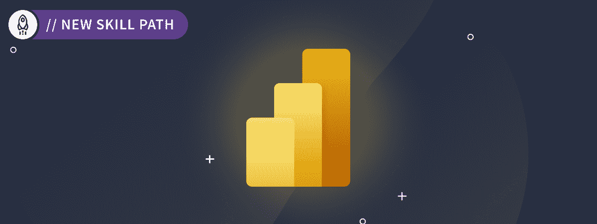

# 一位首席执行官解释如何在 2022 年学习 Power BI(循序渐进)

> 原文：<https://www.dataquest.io/blog/learn-power-bi/>

April 11, 2022

# 为什么要学 Power BI？

微软 Power BI 是全球使用最广泛的数据工具之一。全球有 50，000 家公司使用 Power BI 来清理、转换、建模和可视化他们的数据。

Power BI 的使用一直在快速增长，LinkedIn 上有超过 80，000 个空缺职位。大多数业务分析师和数据分析师定期使用 Power BI。通过学习 Power BI，您可以加速您的职业发展，成为一名数据专家。

向雇主证明您的 Power BI 技能的最佳方式是获得微软 Power BI 数据分析师认证。获得认证让雇主知道你可以使用像 DAX、M 语言和 Power 查询编辑器这样的 Power BI 特性。

要获得认证，你需要参加 [PL-300 考试](https://docs.microsoft.com/en-us/learn/certifications/exams/pl-300)(T2】DA-100 考试的更新版本)。要通过 PL-300 考试，您需要具备使用 Power BI 界面的所有方面的经验。

如果你想在求职面试中脱颖而出，你还应该建立一个项目组合。投资组合将表明你可以在现实世界中进行复杂的分析。

在本帖中，我们将通过 5 个步骤获得真实世界的 Power BI 经验，获得认证，并建立产品组合。这需要工作和努力，但如果你遵循这些步骤，你将能够开始一个新的数据职业生涯。

# 如何学习 Power BI 并获得认证

Power BI 有一个友好的图形界面，但在表面之下有很多复杂性。看视频或者看教程，很容易假设自己学过 Power BI。但是要通过考试并为工作做好准备，你需要实践技能。

培养动手能力 BI 技能的最佳方式是创建项目。项目反映了真实世界的数据分析，并将帮助您获得从加载数据到清理数据再到可视化的经验。

在我们的 5 个步骤中，我们将向您展示如何通过构建项目来实际学习 Power BI 技能。有了实践技能，你将为 PL-300 考试和工作面试做好准备。

如果你想更快地学习，我们还与微软合作了一系列 Power BI 课程，将教你通过 PL-300 考试所需的一切。

## 第一步:熟悉界面

学习 Power BI 的第一步是安装，熟悉界面。

幸运的是，Power BI 是从微软免费下载的。Power BI 仅在 Windows 上运行，因此如果您不使用 Windows，您将需要在虚拟机中运行 Power BI。

安装 Power BI 后，您应该熟悉界面的主要部分。这里有一些资源可以帮助你:

*   [动手能力商务智能入门课程](https://www.dataquest.io/course/get-started-with-microsoft-data-analytics/)–这一互动课程将在让您动手实践的同时，教会您基础的商务智能
*   [Microsoft Power BI 快速入门指南](https://docs.microsoft.com/en-us/power-bi/transform-model/desktop-query-overview)-帮助您导航 Power BI 的指南

不要在界面上花太多时间。你的目标应该是尽快开始使用真实数据。

## 第二步:建立一些可视化！

您的下一步应该是使用干净的数据集在报告视图中开发一些可视化。您希望数据集不需要做太多建模或数据清理工作。

这将为您提供导入数据和创建报告的经验。以下是一些可用于创建可视化效果的数据集:

*   [葡萄酒评论](https://www.kaggle.com/datasets/zynicide/wine-reviews)——对世界各地不同葡萄酒的评论
*   [NBA 球员数据](https://github.com/fivethirtyeight/data/tree/master/nba-raptor)–这包含 NBA 球员的 538 猛禽等级

这些数据集不需要太多的数据清理就可以做出一些有趣的可视化效果。

您还可以使用这些参考资料来学习如何在 Power BI 中构建可视化:

*   [动手能力商务智能可视化课程](https://www.dataquest.io/course/get-started-with-microsoft-data-analytics/)-这一互动课程将教你如何创建和分享商务智能可视化
*   [微软 Power BI 可视化指南](https://docs.microsoft.com/en-us/power-bi/visuals/power-bi-visualization-types-for-reports-and-q-and-a)–Power BI 中不同可视化的概述
*   [Power BI 示例报告](https://docs.microsoft.com/en-us/power-bi/create-reports/sample-datasets#sales--returns-sample-pbix-file)–该示例报告将帮助您了解报告的主要功能

## 步骤 3:建模和清理数据

一旦您理解了如何构建可视化，您就可以使用 Power BI 进行更复杂的分析。这涉及到构建数据模型、使用 DAX 计算值以及使用 Power Query 编辑器清理数据。

这些特性起初看起来很复杂，但是你可以通过构建项目一个一个地学习它们。

以下是一些数据集，您可以使用它们来探索数据建模和数据清理:

*   [奥运选手](https://www.kaggle.com/datasets/heesoo37/120-years-of-olympic-history-athletes-and-results)——这里有从 1896 年至今的奥运选手信息。您可以对两个文件—`noc_regions.csv`和`olympic_athletes.csv`之间的关系进行建模。您还可以将这些数据集与其他数据集相结合，例如[国家人口](https://data.worldbank.org/indicator/SP.POP.TOTL)。
*   国际足联数据(FIFA data)–这包含了流行的足球视频游戏 FIFA 的球员评分。你可以把这个数据集和其他数据集结合起来，比如国家人口，或者 [gdp](https://data.worldbank.org/indicator/NY.GDP.MKTP.CD) 。

如果您想要了解如何分析这些数据集，我们制作了视频演示来帮助您:

*   [奥林匹克运动员](https://www.youtube.com/watch?v=G0v2DrqoTJs)
*   [国际足联数据](https://youtu.be/ukwBAi4ytms)

您还可以使用这些参考资料来了解如何在 Power BI 中建模和清理数据:

*   [动手操作 Power BI 建模课程](https://www.dataquest.io/course/model-data-in-microsoft-power-bi/)–本互动课程将教您如何在 Power BI 中建模和清理数据
*   [微软 Power BI 数据建模指南](https://docs.microsoft.com/en-us/power-bi/transform-model/desktop-create-and-manage-relationships)—Power BI 中的数据关系概述
*   [Power BI 示例报告](https://docs.microsoft.com/en-us/power-bi/create-reports/sample-datasets#download-original-sample-power-bi-files)–这些报告将帮助您了解如何在 Power BI 中清理和建模数据

## 步骤 4:发布您的报告

当您在工作环境中使用 Power BI 时，您需要能够在整个团队中共享您的分析。这是通过使用[电源 BI 服务](https://docs.microsoft.com/en-us/power-bi/fundamentals/power-bi-service-overview)完成的。

在 Power BI desktop 中创建报告后，您可以将它们发布到 Power BI 服务并与其他人共享。

要练习发布您的结果，您需要注册 Power BI 服务，并熟悉该界面。这些资源可以帮助:

*   [Dataquest Power BI 技能途径](https://www.dataquest.io/path/analyzing-data-with-microsoft-power-bi-skill-path/)–本实践课程将教您如何管理工作空间和 Power BI 服务
*   [开始使用 Power BI 服务](https://docs.microsoft.com/en-us/power-bi/fundamentals/service-get-started)–本文将帮助您注册 Power BI 服务并迈出第一步
*   [微软工作区指南](https://docs.microsoft.com/en-us/power-bi/consumer/end-user-workspaces)–该指南将帮助您在 Power BI 服务中使用工作区

## 步骤 5:建立项目组合

一旦您理解了 Power BI 的所有主要特性，您将需要能够将所有这些技能整合到一个端到端的工作流中。

该工作流程包括:

*   查找数据集并将其加载到 Power BI 中
*   使用超级查询编辑器清理数据
*   数据建模和建立关系
*   使用 DAX 计算任何需要的列
*   创建可视化和报告
*   发布这些报告

确保您使用几个数据集完成了这个端到端的过程，以便您可以完全理解如何使用 Power BI 和所有功能。

你也可以利用你为这些项目所做的工作来创建一个作品集。作品集是你已经完成的项目的汇编，你可以在你的 Github 个人资料、简历或个人网站上向雇主强调这些项目。

以下是查找可用于投资组合的数据集的一些地方:

*   [Data.gov](https://data.gov/)——查找美国政府数据的好地方
*   美国国家海洋和大气管理局(NOAA)——你可以从这个网站下载天气数据进行分析
*   你可以在这里找到大量的市场调查和经济数据

# 获得认证

一旦您熟悉了所有关键的 Power BI 特性并完成了几个端到端项目，您就可以准备好参加 PL-300 认证考试了！

考试需要的主要技能是:

*   准备数据(导入、清理、转换数据)
*   数据建模(设计数据模型、使用 DAX、优化性能)
*   可视化和分析数据(创建报告、增强报告和识别趋势)
*   部署资产(管理文件和工作区)

你可以在这里看到关于考试将评估的技能[的更多细节。](https://query.prod.cms.rt.microsoft.com/cms/api/am/binary/RWREll)

如果你遵循了上面的步骤，你应该具备通过考试所需的所有主要技能！

# 学动力 BI 要多久？

读完这些步骤后，人们问我们的最常见的问题是:“所有这些需要多长时间？”

学习 Power BI 并获得认证可能需要 1 到 6 个多月的时间。

我们看到人们以闪电般的速度通过我们的课程，而其他人则慢得多。这完全取决于你想要的时间表、你可以用来学习 Power BI 的空闲时间以及你学习的速度。

幸运的是，我们的[互动 Power BI 课程](https://www.dataquest.io/path/analyzing-data-with-microsoft-power-bi-skill-path/)是为您创建的，您可以按照自己的速度进行。我们与微软合作，以确保你学会通过 PL-300 考试所需的一切，并为工作做好准备。