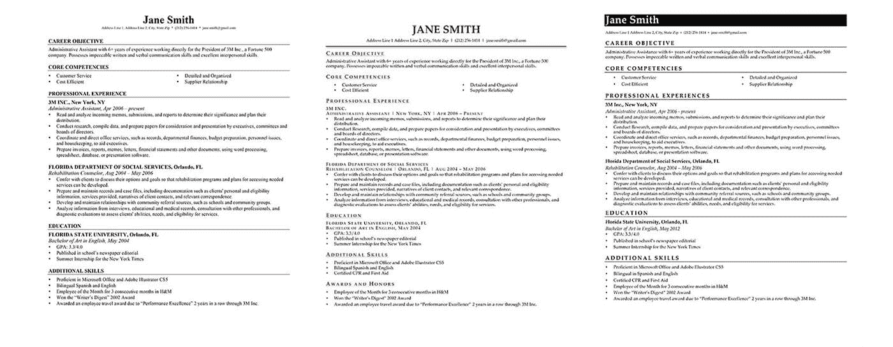
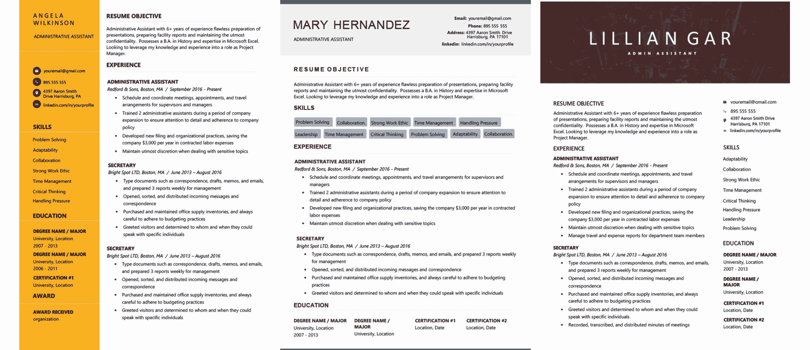
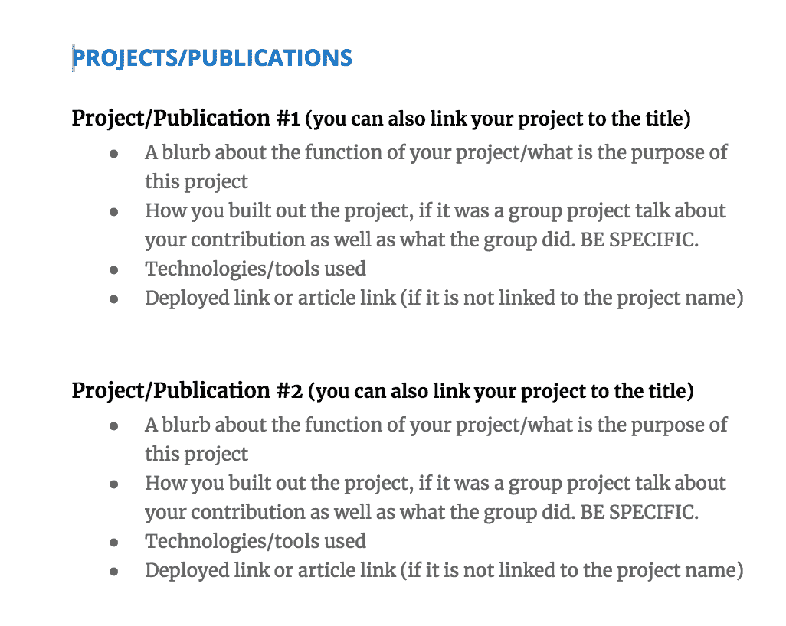
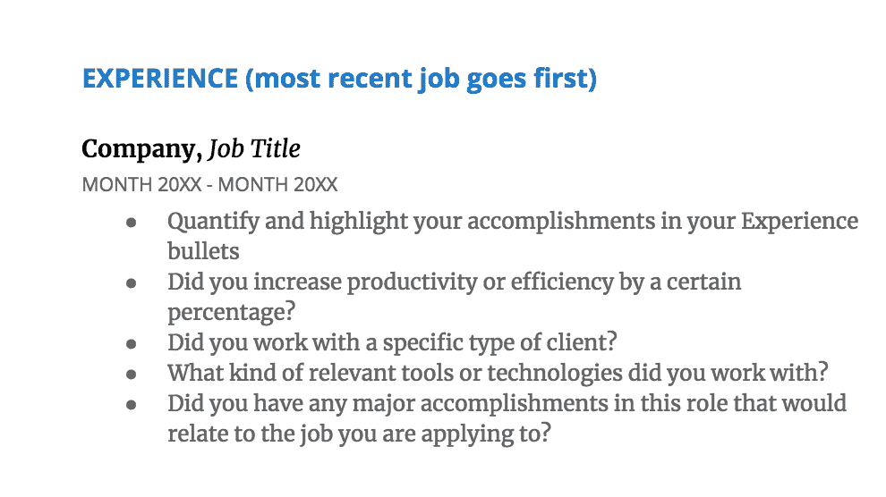
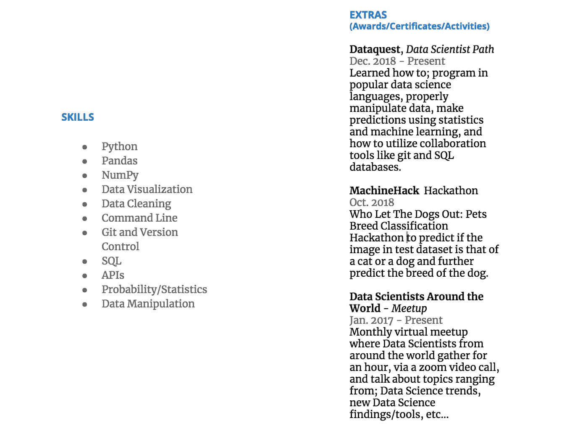
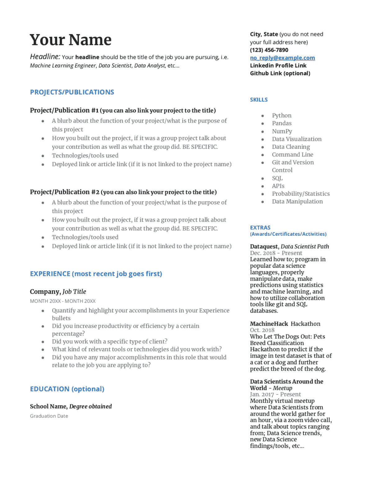

# 完美数据科学简历的 8 步指南(2022)

> 原文：<https://www.dataquest.io/blog/how-data-science-resume-cv/>

September 28, 2022

如果你想要一份数据科学方面的工作，你必须通过“看门人”，也就是广为人知的招聘人员或招聘经理。这意味着要写一份出色的简历。

**这是一个严酷的事实:**无论你在数据科学方面拥有多少技术技能，如果没有一份令人印象深刻的简历，你的职业生涯根本不会起步。

这份文件可能会阻碍你和你梦想的职业生涯，这可能不公平，但这是绝对的事实！

幸运的是，有一些有效写简历的技巧和诀窍。这些可以帮助你在其他数据科学申请者中脱颖而出。

想知道它们是什么吗？继续读！

在本帖中，我们将揭示一些鲜为人知的关于如何撰写一份优秀的数据科学简历的秘密。你将获得业内真正的招聘经理的专家推荐，以及一些让你的简历脱颖而出的专业建议。在这个过程中，我们会指出一些需要避免的关键错误——那些被招聘人员视为危险信号的错误！

需要相关的技能和知识放在你的简历上吗？立即免费查看我们全面的[数据科学课程](https://www.dataquest.io/data-science-courses/)！

## **第一步:保持数据科学简历不超过一页！**

挑战在于既要彻底又要简洁。一份好的简历应该只有一页长(除非你有[十年](https://www.findmyprofession.com/career-advice/resume-length)的*相关*工作经验)。

即便如此，仍有招聘人员会投出任何超过一页的简历。疯狂？也许吧。但这是有原因的。

招聘经理每天都会收到很多简历。所以，他们只有大约 30 秒的时间浏览每份简历并做出决定。

“老实说，”数据分析咨询公司 [Willow Data Strategy](https://www.willowdatastrategy.com/) 的总裁兼首席顾问斯蒂芬·余(Stephen Yu)说。“在我见某人之前，我花在(每份简历上的)时间不到 30 秒。如果那份简历不符合我的要求(这种情况只发生在十分之一的简历中)，我甚至不会给应聘者打电话。”

#### 简历危险信号:冗长的简历

这里的外卖？你需要分清主次。将你的经历浓缩到最重要、最相关的点上，以便于浏览。

超过一页的冗长简历是招聘人员的禁忌！

## 第二步:定制，定制，定制！

想想吧。如果你是一名招聘经理，你会对一份普通的简历还是一份符合你特定公司文化和工作要求的简历印象更深刻？没错。

是的，它比复制粘贴方法需要更多的前期工作。但是根据具体的工作在这里或那里添加一些小的细节肯定会给你加分。

这是不是意味着你每次申请工作都需要进行大规模的重写和重新设计？不会。但是，至少，要寻找招聘启事中提到的重要关键词和技能，并确保将它们包含在你的简历中。

#### 提示:输入你的写作风格和语调

如果你在申请你梦想的工作，你真的想给人留下深刻印象，你可以更进一步。方法如下:看看该公司的网站，了解他们喜欢的风格和语气。然后，相应调整简历的写法和审美。

“你必须找到一种方式来构建自己，这样当雇主看着你的简历时，他们会说，‘这个人是为了我的特殊职位而从天堂下来的，’”sharpes minds 联合创始人爱德华·哈里斯说。

## **第三步:明智地选择你的模板**

你选择的简历模板类型应该与你申请的公司类型一致。

例如，如果你申请的是更传统的公司(如戴尔、惠普和 IBM ),试着写一份更经典、低调的简历。

<figure class="wp-block-image"></figure>

另一方面，如果你的目标是一家更具创业文化或创意氛围的公司(比如谷歌、Meta、Pinterest 等)。)，你可以选择一个模板或创建一份更有才华的简历。

<figure class="wp-block-image"></figure>

您选择的模板也可以是一个组织工具。例如，专栏式简历可以帮助你在页面上容纳更多的信息。

#### 提示:使用在线简历模板

你能从头开始创建自己的简历吗？当然可以。但是从免费网站的创意简历模板开始可能更容易，比如 [Creddle](http://creddle.io/) 、 [VisualCV](https://visualcv.com/) 、 [CVMKR](https://cvmkr.com/) 或 [Enhancv](https://enhancv.com/resume-templates/) 。你甚至可以使用谷歌文档简历模板。

## **第四步:整理你的联系信息**

一旦你选择了简历模板，花点时间仔细检查联系信息部分。**你的名字、标题和联系信息应该总是出现在页面顶部的*****。***

 *为什么？你不希望招聘人员或招聘经理不得不翻遍整份简历来找到与你联系的方法，对吗？让他们轻松点！

关于数据科学简历中的联系信息，以下是一些需要记住的关键事项:

1.  简化你的地址，只写城市和州。
2.  列出一个好的工作电话号码和一个看起来很专业的电子邮件地址。
3.  包括你的个性化 LinkedIn 网址。
4.  将 GitHub 链接或个人资料链接添加到您的联系信息中，并*使其可点击*。

确保你的标题(通常在你的名字下面)反映了你想要得到的工作，而不是你现在的工作。例如，如果你想成为一名数据科学家，你的标题应该是“数据科学家”，即使你目前是一名厨师。

<figure class="wp-block-image"></figure>

## **步骤#5:包括数据科学项目和出版物**

在任何一份好的数据科学简历中，你想突出的主要内容是你创造了什么。包括一个单独的部分，专门用于您的数据科学项目和出版物。将这些信息*紧接*在您的姓名、标题和联系信息之后。

招聘公司想看看你能用你列出的技能做些什么。这可能包括**数据分析项目**、**机器学习项目**，甚至**发表的科学文章或编码教程**。

大多数数据科学雇主会想看看你的[项目组合](https://www.dataquest.io/blog/career-guide-data-science-projects-portfolio/)，看看你做了多少常规工作，你在做什么类型的项目。

“我们面试的大多数人都在简历上列出了他们的 GitHub 页面，”CiBo Technologies 人才招聘经理贾米森·瓦斯奎兹说。“我认为这很重要。”

### **展示相关项目**

当选择在简历上突出哪些项目时，记住一个重要因素:相关性。只选择那些与你申请的工作相关的项目。Pramp 首席执行官 Refael "Rafi" Zikavashvili 解释了原因:

“数据科学家只有一个目标，那就是解决业务问题。这不是关于挑战在技术上有多难，也不是关于解决方案有多酷，或者你正在使用的工具。这是关于你是否能够解决商业问题。

你应该列出多少项目/出版物？您可以在一页参数中容纳尽可能多的内容。

#### 危险信号:数据科学恢复，没有项目或出版物

没有任何项目或出版物的简历肯定会给招聘经理亮起红灯。这种空白不会被忽视。相反，这会凸显出你缺乏经验，让招聘人员怀疑你为什么还要费心去申请！

需要帮助为你的简历和作品集整理项目吗？我们有[一系列博客文章](https://www.dataquest.io/blog/data-science-portfolio-project/)来指导你构建伟大的数据科学项目。另外，[本指南的下一章](https://www.dataquest.io/blog/career-guide-data-science-projects-portfolio)将讨论你应该在求职申请中展示哪些项目以及如何展示。

### **突出你的技能**

尽可能具体地描述你在每个项目中使用的技能、工具和技术。指定编码语言、使用的库等。谈谈你是如何创建这个项目的，如果是团队项目，指出你个人的贡献。

#### 亲提示:冗余是可以的！

感觉你在项目部分重复了你计划在技能部分列出的相同技能？别担心。事实上，你在简历中添加那些关键工具、技术和技能的次数越多越好。

为什么？招聘人员和人事经理经常使用简单的关键词搜索来浏览简历。所以，你想在尽可能多的地方突出你的相关技能！

### **强调沟通技巧**

数据科学招聘人员正在寻找拥有他们需要的技术技能的人，当然。但他们也希望员工是有效的沟通者，并且了解大局。他们想要能有效用数据讲故事的数据科学家。

展示这些特质的一个方法是突出合作项目。这证明你可以和团队一起工作和交流。

另一种方法是在业务指标的背景下框定你的成就。这表明你理解你的分析如何应用于你试图解决的更大的商业问题。

将这些想法写在你的项目和工作经历部分。

### **让你的项目脱颖而出**

可能会有很多人申请你想要的工作。如何为您应用程序提供所需的竞争优势？这里还有两个策略可以考虑。

#### **提及非结构化数据**

也就是说，您处理过的任何数据都需要您自己构建电子表格/数据表。

这方面的例子包括处理视频、帖子、博客、客户评论和音频。处理非结构化数据的经验令人印象深刻。这表明你有能力处理杂乱的数据，而不仅仅是处理原始数据集中的数字。

#### **确定可衡量的结果**

“如果你想让你的简历变得更好，确保列出可衡量的成就，”Zety.com 招聘人员埃娃·扎克泽斯卡说。

例如，如果您创建了一个机器学习模型，作为您的一个项目，它可以将销售目标提高 15%,请这么说！

“‘这就是我一直在努力做的事情，这就是我所做的，这些就是结果。’G2 Crowd 的数据科学和分析经理迈克尔·胡普说:“像这样安排项目确实能创造一份强有力的简历。

以下是简历中这一部分的示例:

<figure class="wp-block-image"></figure>

## 第六步:详述你的相关工作经历

接下来是你的工作经历。你最近的工作经历应该列在最上面，然后是之前的工作，依此类推。

你应该追溯到多远？那得看情况。五年通常是上限，但是如果你有比这更早的相关工作经验，你可能会想把它包括在内。

#### **简历危险信号:工作经历中的空白**

记住，对于招聘人员和招聘经理来说，你的工作经历中超过六个月的空白是一个主要的危险信号。如果你有这样的差距，你肯定想在简历上说明。

例如，如果你在 2015 年至 2017 年间休了两年假来抚养孩子，你仍然希望在简历中添加这些日期。简单地说明你在那段时间是全职妈妈。

### **写入作业条目**

编写本节时，每个条目应包括以下内容:

*   *你的职位名称*
*   *公司*
*   *你担任该职位的时间*
*   *你在该职位上的成就*

如果你有与你申请的工作相关的工作经验，确保你的描述主要包括 T2 的成就而不是职责。雇主希望看到你实际做了什么，而不仅仅是你应该做什么。

如果你的工作经验与你申请的工作不相关，那么你还是会想把它列出来。但是，你只需要包括公司名称，你的职位和工作日期。你不需要用一份不相关的工作的所有细节来占据空间。

以下是一份相关工作中你应该包括的内容:

<figure class="wp-block-image"></figure>

## 第七步:列出你的学历

很多简历模板都是先列出学历。但如果你有工作经验和/或相关项目要展示，你会想先展示这些，把学历放在更靠后的位置。

仅列出*个大专学位(即社区学院、大学和研究生学位)。**如果你上过大学，但没有获得学位，最好不要列出那所学校。***

如果你的学位与你申请的工作不相关怎么办？你还是应该列出来。有些职位只需要任何领域的学位，所以你要确保你在这些职位的竞争中。

#### **提示:不要忘记你的数据科学证书！**

最后，在这里列出相关的“微学位”、在线培训认证和其他专业培训。

像通过 [Dataquest](https://www.dataquest.io/) 提供的数据科学证书是很好的补充。这是因为他们可以向招聘人员展示有针对性的技能。另外，每门 Dataquest 课程都包括一个创造[技能型项目](https://app.dataquest.io/projects)的机会，你也可以把它写进你的简历！

#### 简历危险信号:较老的学位和高中文凭

如果你的学位毕业日期是 15 年前，你可以自行决定是否要加上日期。不幸的是，一些公司认为以 19XX 开始的毕业日期是一个危险信号。如果你没有学位，就不要担心。把教育部分完全从你的简历中去掉。你不想做的是列出你的高中信息。对于招聘人员和招聘经理来说，这是另一个危险信号。

<figure class="wp-block-image"></figure>

## **第八步:添加技能和临时演员**

除了列出你的[数据科学项目](https://www.dataquest.io/blog/tag/portfolio/)和出版物之外，还有一些方法可以展示你的技能:

*   在“技能”部分包括你学到的相关技能。
*   添加一个包含相关活动和培训的“附加内容”部分。

### 技能部分不是可选的！

招聘人员和人事经理很可能会在查看你的简历时首先进行关键词搜索。你要确保像[、【Python】、](https://www.dataquest.io/course/python-for-data-science-fundamentals/)或[、【机器学习】、](https://www.dataquest.io/course/machine-learning-fundamentals/)这样的关键词被突出显示。

招聘人员*假设你首先列出的技能是你最强的技能*，你最后列出的技能是你最弱的。因此，首先列出你最强和最相关的技能。把你不太适应的技能或者不太可能与职位相关的技能留在清单的后面。

#### **简历红旗:你无法解释的技能**

你要小心不要在这里走极端。

“我认为一个巨大的危险信号是在[简历]上放了太多的技术，然后却不能支持它们，特别是在一个电话里，”圣裘德儿童研究医院的生物信息学软件开发经理 Clay McLeod 说。

Stephanie Leuck 是 84.51 T1 的大学招聘人员，她每年会看到数千份入门级数据科学简历。她附和了这一观点。“确保[你在简历中列出的技能]是你实际上可以交流的技能。如果你曾经读过一本关于 R 的书，但是你实际上不会用 R 编码，你也从来没有用 R 编码过，不要把 R 列为你的技能之一。只把你能说的技能放在上面。”

#### **亲提示:不要列举软技能**

这里应该包括软技能吗？大概不会。招聘人员倾向于浏览这一部分，寻找他们需要的特定技能。声称你擅长“沟通”或“团队合作”不会让你的简历脱颖而出。

最好在项目和工作经验部分说明自己具备这些技能。在这里，你可以强调你的“软”和“硬”技能是如何一起产生有意义的结果的。

### **何时添加附加部分**

如果你有空间，考虑包括一个“额外”部分。例如，此部分可以标记为“奖励”、“认证”或“培训”。

在数据科学领域，对于这一部分，您有几个选项。例如，你可能想列出你参加过的任何好的 Kaggle 比赛结果或你参加过的相关聚会/活动。任何其他表明你积极参与学习和*做*数据科学的事情也是公平的游戏。

像 [Machinehack](https://www.machinehack.com/) 和 [Hackerearth](https://www.hackerearth.com/) 这样的数据科学和机器学习黑客马拉松是你简历上的一大亮点。这表明你有健康的竞争精神。此外，它让招聘人员知道你可以在创建实际内容和项目的同时提高自己的技能和知识。

以下是技能和附加部分的示例:

<figure class="wp-block-image"></figure>

## **润色润色**

一旦你将所有相关内容添加到简历中，最后要做的主要事情是*拼写和语法检查*。对招聘人员和招聘经理来说，简历中的语法或拼写错误是一个巨大的危险信号。

#### **简历红旗:错误和错别字**

记住，招聘人员经常会收到成百上千份入门级工作的申请。他们经常寻找任何可能的借口来淘汰候选人！

虽然这看起来很小，但一个简单的打字错误暗示了对细节的忽视。信不信由你，这足以让一些招聘人员扔掉你的简历，不管你有什么技能和经验。

所以要确保文章没有错误，所有的措辞都简单明了。让编辑朋友检查你的简历总是一个好主意，但是像[海明威](https://www.hemingwayapp.com/)和[语法](https://app.grammarly.com/)这样的应用程序也可以帮助你清理和简化你的写作。

#### **专业提示:使用人工编辑器**

注意不要太相信自动语法检查软件。即使是最好的应用程序也会出错。

一份完整的数据科学简历可能如下所示:

<figure class="wp-block-image"></figure>

当然，如果你不能*证明*你已经掌握了简历中列出的技能，简历就没有意义了。[在下一章](https://www.dataquest.io/blog/career-guide-data-science-projects-portfolio)，我们将深入了解你应该做什么样的项目，以及你应该如何在你的投资组合中突出它们。

*本文是我们深入的数据科学职业指南的一部分。*

*   [简介和目录](https://www.dataquest.io/blog/data-science-career-guide/)
*   [申请前:考虑你的选择](https://www.dataquest.io/blog/career-guide-data-science-options)
*   [如何以及在哪里找到数据科学工作](https://www.dataquest.io/blog/career-guide-find-data-science-jobs)
*   如何写一份数据科学简历—你在这里。
*   [如何创建数据科学项目组合](https://www.dataquest.io/blog/career-guide-data-science-projects-portfolio)
*   [如何填写申请表，何时申请，以及其他注意事项](https://www.dataquest.io/blog/career-guide-data-science-application-forms)
*   [准备数据科学领域的工作面试](https://www.dataquest.io/blog/career-guide-data-science-job-interview)
*   [评估和协商工作机会](https://www.dataquest.io/blog/career-guide-data-science-job-offer-negotation)

### 成为数据分析师！

立即学习成为数据分析师所需的技能。注册一个免费帐户，获得免费的交互式 Python、R 和 SQL 课程内容。

[Sign up now!](https://app.dataquest.io/signup)

*(不需要信用卡！)**