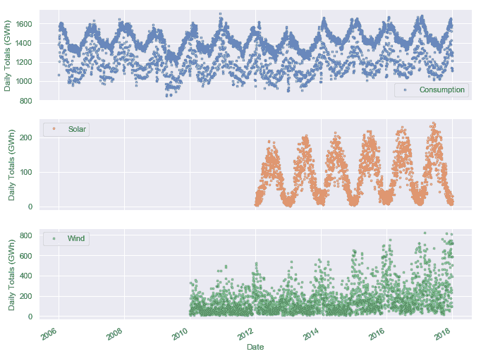
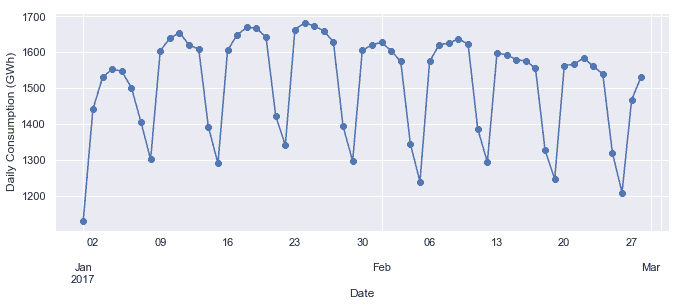
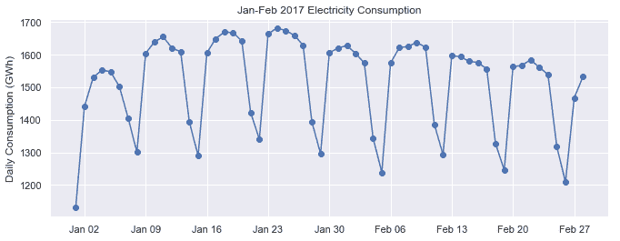
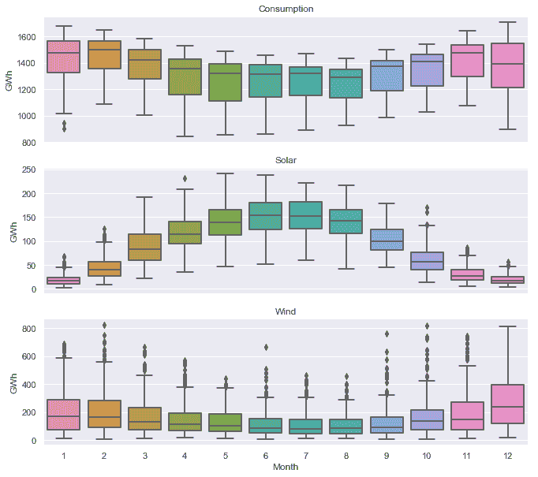
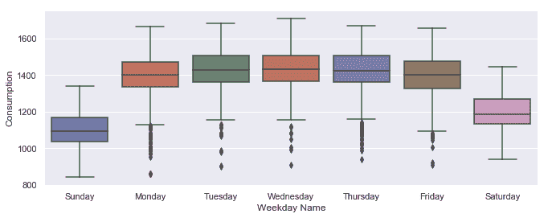
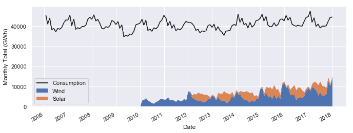
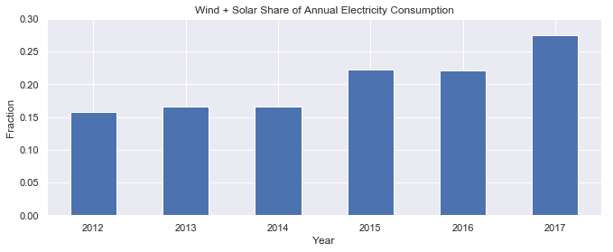
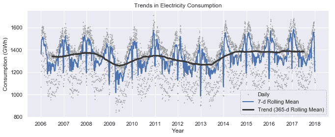
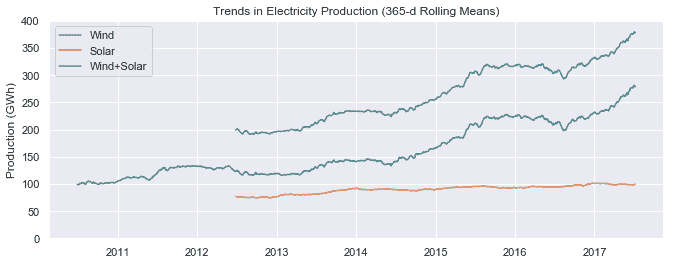

# 教程:熊猫的时间序列分析

> 原文：<https://www.dataquest.io/blog/tutorial-time-series-analysis-with-pandas/>

January 10, 2019

在本教程中，我们将了解熊猫图书馆中强大的时间序列工具。我们将学习制作像这样的酷酷的图表！

最初是为金融时间序列(如每日股票市场价格)开发的，pandas 中健壮而灵活的数据结构可以应用于任何领域的时间序列数据，包括商业、科学、工程、公共卫生和许多其他领域。借助这些工具，您可以轻松地以任何粒度级别组织、转换、分析和可视化您的数据—检查感兴趣的特定时间段内的详细信息，并缩小以探索不同时间尺度上的变化，如每月或每年的汇总、重复模式和长期趋势。

从最广泛的定义来看，**时间序列**是在不同时间点测量值的任何数据集。许多时间序列以特定的频率均匀分布，例如，每小时的天气测量、每天的网站访问量或每月的销售总额。时间序列也可以是不规则间隔和零星的，例如，计算机系统的事件日志中的时间戳数据或 911 紧急呼叫的历史记录。Pandas 时间序列工具同样适用于任何一种时间序列。

本教程将主要关注时间序列分析的数据争论和可视化方面。通过研究能源数据的时间序列，我们将了解基于时间的索引、重采样和滚动窗口等技术如何帮助我们探索电力需求和可再生能源供应随时间的变化。我们将讨论以下主题:

*   数据集:开放电力系统数据
*   时间序列数据结构
*   基于时间的索引
*   可视化时间序列数据
*   季节性
*   频率
*   重采样
*   滚动窗户
*   趋势

我们将使用 Python 3.6、pandas、matplotlib 和 seaborn。为了充分利用本教程，您需要熟悉 pandas 和 matplotlib 的基础知识。

还没到那一步？通过我们的[Python for Data Science:Fundamentals](https://www.dataquest.io/course/python-for-data-science-fundamentals/)和[中级](https://www.dataquest.io/course/python-for-data-science-intermediate/)课程，构建您的 Python 基础技能。

## 数据集:开放电力系统数据

在本教程中，我们将使用德国[开放电力系统数据(OPSD)](https://open-power-system-data.org/) 的每日时间序列，德国[近年来一直在快速扩大其可再生能源生产](https://www.independent.co.uk/environment/renewable-energy-germany-six-months-year-solar-power-wind-farms-a8427356.html)。该数据集包括 2006-2017 年全国电力消费、风力发电和太阳能发电总量。你可以在这里下载数据。

电力生产和消费以千兆瓦时(GWh)的日总量报告。数据文件的列有:

*   `Date` —日期( *yyyy-mm-dd* 格式)
*   `Consumption` —用电量，单位为吉瓦时
*   `Wind`——以 GWh 为单位的风力发电量
*   `Solar` —太阳能发电量，单位 GWh
*   `Wind+Solar`——风能和太阳能发电量之和，单位 GWh

我们将探索德国的电力消费和生产如何随着时间的推移而变化，使用 pandas 时间序列工具来回答以下问题:

*   电力消耗通常在什么时候最高和最低？
*   风力和太阳能发电如何随一年的季节变化？
*   电力消耗、太阳能和风力发电的长期趋势是什么？
*   风能和太阳能发电与电力消耗相比如何，这一比例随着时间的推移如何变化？

## 时间序列数据结构

在我们深入研究 OPSD 数据之前，让我们简要介绍一下用于处理日期和时间的主要 pandas 数据结构。在熊猫中，单个时间点被表示为一个**时间戳**。我们可以使用`to_datetime()`函数从各种日期/时间格式的字符串中创建时间戳。让我们导入 pandas 并将一些日期和时间转换成时间戳。

```
import pandas as pd
pd.to_datetime('2018-01-15 3:45pm') 
```

```
 Timestamp('2018-01-15 15:45:00') 
```

```
 pd.to_datetime('7/8/1952') 
```

```
 Timestamp('1952-07-08 00:00:00') 
```

正如我们所见，`to_datetime()`根据输入自动推断日期/时间格式。在上面的例子中，不明确的日期`'7/8/1952'`被假定为*月/日/年*，并被解释为 1952 年 7 月 8 日。或者，我们可以使用`dayfirst`参数告诉熊猫将日期解释为 1952 年 8 月 7 日。

```
pd.to_datetime('7/8/1952, dayfirst=True) 
```

```
 Timestamp('1952-08-07 00:00:00')
```

如果我们提供一个字符串列表或数组作为对`to_datetime()`的输入，它将在一个 **DatetimeIndex** 对象中返回一系列日期/时间值，这是一个核心数据结构，为 pandas 的大部分时间序列功能提供支持。

```
 pd.to_datetime(['2018-01-05', '7/8/1952', 'Oct 10, 1995']) 
```

```
 DatetimeIndex(['2018-01-05', '1952-07-08', '1995-10-10'], dtype='datetime64[ns]', freq=None)
```

在上面的 DatetimeIndex 中，数据类型`datetime64[ns]`表示底层数据存储为`64`位整数，单位为纳秒(ns)。这种数据结构允许 pandas 紧凑地存储大型日期/时间值序列，并使用 [NumPy datetime64 数组](https://docs.scipy.org/doc/numpy-1.15.0/reference/arrays.datetime.html)有效地执行矢量化运算。

如果我们正在处理一系列日期/时间格式相同的字符串，我们可以用`format`参数显式地指定它。对于非常大的数据集，与默认行为相比，这可以大大提高`to_datetime()`的性能，在默认行为中，格式是为每个单独的字符串单独推断的。可以使用 Python 内置 datetime 模块中的`strftime()`和`strptime()`函数中的任意[格式代码](https://docs.python.org/3/library/datetime.html#strftime-and-strptime-behavior)。下面的示例使用格式代码`%m`(数字月份)、`%d`(月份中的某一天)和`%y`(两位数的年份)来指定格式。

```
pd.to_datetime(['2/25/10', '8/6/17', '12/15/12'], format='%m/%d/%y') 
```

```
 DatetimeIndex(['2010-02-25', '2017-08-06', '2012-12-15'], dtype='datetime64[ns]', freq=None) 
```

除了表示各个时间点的 Timestamp 和 DatetimeIndex 对象，pandas 还包括表示持续时间(例如，125 秒)和周期(例如，2018 年 11 月)的数据结构。关于这些数据结构的更多信息，这里有一个很好的总结。在本教程中，我们将使用 DatetimeIndexes，熊猫时间序列最常见的数据结构。

### 创建时间序列数据框架

为了在 pandas 中处理时间序列数据，我们使用 DatetimeIndex 作为数据帧(或序列)的索引。让我们看看如何用我们的 OPSD 数据集做到这一点。首先，我们使用`read_csv()`函数将数据读入 DataFrame，然后显示它的形状。

```
 opsd_daily = pd.read_csv('opsd_germany_daily.csv')
opsd_daily.shape 
```

```
 (4383, 5) 
```

DataFrame 有 4383 行，涵盖从 2006 年 1 月 1 日到 2017 年 12 月 31 日的时间段。为了查看数据的样子，让我们使用`head()`和`tail()`方法来显示前三行和后三行。

```
opsd_daily.head(3) 
```

|  | 日期 | 消费 | 风 | 太阳的 | 风能+太阳能 |
| --- | --- | --- | --- | --- | --- |
| Zero | 2006-01-01 | One thousand and sixty-nine point one eight four | 圆盘烤饼 | 圆盘烤饼 | 圆盘烤饼 |
| one | 2006-01-02 | One thousand three hundred and eighty point five two one | 圆盘烤饼 | 圆盘烤饼 | 圆盘烤饼 |
| Two | 2006-01-03 | One thousand four hundred and forty-two point five three three | 圆盘烤饼 | 圆盘烤饼 | 圆盘烤饼 |

```
opsd_daily.tail(3) 
```

|  | 日期 | 消费 | 风 | 太阳的 | 风能+太阳能 |
| --- | --- | --- | --- | --- | --- |
| Four thousand three hundred and eighty | 2017-12-29 | 1295.08753 | Five hundred and eighty-four point two seven seven | Twenty-nine point eight five four | Six hundred and fourteen point one three one |
| Four thousand three hundred and eighty-one | 2017-12-30 | 1215.44897 | Seven hundred and twenty-one point two four seven | Seven point four six seven | Seven hundred and twenty-eight point seven one four |
| Four thousand three hundred and eighty-two | 2017-12-31 | 1107.11488 | Seven hundred and twenty-one point one seven six | Nineteen point nine eight | Seven hundred and forty-one point one five six |

接下来，让我们检查每一列的数据类型。

```
 opsd_daily.dtypes 
```

```
 Date datetime64[ns]
Consumption float64
Wind float64
Solar float64
Wind+Solar float64
dtype: object 
```

既然`Date`列是正确的数据类型，让我们将其设置为数据帧的索引。

```
 opsd_daily = opsd_daily.set_index('Date')
opsd_daily.head(3) 
```

|  | 消费 | 风 | 太阳的 | 风能+太阳能 |
| --- | --- | --- | --- | --- |
| 日期 |  |  |  |  |
| --- | --- | --- | --- | --- |
| 2006-01-01 | One thousand and sixty-nine point one eight four | 圆盘烤饼 | 圆盘烤饼 | 圆盘烤饼 |
| 2006-01-02 | One thousand three hundred and eighty point five two one | 圆盘烤饼 | 圆盘烤饼 | 圆盘烤饼 |
| 2006-01-03 | One thousand four hundred and forty-two point five three three | 圆盘烤饼 | 圆盘烤饼 | 圆盘烤饼 |

```
 opsd_daily.index 
```

```
 DatetimeIndex(['2006-01-01', '2006-01-02', '2006-01-03', '2006-01-04',
'2006-01-05', '2006-01-06', '2006-01-07', '2006-01-08',
'2006-01-09', '2006-01-10',
...
'2017-12-22', '2017-12-23', '2017-12-24', '2017-12-25',
'2017-12-26', '2017-12-27', '2017-12-28', '2017-12-29',
'2017-12-30', '2017-12-31'],
dtype='datetime64[ns]', name='Date', length=4383, freq=None) 
```

或者，我们可以使用`read_csv()`函数的`index_col`和`parse_dates`参数将上述步骤合并成一行。这通常是一种有用的捷径。

```
 opsd_daily = pd.read_csv('opsd_germany_daily.csv', index_col=0, parse_dates=True) 
```

现在我们的 DataFrame 的索引是 DatetimeIndex，我们可以使用 pandas 强大的基于时间的索引来争论和分析我们的数据，正如我们将在下面的部分中看到的。

DatetimeIndex 的另一个有用的方面是，[的各个日期/时间组件](https://pandas.pydata.org/pandas-docs/stable/timeseries.html#time-date-components)都可以作为属性使用，例如`year`、`month`、`day`等等。让我们给`opsd_daily`再添加几列，包含年、月和工作日名称。

```
 # Add columns with year, month, and weekday name
opsd_daily['Year'] = opsd_daily.index.year
opsd_daily['Month'] = opsd_daily.index.month
opsd_daily['Weekday Name'] = opsd_daily.index.weekday_name
# Display a random sampling of 5 rows
opsd_daily.sample(5, random_state=0) 
```

|  | 消费 | 风 | 太阳的 | 风能+太阳能 | 年 | 月 | 工作日名称 |
| --- | --- | --- | --- | --- | --- | --- | --- |
| 日期 |  |  |  |  |  |  |  |
| --- | --- | --- | --- | --- | --- | --- | --- |
| 2008-08-23 | One thousand one hundred and fifty-two point zero one one | 圆盘烤饼 | 圆盘烤饼 | 圆盘烤饼 | Two thousand and eight | eight | 星期六 |
| 2013-08-08 | One thousand two hundred and ninety-one point nine eight four | Seventy-nine point six six six | Ninety-three point three seven one | One hundred and seventy-three point zero three seven | Two thousand and thirteen | eight | 星期四 |
| 2009-08-27 | One thousand two hundred and eighty-one point zero five seven | 圆盘烤饼 | 圆盘烤饼 | 圆盘烤饼 | Two thousand and nine | eight | 星期四 |
| 2015-10-02 | One thousand three hundred and ninety-one point zero five | Eighty-one point two two nine | One hundred and sixty point six four one | Two hundred and forty-one point eight seven | Two thousand and fifteen | Ten | 星期五 |
| 2009-06-02 | One thousand two hundred and one point five two two | 圆盘烤饼 | 圆盘烤饼 | 圆盘烤饼 | Two thousand and nine | six | 星期二 |

## 基于时间的索引

熊猫时间序列最强大和方便的特性之一是**基于时间的索引**——使用日期和时间来直观地组织和访问我们的数据。通过基于时间的索引，我们可以使用日期/时间格式的字符串，通过`loc`访问器选择数据帧中的数据。索引的工作方式类似于使用`loc`的标准的基于标签的索引，但是有一些额外的特性。

例如，我们可以使用诸如`'2017-08-10'`这样的字符串来选择某一天的数据。

```
 opsd_daily.loc['2017-08-10'] 
```

```
 Consumption 1351.49
Wind 100.274
Solar 71.16
Wind+Solar 171.434
Year 2017
Month 8
Weekday Name Thursday
Name: 2017-08-10 00:00:00, dtype: object 
```

我们也可以选择一段日子，比如`'2014-01-20':'2014-01-22'`。与使用`loc`的常规基于标签的索引一样，切片包含两个端点。

```
 opsd_daily.loc['2014-01-20':'2014-01-22'] 
```

|  | 消费 | 风 | 太阳的 | 风能+太阳能 | 年 | 月 | 工作日名称 |
| --- | --- | --- | --- | --- | --- | --- | --- |
| 日期 |  |  |  |  |  |  |  |
| --- | --- | --- | --- | --- | --- | --- | --- |
| 2014-01-20 | One thousand five hundred and ninety point six eight seven | Seventy-eight point six four seven | Six point three seven one | Eighty-five point zero one eight | Two thousand and fourteen | one | 星期一 |
| 2014-01-21 | One thousand six hundred and twenty-four point eight zero six | Fifteen point six four three | Five point eight three five | Twenty-one point four seven eight | Two thousand and fourteen | one | 星期二 |
| 2014-01-22 | One thousand six hundred and twenty-five point one five five | Sixty point two five nine | Eleven point nine nine two | Seventy-two point two five one | Two thousand and fourteen | one | 星期三 |

pandas 时间序列的另一个非常方便的特性是**部分字符串索引**，在这里我们可以选择与给定字符串部分匹配的所有日期/时间。例如，我们可以用`opsd_daily.loc['2006']`选择整个 2006 年，或者用`opsd_daily.loc['2012-02']`选择整个 2012 年 2 月。

```
 opsd_daily.loc['2012-02'] 
```

|  | 消费 | 风 | 太阳的 | 风能+太阳能 | 年 | 月 | 工作日名称 |
| --- | --- | --- | --- | --- | --- | --- | --- |
| 日期 |  |  |  |  |  |  |  |
| --- | --- | --- | --- | --- | --- | --- | --- |
| 2012-02-01 | One thousand five hundred and eleven point eight six six | One hundred and ninety-nine point six zero seven | Forty-three point five zero two | Two hundred and forty-three point one zero nine | Two thousand and twelve | Two | 星期三 |
| 2012-02-02 | One thousand five hundred and sixty-three point four zero seven | Seventy-three point four six nine | Forty-four point six seven five | One hundred and eighteen point one four four | Two thousand and twelve | Two | 星期四 |
| 2012-02-03 | One thousand five hundred and sixty-three point six three one | Thirty-six point three five two | Forty-six point five one | Eighty-two point eight six two | Two thousand and twelve | Two | 星期五 |
| 2012-02-04 | One thousand three hundred and seventy-two point six one four | Twenty point five five one | Forty-five point two two five | Sixty-five point seven seven six | Two thousand and twelve | Two | 星期六 |
| 2012-02-05 | One thousand two hundred and seventy-nine point four three two | Fifty-five point five two two | Fifty-four point five seven two | One hundred and ten point zero nine four | Two thousand and twelve | Two | 星期日 |
| 2012-02-06 | One thousand five hundred and seventy-four point seven six six | Thirty-four point eight nine six | Fifty-five point three eight nine | Ninety point two eight five | Two thousand and twelve | Two | 星期一 |
| 2012-02-07 | One thousand six hundred and fifteen point zero seven eight | One hundred point three one two | Nineteen point eight six seven | One hundred and twenty point one seven nine | Two thousand and twelve | Two | 星期二 |
| 2012-02-08 | One thousand six hundred and thirteen point seven seven four | Ninety-three point seven six three | Thirty-six point nine three | One hundred and thirty point six nine three | Two thousand and twelve | Two | 星期三 |
| 2012-02-09 | One thousand five hundred and ninety-one point five three two | One hundred and thirty-two point two one nine | Nineteen point zero four two | One hundred and fifty-one point two six one | Two thousand and twelve | Two | 星期四 |
| 2012-02-10 | One thousand five hundred and eighty-one point two eight seven | Fifty-two point one two two | Thirty-four point eight seven three | Eighty-six point nine nine five | Two thousand and twelve | Two | 星期五 |
| 2012-02-11 | One thousand three hundred and seventy-seven point four zero four | Thirty-two point three seven five | Forty-four point six two nine | Seventy-seven point zero zero four | Two thousand and twelve | Two | 星期六 |
| 2012-02-12 | One thousand two hundred and sixty-four point two five four | Sixty-two point six five nine | Forty-five point one seven six | One hundred and seven point eight three five | Two thousand and twelve | Two | 星期日 |
| 2012-02-13 | One thousand five hundred and sixty-one point nine eight seven | Twenty-five point nine eight four | Eleven point two eight seven | Thirty-seven point two seven one | Two thousand and twelve | Two | 星期一 |
| 2012-02-14 | One thousand five hundred and fifty point three six six | One hundred and forty-six point four nine five | Nine point six one | One hundred and fifty-six point one zero five | Two thousand and twelve | Two | 星期二 |
| 2012-02-15 | One thousand four hundred and seventy-six point zero three seven | Four hundred and thirteen point three six seven | Eighteen point eight seven seven | Four hundred and thirty-two point two four four | Two thousand and twelve | Two | 星期三 |
| 2012-02-16 | One thousand five hundred and four point one one nine | One hundred and thirty point two four seven | Thirty-eight point one seven six | One hundred and sixty-eight point four two three | Two thousand and twelve | Two | 星期四 |
| 2012-02-17 | One thousand four hundred and thirty-eight point eight five seven | One hundred and ninety-six point five one five | Seventeen point three two eight | Two hundred and thirteen point eight four three | Two thousand and twelve | Two | 星期五 |
| 2012-02-18 | One thousand two hundred and thirty-six point zero six nine | Two hundred and thirty-seven point eight eight nine | Twenty-six point two four eight | Two hundred and sixty-four point one three seven | Two thousand and twelve | Two | 星期六 |
| 2012-02-19 | One thousand one hundred and seven point four three one | Two hundred and seventy-two point six five five | Thirty point three eight two | Three hundred and three point zero three seven | Two thousand and twelve | Two | 星期日 |
| 2012-02-20 | One thousand four hundred and one point eight seven three | One hundred and sixty point three one five | Fifty-three point seven nine four | Two hundred and fourteen point one zero nine | Two thousand and twelve | Two | 星期一 |
| 2012-02-21 | One thousand four hundred and thirty-four point five three three | Two hundred and eighty-one point nine zero nine | Fifty-seven point nine eight four | Three hundred and thirty-nine point eight nine three | Two thousand and twelve | Two | 星期二 |
| 2012-02-22 | One thousand four hundred and fifty-three point five zero seven | Two hundred and eighty-seven point six three five | Seventy-four point nine zero four | Three hundred and sixty-two point five three nine | Two thousand and twelve | Two | 星期三 |
| 2012-02-23 | One thousand four hundred and twenty-seven point four zero two | Three hundred and fifty-three point five one | Eighteen point nine two seven | Three hundred and seventy-two point four three seven | Two thousand and twelve | Two | 星期四 |
| 2012-02-24 | One thousand three hundred and seventy-three point eight | Three hundred and eighty-two point seven seven seven | Twenty-nine point two eight one | Four hundred and twelve point zero five eight | Two thousand and twelve | Two | 星期五 |
| 2012-02-25 | One thousand one hundred and thirty-three point one eight four | Three hundred and two point one zero two | Forty-two point six six seven | Three hundred and forty-four point seven six nine | Two thousand and twelve | Two | 星期六 |
| 2012-02-26 | One thousand and eighty-six point seven four three | Ninety-five point two three four | Thirty-seven point two one four | One hundred and thirty-two point four four eight | Two thousand and twelve | Two | 星期日 |
| 2012-02-27 | One thousand four hundred and thirty-six point zero nine five | Eighty-six point nine five six | Forty-three point zero nine nine | One hundred and thirty point zero five five | Two thousand and twelve | Two | 星期一 |
| 2012-02-28 | One thousand four hundred and eight point two one one | Two hundred and thirty-one point nine two three | Sixteen point one nine | Two hundred and forty-eight point one one three | Two thousand and twelve | Two | 星期二 |
| 2012-02-29 | One thousand four hundred and thirty-four point zero six two | Seventy-seven point zero two four | Thirty point three six | One hundred and seven point three eight four | Two thousand and twelve | Two | 星期三 |

## 可视化时间序列数据

通过 pandas 和 matplotlib，我们可以轻松地可视化我们的时间序列数据。在这一节中，我们将介绍几个例子和一些对我们的时间序列图有用的定制。首先，我们导入 matplotlib。

```
 import matplotlib.pyplot as plt
# Display figures inline in Jupyter notebook 
```

我们将为我们的图使用 seaborn 样式，让我们将默认的图形大小调整为适合时间序列图的形状。

```
 import seaborn as sns
# Use seaborn style defaults and set the default figure size
sns.set(rc={'figure.figsize':(11, 4)}) 
```

让我们使用 DataFrame 的`plot()`方法，创建一个德国日常用电量全时间序列的线图。

```
 opsd_daily['Consumption'].plot(linewidth=0.5); 
```


我们可以看到,`plot()`方法为 x 轴选择了非常好的刻度位置(每两年)和标签(年份),这很有帮助。但是，这么多的数据点，线图很拥挤，很难读懂。让我们将数据绘制成点，同时看看`Solar`和`Wind`时间序列。

```
 cols_plot = ['Consumption', 'Solar', 'Wind']
axes = opsd_daily[cols_plot].plot(marker='.', alpha=0.5, linestyle='None', figsize=(11, 9), subplots=True)
for ax in axes:
    ax.set_ylabel('Daily Totals (GWh)') 
```



我们已经可以看到一些有趣的模式出现了:

*   冬季耗电量最高，可能是由于电加热和照明用电的增加，夏季耗电量最低。
*   电力消耗似乎分成两个集群——一个以大约 1400 GWh 为中心的振荡，另一个以大约 1150 GWh 为中心的数据点越来越少，越来越分散。我们可能会猜测这些聚类对应于工作日和周末，我们将很快对此进行进一步的研究。
*   太阳能发电量在阳光最充足的夏季最高，冬季最低。
*   风力发电量在冬季最高，可能是因为风力更强，风暴更频繁，而在夏季最低。
*   近年来，风力发电似乎呈现出强劲的增长趋势。

所有三个时间序列都明显表现出周期性——在时间序列分析中通常被称为**季节性**——其中一个模式以固定的时间间隔一次又一次地重复。`Consumption`、`Solar`和`Wind`时间序列在每年的高值和低值之间振荡，与一年中天气的季节性变化相对应。然而，季节性通常不一定与气象季节相一致。例如，零售销售数据通常表现出年度季节性，在十一月和十二月销售增加，导致假期。

季节性也可能发生在其他时间尺度上。上图表明，德国的电力消耗可能存在一定的周季节性，与工作日和周末相对应。让我们画出一年的时间序列来进一步研究。

```
 ax = opsd_daily.loc['2017', 'Consumption'].plot()
ax.set_ylabel('Daily Consumption (GWh)'); 
```


现在我们可以清楚地看到周线振荡。另一个在这个粒度级别变得明显的有趣特性是，在 1 月初和 12 月底的假期期间，用电量会急剧下降。

让我们进一步放大，只看一月和二月。

```
 ax = opsd_daily.loc['2017-01':'2017-02', 'Consumption'].plot(marker='o', linestyle='-')
ax.set_ylabel('Daily Consumption (GWh)'); 
```



正如我们所怀疑的，消费在工作日最高，周末最低。

### 自定义时间序列图

为了更好地显示上图中电力消耗的每周季节性，最好在每周时间刻度上(而不是在每月的第一天)显示垂直网格线。我们可以用 [matplotlib.dates](https://matplotlib.org/api/dates_api.html) 定制我们的绘图，所以让我们导入那个模块。

```
 import matplotlib.dates as mdates 
```

因为与 DataFrame 的`plot()`方法相比，matplotlib.dates 对日期/时间刻度的处理稍有不同，所以让我们直接在 matplotlib 中创建绘图。然后我们使用`mdates.WeekdayLocator()`和`mdates.MONDAY`将 x 轴刻度设置为每周的第一个星期一。我们还使用`mdates.DateFormatter()`来改进刻度标签的格式，使用我们之前看到的[格式代码](https://docs.python.org/3/library/datetime.html#strftime-and-strptime-behavior)。

```
fig, ax = plt.subplots()
ax.plot(opsd_daily.loc['2017-01':'2017-02', 'Consumption'], marker='o', linestyle='-')
ax.set_ylabel('Daily Consumption (GWh)')
ax.set_title('Jan-Feb 2017 Electricity Consumption')
# Set x-axis major ticks to weekly interval, on Mondays
ax.xaxis.set_major_locator(mdates.WeekdayLocator(byweekday=mdates.MONDAY))
# Format x-tick labels as 3-letter month name and day number
ax.xaxis.set_major_formatter(mdates.DateFormatter('%b %d')); 
```



现在，我们在每个星期一都有垂直网格线和格式良好的刻度标签，所以我们可以很容易地分辨出哪一天是工作日和周末。

还有许多其他方法来可视化时间序列，这取决于您尝试探索的模式—散点图、热图、直方图等等。在接下来的部分中，我们将看到其他可视化示例，包括以某种方式转换的时间序列数据的可视化，例如聚合或平滑数据。

## 季节性

接下来，让我们用[箱线图](https://towardsdatascience.com/understanding-boxplots-5e2df7bcbd51)进一步探索我们数据的季节性，使用 seaborn 的`boxplot()`函数按不同时间段对数据进行分组，并显示每组的分布。我们将首先按月对数据进行分组，以显示每年的季节性。

```
 fig, axes = plt.subplots(3, 1, figsize=(11, 10), sharex=True)
for name, ax in zip(['Consumption', 'Solar', 'Wind'], axes):
sns.boxplot(data=opsd_daily, x='Month', y=name, ax=ax)
ax.set_ylabel('GWh')
ax.set_title(name)
# Remove the automatic x-axis label from all but the bottom subplot
if ax != axes[-1]:
    ax.set_xlabel('') 
```



这些箱线图证实了我们在早期图中看到的年度季节性，并提供了一些额外的见解:
*虽然电力消耗通常在冬季较高，在夏季较低，但与 11 月和 2 月相比，12 月和 1 月的中间值和较低的两个四分位数较低，这可能是由于假期期间企业关闭。我们在 2017 年的时间序列中看到了这一点，箱线图证实了这是多年来的一致模式。
*虽然太阳能和风力发电都表现出年度季节性，但风力发电分布有更多异常值，反映了与风暴和其他瞬态天气条件相关的偶然极端风速的影响。

接下来，让我们按一周中的每一天对电力消耗时间序列进行分组，以探究每周的季节性。

```
 sns.boxplot(data=opsd_daily, x='Weekday Name', y='Consumption'); 
```



不出所料，工作日的用电量明显高于周末。工作日的低异常值大概是在假期。

本节简要介绍了时间序列的季节性。正如我们将在后面看到的，对数据应用滚动窗口也有助于在不同的时间尺度上可视化季节性。分析季节性的其他技术包括[自相关图](https://pandas.pydata.org/pandas-docs/stable/visualization.html#autocorrelation-plot)，它绘制了时间序列在不同时滞下与其自身的相关系数。

具有强季节性的时间序列通常可以用将信号分解为季节性和长期趋势的模型来很好地表示，并且这些模型可以用于预测时间序列的未来值。这种模型的一个简单例子是[经典季节分解](https://otexts.org/fpp2/classical-decomposition.html)，如[本教程](https://machinelearningmastery.com/decompose-time-series-data-trend-seasonality/)所示。一个更复杂的例子是脸书的[先知模型](https://facebook.github.io/prophet/)，它使用曲线拟合来分解时间序列，考虑多个时间尺度上的季节性、假日效应、突变点和长期趋势，如本教程中的[所示。](https://towardsdatascience.com/time-series-analysis-in-python-an-introduction-70d5a5b1d52a)

## 频率

当时间序列的数据点在时间上均匀间隔时(例如，每小时、每天、每月等)。)，时间序列可以与熊猫的**频率**联系起来。例如，让我们使用`date_range()`函数以每天的频率创建一个从`1998-03-10`到`1998-03-15`的等间距日期序列。

```
 pd.date_range('1998-03-10', '1998-03-15', freq='D') 
```

```
 DatetimeIndex(['1998-03-10', '1998-03-11', '1998-03-12', '1998-03-13',
'1998-03-14', '1998-03-15'],
dtype='datetime64[ns]', freq='D') 
```

得到的 DatetimeIndex 有一个值为`'D'`的属性`freq`，表示每天的频率。熊猫的可用频率包括每小时一次(`'H'`、日历每天一次(`'D'`)、商业每天一次(`'B'`)、每周一次(`'W'`)、每月一次(`'M'`)、每季度一次(`'Q'`)、每年一次(`'A'`)以及[许多其他的](https://pandas.pydata.org/pandas-docs/stable/timeseries.html#offset-aliases)。频率也可以指定为任何基本频率的倍数，例如每五天一次`'5D'`。

作为另一个例子，让我们以每小时的频率创建一个日期范围，指定开始日期和周期数，而不是开始日期和结束日期。

```
 pd.date_range('2004-09-20', periods=8, freq='H') 
```

```
 DatetimeIndex(['2004-09-20 00:00:00', '2004-09-20 01:00:00',
'2004-09-20 02:00:00', '2004-09-20 03:00:00',
'2004-09-20 04:00:00', '2004-09-20 05:00:00',
'2004-09-20 06:00:00', '2004-09-20 07:00:00'],
dtype='datetime64[ns]', freq='H') 
```

现在让我们再来看看我们的`opsd_daily`时间序列的 DatetimeIndex。

```
 opsd_daily.index 
```

```
 DatetimeIndex(['2006-01-01', '2006-01-02', '2006-01-03', '2006-01-04',
'2006-01-05', '2006-01-06', '2006-01-07', '2006-01-08',
'2006-01-09', '2006-01-10',
...
'2017-12-22', '2017-12-23', '2017-12-24', '2017-12-25',
'2017-12-26', '2017-12-27', '2017-12-28', '2017-12-29',
'2017-12-30', '2017-12-31'],
dtype='datetime64[ns]', name='Date', length=4383, freq=None) 
```

我们可以看到它没有频率(`freq=None`)。这是有意义的，因为索引是根据 CSV 文件中的日期序列创建的，没有明确指定时间序列的任何频率。

如果我们知道我们的数据应该在一个特定的频率，我们可以使用 DataFrame 的`asfreq()`方法来分配一个频率。如果数据中缺少任何日期/时间，将为这些日期/时间添加新行，这些行或者为空(`NaN`)，或者根据指定的数据填充方法(如向前填充或插值)进行填充。

为了了解这是如何工作的，让我们创建一个新的 DataFrame，它只包含 2013 年 2 月 3 日、6 日和 8 日的`Consumption`数据。

```
 # To select an arbitrary sequence of date/time values from a pandas time series,
# we need to use a DatetimeIndex, rather than simply a list of date/time strings
times_sample = pd.to_datetime(['2013-02-03', '2013-02-06', '2013-02-08'])
# Select the specified dates and just the Consumption column
consum_sample = opsd_daily.loc[times_sample, ['Consumption']].copy()
consum_sample 
```

|  | 消费 |
| --- | --- |
| 2013-02-03 | One thousand one hundred and nine point six three nine |
| 2013-02-06 | One thousand four hundred and fifty-one point four four nine |
| 2013-02-08 | One thousand four hundred and thirty-three point zero nine eight |

现在我们使用`asfreq()`方法将数据帧转换为日频率，一列为未填充的数据，一列为向前填充的数据。

```
 # Convert the data to daily frequency, without filling any missings
consum_freq = consum_sample.asfreq('D')
# Create a column with missings forward filled
consum_freq['Consumption - Forward Fill'] = consum_sample.asfreq('D', method='ffill')
consum_freq 
```

|  | 消费 | 消耗-向前填充 |
| --- | --- | --- |
| 2013-02-03 | One thousand one hundred and nine point six three nine | One thousand one hundred and nine point six three nine |
| 2013-02-04 | 圆盘烤饼 | One thousand one hundred and nine point six three nine |
| 2013-02-05 | 圆盘烤饼 | One thousand one hundred and nine point six three nine |
| 2013-02-06 | One thousand four hundred and fifty-one point four four nine | One thousand four hundred and fifty-one point four four nine |
| 2013-02-07 | 圆盘烤饼 | One thousand four hundred and fifty-one point four four nine |
| 2013-02-08 | One thousand four hundred and thirty-three point zero nine eight | One thousand four hundred and thirty-three point zero nine eight |

在`Consumption`列中，我们有原始数据，对于我们的`consum_sample`数据框架中缺失的任何日期，值为`NaN`。在`Consumption - Forward Fill`列中，缺失值已被向前填充，这意味着最后一个值在缺失行中重复，直到下一个非缺失值出现。

如果您正在进行任何时间序列分析，需要均匀间隔的数据，没有任何遗漏，您将希望使用`asfreq()`将您的时间序列转换为指定的频率，并用适当的方法填充任何遗漏。

## 重采样

将我们的时间序列数据重新采样到更低或更高的频率通常是有用的。重新采样到一个较低的频率(**下采样**)通常涉及一个聚合操作——例如，从每天的数据计算每月的总销售额。我们在本教程中使用的每日 OPSD 数据是从最初的每小时时间序列向下采样的[。重新采样到更高的频率(**上采样**)不太常见，通常涉及插值或其他数据填充方法——例如，将每小时的天气数据插值到 10 分钟的间隔，以输入到科学模型中。](https://github.com/jenfly/opsd/blob/master/time-series-preprocessing.ipynb)

我们将在这里关注下采样，探索它如何帮助我们分析不同时间尺度上的 OPSD 数据。我们使用 DataFrame 的`resample()`方法，该方法将 DatetimeIndex 分割成时间仓，并按时间仓对数据进行分组。`resample()`方法返回一个[重采样器对象](https://pandas.pydata.org/pandas-docs/stable/generated/pandas.DataFrame.resample.html)，类似于 pandas [GroupBy 对象](https://pandas.pydata.org/pandas-docs/stable/generated/pandas.DataFrame.groupby.html#pandas.DataFrame.groupby)。然后，我们可以应用聚合方法，如`mean()`、`median()`、`sum()`等。，添加到每个时间仓的数据组。

例如，让我们将数据重新采样为每周平均时间序列。

```
 # Specify the data columns we want to include (i.e. exclude Year, Month, Weekday Name)
data_columns = ['Consumption', 'Wind', 'Solar', 'Wind+Solar']
# Resample to weekly frequency, aggregating with mean
opsd_weekly_mean = opsd_daily[data_columns].resample('W').mean()
opsd_weekly_mean.head(3) 
```

|  | 消费 | 风 | 太阳的 | 风能+太阳能 |
| --- | --- | --- | --- | --- |
| 日期 |  |  |  |  |
| --- | --- | --- | --- | --- |
| 2006-01-01 | 1069.184000 | 圆盘烤饼 | 圆盘烤饼 | 圆盘烤饼 |
| 2006-01-08 | 1381.300143 | 圆盘烤饼 | 圆盘烤饼 | 圆盘烤饼 |
| 2006-01-15 | 1486.730286 | 圆盘烤饼 | 圆盘烤饼 | 圆盘烤饼 |

上面标记为`2006-01-01`的第一行包含时间仓`2006-01-01`到`2006-01-07`中包含的所有数据的平均值。第二行标记为`2006-01-08`，包含从`2006-01-08`到`2006-01-14`时间仓的平均数据，依此类推。默认情况下，缩减采样时间序列的每一行都用时间条的右边缘进行标记。

通过构建，我们的每周时间序列的数据点是每日时间序列的 1/7。我们可以通过比较两个数据帧的行数来证实这一点。

```
 print(opsd_daily.shape[0])
print(opsd_weekly_mean.shape[0]) 
```

```
 4383
627 
```

让我们一起绘制一个六个月期间的每日和每周时间序列来比较它们。

```
 # Start and end of the date range to extract
start, end = '2017-01', '2017-06'
# Plot daily and weekly resampled time series together
fig, ax = plt.subplots()
ax.plot(opsd_daily.loc[start:end, 'Solar'],
marker='.', linestyle='-', linewidth=0.5, label='Daily')
ax.plot(opsd_weekly_mean.loc[start:end, 'Solar'],
marker='o', markersize=8, linestyle='-', label='Weekly Mean Resample')
ax.set_ylabel('Solar Production (GWh)')
ax.legend(); 
```


我们可以看到，周平均时间序列比日平均时间序列更平滑，因为较高的频率可变性在重采样中被平均掉了。

现在，让我们按月频率对数据进行重新采样，用总和而不是平均值进行合计。与使用`mean()`聚合不同，聚合会将所有缺失数据的任意时段的输出设置为`NaN`,`sum()`的默认行为将返回`0`的输出作为缺失数据的总和。我们使用`min_count`参数来改变这种行为。

```
 # Compute the monthly sums, setting the value to NaN for any month which has
# fewer than 28 days of data
opsd_monthly = opsd_daily[data_columns].resample('M').sum(min_count=28)
opsd_monthly.head(3) 
```

|  | 消费 | 风 | 太阳的 | 风能+太阳能 |
| --- | --- | --- | --- | --- |
| 日期 |  |  |  |  |
| --- | --- | --- | --- | --- |
| 2006-01-31 | Forty-five thousand three hundred and four point seven zero four | 圆盘烤饼 | 圆盘烤饼 | 圆盘烤饼 |
| 2006-02-28 | Forty-one thousand and seventy-eight point nine nine three | 圆盘烤饼 | 圆盘烤饼 | 圆盘烤饼 |
| 2006-03-31 | Forty-three thousand nine hundred and seventy-eight point one two four | 圆盘烤饼 | 圆盘烤饼 | 圆盘烤饼 |

您可能会注意到，每月重新采样的数据被标记为每个月的月末(条柱的右边)，而每周重新采样的数据被标记为条柱的左边。默认情况下，对于月度、季度和年度频率，重新采样的数据标记为条柱右边缘，对于所有其他频率，标记为条柱左边缘。该行为和各种其他选项可以使用`resample()`文档中列出的参数进行调整。

现在，让我们通过将耗电量绘制为线形图，将风能和太阳能发电量一起绘制为堆积面积图，来探索月度时间序列。

```
 fig, ax = plt.subplots()
ax.plot(opsd_monthly['Consumption'], color='black', label='Consumption')
opsd_monthly[['Wind', 'Solar']].plot.area(ax=ax, linewidth=0)
ax.xaxis.set_major_locator(mdates.YearLocator())
ax.legend()
ax.set_ylabel('Monthly Total (GWh)'); 
```



在这个月时间尺度上，我们可以清楚地看到每个时间序列中的年度季节性，并且很明显，电力消费随着时间的推移一直相当稳定，而风力发电一直在稳步增长，风力+太阳能发电在电力消费中所占的份额越来越大。

让我们通过对年频率进行重新采样并计算每年的`Wind+Solar`与`Consumption`之比来进一步探究这一点。

```
 # Compute the annual sums, setting the value to NaN for any year which has
# fewer than 360 days of data
opsd_annual = opsd_daily[data_columns].resample('A').sum(min_count=360)
# The default index of the resampled DataFrame is the last day of each year,
# ('2006-12-31', '2007-12-31', etc.) so to make life easier, set the index
# to the year component
opsd_annual = opsd_annual.set_index(opsd_annual.index.year)
opsd_annual.index.name = 'Year'
# Compute the ratio of Wind+Solar to Consumption
opsd_annual['Wind+Solar/Consumption'] = opsd_annual['Wind+Solar'] / opsd_annual['Consumption']
opsd_annual.tail(3) 
```

|  | 消费 | 风 | 太阳的 | 风能+太阳能 | 风能+太阳能/消耗 |
| --- | --- | --- | --- | --- | --- |
| 年 |  |  |  |  |  |
| --- | --- | --- | --- | --- | --- |
| Two thousand and fifteen | 505264.56300 | Seventy-seven thousand four hundred and sixty-eight point nine nine four | Thirty-four thousand nine hundred and seven point one three eight | One hundred and twelve thousand three hundred and seventy-six point one three two | 0.222410 |
| Two thousand and sixteen | 505927.35400 | Seventy-seven thousand and eight point one two six | Thirty-four thousand five hundred and sixty-two point eight two four | One hundred and eleven thousand five hundred and seventy point nine five | 0.220528 |
| Two thousand and seventeen | 504736.36939 | One hundred and two thousand six hundred and sixty-seven point three six five | Thirty-five thousand eight hundred and eighty-two point six four three | One hundred and thirty-eight thousand five hundred and fifty point zero zero eight | 0.274500 |

最后，让我们把风能+太阳能在年用电量中所占的份额绘制成柱状图。

```
 # Plot from 2012 onwards, because there is no solar production data in earlier years
ax = opsd_annual.loc[2012:, 'Wind+Solar/Consumption'].plot.bar(color='C0')
ax.set_ylabel('Fraction')
ax.set_ylim(0, 0.3)
ax.set_title('Wind + Solar Share of Annual Electricity Consumption')
plt.xticks(rotation=0); 
```



我们可以看到，风能+太阳能发电量占年用电量的比例已从 2012 年的约 15%上升至 2017 年的约 27%。

## 滚动窗户

**滚动窗口**操作是时间序列数据的另一个重要变换。类似于下采样，滚动窗口将数据分成时间窗口和，并且每个窗口中的数据用诸如`mean()`、`median()`、`sum()`等函数聚集。但是，与时间窗不重叠且输出频率低于输入频率的下采样不同，滚动窗口重叠并以与数据相同的频率“滚动”,因此转换后的时间序列与原始时间序列具有相同的频率。

默认情况下，一个窗口内的所有数据点在聚合中的权重相等，但这可以通过指定窗口类型来更改，如高斯、三角和[其他](https://pandas.pydata.org/pandas-docs/stable/generated/pandas.DataFrame.rolling.html)。我们将坚持使用标准的等权重窗口。

让我们使用`rolling()`方法来计算我们每日数据的 7 天滚动平均值。我们使用`center=True`参数来标记每个窗口的中点，因此滚动窗口是:

*   `2006-01-01`到`2006-01-07` —标注为`2006-01-04`
*   `2006-01-02`到`2006-01-08` —标注为`2006-01-05`
*   `2006-01-03`到`2006-01-09` —标注为`2006-01-06`
*   诸如此类…

```
 # Compute the centered 7-day rolling mean
opsd_7d = opsd_daily[data_columns].rolling(7, center=True).mean()
opsd_7d.head(10) 
```

|  | 消费 | 风 | 太阳的 | 风能+太阳能 |
| --- | --- | --- | --- | --- |
| 日期 |  |  |  |  |
| --- | --- | --- | --- | --- |
| 2006-01-01 | 圆盘烤饼 | 圆盘烤饼 | 圆盘烤饼 | 圆盘烤饼 |
| 2006-01-02 | 圆盘烤饼 | 圆盘烤饼 | 圆盘烤饼 | 圆盘烤饼 |
| 2006-01-03 | 圆盘烤饼 | 圆盘烤饼 | 圆盘烤饼 | 圆盘烤饼 |
| 2006-01-04 | 1361.471429 | 圆盘烤饼 | 圆盘烤饼 | 圆盘烤饼 |
| 2006-01-05 | 1381.300143 | 圆盘烤饼 | 圆盘烤饼 | 圆盘烤饼 |
| 2006-01-06 | 1402.557571 | 圆盘烤饼 | 圆盘烤饼 | 圆盘烤饼 |
| 2006-01-07 | 1421.754429 | 圆盘烤饼 | 圆盘烤饼 | 圆盘烤饼 |
| 2006-01-08 | 1438.891429 | 圆盘烤饼 | 圆盘烤饼 | 圆盘烤饼 |
| 2006-01-09 | 1449.769857 | 圆盘烤饼 | 圆盘烤饼 | 圆盘烤饼 |
| 2006-01-10 | 1469.994857 | 圆盘烤饼 | 圆盘烤饼 | 圆盘烤饼 |

我们可以看到第一个非缺失滚动平均值在`2006-01-04`上，因为这是第一个滚动窗口的中点。

为了直观显示滚动平均值和重采样之间的差异，让我们更新我们之前的 2017 年 1 月至 6 月太阳能发电量图，以包括 7 天的滚动平均值以及每周平均重采样时间序列和原始每日数据。

```
 # Start and end of the date range to extract
start, end = '2017-01', '2017-06'
# Plot daily, weekly resampled, and 7-day rolling mean time series together
fig, ax = plt.subplots()
ax.plot(opsd_daily.loc[start:end, 'Solar'],
marker='.', linestyle='-', linewidth=0.5, label='Daily')
ax.plot(opsd_weekly_mean.loc[start:end, 'Solar'],
marker='o', markersize=8, linestyle='-', label='Weekly Mean Resample')
ax.plot(opsd_7d.loc[start:end, 'Solar'],
marker='.', linestyle='-', label='7-d Rolling Mean')
ax.set_ylabel('Solar Production (GWh)')
ax.legend(); 
```


我们可以看到，滚动平均时间序列中的数据点与每日数据具有相同的间距，但曲线更平滑，因为更高的频率可变性已被平均掉。在滚动平均时间序列中，波峰和波谷往往与每日时间序列的波峰和波谷紧密对齐。相比之下，每周重采样时间序列中的波峰和波谷与每日时间序列不太一致，因为重采样时间序列的粒度更粗。

## 趋势

除了较高频率的可变性，如季节性和噪声，时间序列数据通常表现出一些缓慢的、渐进的可变性。可视化这些**趋势**的一个简单方法是使用不同时间尺度的滚动方法。

滚动平均往往通过平均频率远高于窗口大小的变化和平均时间尺度等于窗口大小的季节性来平滑时间序列。这允许探索数据中较低频率的变化。由于我们的电力消费时间序列具有每周和每年的季节性，让我们看看这两个时间尺度上的滚动平均值。

我们已经计算了 7 天的滚动平均值，现在让我们来计算 OPSD 数据的 365 天的滚动平均值。

```
 # The min_periods=360 argument accounts for a few isolated missing days in the
# wind and solar production time series
opsd_365d = opsd_daily[data_columns].rolling(window=365, center=True, min_periods=360).mean() 
```

让我们绘制 7 天和 365 天的滚动平均用电量，以及每日时间序列。

```
 # Plot daily, 7-day rolling mean, and 365-day rolling mean time series
fig, ax = plt.subplots()
ax.plot(opsd_daily['Consumption'], marker='.', markersize=2, color='0.6',
linestyle='None', label='Daily')
ax.plot(opsd_7d['Consumption'], linewidth=2, label='7-d Rolling Mean')
ax.plot(opsd_365d['Consumption'], color='0.2', linewidth=3,
label='Trend (365-d Rolling Mean)')
# Set x-ticks to yearly interval and add legend and labels
ax.xaxis.set_major_locator(mdates.YearLocator())
ax.legend()
ax.set_xlabel('Year')
ax.set_ylabel('Consumption (GWh)')
ax.set_title('Trends in Electricity Consumption'); 
```



我们可以看到，7 天滚动平均消除了所有的每周季节性，同时保留了每年的季节性。7 天滚动平均值显示，虽然用电量通常在冬季较高，夏季较低，但在每个冬季的 12 月底和 1 月初的几个星期里，在假期期间，用电量会急剧下降。

观察 365 天的滚动平均时间序列，我们可以看到电力消费的长期趋势非常平缓，在 2009 年和 2012-2013 年左右有几个时期的消费量异常低。

现在让我们看看风能和太阳能生产的趋势。

```
 # Plot 365-day rolling mean time series of wind and solar power
fig, ax = plt.subplots()
for nm in ['Wind', 'Solar', 'Wind+Solar']:
    ax.plot(opsd_365d[nm], label=nm)
    # Set x-ticks to yearly interval, adjust y-axis limits, add legend and labels
    ax.xaxis.set_major_locator(mdates.YearLocator())
    ax.set_ylim(0, 400)
    ax.legend()
    ax.set_ylabel('Production (GWh)')
    ax.set_title('Trends in Electricity Production (365-d Rolling Means)'); 
```



随着德国继续扩大其在这些领域的产能，我们可以看到太阳能发电的小幅增长趋势和风力发电的大幅增长趋势。

## 总结和进一步阅读

我们已经学会了如何在 pandas 中使用基于时间的索引、重采样和滚动窗口等技术来争论、分析和可视化我们的时间序列数据。将这些技术应用于我们的 OPSD 数据集，我们获得了关于德国电力消费和生产的季节性、趋势和其他有趣特征的见解。

我们还没有涉及的其他潜在有用的主题包括[时区处理](https://pandas.pydata.org/pandas-docs/stable/timeseries.html#time-zone-handling)和[时移](https://pandas.pydata.org/pandas-docs/stable/timeseries.html#shifting-lagging)。如果你想了解更多关于在 pandas 中处理时间序列数据的信息，你可以查看 Python 数据科学手册[的](https://tomaugspurger.github.io/modern-7-timeseries)[这一部分，这篇博文](https://jakevdp.github.io/PythonDataScienceHandbook/03.11-working-with-time-series.html)，当然还有[官方文档](https://pandas.pydata.org/pandas-docs/stable/timeseries.html)。如果您对时间序列数据的预测和机器学习感兴趣，我们将在未来的博客文章中讨论这些主题，敬请关注！

如果你想了解更多关于这个话题的信息，请查看 Dataquest 的交互式 [Pandas 和 NumPy Fundamentals](https://www.dataquest.io/course/pandas-fundamentals/) 课程，以及我们的[Python 数据分析师](https://www.dataquest.io/path/data-analyst)和[Python 数据科学家](https://www.dataquest.io/path/data-scientist)路径，它们将帮助你在大约 6 个月内做好工作准备。


*[https://www.youtube.com/embed/6a5jbnUNE2E?rel=0](https://www.youtube.com/embed/6a5jbnUNE2E?rel=0)*

 *提升您的数据技能。

[查看计划](/subscribe)*