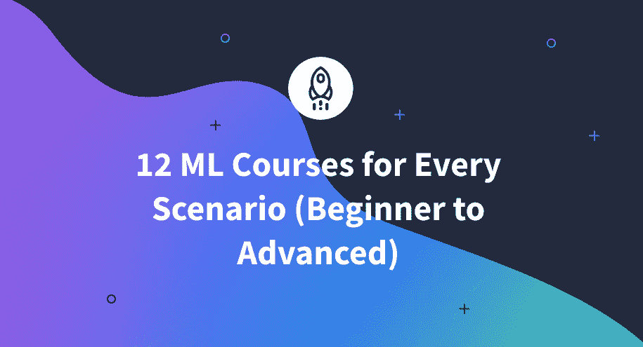
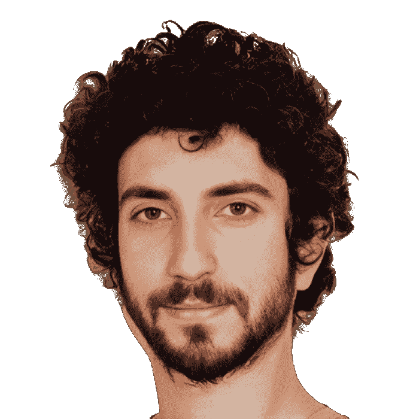
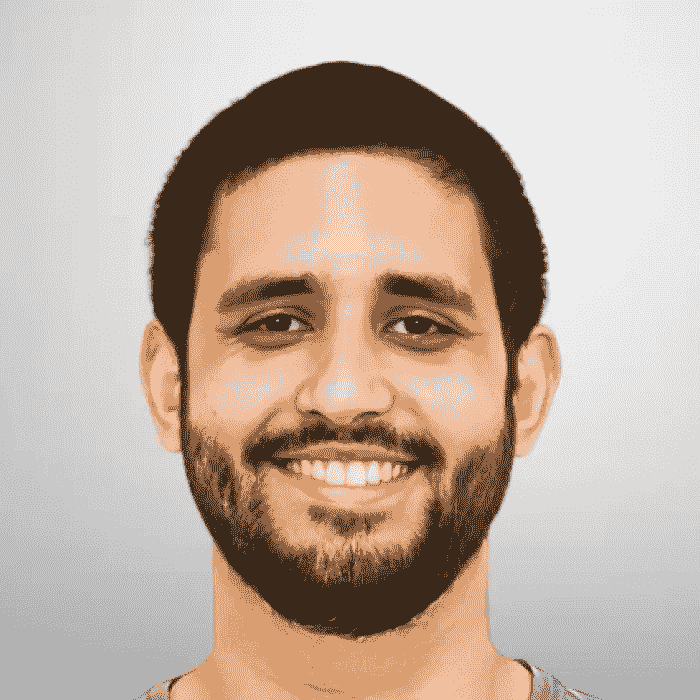

# 每种场景 12 毫升课程(初级到高级)

> 原文：<https://www.dataquest.io/blog/best-machine-learning-courses/>

December 5, 2022

在接近机器学习时，每个人都有不同的知识和技能水平。有几十个，如果不是几百个，机器学习课程，找到正确的一个可能是困难的。理想的课程应该做到以下几点:

*   尽量减少冗余知识的数量
*   最大限度地享受新话题
*   提供真实的编程示例
*   通过作品集项目提升你的简历

本指南将帮助您根据现有知识和对编程的熟悉程度找到最佳的机器学习课程。我们分析了基于 14 个独特变量的顶级课程，得出了以下列表。

### 以下是 2022 年最好的机器学习课程总结:

*   **最适合初学者:** [Dataquest 的 Python 中的机器学习](https://www.dataquest.io/path/machine-learning-in-python/)
*   **最适合中级学习者:** [机器学习专精](https://www.coursera.org/specializations/machine-learning-introduction)
*   **最适合高级学习者:** [用 Python 进行机器学习:从线性模型到深度学习](https://www.edx.org/course/machine-learning-with-python-from-linear-models-to)
*   **最佳免费课程:** [谷歌的机器学习速成班](https://developers.google.com/machine-learning/crash-course/)
*   **最佳在线机器学习训练营:** [编码道场的机器学习训练营](https://www.codingdojo.com/data-science-bootcamp-ml-python-part-time)
*   **最佳现场机器学习训练营:** [哥伦比亚工程数据分析训练营](https://bootcamp.cvn.columbia.edu/data/landing-full/)
*   **最适合数据科学家:** [Dataquest 的数据科学家在 Python 途径](https://www.dataquest.io/path/data-scientist/)
*   **最适合音乐人和艺术家:** [适合音乐人和艺术家的机器学习](https://www.kadenze.com/courses/machine-learning-for-musicians-and-artists/info)

## **最适合初学者**

### [Dataquest 在 Python 中的机器学习](https://www.dataquest.io/path/machine-learning-in-python/)

Dataquest 为希望在数据科学领域发展职业生涯的初学者提供了最佳课程。该课程为学习有监督和无监督的机器学习算法提供了基础。

涵盖的主题包括线性回归，逻辑回归，k-均值聚类，决策树，等等。每个主题都有必要的细节，为你解决现实世界的问题做好准备。

最重要的是，这门课程允许你直接开始写代码。每一课都配有一个真实世界的项目，让你建立自己的投资组合，向未来的雇主展示，并巩固你的知识基础。

您将参与的项目包括:

*   使用线性回归模型预测保险成本
*   使用逻辑回归对心脏病进行分类
*   使用就业数据确定生产率阈值

该课程包括一个最终的顶点项目，由专家评审，以完善你的作品集。

以下是我们对该课程的详细分析:

<figure class="wp-block-table">

| **价格:**$ 399/年，$ 49/月(提供折扣) | **彻底性:**机器学习的完整介绍，包括简历制作的组合项目 |
| **前期费用:**免费开始 | **特长:**监督和非监督算法
Python 编程 |
| **评分:** 4.8 (359 条评论) | **所需前提:**Python 基础知识
基础数学概念 |
| **预计持续时间:** 2 个月(每周 10 小时) | **定速:**自定速 |
| **认证项目:**是 | **项目数量:** 7 |
| 注册学生: 400 人 | **退款选项:**如果您在完成职业道路后不满意，可以退款 |
| **学习风格:**编码模块和指导项目 | **职业服务:**完成认证和强大的社区支持 |

</figure>

学生推荐信

<figure class="wp-block-table">

|  | “Dataquest 实际上让你思考并运用你的技能。你真的不需要在训练营上花 1 万美元。”**—米格尔·库托** |

</figure>

<figure class="wp-block-table">

|  | “Dataquest 上的学习路径令人难以置信。你不用猜你接下来该学什么。”**—奥特维奥·西尔韦拉** |

</figure>

<figure class="wp-block-table">

|  | "我无法相信复杂的材料在 Dataquest 上是如此简单明了."**—维多利亚·乔拉耶娃** |

</figure>

### [机器学习 A-Z:数据科学中的 Python&R](https://www.udemy.com/course/machinelearning)

对于希望学习如何在 Python 或 r 中使用机器学习的初学者来说，这是一门非常棒的课程。该课程直接教授不同的机器学习算法和概念，包括支持向量回归、自然语言处理和深度学习。

该课程提供了视频和测验的组合形式，让您在学习过程中检查自己的理解情况。你将完成几个实践练习，这些练习与你将要学习的材料是高度互补的。

以下是我们对该课程的详细分析:

<figure class="wp-block-table">

| 价格: $84.99 | **彻底:**机器学习算法的彻底介绍 |
| **前期费用:**全额支付 | **特长:**监督和非监督算法
自然语言处理
Python 和 R 编程 |
| **评分:** 4.5 (163，675 条评论) | **所需前提:**Python 和 R 基础数学概念 |
| 预计持续时间: 42.5 小时 | **定速:**自定速 |
| **认证项目:**是 | 项目数量: 0 |
| 注册学生人数:906，661 人 | **退款选项:**30 天内退款 |
| **学习方式:**视频讲座、文章和测验 | **职业服务:**结业证书 |

</figure>

> 对于想要了解机器学习所有内容的初学者来说，这是一门令人惊叹的课程。感谢导师(哈德林·德·庞特维斯和基里尔·叶列缅科)清晰地解释了它，并使它易于理解。我希望这些知识能帮助我发展自己的公司，推动技术进步，并造福他人。
> 
> <cite>**—努曼阿姆里姆**</cite>

## **最佳免费课程**

### [谷歌的机器学习速成班，采用 tensor flow API](https://developers.google.com/machine-learning/crash-course/)

这个谷歌课程对于希望学习机器学习的初学者和希望复习的有经验的数据科学家来说都很棒。该课程首先询问您的经验水平，然后推荐特定资源以实现最大效率(智能机器学习课程！).

该课程包括 25 节课，需要 15 个小时完成，包括带有交互式可视化的真实案例研究。此外，你还将获得谷歌内部机器学习框架 Tensorflow 的实践经验。

本课程高度浓缩并消除了核心概念，因此需要进一步研究以更深入地理解所涵盖的主题。

课程亮点:

*   来自谷歌研究人员的讲座
*   访问现实世界应用的配套 Kaggle 数据集
*   洞察关键的机器学习概念，包括损失、梯度下降和神经网络

以下是我们对该课程的详细分析:

<figure class="wp-block-table">

| **价格:**免费 | **彻底性:**核心机器学习概念的高级概述 |
| **前期费用:**无 | **特长:**用 Tensorflow神经网络进行 Python 编程 |
| **评级:**不公开 | **所需前提:**Python 基础
基础数学
微积分(针对高级题目) |
| **预计持续时间:** 15 小时 | **定速:**自定速 |
| **认证项目:**否 | **项目数量:**无 |
| **注册学生:**非公立 | **退款选项:**不可用(免费课程) |
| 学习风格: 25 节课，30+练习，来自谷歌研究人员的讲座 | 职业服务:无 |

</figure>

### [Kaggle 的机器学习入门](https://www.kaggle.com/learn/intro-to-machine-learning)

Kaggle 是互联网上访问原始数据的最佳平台，并通过赞助的比赛来测试您的数据科学技能。

这门课程是 Kaggle 对一切数据科学的介绍，完全免费。该材料高度简洁，可以在 3 小时内完成，并将向您介绍如何使用 Kaggle 的平台。

本课程将介绍基本的数据探索、欠拟合和过拟合模型、随机森林，并最终让你为竞争做好准备。虽然不是很长，但该课程是对 Kaggle 平台的一个很好的介绍，对于任何有抱负的机器学习专家或数据科学家来说，这都是一个很好的资源。

以下是我们对该课程的详细分析:

<figure class="wp-block-table">

| **价格:**免费 | **彻底性:**机器学习概念的高级概述 |
| **前期费用:**无 | **特长:**Kaggle 的编程平台 |
| **评级:**不公开 | **必备先决条件:**Python 基础基础数学概念 |
| **预计持续时间:** 3 小时 | **定速:**自定速 |
| **认证项目:**否 | 项目数量: 0 |
| **注册学生:**非公立 | **退款选项:**不可用(免费课程) |
| **学习方式:** 7 课 | 职业服务:无 |

</figure>

## **中级学习者最佳**

### [机器学习专业化](https://www.coursera.org/specializations/machine-learning-introduction)

该计划由三门课程组成:

*   监督机器学习:回归和分类
*   高级学习算法
*   无监督学习、推荐器和强化学习

对于之前有机器学习知识的人来说，这是一门很棒的课程，它涵盖了广泛的主题，会让你感觉像个专家。

课程从监督机器学习开始，你将学习线性和逻辑回归。从那里，您将进入更高级的算法，并学习如何使用 Tensorflow 构建神经网络。最后，您将完成无监督学习，以执行聚类和异常检测，并构建深度强化学习模型。

Python 实践包括:

*   用 NumPy 和 scikit-learn 构建机器学习模型
*   用张量流训练神经网络
*   用协同过滤方法构建推荐系统
*   构建深度强化学习模型

Coursera 提供了这个项目的付费订阅版本，它允许你获得一个结业证书，等待项目的完成和及格分数。或者，你可以免费旁听课程，但你将没有资格获得证书。

以下是我们对该课程的详细分析:

<figure class="wp-block-table">

| **价格:**免费；Coursera Plus(每月 39 美元) | **透彻:**对核心机器学习概念的透彻概述 |
| **前期费用:**免费试用(7 天) | **特长:**Python 编程用 Tensorflow监督和非监督算法 |
| **评分:**4.9(6013 条评论) | **必备前提:** Python 基础知识 |
| **预计持续时间:** 3 个月(每周 9 小时) | **定速:**自定速 |
| **认证项目:**是 | **项目数量:** 1 |
| 注册学生人数:98393 人 | **退款选项:**付款后 14 天内退款 |
| 学习方式:视频讲座、交互式编码练习和一个期末项目 | **职业服务:**技能展示证书 |

</figure>

学生推荐信

<figure class="wp-block-table">

|  | “我迷上了课程中的一切，从课程内容和助教反馈，到 meetup 活动和教授的 Twitter 信息。”**—泽山大学** |

</figure>

<figure class="wp-block-table">

|  | “事实是我热爱学习——我总是在寻找新的学习机会。Coursera 上的内容质量总是超出我的预期。”**—娜塔莉·h .** |

</figure>

<figure class="wp-block-table">

|  | “能够尽可能多地学习对我来说很重要。我在 Coursera 上的课程让我对未来充满信心和希望。”**—理查德·b .** |

</figure>

### 佐治亚理工学院的机器学习

这门课程是乔治亚理工学院在线硕士课程的一部分，通过 Udacity 免费提供！该课程是研究生水平的课程，有一些崇高的先决条件，但提供了对几个核心机器学习概念的深入研究。

在导师 Michael Littman、Charles Isbell 和 Pushkar Kolhe 的带领下，您将通过视频讲座和作业探索有监督、无监督和强化学习的概念。此外，你还将获得马尔可夫决策过程和信息论的介绍。

这门课程也是 Udacity 的 NanoDegree 计划的一部分，该计划收集了数据科学和机器学习相关的课程，可以通过付费订阅来完成。

以下是我们对该课程的详细分析:

<figure class="wp-block-table">

| **价格:**免费；1077 美元(纳米学位课程) | **彻底性:**详细的课程侧重于监督、非监督和强化学习 |
| **前期费用:**免费开始 | **专业:** Python 编程有监督、无监督和强化学习信息论 |
| **评级:**不公开 | **所需先决条件:**
概率论、线性代数和统计学
熟悉任何编程语言
熟悉神经网络 |
| **预计持续时间:** 4 个月 | **定速:**自定速 |
| **证书项目:**否(带付费选项的纳米学位) | 项目数量: 0 |
| **注册学生:**非公立 | **退款选项:**在第一个月的订购日的前两天内退款 |
| 学习方式:视频讲座、作业、互动小测验 | **职业服务:**未提供服务 |

</figure>

## **最适合高级学习者**

### [用 Python 进行机器学习:从线性模型到深度学习](https://www.edx.org/course/machine-learning-with-python-from-linear-models-to)

本课程是统计和数据科学 MITx MicroMasters 项目的一部分，需要精通 Python 编程和大学水平的多变量微积分。

本课程提供从线性回归到神经网络和强化学习等主题的高级教学。本课程提供 Python 实践示例，学生将能够完成几个项目，包括:

*   自动评论分析器
*   基于神经网络的数字识别
*   强化学习

该课程由麻省理工学院的雷吉娜·巴兹莱教授、汤米·雅克拉教授和麦贝夷·朱教授授课，共 15 周。这门课和其他三门课组成了麻省理工学院完整的微硕士课程。要获得学位，你必须成功完成所有四门课程，并通过监考考试。不幸的是，这门课程要到 2023 年 2 月才开设，但开设时它的价格非常值得！

以下是我们对该课程的详细分析:

<figure class="wp-block-table">

| **价格:**免费(限制访问)；300 美元(完全访问) | **彻底性:**深度机器学习算法，用于精通 ML |
| **前期费用:**免费开始 | **特长:**Python 编程监督学习、深度学习、强化学习 |
| **评分:**4.9(6013 条评论) | **必要先决条件:**对 Python 编程和概率论有很好的理解大学水平的单变量/多变量微积分
向量和矩阵 |
| **预计工期:**15 周，每周 10-14 小时
2023 年 2 月 1 日开工 | **起搏:**教师起搏 |
| **认证项目:**是 | **项目数量:** 3 |
| 注册学生人数:174，710 人 | **退款选项:**自购买之日起 14 天内退款 |
| **学习方式:**视频授课、分级练习、考试(仅限付费版) | **职业服务:**证书完成后付费订阅 |

</figure>

### [生产中的机器学习简介](https://www.coursera.org/learn/introduction-to-machine-learning-in-production)

这个课程来自于 DeepLearning。人工智能，由斯坦福大学的吴恩达创立。本课程专为对机器学习有透彻理解的个人而设计，介绍了机器学习模型在生产环境中的实际部署。

该课程分为三周的增量，重点关注机器学习开发生命周期、选择和训练模型，以及使用具有现实世界约束的不同数据类型。

本课程与列表中的其他课程不同，它提供了作为数据科学家的日常操作的实际示例。你将学习机器学习的基本概念和现代软件开发的功能专业知识。

以下是我们对该课程的详细分析:

<figure class="wp-block-table">

| **价格:**$ 49/月，免费试用 | **彻底:**为工作成功做好充分准备 |
| **前期费用:**免费试用(7 天) | **专业:**
生产质量代码 |
| **评分:** 4.8 (2，155 条评论) | **所需先决条件:**AI/深度学习的一些知识中级了解 Python 编程经验具备任何深度学习框架(PyTorch，Keras，或 TensorFlow) |
| **预计持续时间:** 12 小时 | **定速:**自定速 |
| **认证项目:**是 | 项目数量: 0 |
| 注册学生人数:66，698 人 | **退款选项:**自购买之日起 14 天内退款 |
| 学习方式:视频讲座、交互式编码练习和一个期末项目 | **职业服务:**结业证书(付费订阅) |

</figure>

> 精品课程；你学习了 MLOps 的基本原理。如果你想了解机器学习算法在生产中的生命周期，这是一门推荐课程。
> 
> <cite>**—DG**</cite>

> 我喜欢对数据质量重要性的认可。机器学习不仅仅是训练模型。只有转移到现实生活中的数据，才能获得真正的好处
> 
> <cite>**—萨**</cite>

> 贯穿 ML 生命周期的实用且结构合理的建议。来自现实世界的问题和经验的例子使建议更加具体，并有助于反思你自己的问题。
> 
> <cite>**—DC**</cite>

## **最佳在线机器学习训练营**

### [编码 Dojo 的数据科学训练营](https://www.codingdojo.com/data-science-bootcamp-ml-python-part-time)

Coding Dojo 提供了一个为期 16 周(或 20 周)的训练营，深入研究数据科学和 Python 机器学习的基础知识。该计划向您介绍数据准备，分析和可视化，以及如何正确地将机器学习算法应用于现实世界的例子。

这个项目的好处包括建立一个投资组合，向潜在的雇主展示你的新技能和一个结业证书。本课程是 Python 的实践课程，将带您了解各种主题，包括回归模型、数据库编程、无监督学习和数据可视化。

该课程价格不菲，但具有很大的灵活性，毕业后 180 天内的就业率高达 83.8%。

以下是我们对该课程的详细分析:

<figure class="wp-block-table">

| **价格:**11995 美元(16 周)；13 995 美元(20 周) | 彻底性:获得工作所需的一切 |
| **前期费用:**全额支付(提供奖学金和学费资助选项) | **特长:**Python 编程
监督/非监督学习
数据操纵与可视化 |
| **评级:**不公开 | **所需先决条件:**Python 基础知识 |
| **预计持续时间:** 16-20 周，每周 20 小时 | **起搏:**教师起搏 |
| **认证项目:**是 | **项目数量:**几个 |
| **注册学生:**非公立 | **退款选项:**在第一天上课前退款(减去 100 美元管理费) |
| **学习方式:**视频讲座、作业、项目 | 职业服务:
求职、简历准备和模拟面试 |

</figure>

## **最佳面对面机器学习训练营**

### [哥伦比亚工程数据分析训练营](https://bootcamp.cvn.columbia.edu/data/landing-full/)

哥伦比亚大学提供了一个完全沉浸式的 24 周数据分析训练营，为您在数据科学领域的职业生涯做准备。该课程涵盖广泛的主题，包括 SQL、中级 Excel、机器学习和软件开发最佳实践。

该计划要求每周工作 3 天，允许个人兼职完成所有要求。课程的亮点是项目演示日，学生可以向当地专业人士展示他们的顶点项目。

虽然出勤率很高，但你将受益于广泛的职业服务来帮助你被录用。你会被指派一名专门的蔻驰个人资料和职业指导，他们会帮你润色简历，为面试做准备。

以下是我们对该课程的详细分析:

<figure class="wp-block-table">

| 价格:14745 美元 | 彻底性:获得工作所需的一切 |
| **前期费用:**全额支付(提供学费融资选项) | **专业:**Python 与 Javascript 编程
SQL 数据库与 ExcelMachine 学习 |
| **评级:**不公开 | **必备条件:**Python 基础基础数学技能
两年商业、管理、金融、统计或相关领域工作经验 |
| 预计持续时间: 24 周，每周 3 天 | **起搏:**教师起搏 |
| **认证项目:**是 | **项目数量:**几个 |
| **注册学生:**非公立 | **退款选项:**在计划的第一个日历周内可用(初始存款不可退款) |
| **学习方式:**现场讲座、编码作业、顶点项目 | **职业服务:**专门的个人资料蔻驰和职业总监组合评论、简历和社交媒体个人资料支持、职业内容和实践课程。
 |

</figure>

## **最适合数据科学家**

### [Dataquest 的数据科学家在 Python 途径](https://www.dataquest.io/path/data-scientist/)

Dataquest 是进入数据科学职业的最佳选择。数据科学家途径提供了一个全面的课程，包括学习统计和机器学习框架，使用数据库，设计惊人的可视化。

职业道路包括一系列课程，将带您从初学者到完全胜任特定数据科学职位。这些职业道路就像一个价值 10，000 美元的训练营一样全面，但成本只是它的一小部分。完成课程后，您将有一个全面的项目组合展示给潜在的雇主，并访问 Dataquest 的专家和专业人士社区。

以下是我们对该课程的详细分析:

<figure class="wp-block-table">

| **价格:**$ 399/年，$ 49/月(提供折扣) | 彻底性:获得工作所需的一切 |
| **前期费用:**免费开始 | **特长:**Python 编程 SQL 和数据库编程机器学习包罗万象的数据科学技能集 |
| **评分:** 4.8 (359 条评论) | **所需先决条件:**无 |
| **预计持续时间:** 9 个月(每周 10 小时) | **定速:**自定速 |
| **认证项目:**是 | 项目数量: 28 |
| 注册学生人数:271，400 人 | **退款选项:**完成后如果不满意可以使用 |
| **学习风格:** 36 门课程，28 个项目 | **职业服务:**完成认证和强大的社区支持 |

</figure>

> 它们就像真的一样。Dataquest 向您展示您需要学习的内容，然后帮助您应用这些内容。
> 
> <cite>——**埃迪·柯克兰**</cite>

## **最适合音乐家和艺术家**

### [面向音乐家和艺术家的机器学习](https://www.kadenze.com/courses/machine-learning-for-musicians-and-artists/info)

我们列表中的最后一项是为音乐爱好者开设的课程。伦敦大学的机器学习课程与我们名单上的其他课程相比，采取了一种非常不同的角度，专注于可以用来理解人类手势、音乐音频和其他实时数据的机器学习技术。

除了教授传统的机器学习方法，如分类和回归，您还将学习如何将您的机器学习工具连接到常见的数字艺术工具，如 Max/MSP 和 Unity 3D。

以下是我们对该课程的详细分析:

<figure class="wp-block-table">

| **价格:**$ 20/月 | **彻底性:**将机器学习应用于艺术问题的能力 |
| **前期费用:** 1 次免费 | 专业:专注于数字艺术整合的机器学习 |
| **评分:** 5.0 (89 条评论) | **所需先决条件:**熟悉数字艺术工具(Wekinator)访问传感器(操纵杆、网络摄像头、麦克风等。) |
| **预计持续时间:** 7 场，每场 8 小时 | **定速:**自定速 |
| **认证项目:**是 | 项目数量: 0 |
| **注册学生:**非公立 | **退款选项:**不提供退款 |
| **学习风格:**视频和作业 | **职业服务:**结业证书 |

</figure>

> 对于任何对交互设计的未来感兴趣的人来说，这是一门很棒的课程。
> 
> <cite>**—安东尼奥·里佐**</cite>