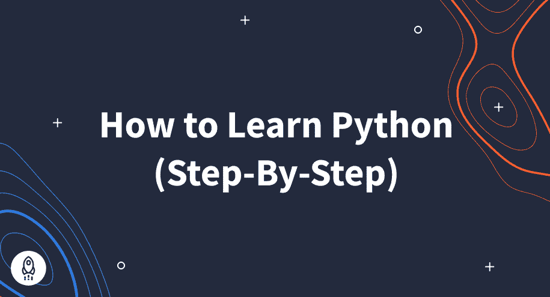
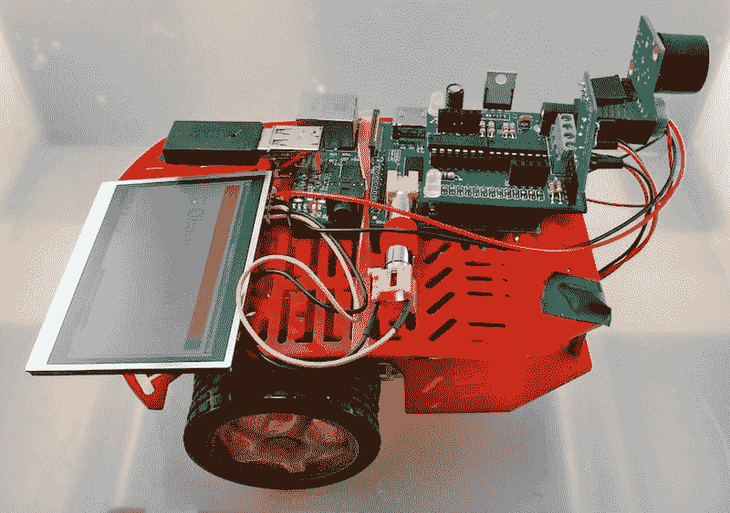

# 2023 年如何学习 Python(循序渐进)

> 原文：<https://www.dataquest.io/blog/learn-python-the-right-way/>

December 23, 2022

学习 Python 对我来说极其困难，但也不尽然。

十多年前，我是一名大学毕业生，拥有历史学位，前途渺茫。然后，我成为了一名成功的机器学习工程师、数据科学顾问，现在是 Dataquest 的 CEO。

然而，这并不是一夜成功的故事。我学习 Python 的旅程漫长、低效，而且经常令人沮丧。

如果我能再做一次，我会按照我将在这篇文章中与你分享的步骤去做。它会加速我的职业生涯，节省数千小时的浪费时间，并避免很多压力。

本指南将向您展示如何以正确的方式学习 Python。

## 第一步:了解大多数人失败的原因

学习 Python 并不一定很难。事实上，如果你使用正确的资源，这实际上很容易(也很有趣)。

### 大多数学习资源的问题是

很多课程让学习 Python 变得更加困难。为了说明我的观点，我给你举一个个人的例子。

当我刚开始学习 Python 时，我想做让我兴奋的事情，比如制作网站。不幸的是，我所学的课程迫使我在语法上花了几个月的时间。太痛苦了。

在整个课程中，Python 代码看起来仍然很陌生，令人困惑。它就像一种外星语言。毫不奇怪，我很快失去了兴趣。

遗憾的是，大多数 Python 教程都与此非常相似。他们假设在开始做任何有趣的事情之前，您需要学习所有的 Python 语法。大多数人放弃有什么奇怪的吗？

与其在这些平凡的任务上浪费时间，不如体验一下 Python 真正的刺激。想想分析数据，建立一个网站，或者创造一个具有人工智能的自主无人机！

### 更简单的方法

经过多次失败的尝试，我找到了一种更适合我的方法。事实上，我相信这是学习 Python 编程的最好方法。

**首先，我花尽可能少的时间去记忆 Python 语法**。然后，我带着我学到的东西，立即一头扎进一个我真正感兴趣的项目。

遵循下面列出的步骤不仅更有趣，还能让你以惊人的速度学习！

事实上，这种更好的学习方式是我创建 Dataquest 的原因。我们的数据科学课程将让您用最少的时间做枯燥的事情，立即构建项目。点击这里查看我们的课程。**报名免费**。

## **第二步:确定你的动力**

好消息是:只要有正确的动机，任何人都可以熟练掌握 Python。

作为一个初学者，当我试图记忆语法时，我努力让自己保持清醒。然而，当我需要应用 Python 基础知识来构建一个有趣的项目时，我高兴地熬了一整夜来完成它。

这里的教训是什么？你需要找到激励你的东西，并为此感到兴奋！首先，找到一两个你感兴趣的领域:

*   数据科学/机器学习
*   移动应用
*   网站
*   计算机科学
*   比赛
*   数据处理和分析
*   硬件/传感器/机器人
*   自动化工作任务

<figure class="wp-block-image">

<figcaption class="wp-element-caption">Yes, you can make robots using the Python programming language! From the Raspberry Pi Cookbook.</figcaption>

</figure>

## **第三步:快速学习基本语法**

我知道，我知道。我说过我们会在语法上花尽可能少的时间。不幸的是，这一步不能完全跳过。

这里有一些很好的资源，可以帮助您学习 Python 基础知识，而不会扼杀您的学习动力:

*   [Dataquest——Python for Data Science 基础课程](https://www.dataquest.io/course/python-for-data-science-fundamentals/) —我创办 Data quest 是为了让学习 Python 和数据科学更容易。Dataquest 在学习数据科学的背景下教授 Python 语法。例如，您将在分析天气数据时学习基本的 Python 命令。
*   [艰难地学习 Python](https://learnpythonthehardway.org/)——这本书教授从基础到更深入程序的 Python 概念。
*   [Python 教程](https://docs.python.org/3/tutorial/) —主要 Python 站点上的教程。

我怎么强调都不为过:**尽你所能学习语法，然后继续前进。理想情况下，你会在这个阶段花上几周时间，但不会超过一个月。**

你越早开始做项目，你学得就越快。如有必要，您可以随时回头参考该语法。

快速说明:学 Python 3，[不学 Python 2](https://www.dataquest.io/blog/python-2-or-3/) 。不幸的是，网上很多“学习 Python”的资源还是教 Python 2。但是 Python 2 是[不再支持](https://www.python.org/doc/sunset-python-2/)，所以 bug 和安全漏洞不会被修复！

## **第四步:制作结构化项目**

一旦你学会了基本的 Python 语法，就开始做项目吧。马上应用你的知识会帮助你记住你所学的一切。

最好从结构化的项目开始，直到你觉得足够舒服可以自己做项目。在 Dataquest，我们战略性地将结构化项目纳入了几乎所有的 [Python 课程](https://www.dataquest.io/python-for-data-science-courses/)。这样，你可以立即应用你所学到的东西。

下面是一些实际 Dataquest 项目的例子。哪个点燃了你的好奇心？

*   [越狱](https://www.dataquest.io/course/for-loops-and-conditional-statements-in-python/):大多数直升机越狱发生在何时何地？通过这个针对 Python 初学者的指导性项目来寻找答案。
*   [员工离职调查](https://www.dataquest.io/course/python-datacleaning/):该结构化项目专为具备中级技能的 Python 用户设计，让您清理数据集，为澳大利亚昆士兰州教育部的利益相关者找到答案。
*   数据清理和可视化星球大战风格:星球大战的粉丝们不会想错过这个使用电影中真实数据的结构化项目。

### **结构化项目的灵感**

说到结构化项目，没有一个合适的起点。对你来说最好的资源将取决于你的动机以及你对 Python 编程的目标。

你对通用数据科学还是机器学习感兴趣？你想建立一个特定的应用程序或网站吗？以下是一些推荐的灵感资源，按类别分类:

### **数据科学/机器学习**

*   [Dataquest](https://www.dataquest.io/) —以互动方式教你 Python 和数据科学。您分析了一系列有趣的数据集，从中情局文件到 NBA 球员数据。你最终会构建复杂的算法，包括神经网络和决策树。
*   [Scikit-learn 文档](https://scikit-learn.org/stable/documentation.html) — Scikit-learn 是主要的 Python 机器学习库。它有一些很棒的文档和教程。
*   这是哈佛大学教授 Python 数据科学的课程。他们在网上有一些他们的[项目和其他材料](https://github.com/cs109/content)。

### **手机应用**

*   Kivy 是一个让你用 Python 制作移动应用的工具。他们有入门指南。

### **网站**

*   [Bottle 教程](https://bottlepy.org/docs/dev/tutorial_app.html) — Bottle 是 Python 的另一个 web 框架。以下是入门指南。
*   如何与 Django 合作——Django 使用指南，一个复杂的 Python web 框架。

### **游戏**

*   Pygame 教程 —这是 Pygame 的教程列表，这是一个流行的制作游戏的 Python 库。
*   [用 Pygame 制作游戏](https://www.amazon.com/Making-Games-Python-Pygame-Sweigart/dp/1469901730)——一本教如何用 Python 制作游戏的书。

用 Python 发明你自己的电脑游戏——这本书将带你了解如何用 Python 制作几个游戏。

<figure class="wp-block-image">

<figcaption class="wp-element-caption">*An example of a game you can make with Pygame. This is Barbie Seahorse Adventures 1.0, by Phil Hassey.*
</figcaption>

</figure>

### **硬件/传感器/机器人**

*   [使用 Python 和 Arduino](https://www.toptechboy.com/using-python-with-arduino-lessons/) —了解如何使用 Python 控制连接到 Arduino 的传感器。
*   [使用 Raspberry Pi 学习 Python](https://www.raspberrypi.org/blog/learning-python-with-raspberry-pi/)—使用 Python 和 Raspberry Pi 构建硬件项目。
*   [使用 Python 学习机器人学](https://www.amazon.com/dp/B00YEVZ6UK) —学习如何使用 Python 建造机器人。
*   [树莓派食谱](https://www.amazon.com/Raspberry-Pi-Cookbook-Simon-Monk/dp/1449365221) —了解如何使用树莓派和 Python 制作机器人。

### **自动化工作的脚本**

*   [使用 Python 自动化枯燥的工作](https://www.amazon.com/gp/product/1593275994) —了解如何使用 Python 自动化日常任务。

项目至关重要。它们拓展你的能力，帮助你学习新的 Python 概念，并允许你向潜在雇主展示你的能力。一旦你完成了一些结构化的项目，你就可以继续做你自己的项目了。

## **第五步:独立完成 Python 项目**

在你完成几个结构化的项目后，是时候加快进度了。你可以通过从事独立的 Python 项目来加速你的学习。

**这里是关键:**从小项目开始。完成一个小项目比着手一个永远无法完成的大项目要好。

### **发现迷人 Python 项目的 8 个技巧**

我知道找到一个好的 Python 项目可能会令人望而生畏。以下是找到有趣项目的一些提示:

*   扩展您之前正在处理的项目，并添加更多功能。
*   查看我们为初学者准备的 [Python 项目列表](https://www.dataquest.io/blog/python-projects-for-beginners/)。
*   去你所在地区的 Python [meetups](https://www.meetup.com/) 网站，寻找从事有趣项目的人。
*   寻找开源软件包来为之做出贡献。
*   看看当地是否有非营利组织在寻找志愿者开发者。
*   找到其他人已经完成的项目，看看你是否可以扩展或修改它们。Github 是一个很好的起点。
*   浏览别人的博客文章，找到感兴趣的项目创意。
*   想想能让你的日常生活变得更轻松的工具。然后，建造它们。

### **17 Python 项目创意**

需要更多灵感？这里有一些额外的想法来激发你的创造力:

#### **数据科学/机器学习项目创意**

*   按州显示选举投票的地图
*   预测当地天气的算法
*   预测股票市场的工具
*   自动总结新闻文章的算法

<figure class="wp-block-image">

<figcaption class="wp-element-caption">*Try making a more interactive version of this map from RealClearPolitics.*
</figcaption>

</figure>

#### **手机 App 项目创意**

*   追踪你每天行走距离的应用程序
*   向你发送天气通知的应用程序
*   基于位置的实时聊天

#### **网站项目创意**

*   一个帮助你计划每周膳食的网站
*   允许用户评论视频游戏的网站
*   笔记平台

#### **Python 游戏项目创意**

*   一款基于地理位置的手机游戏，你可以在其中占领领地
*   一种通过编程解决谜题的游戏

#### **硬件/传感器/机器人项目创意**

*   远程监控你房子的传感器
*   更智能的闹钟
*   探测障碍物的自动驾驶机器人

#### **工作自动化项目创意**

*   自动化数据输入的脚本
*   从网络上抓取数据的工具

关键是挑一件事去做。如果你太执着于寻找完美的项目，你就有可能永远不会开始一个项目。

我的第一个独立项目包括将我的自动论文评分算法从 R 移植到 Python。它最终看起来并不漂亮，但它给了我一种成就感，并让我开始了建设技能的道路。

记住:障碍是不可避免的。当你构建你的项目时，你*会*在你的代码中遇到问题和错误。这里有一些资源可以帮助你。

### **3 个摆脱困境的最佳 Python 资源**

不要让挫折使你气馁。相反，请查看以下资源:

*   StackOverflow —一个社区问答网站，人们在这里讨论编程问题。你可以在这里找到 Python 特有的问题。
*   任何有经验的程序员最常用的工具。在尝试解决错误时非常有用。[这里有一个](https://www.google.com/search?q=python+typerror)的例子。
*   [Python 文档](https://docs.python.org/3/) —查找 Python 参考资料的好地方。

## 第六步:继续做更难的项目

当你在独立项目中获得成功时，不断增加项目的难度和范围。学习 Python 是一个过程，你需要动力来完成它。

一旦你对你正在构建的东西完全满意了，是时候尝试更难的东西了。继续寻找挑战你的技能并推动你成长的新项目。

### **5 个掌握 Python 的提示**

当那个时刻到来时，这里有一些想法:

*   试着教一个新手如何构建你的项目。
*   问问你自己:你能扩展你的工具吗？它能处理更多的数据吗，或者它能处理更多的流量吗？
*   试着让你的程序运行得更快。
*   想象一下如何让你的工具对更多的人有用。
*   想象一下如何把你做的东西商业化。

## **与 Python 一起前进**

记住，Python 是不断发展的。世界上只有少数人能声称完全理解 Python。而这些就是创造它的人！

那会给你留下什么？在不断的学习和新项目的工作中磨练你的技能。

六个月后，你会发现自己回头看你的代码时会想到它有多糟糕。不要绝望！当你到了这一步，你就知道你走对了。

如果你是那种依靠最小的结构而茁壮成长的人，那么你就拥有了开始你的旅程所需要的一切。然而，如果你需要更多的指导，那么我们的课程可能会有所帮助。

我创建 Dataquest 是为了帮助人们快速学习，避免那些通常会让人放弃的事情。您将在几分钟内编写实际代码，并在几小时内完成真正的项目。

如果你想学习 Python 成为一名[商业分析师](https://www.dataquest.io/path/business-analyst/)、[数据分析师](https://www.dataquest.io/path/data-analyst/)、[数据工程师](https://www.dataquest.io/path/data-engineer/)或[数据科学家](https://www.dataquest.io/path/data-scientist/)，我们为你设计了职业道路，让你在几个月内从完全的初学者到工作就绪。或者，您可以先尝试一下，在这里试驾一下我们的[Python 入门课程](https://www.dataquest.io/course/introduction-to-python/)。

## **常见 Python 问题**

### **学 Python 难吗？**

学习 Python 肯定会很有挑战性。然而，如果你采取我在这里概述的一步一步的方法，你会发现这比你想象的要容易得多。

### **可以免费学习 Python 吗？**

有很多免费的 Python 学习资源。例如，在 Dataquest，我们有[几十个免费的 Python 教程](https://www.dataquest.io/python-tutorials-for-data-science/)。你可以[免费注册](https://app.dataquest.io/login?target-url=%2Fdashboard)我们的互动数据科学学习平台。

免费学习有一个缺点:为了有效地学习，你需要拼凑几个免费资源。这意味着你要花额外的时间研究下一步需要学什么以及如何学。

优质平台可能会提供更好的教学方法(如交互式浏览器内编码 Dataquest 提供的)。它们也节省了你寻找和建立自己的课程的时间。

### **可以从零开始学习 Python 吗(没有编码经验)？**

是的。Python 对于编程初学者来说是一门很棒的语言，因为你不需要有代码方面的经验就能掌握它。Dataquest 帮助没有编程经验的学生找到数据分析师、数据科学家和数据工程师的工作。

### **学习 Python 需要多长时间？**

学习一门编程语言有点像学习一门口语——你永远不会真正*完成*！那是因为语言在进化，所以总是有更多的东西要学！不过，你可以很快掌握编写简单但功能强大的 Python 代码。

做好工作准备需要多长时间？这取决于你的目标，你正在寻找的具体工作，以及你能投入多少时间来学习。

[我们在 2020 年调查的 Dataquest 学习者](https://www.dataquest.io/blog/dataquest-reviews-2020/)报告称，他们在不到一年的时间内达到了学习目标。**许多人在不到六个月的时间里就做到了。这还不包括每周不超过 10 小时的学习。**

### **怎样才能更快的学习 Python？**

找一个专门针对你想学习的技能(例如，游戏开发的 Python 或数据科学的 Python)教授 Python 的平台(或者为自己建立一个课程)。

这样，您就不会浪费时间去学习与日常 Python 工作无关的东西。

### **找工作需要 Python 认证吗？**

大概不会。在数据科学中，证书没有多大分量。雇主关心的是技能，而不是纸文凭。

翻译？一个充满 Python 代码的 GitHub 比一张证书重要得多。

### **应该学 Python 2 还是 3？**

Python 3，手到擒来。几年前，这还是一个争论的话题。一些极端分子甚至声称 Python 3 将[“杀死 Python”这还没有发生。今天，Python 3 无处不在。](https://learnpythonthehardway.org/book/nopython3.html)

### **Python 与数据科学/机器学习之外的相关吗？**

是的。Python 是一种流行且灵活的语言，在各种各样的环境中被专业地使用。

我们为数据科学和机器学习教授 Python。不过，您可以将 Python 技能应用到另一个领域。你会发现它被用于金融、网络开发、软件工程、游戏开发等等。

掌握一些 Python 的数据分析技能对于各种各样的其他工作也很有用。例如，如果您处理电子表格，那么使用 Python 有可能会做得更快更好。

Python 的影响力真的是无止境的。成为革命的一部分。准备好开始了吗？了解更多关于 Dataquest 如何帮助您[在线学习 Python](https://www.dataquest.io/path/python-basics-for-data-analysis/)的信息，并立即注册，没有任何风险。