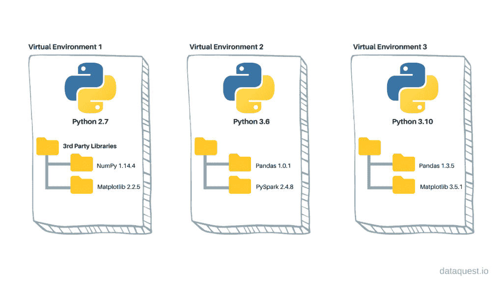

# Python 虚拟环境完全指南

> 原文：<https://www.dataquest.io/blog/a-complete-guide-to-python-virtual-environments/>

January 17, 2022

在本教程中，我们将学习 Python 虚拟环境、使用虚拟环境的好处以及如何在虚拟环境中工作。

完成本教程后，您将理解以下内容:

*   [什么是 Python 虚拟环境](#what-are-python-virtual-environments)
*   [在虚拟环境中工作的好处](#why-are-python-environments-important)
*   [如何创建、激活、停用和删除虚拟环境](#how-to-use-python-environments)
*   [如何在虚拟环境中安装软件包并在其他系统上复制它们](#how-to-install-packages-in-virtual-environments)
*   [如何在 VS 代码中使用 Python 虚拟环境](#use-python-virtual-environments-in-vs-code)

如果您需要在 Mac 上安装 Python，请参考[教程在 Mac 上安装和运行 Python](https://www.dataquest.io/blog/installing-python-on-mac/)。

注意:本教程主要面向 macOS 和 Linux 用户；然而，Windows 用户也应该能够跟随。

## 什么是 Python 虚拟环境？

Python 虚拟环境由两个基本组件组成:运行虚拟环境的 Python 解释器和包含安装在虚拟环境中的第三方库的文件夹。这些虚拟环境与其他虚拟环境隔离，这意味着对虚拟环境中安装的依赖关系的任何更改都不会影响其他虚拟环境或系统范围的库的依赖关系。因此，我们可以用不同的 Python 版本创建多个虚拟环境，加上不同的库或不同版本的相同库。

[](https://www.dataquest.io/wp-content/uploads/2022/01/python-virtual-envs1.webp)

上图展示了当我们创建多个 Python 虚拟环境时，您的系统上有什么。如上图所示，虚拟环境是一个包含特定 Python 版本、第三方库和其他脚本的文件夹树；因此，系统上的虚拟环境数量没有限制，因为它们只是包含一些文件的文件夹。

## 为什么 Python 虚拟环境很重要？

当我们在同一台机器上有不同的 Python 项目依赖于相同包的不同版本时，Python 虚拟环境的重要性就变得显而易见了。例如，想象一下使用 matplotlib 包的两个不同的[数据可视化项目，一个使用 2.2 版本，另一个使用 3.5 版本。这将导致兼容性问题，因为 Python 不能同时使用同一个包的多个版本。放大使用 Python 虚拟环境重要性的另一个用例是，当您在托管服务器或生产环境中工作时，由于特定的要求，您不能修改系统范围的包。](https://www.dataquest.io/blog/comical-data-visualization-in-python-using-matplotlib/)

Python 虚拟环境创建隔离的上下文来保持不同项目所需的依赖关系是独立的，因此它们不会干扰其他项目或系统范围的包。基本上，建立虚拟环境是隔离不同 Python 项目的最佳方式，尤其是当这些项目具有不同且相互冲突的依赖关系时。作为对新 Python 程序员的一条建议，永远为每个 Python 项目建立一个单独的虚拟环境，并在其中安装所有需要的依赖项——不要全局安装软件包。

## 如何使用 Python 虚拟环境

到目前为止，我们已经了解了什么是虚拟环境以及我们为什么需要虚拟环境。在教程的这一部分，我们将学习如何创建、激活和(一般来说)使用虚拟环境。我们开始吧！

### 创建 Python 虚拟环境

首先创建一个项目文件夹，并在其中创建一个虚拟环境。为此，打开终端应用程序，编写以下命令，然后按 return 键。

```
~ % mkdir alpha-prj
```

现在，使用`venv`命令在项目文件夹中创建一个虚拟环境，如下所示:

```
~ % python3 -m venv alpha-prj/alpha-venv
```

* * *

**注意**有两种工具可以设置虚拟环境，`virtualenv`和`venv`，我们几乎可以互换使用。`virtualenv`支持旧的 Python 版本，需要使用`pip`命令安装。相比之下，`venv`仅用于 Python 3.3 或更高版本，包含在 Python 标准库中，无需安装。

* * *

### 激活 Python 虚拟环境

要激活我们在上一步中创建的虚拟环境，请运行以下命令。

```
~ % source alpha-prj/alpha-venv/bin/activate
```

正如您在激活虚拟环境后所看到的，它的名称出现在终端提示符开始处的括号中。运行 which `python`命令是确保虚拟环境处于活动状态的另一种方式。如果我们运行这个命令，它会显示 Python 解释器在虚拟环境中的位置。让我们检查一下虚拟环境中的位置。

```
(alpha-venv) ~ % which python
/Users/lotfinejad/alpha-prj/alpha-venv/bin/python
```

很高兴知道虚拟环境的 Python 版本与用于创建环境的 Python 版本是相同的。让我们在虚拟环境中检查 Python 版本。

```
(alpha-venv) ~ % python —version
Python 3.10.1
```

由于我使用 Python 3.10 来设置虚拟环境，因此虚拟环境使用完全相同的 Python 版本。

### 在 Python 虚拟环境中安装包

我们现在处于一个隔离的虚拟环境中，默认情况下只安装了`pip`和`setup tools`。让我们通过运行`pip list`命令来检查虚拟环境中预安装的包。

```
(alpha-venv) ~ % pip list
Package    Version
---------- -------
pip        21.2.4
setuptools 58.1.0
```

在我们想用`pip`安装任何包之前，让我们把它升级到最新版本。因为我们是在虚拟环境中工作，所以下面的命令只在这个环境中升级`pip`工具，而不在其他虚拟环境或系统范围内升级。

```
(alpha-venv) ~ % alpha-prj/alpha-venv/bin/python3 -m pip install --upgrade pip
```

让我们重新运行`pip list`命令来查看变化。

```
(alpha-venv) ~ % pip list
Package    Version
---------- -------
pip        21.3.1
setuptools 58.1.0
```

很明显`pip`从版本 21.2.4 更新到了 21.3.1。现在，让我们将熊猫包安装到环境中。在安装软件包之前，您需要决定安装哪个版本。如果您要安装最新版本，只需使用以下命令:

```
(alpha-venv) ~ % python3 -m pip install pandas
```

但是如果你想安装软件包的一个特定版本，你需要使用这个命令:

```
(alpha-venv) ~ % python3 -m pip install pandas==1.1.1
```

现在，让我们看看如何告诉`pip`我们将安装 1.2 版本之前的任何版本的熊猫。

```
(alpha-venv) ~ % python3 -m pip install 'pandas<1.2'
```

另外，我们可以要求`pip`在 0.25.3 版本之后安装 pandas 包，如下所示:

```
(alpha-venv) ~ % python3 -m pip install 'pandas>0.25.3'
```

在前面的命令中，我们将包规范放在引号中，因为大于`>`和小于`<`符号在命令行 shell 中有特殊的含义。这两个命令都将安装符合给定约束的 pandas 包的最新版本。然而，最佳实践是用确切的版本号指定软件包。

让我们回顾一下环境中已安装的软件包列表。

```
(alpha-venv) ~ % pip list
Package         Version
--------------- -------
numpy           1.22.0
pandas          1.3.5
pip             21.3.1
python-dateutil 2.8.2
pytz            2021.3
setuptools      58.1.0
six             1.16.0
```

在安装 pandas 时，NumPy 和其他三个软件包会作为 pandas 软件包的先决条件自动安装。

### 再现 Python 虚拟环境

再现虚拟环境很常见。假设你的同事将要做你已经做了几周的同一个项目。她需要在她的系统上的虚拟环境中安装具有正确版本的完全相同的包。要创建相同的环境，首先需要使用`pip freeze`命令列出项目虚拟环境中安装的所有依赖项。

```
(alpha-venv) ~ % pip freeze
numpy==1.22.0
pandas==1.3.5
python-dateutil==2.8.2
pytz==2021.3
six==1.16.0
```

`pip freeze`的输出与`pip list`非常相似，但是它以正确的格式返回安装在一个环境中的包的列表，以使用项目所需的确切包版本来再现该环境。下一步是将包列表导出到`requirements.txt`文件中。为此，请运行以下命令:

```
(alpha-venv) ~ % pip freeze > requirements.txt
```

上面的命令在当前文件夹中创建一个名为`requirements.txt`的文本文件。`requirements.txt`文件包含所有的包和它们的确切版本。我们来看看文件内容。

```
~ % cat requirements.txt
numpy==1.21.5
pandas==1.3.5
python-dateutil==2.8.2
pytz==2021.3
six==1.16.0
```

干得好，您已经创建了一个`requirements.txt`，可以分发给您的同事，在她的系统上复制相同的虚拟环境。现在，让我们看看她应该做些什么来重现虚拟环境。这很简单。她首先需要创建一个虚拟环境，激活它，然后运行`pip install -r requirements.txt`命令来安装所有需要的包。

她将运行以下三个命令:

```
~ % python3 -m venv prj/venv                                       
~ % source prj/venv/bin/activate 
(venv) ~ % pip install -r requirements.txt
```

最后一个命令将`requirements.txt`中列出的所有包安装到您的同事正在创建的虚拟环境中。所以，如果她在自己这边运行`pip freeze`命令，她会得到与你相同版本的包。另一个要考虑的要点是，如果您要将项目添加到 Git 存储库中，千万不要将其虚拟环境文件夹添加到存储库中。你唯一需要添加的是`requirements.txt`文件。

* * *

**注意**一个 Python 项目文件夹包含了在虚拟环境中运行的源代码。另一方面，虚拟环境是一个包含 Python 解释器、包和类似于`pip`的工具的文件夹。因此，最佳实践是将它们分开，并且永远不要将项目文件放在虚拟环境文件夹中。

* * *

### 停用 Python 虚拟环境

一旦您完成了虚拟环境的工作，或者您想要切换到另一个虚拟环境，您可以通过运行以下命令来停用环境:

```
(alpha-venv) ~ % deactivate
```

### 删除 Python 虚拟环境

如果您想要删除虚拟环境，只需删除其文件夹，无需卸载。

```
~ % rm -rf alpha-prj/alpha-venv
```

## 如何在 Visual Studio 代码中使用 Python 虚拟环境

在这一节中，我们将介绍如何在 VS 代码中使用 Python 虚拟环境。首先，确保您已经创建并激活了虚拟环境。现在，在终端中导航到您的项目文件夹，并运行以下命令:

```
(alpha-venv) alpha-prj % code .
```

上面的命令将在 VS 代码中打开项目文件夹。如果上面的命令不起作用，打开 VS 代码，按 command + shift + P，打开命令面板，键入 shell 命令，选择*安装路径*中的‘代码’命令。现在，创建一个 Python 文件，并将其命名为`my_script.py`。最后一步是使用 Python: Select Interpreter 命令从命令面板中选择虚拟环境。为此，请按 Command + shift + P，键入 Python，并选择*选择解释器*。

Python: Select 解释器命令显示所有可用的环境。下图显示了我们需要选择的环境。

[](https://www.dataquest.io/wp-content/uploads/2022/01/python-3.10.1-screenshot.webp)

此时，如果您在 VS 代码中打开集成终端，您将看到虚拟环境是活动的，您可以在其中安装任何包。

* * *

在本教程中，我们学习了 Python 虚拟环境如何避免不同项目或系统范围的依赖关系之间的冲突。此外，我们还学习了如何通过在这些自包含环境之间切换来处理具有不同依赖关系的不同项目。