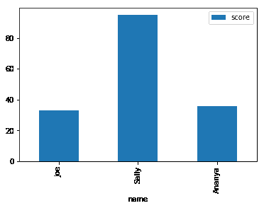

# 向带有熊猫的地块添加轴标签

> 原文：<https://www.dataquest.io/blog/adding-axis-labels-to-plots-with-pandas-and-matplotlib/>

December 20, 2017

熊猫绘图方法提供了一种简单的方法来绘制熊猫对象。不过，通常您会想要添加轴标签，这涉及到理解 Matplotlib 语法的复杂性。谢天谢地，有一种方法可以完全用熊猫来做这件事。让我们从导入所需的库开始:

```
import pandas as pd
import numpy as np
import matplotlib.pyplot as plt
```

接下来，我们将创建一个测试数据框架，其中包含一列名称和相应的测试分数:

```
df = pd.DataFrame({
    "name": ["Joe", "Sally", "Ananya"],
    "score": np.random.randint(0,100,size=3)})
df
```

|  | 名字 | 得分 |
| --- | --- | --- |
| Zero | 乔（人名） | forty-two |
| one | 俏皮话 | Thirty-seven |
| Two | 安纳亚 | Ninety-eight |

用 pandas 方法绘制这个数据帧很简单。我们可以使用 [DataFrame.plot.bar()方法](https://pandas.pydata.org/pandas-docs/stable/generated/pandas.DataFrame.plot.bar.html)来生成两行条形图。

```
df.plot.bar()
plt.show()
```


这给了我们立竿见影的效果，但要解读这个情节并不容易，因为我们看不到哪些分数属于哪个名字。如果你仔细观察，你可能会注意到当前的 x 轴标签是`0`、`1`和`2`。这些实际上对应于数据帧索引。通过使用 [`set_index()`方法](https://pandas.pydata.org/pandas-docs/stable/generated/pandas.DataFrame.set_index.html)将数据帧的索引设置为我们的名称，我们可以轻松地生成轴标签并改进我们的绘图。我们将使用`drop=True`来删除列，并使用`inplace=True`来代替将变量赋回给自身或一个新的变量名。

```
df.set_index("name",drop=True,inplace=True)
df
```

|  | 得分 |
| --- | --- |
| 名字 |  |
| --- | --- |
| 乔（人名） | Thirty-three |
| 俏皮话 | Ninety-five |
| 安纳亚 | Thirty-six |

现在，让我们再次绘图，看看我们的结果:

```
df.plot.bar()
plt.show()
```



瞬间我们的剧情更好看了，清晰的传达了数据！

如果你有兴趣学习更多关于 Python 中数据可视化的知识，你可能想看看我们的[Matplotlib](https://www.dataquest.io/course/exploratory-data-visualization/)数据可视化课程。