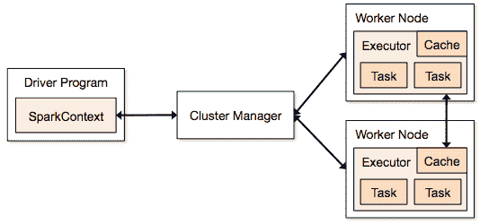

# 教程:Apache Spark 简介

> 原文：<https://www.dataquest.io/blog/apache-spark/>

October 9, 2015

## 概观

在由加州大学伯克利分校 AMP 实验室领导的大量开创性工作之后，Apache Spark 被开发出来，利用分布式内存数据结构来提高大多数工作负载在 Hadoop 上的数据处理速度。

在本帖中，我们将使用一个真实的数据集来介绍 Spark 的架构以及基本的转换和操作。如果你想编写并运行你自己的 Spark 代码，可以在 [Dataquest](https://app.dataquest.io/m/60) 上查看这篇文章的**互动版**。

## 弹性分布式数据集(RDD 的)

Spark 中的核心数据结构是一个 RDD，即弹性分布式数据集。顾名思义，RDD 是 Spark 对分布在许多机器的 RAM 或内存中的数据集的表示。一个 RDD 对象本质上是一个元素的集合，你可以用它来保存元组列表、字典、列表等等。与 Pandas 中的数据帧类似，您将数据集加载到 RDD 中，然后可以运行该对象可访问的任何方法。

## Python 中的 Apache Spark

虽然 Spark 是用 Scala 编写的，Scala 是一种编译成 JVM 字节码的语言，但是开源社区已经开发了一个名为 [PySpark](https://spark.apache.org/docs/0.9.0/python-programming-guide.html) 的奇妙工具包，它允许你用 Python 与 RDD 的接口。多亏了一个名为 [Py4J](https://github.com/bartdag/py4j) 的库，Python 可以与 JVM 对象接口，在我们的例子中是 RDD 的，这个库是 PySpark 工作的工具之一。

首先，我们将把包含所有日常节目嘉宾的数据集加载到 RDD 中。我们使用的是 [FiveThirtyEight 的数据集](https://github.com/fivethirtyeight/data/tree/master/daily-show-guests)的`TSV`版本。TSV 文件由制表符`"\t"`分隔，而不是像 CSV 文件那样由逗号`","`分隔。

```
raw_data = sc.textFile("daily_show.tsv")
raw_data.take(5)
```

```
['YEAR\tGoogleKnowlege_Occupation\tShow\tGroup\tRaw_Guest_List',
'1999\tactor\t1/11/99\tActing\tMichael J. Fox',
'1999\tComedian\t1/12/99\tComedy\tSandra Bernhard',
'1999\ttelevision actress\t1/13/99\tActing\tTracey Ullman',
'1999\tfilm actress\t1/14/99\tActing\tGillian Anderson']
```

## sparks context(储蓄上下文)

`SparkContext`是管理 Spark 中集群的连接并协调集群上运行的进程的对象。SparkContext 连接到集群管理器，集群管理器管理运行特定计算的实际执行器。这里有一个来自 Spark 文档的图表，可以更好地形象化这个架构:

SparkContext 对象通常作为变量`sc`被引用。然后我们运行:

```
raw_data = sc.textFile("daily_show.tsv")
```

将 TSV 数据集读入 RDD 对象`raw_data`。RDD 对象`raw_data`非常类似于字符串对象的列表，数据集中的每一行对应一个对象。然后我们使用`take()`方法打印 RDD 的前 5 个元素:

```
raw_data.take(5)
```

要探索 RDD 对象可以访问的其他方法，请查看 [PySpark 文档](https://spark.apache.org/docs/1.1.1/api/python/pyspark.rdd.RDD-class.html#take)。take(n)将返回 RDD 的前 n 个元素。

## 懒惰评估

您可能会问，如果 RDD 类似于 Python 列表，为什么不直接使用括号符号来访问 RDD 中的元素呢？因为 RDD 对象分布在许多分区上，所以我们不能依赖列表的标准实现，而 RDD 对象是专门为处理数据的分布式特性而开发的。

RDD 抽象的一个优点是能够在您自己的计算机上本地运行 Spark。当在您自己的计算机上本地运行时，Spark 通过将您计算机的内存分割成分区来模拟将您的计算分布在许多机器上，无需调整或更改您编写的代码。Spark 的 RDD 实现的另一个优点是能够懒惰地评估代码，直到绝对必要时才运行计算。

在上面的代码中，Spark 没有等到`raw_data.take(5)`运行后才把 TSV 文件加载到 RDD 中。当调用`raw_data = sc.textFile("dail_show.tsv")`时，一个指向文件的指针被创建，但是只有当`raw_data.take(5)`需要文件来运行它的逻辑时，文本文件才被真正读入`raw_data`。在这节课和以后的课中，我们会看到更多这种懒惰评估的例子。

## 管道

Spark 大量借鉴了 Hadoop 的 Map-Reduce 模式，但在许多方面有很大不同。如果你有使用 Hadoop 和传统 Map-Reduce 的经验，请阅读 Cloudera 的这篇伟大的[文章。如果您以前从未使用过 Map-Reduce 或 Hadoop，请不要担心，因为我们将在本课程中介绍您需要了解的概念。](https://blog.cloudera.com/blog/2014/09/how-to-translate-from-mapreduce-to-apache-spark/)

使用 Spark 时需要理解的关键思想是数据**流水线**。Spark 中的每个操作或计算本质上都是一系列步骤，这些步骤可以链接在一起，连续运行，形成一个**管道**。**管道**中的每一步都返回一个 Python 值(如整数)、一个 Python 数据结构(如字典)或一个 RDD 对象。我们首先从`map()`函数开始。**Map()**`map(f)`函数将函数 f 应用于 RDD 中的每个元素。因为 RDD 是可迭代的对象，像大多数 Python 对象一样，Spark 在每次迭代中运行函数`f`，并返回一个新的 RDD。

我们将浏览一个例子，这样你会有更好的理解。如果你仔细观察，`raw_data`是一种很难处理的格式。虽然目前每个元素都是一个`String`，但我们希望将每个元素都转换成一个`List`，这样数据更易于管理。传统上，我们会:

```
1\. Use a `for` loop to iterate over the collection
2\. Split each `String` on the delimiter
3\. Store the result in a `List`
```

让我们来看看如何在 Spark 中使用`map`来实现这一点。在下面的代码块中，我们:

```
1\. Call the RDD function `map()` to specify we want the enclosed logic to be applied to every line in our dataset
2\. Write a lambda function to split each line using the tab delimiter "\t" and assign the resulting RDD to `daily_show`
3\. Call the RDD function `take()` on `daily_show` to display the first 5 elements (or rows) of the resulting RDD
```

`map(f)`函数被称为转换步骤，需要命名函数或 lambda 函数`f`。

```
daily_show = raw_data.map(lambda line: line.split('\t'))
daily_show.take(5)
```

```
[['YEAR', 'GoogleKnowlege_Occupation', 'Show', 'Group', 'Raw_Guest_List'],
['1999', 'actor', '1/11/99', 'Acting', 'Michael J. Fox'],
['1999', 'Comedian', '1/12/99', 'Comedy', 'Sandra Bernhard'],
['1999', 'television actress', '1/13/99', 'Acting', 'Tracey Ullman'],
['1999', 'film actress', '1/14/99', 'Acting', 'Gillian Anderson']]
```

## Python 和 Scala，永远的朋友

PySpark 的一个精彩特性是能够将我们的逻辑(我们更喜欢用 Python 编写)与实际的数据转换分离开来。在上面的代码块中，我们用 Python 代码编写了一个 lambda 函数:

```
raw_data.map(lambda: line(line.split('\t')))
```

但是当 Spark 在我们的 RDD 上运行代码时，我们必须利用 Scala。

**这个**就是 PySpark 的力量。无需学习任何 Scala，我们就可以利用 Spark 的 Scala 架构带来的数据处理性能提升。更棒的是，当我们跑步时:

```
daily_show.take(5)
```

结果以 Python 友好的符号返回给我们。

## 转换和操作

在 Spark 中，有两种方法:

```
1\. Transformations - map(), reduceByKey()
2\. Actions - take(), reduce(), saveAsTextFile(), collect()
```

转换是懒惰的操作，总是返回对 RDD 对象的引用。然而，直到一个操作需要使用转换产生的 RDD 时，转换才真正运行。任何返回 RDD 的函数都是转换，任何返回值的函数都是操作。随着您学习本课并练习编写 PySpark 代码，这些概念将变得更加清晰。

## 不变

你可能想知道为什么我们不能把每一个`String`分开，而不是创建一个新的对象`daily_show`？在 Python 中，我们可以就地逐个元素地修改集合，而无需返回并分配给新对象。RDD 对象是[不可变的](https://www.quora.com/Why-is-a-spark-RDD-immutable)，一旦对象被创建，它们的值就不能改变。

在 Python 中，列表对象和字典对象是可变的，这意味着我们可以改变对象的值，而元组对象是不可变的。在 Python 中修改 Tuple 对象的唯一方法是用必要的更新创建一个新的 Tuple 对象。Spark 利用 RDD 的不变性来提高速度，其机制超出了本课的范围。

## ReduceByKey()

我们想得到一个直方图，或者说是一个统计数字，显示每年的来宾数量。如果`daily_show`是列表的列表，我们可以编写下面的 Python 代码来实现这个结果:

```
tally = dict()
for line in daily_show:
  year = line[0]
  if year in tally.keys():
    tally2022 = tally2022 + 1
  else:
    tally2022 = 1
```

`tally`中的键将是唯一的`Year`值，并且该值将是数据集中包含该值的行数。如果我们想使用 Spark 达到同样的结果，我们将不得不使用一个`Map`步骤，然后是一个`ReduceByKey`步骤。

```
tally = daily_show.map(lambda x: (x[0], 1)).reduceByKey(lambda x,y: x+y)
print(tally)
```

```
PythonRDD[156] at RDD at PythonRDD.scala:43
```

## 说明

您可能会注意到，打印`tally`并没有返回我们期望的直方图。由于懒惰评估，PySpark 延迟执行`map`和`reduceByKey`步骤，直到我们真正需要它。在我们使用`take()`来预览`tally`中的前几个元素之前，我们将遍历刚刚编写的代码。

```
daily_show.map(lambda x: (x[0], 1)).reduceByKey(lambda x, y: x+y)
```

在映射步骤中，我们使用 lambda 函数创建了一个元组，由以下内容组成:

*   key: x[0]，列表中的第一个值
*   值:1，整数

我们的高级策略是用代表`Year`的键和代表`1`的值创建一个元组。在`map`步骤之后，Spark 将在内存中维护一个类似如下的元组列表:

```
('YEAR', 1)
('1991', 1)
('1991', 1)
('1991', 1)
('1991', 1)
...
```

我们希望将其简化为:

```
('YEAR', 1)
('1991', 4)
...
```

`reduceByKey(f)`使用我们指定的函数`f`将元组与相同的键组合在一起。为了查看这两步的结果，我们将使用`take`命令，该命令强制懒惰代码立即运行。由于`tally`是一个 RDD，我们不能使用 Python 的`len`函数来知道集合中有多少元素，而是需要使用 RDD `count()`函数。

```
tally.take(tally.count())
```

```
[('YEAR', 1),
('2013', 166),
('2001', 157),
('2004', 164),
('2000', 169),
('2015', 100),
('2010', 165),
('2006', 161),
('2014', 163),
('2003', 166),
('2002', 159),
('2011', 163),
('2012', 164),
('2008', 164),
('2007', 141),
('2005', 162),
('1999', 166),
('2009', 163)]
```

## 过滤器

与熊猫不同，Spark 对列标题一无所知，也没有把它们放在一边。我们需要一种方法来消除这种元素:

```
('YEAR', 1)
```

来自我们的收藏。虽然您可能会尝试找到一种方法来从 RDD 中删除这个元素，但是请记住，RDD 对象是不可变的，一旦创建就不能更改。

删除该元组的唯一方法是创建一个没有该元组的新 RDD 对象。Spark 附带了一个函数`filter(f)`,允许我们从现有的只包含符合我们标准的元素的 RDD 中创建一个新的。指定一个返回二进制值的函数`f`、`True`或`False`，得到的 RDD 将由函数求值为`True`的元素组成。在 [Spark 的文档](https://spark.apache.org/docs/1.1.1/api/python/pyspark.rdd.RDD-class.html#filter)中阅读更多关于`filter`功能的信息。

```
def filter_year(line):
    if line[0] == 'YEAR':
        return False
    else:
        return True
filtered_daily_show = daily_show.filter(lambda line: filter_year(line))
```

## 现在都在一起

为了展示 Spark 的能力，我们将演示如何将一系列数据转换链接到一个管道中，并观察 Spark 在后台管理一切。Spark 在编写时就考虑到了这一功能，并针对连续运行任务进行了高度优化。以前，在 Hadoop 中连续运行大量任务非常耗时，因为中间结果需要写入磁盘，而 Hadoop 并不知道完整的管道(如果你好奇，可以选择阅读:[https://qr.ae/RHWrT2](https://qr.ae/RHWrT2))。

由于 Spark 对内存的积极使用(仅将磁盘作为备份并用于特定任务)和良好架构的核心，Spark 能够显著改善 Hadoop 的周转时间。在下面的代码块中，我们将过滤掉没有列出职业的演员，小写每个职业，生成一个职业直方图，并输出直方图中的前 5 个元组。

```
filtered_daily_show.filter(lambda line: line[1] != '') \
                   .map(lambda line: (line[1].lower(), 1)) \
                   .reduceByKey(lambda x,y: x+y) \
                   .take(5)
```

```
[('radio personality', 3),
('television writer', 1),
('american political figure', 2),
('former united states secretary of state', 6),
('mathematician', 1)]
```

## 后续步骤

我们希望在本课中，我们已经激起了您对 Apache Spark 兴趣，以及我们如何使用 PySpark 来编写我们熟悉的 Python 代码，同时仍然利用分布式处理。当处理更大的数据集时，PySpark 确实大放异彩，因为它模糊了在自己的计算机上本地进行数据科学和在互联网上使用大量分布式计算(也称为云)进行数据科学之间的界限。

如果你喜欢这篇文章，看看我们在 Dataquest 上的 [Spark 课程](https://www.dataquest.io/course/spark-map-reduce/),在那里我们可以学到更多关于 Spark 中的转换&动作。