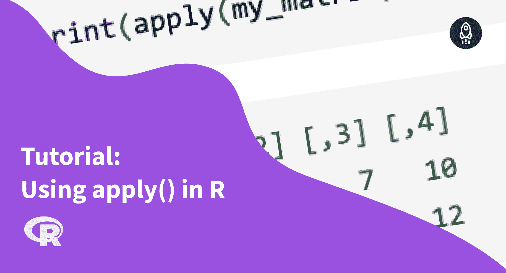

# 用例子应用 R 中的函数[apply()，sapply()，lapply()，tapply()]

> 原文：<https://www.dataquest.io/blog/apply-functions-in-r-sapply-lapply-tapply/>

May 31, 2022

## 在本教程中，我们将学习 R 中的 apply()函数，包括何时使用它以及为什么它比循环更有效。

`apply()`函数是 R 中 apply 函数族的基本模型，它包含了一些特定的函数，如`lapply()`、`sapply()`、`tapply()`、`mapply()`、`vapply()`、`rapply()`、`bapply()`、`eapply()`等。所有这些函数都允许我们遍历一个数据结构，比如一个列表、一个矩阵、一个数组、一个数据帧或者一个给定数据结构的一个选定部分——并在每个元素上执行相同的操作。

此类操作可能意味着聚合(即计算汇总统计，如平均值、最大值、最小值、总和等。)、变换—或任何其他简单或复杂、内置或自定义的矢量化函数。apply 系列函数之间的区别在于数据结构的输入和输出类型以及它们执行的功能。

与出于同样目的使用循环结构的更保守的方法相比，`apply()`函数及其变体提供了显著更快的程序执行和紧凑的单行语法，而不是跨越多行的代码块。这在处理大型数据集时变得尤为重要。

## 如何在 R 中使用`apply()`函数(及其变种)

让我们探索一下 r 中一些最有用的 apply 函数。

### `apply()`

我们将从应用组的主要功能开始:`apply()`。它接受数据帧、矩阵或多维数组作为输入，并根据输入对象类型和传入的函数，输出向量、列表、矩阵或数组。

`apply()`函数的语法非常简单，只有三个参数:

```
apply(X, MARGIN, FUN)
```

这里的`X`是一个输入对象(一个数据帧、一个矩阵或一个数组)，`MARGIN`是决定函数应用的参数(它可以取值`1`、`2`或`c(1,2)`，这意味着函数相应地应用于行、列或行和列)，而`FUN`是应用于输入数据的函数(内置或自定义)。

让我们看一些例子。我们将使用矩阵作为输入数据结构，但同样的原理也适用于其他可能的数据结构:

```
my_matrix <- matrix((1:12), nrow=3)
print(my_matrix)
```

```
 [,1] [,2] [,3] [,4]
[1,]    1    4    7   10
[2,]    2    5    8   11
[3,]    3    6    9   12
```

例如，我们可能希望找到矩阵中每一行的最大值。为此，我们将把`1`设置为`MARGIN`参数，并传入`max`函数:

```
print(apply(my_matrix, 1, max))
```

```
[1] 10 11 12
```

在上面的代码中，我们在输入矩阵上虚拟地实现了一个聚合(这是一个二维数据结构)。结果，输出是一个包含每行相应最大值的**向量**(这是一个一维数据结构)。

现在，让我们按列(`MARGIN=2`)计算矩阵值的总和:

```
print(apply(my_matrix, 2, sum))
```

```
[1]  6 15 24 33
```

输出数据结构也是一个向量。`sum`函数是聚合函数的另一个例子，它将输入对象的维数减少 1。

在某些情况下，我们可能需要按列计算累积和:

```
print(apply(my_matrix, 2, cumsum))
```

```
 [,1] [,2] [,3] [,4]
[1,]    1    4    7   10
[2,]    3    9   15   21
[3,]    6   15   24   33
```

这次，我们获得了一个与输入矩阵大小相同的矩阵**,因为`cumsum`函数为输入矩阵的每个值计算一个值。**

 **注意，最后的结果(输出对象与输入对象的大小相同)对于非聚合函数来说并不总是这样。例如，我们可能想要一个按列排列的*范围*的值:

```
print(apply(my_matrix, 2, range))
```

```
 [,1] [,2] [,3] [,4]
[1,]    1    4    7   10
[2,]    3    6    9   12
```

这里，我们也得到一个矩阵作为输出对象，但是它的大小与输入对象不同(2×4 而不是 3×4)。

可以向`apply()`提供任何自定义功能。让我们定义一个函数来计算每个输入的均方值:

```
mean_squared_vals <- function(x) mean(x**2)
```

正如我们之前所做的那样，我们可以通过行(`MARGIN=1`)来应用这个函数:

```
print(apply(my_matrix, 1, mean_squared_vals))
```

```
[1] 41.5 53.5 67.5
```

我们也可以按列(`MARGIN=2`)应用函数:

```
print(apply(my_matrix, 2, mean_squared_vals))
```

```
[1]   4.666667  25.666667  64.666667 121.666667
```

最后——这是我们还没有尝试过的——我们可以通过行和列来应用它(`MARGIN=c(1,2)`):

```
print(apply(my_matrix, c(1,2), mean_squared_vals))
```

```
 [,1] [,2] [,3] [,4]
[1,]    1   16   49  100
[2,]    4   25   64  121
[3,]    9   36   81  144
```

在最后一种情况下，我们得到了一个矩阵，其中每个值都是输入矩阵对应值的平方。因为我们的用户定义函数的`mean`组件实际上在每次迭代中只应用于一个值，所以值本身被返回。因此，在这种特殊情况下，`mean`操作没有任何意义。

### `lapply()`

`lapply()`函数是`apply()`的变体，它接受一个向量、一个列表或一个数据帧作为输入，并且总是输出一个**列表**(函数名中的“l”代表“列表”)。指定的函数应用于输入对象的每个元素，因此结果列表的长度总是等于输入对象的长度。

该函数的语法类似于`apply()`的语法，只是这里不需要`MARGIN`参数，因为该函数对列表和向量应用元素方式，对数据帧应用列方式:

```
lapply(X, FUN)
```

让我们看看它是如何处理向量、列表和数据帧的。首先，我们将创建一个将输入值加 1 的简单函数:

```
add_one <- function(x) x+1
```

让我们在一个向量上测试它:

```
my_vector = c(1, 2, 3)
print(lapply(my_vector, add_one))
```

```
[[1]]
[1] 2

[[2]]
[1] 3

[[3]]
[1] 4
```

我们给向量的每个值加 1。

现在，我们将创建一个列表:

```
my_list = list(TRUE, c(1, 2, 3), 10)
print(my_list)
```

```
[[1]]
[1] TRUE

[[2]]
[1] 1 2 3

[[3]]
[1] 10
```

现在我们将对它应用我们的函数:

```
print(lapply(my_list, add_one))
```

```
[[1]]
[1] 2

[[2]]
[1] 2 3 4

[[3]]
[1] 11
```

由于`TRUE`的值为 1，加上 1，我们得到结果列表第一项的值为 2。在矢量项的情况下，每个值都加 1。

最后，让我们在数据帧上使用`lapply()`:

```
my_df <- data.frame(a=1:3, b=4:6, c=7:9, d=10:12)
print(my_df)
```

```
 a b c  d
1 1 4 7 10
2 2 5 8 11
3 3 6 9 12
```

```
print(lapply(my_df, add_one))
```

```
$a
[1] 2 3 4

$b
[1] 5 6 7

$c
[1]  8  9 10

$d
[1] 11 12 13
```

正如我们前面提到的，`lapply()`函数适用于数据帧的列方式。

### `sapply()`

`sapply()`函数是`lapply()`的简化形式(函数名中的“s”代表“简化”)。与`lapply()`(即`sapply(X, FUN)`)语法相同；接受一个向量、一个列表或一个数据帧作为输入，就像`lapply()`一样，并试图将输出对象简化为最简单的数据结构。这意味着，默认情况下，`sapply()`函数为 vector 输出 vector，为 list 输出 list，为 DataFrame 输出 matrix。

让我们使用与前面相同的自定义函数`add_one`对变量`my_vector`、`my_list`和`my_df`进行尝试:

```
print(sapply(my_vector, add_one))
```

```
[1] 2 3 4
```

```
print(sapply(my_list, add_one))
```

```
[[1]]
[1] 2

[[2]]
[1] 2 3 4

[[3]]
[1] 11
```

```
print(sapply(my_df, add_one))
```

```
 a b  c  d
[1,] 2 5  8 11
[2,] 3 6  9 12
[3,] 4 7 10 13
```

我们可以改变`sapply()`函数的默认行为，传入一个可选参数`simplify=FALSE`(默认为`TRUE`)。在这种情况下，`sapply()`函数变得与`lapply()`相同，并且总是输出任何有效输入数据结构的列表:

```
print(typeof(sapply(my_vector, add_one, simplify=FALSE)))
print(typeof(sapply(my_list, add_one, simplify=FALSE)))
print(typeof(sapply(my_df, add_one, simplify=FALSE)))
```

```
[1] "list"
[1] "list"
[1] "list"
```

### `tapply()`

我们使用`tapply()`函数来计算汇总统计数据(如平均值、中值、最小值、最大值、总和等)。)针对不同的因素(即类别)。它具有以下语法:

```
tapply(X, INDEX, FUN)
```

这里的`X`是一个 R 对象，通常是一个向量，包含数字数据；`INDEX`是一个 R 对象，典型的是一个向量或者一个列表，包含因子；而`FUN`是要在`X`上应用的函数。

为了了解它是如何工作的，让我们假设我们有一组从事数据相关工作的人的工资信息:数据科学家(DS)、数据分析师(DA)和数据工程师(DE)。使用`tapply()`函数，我们可以按职位计算平均工资。

(*旁注:*作为一个粗略的指南，我们在这里使用了来自[的信息，实际上是](https://www.indeed.com/career/salaries)来估算 2022 年 2 月美国各职位的平均工资。)

```
salaries <- c(80000, 62000, 113000, 68000, 75000, 79000, 112000, 118000, 65000, 117000)
jobs <- c('DS', 'DA', 'DE', 'DA', 'DS', 'DS', 'DE', 'DE', 'DA', 'DE')
print(tapply(salaries, jobs, mean))
```

```
 DA     DE     DS 
 65000 115000  78000 
```

## 结论

总的来说，我们学习了很多关于在 r 中使用 apply 函数的东西。

*   如何在 R 中定义`apply()`函数
*   函数的种类和最常见的函数
*   为什么 apply 系列的函数比循环更有效
*   当应用功能的每一种常见变化都适用时
*   每个变体的语法
*   每种类型的输入以及如何在不同类型的输入上使用它**