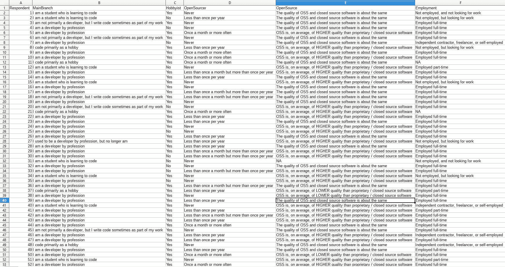
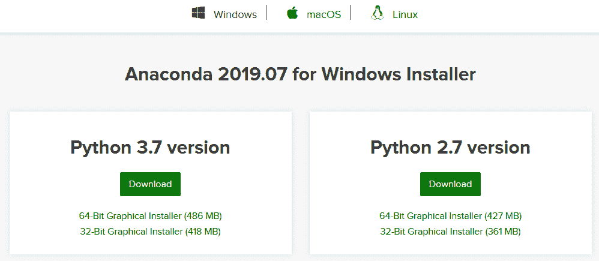
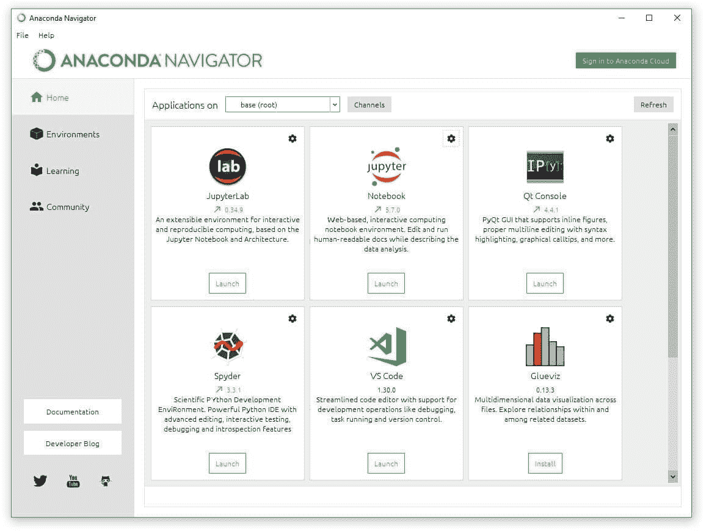
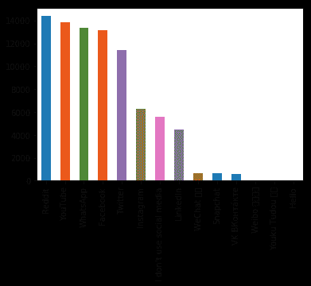
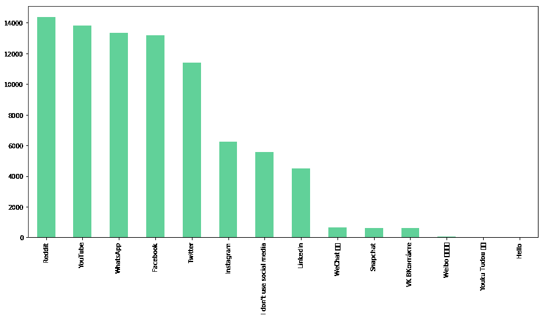

# 初学者如何用 Python 分析调查数据

> 原文：<https://www.dataquest.io/blog/how-to-analyze-survey-data-python-beginner/>

October 10, 2019

开展调查和投票是收集数据和深入了解诸如*为什么客户会离开我们的网站等问题的最佳方式之一。*或*为什么选民会被这位候选人吸引？*但是分析调查数据可能是一项真正的挑战！

在本教程中，我们将介绍如何使用 Python 分析调查数据。但是不要担心——即使你以前从来没有写过代码，你也能处理好这件事！我们将一步一步来，在本教程结束时，您将看到如何通过几行代码来释放一些令人印象深刻的分析能力！

出于本文的目的，我们将分析 StackOverflow 的 2019 年开发者调查数据，因为这是一个大型的最新调查数据集，并且是公开的和适当匿名的。但是这些技术几乎适用于任何种类的调查数据。

大多数调查数据的格式与我们在这里使用的类似:一个电子表格，其中每行包含一个人的答案，每列包含一个特定问题的所有答案。这是我们数据集的一个片段；你的可能看起来很相似。



现在，让我们开始分析这些数据吧！我们将从几个快速步骤开始，为分析做好准备。

## 步骤 1:获取 CSV 文件
形式的调查回复

为了使用代码分析我们的调查数据，我们需要以`.csv`文件的形式获取它。如果你想使用我们正在使用的相同数据集来完成本教程，你可以在这里获取 2019 年 StackOverflow 开发者调查结果数据[，它已经准备好了一个 CSV 文件(在`.zip`文件内)。](https://insights.stackoverflow.com/survey)

如果您想开始处理自己的数据，以下是获取 CSV 格式数据的方法:

*   如果您进行了在线调查，您可以直接从您使用的调查服务下载 CSV。Typeform 和许多其他在线调查工具将允许您下载包含您所有调查回答的 CSV 文件，这使事情变得简单而美好。
*   如果您在调查中使用了谷歌表单，您的数据将以谷歌表单的形式在线提供。在 Google Sheets 界面中，点击`File > Download`然后选择`Comma-separated values (.csv, current sheet)`以 CSV 格式下载您的数据。
*   如果你已经通过其他方式收集了数据，但是你是以电子表格格式保存的，你可以从 Excel 或者其他电子表格程序中保存电子表格为 CSV 文件。在 Excel 中，您需要导航到`File > Save As`。在`Save as type:`字段中，选择`CSV (Comma delimited) (*.csv)`，然后点击保存。在其他电子表格软件中，过程应该非常相似。

在继续之前，您可能希望用电子表格软件打开您的 CSV 文件并查看其格式。如果分析看起来像我们前面看到的代码片段，那么分析将是最简单的:问题在电子表格的第一行，应答者的答案在后面的每一行。例如，如果您的数据在顶部有一些额外的行，最好在继续之前删除这些行，这样数据集中的第一行就是您的调查问题，随后的每一行都是一个受访者的答案。

## 步骤 2:设置你的编码环境

(如果你已经安装了 Anaconda，并且熟悉 Jupyter 笔记本，可以跳过这一步。)

下一步是建立一个叫做 Jupyter 笔记本的工具。Jupyter 笔记本是一种流行的数据分析工具，因为它们安装快速，使用非常方便。我们已经写了一个深入的 Jupyter 笔记本教程,里面有很多细节，但是我们将在这里讨论你需要设置和运行的内容。

首先，[前往蟒蛇网站](https://www.anaconda.com/distribution/)。稍微向下滚动，选择你电脑的操作系统，然后点击`Download`进入 **Python 3.7 版本**。



文件下载完成后，打开它并按照提示将其安装到您的计算机上您选择的位置。如果你不确定你需要什么，默认选项就可以了。

安装完成后，打开 Anaconda Navigator 应用程序。您将能够在您刚刚安装 Anaconda 的任何目录中找到它，或者只需在您的计算机上搜索“Anaconda”。当应用程序打开时，您可能会看到几个屏幕闪烁，然后您会看到:



点击中间选项“Jupyter 笔记本”下“启动”。这将在您的网络浏览器中打开一个新标签。从那里，点击右上角的“新建”，然后在下拉菜单中的“笔记本”下，点击“Python 3”。


转眼间。您已经打开了一个新的 Jupyter 笔记本，我们准备开始编写一些代码！

## 步骤 3:将我们的调查数据导入 Python

我们编写的前两行代码将允许我们将数据集导入 Python 和我们的 Jupyter 笔记本，这样我们就可以开始使用它了。

我们将首先导入一个名为`pandas`的 Python 库，并给它起名叫`pd`，这样我们就可以在代码中轻松地引用它。为此，我们将使用语法`import pandas as pd`。这段代码告诉 Python 导入熊猫库，然后告诉它当我们使用字母`pd`时，我们希望它引用那个熊猫库。

Python 库有点像浏览器插件；它们增加了额外的特性和功能，因此我们可以用 Python 做更多的事情。Pandas 是一个非常受欢迎的数据分析库，它将使我们的分析工作更加容易。

使用“昵称”`pd`并不是强制性的，但这是 pandas 用户中常见的一种习惯，所以习惯使用它将使阅读其他人的代码更容易。

一旦我们导入了熊猫，我们需要读取我们的 CSV 来创建所谓的熊猫数据框架。一个数据框架只是一个数据表，我们可以用熊猫来操作它。一会儿我们将看到数据帧是什么样子，但是要将我们的数据放入 Python 和 pandas，我们需要做两件事:

1.  阅读我们下载的 CSV 文件，我们可以使用一个名为`.read_csv()`的熊猫函数来完成
2.  将 CSV 数据赋给一个变量，以便我们可以轻松地引用它

函数是对输入执行操作的代码。在这种情况下，我们将输入 CSV 文件的文件名，然后`.read_csv()`函数会自动将该文件解析为 pandas 数据帧。

你可以把 Python 中的变量想象成一本书的标题。书名让查阅书籍变得容易——我们只需说*杀死一只知更鸟*，人们就会知道我们在谈论什么，所以我们不必背诵整本书。变量的工作方式类似。它们就像一个简短的标题，我们可以用它来引用 Python 到更大的信息(比如我们试图分析的调查数据)，而不必重述所有的信息。

但是，我们第一次使用变量时，必须告诉 Python 我们在讨论什么。我们将使用变量名`df`(data frame 的缩写)来表示我们的调查数据。

因此，我们将用来读取数据集的代码如下所示:`df = pd.read_csv('survey_results_public.csv')`。下面是这段代码从左到右告诉 Python 的内容:

1.  `df =`告诉 Python 我们正在创建一个名为`df`的新变量，当你看到`df`时，请参考以下信息:

2.  告诉 Python 查看我们之前导入的 pandas 库。

3.  `.read_csv('survey_results_public.csv')`告诉 Python 使用函数`.read_csv()`读取文件`survey_results_public.csv`。

请注意，如果您的 CSV 文件与您正在使用的 Jupyter 笔记本不在同一个文件夹中，您需要为数据集指定文件路径。这将根据您保存它的时间而变化，但它可能看起来像这样:`df = pd.read_csv('C://Users/Username/Documents/Filename.csv')`。

序言说得够多了。让我们运行我们的代码，在 Jupyter 笔记本的第一个单元格中输入这个，然后点击 **Run** 按钮:

```
import pandas as pd

df = pd.read_csv('survey_results_public.csv')
```

但是等等，什么都没发生！那是因为我们实际上没有告诉 Python 给我们任何类型的响应。我们的代码真的有效吗？

为了验证，让我们使用另一个名为`.head()`的 pandas 方法。这个将向我们展示一个数据帧的前几行。我们可以通过在那些括号之间放一个数字来指定我们想要看到多少行，或者我们可以简单地让它保持原样，它将显示前五行。

不过，我们确实需要告诉`.head()`要查看什么数据帧，所以我们将使用语法`df.head()`。`df`告诉 Python 我们想要查看我们刚刚用 CSV 数据制作的数据帧，`.`告诉 Python 我们要对该数据帧做些什么，然后`head()`告诉 Python 我们想要做什么:显示前五行。

```
df.head()
```

|  | 被告 | 枝 | 业余爱好者 | 开放源码 | 开源 | 雇用 | 国家 | 学生 | EdLevel | 大学校长 | … | 欢迎改变 | SONewContent | 年龄 | 性别 | 反式 | 性别 | 种族划分 | 受赡养者 | 测量长度 | 检验简易 |
| --- | --- | --- | --- | --- | --- | --- | --- | --- | --- | --- | --- | --- | --- | --- | --- | --- | --- | --- | --- | --- | --- |
| Zero | one | 我是一名正在学习编码的学生 | 是 | 从不 | 开放源码软件和封闭源码软件的质量… | 没有工作，也没有在找工作 | 联合王国 | 不 | 小学/小学 | 圆盘烤饼 | … | 就像我去年一样受欢迎 | 其他开发人员撰写的技术文章；工业… | Fourteen | 男人 | 不 | 异性恋/异性恋 | 圆盘烤饼 | 不 | 长度合适 | 既不容易也不困难 |
| one | Two | 我是一名正在学习编码的学生 | 不 | 每年不到一次 | 开放源码软件和封闭源码软件的质量… | 未就业，正在找工作 | 波斯尼亚和黑塞哥维那 | 是的，全职 | 中学(如美国高中，G… | 圆盘烤饼 | … | 就像我去年一样受欢迎 | 其他开发人员撰写的技术文章；工业… | Nineteen | 男人 | 不 | 异性恋/异性恋 | 圆盘烤饼 | 不 | 长度合适 | 既不容易也不困难 |
| Two | three | 我主要不是一个开发人员，但我写公司… | 是 | 从不 | 开放源码软件和封闭源码软件的质量… | 全职受雇 | 泰国 | 不 | 学士学位(文学学士、理学学士、工程学士等)) | 网页开发或网页设计 | … | 就像我去年一样受欢迎 | 你所在地区的技术会议或活动；关于…的课程 | Twenty-eight | 男人 | 不 | 异性恋/异性恋 | 圆盘烤饼 | 是 | 长度合适 | 既不容易也不困难 |
| three | four | 我的职业是开发人员 | 不 | 从不 | 开放源码软件和封闭源码软件的质量… | 全职受雇 | 美国 | 不 | 学士学位(文学学士、理学学士、工程学士等)) | 计算机科学、计算机工程或软件工程 | … | 就像我去年一样受欢迎 | 其他开发人员撰写的技术文章；工业… | Twenty-two | 男人 | 不 | 异性恋/异性恋 | 白人或欧洲后裔 | 不 | 长度合适 | 容易的 |
| four | five | 我的职业是开发人员 | 是 | 每月一次或更频繁 | 一般来说，开放源码软件比专业软件质量更高 | 全职受雇 | 乌克兰 | 不 | 学士学位(文学学士、理学学士、工程学士等)) | 计算机科学、计算机工程或软件工程 | … | 就像我去年一样受欢迎 | 你所在地区的技术会议或活动；关于…的课程 | Thirty | 男人 | 不 | 异性恋/异性恋 | 白人或欧洲后裔；多民族的 | 不 | 长度合适 | 容易的 |

5 行× 85 列

这是我们的数据框！看起来很像电子表格，对吧？我们可以看到一些答案看起来被截断了，但是不要担心，数据没有丢失，只是没有直观地显示出来。

我们可能还会注意到该数据中其他一些奇怪的事情，比如在一些行中出现了`NaN`。我们稍后将处理这个问题，但是首先，让我们使用另一个名为`.shape`的 pandas 特性来更仔细地查看我们的数据集，以给出我们数据集的大小。

```
df.shape
```

```
(88883, 85)
```

这告诉我们，我们的数据集中有 88，883 行和 85 列。这些数字应该与调查中回答者(行)和问题(列)的数量完全一致。如果是这样，这意味着我们所有的调查数据现在都存储在该数据框架中，并准备好进行分析。

## 第四步:分析选择题

从这里开始，你如何继续你的分析真的取决于你，有 85 个问题，有*吨*我们可以用这些数据做不同的事情。但是让我们从简单的问题开始:一个是或否的问题。

(注意:可能很难弄清楚 StackOverflow 数据中某些列名的含义，但是数据集下载附带了一个模式文件，其中包含每个问题的完整文本，因此您可能需要不时地参考该文件，以便将列名与受访者实际看到的问题进行匹配。)

调查中一个比较独特的是或否问题是这样的:“你认为今天出生的人会比他们的父母过得更好吗？”

看看 StackOverflow 的社区对未来有多乐观可能会很有趣！我们可以通过一个叫做`value_counts()`的便捷的熊猫函数来实现。

`value_counts()`函数一次查看一列数据，并计算该列包含的每个唯一条目的实例数。(在 pandas 行话中，一个单独的列被称为一个系列，因此您可能会看到这个函数被称为`Series.value_counts()`。)

要使用它，我们需要做的就是告诉 Python 我们想要查看的特定系列(也称为列)，然后告诉它执行`.value_counts()`。我们可以通过写 dataframe 的名称来指定一个特定的列，后面跟着括号中的列名，就像这样:`df['BetterLife']`。

(就像我们的列表一样，因为`'BetterLife'`是一个字符串，而不是一个数字或变量名，我们需要把它放在撇号或引号内，以防止 Python 混淆)。

让我们运行代码，看看我们得到了什么！

```
df['BetterLife'].value_counts()
```

```
Yes    54938
No     31331
Name: BetterLife, dtype: int64
```

不错！现在我们知道，在我们的数据集中的 88，883 名受访者中，有 54，938 人认为未来是光明的。

不过，如果将它表示为总响应数的百分比，可能会更有帮助。幸运的是，我们可以通过简单地在`value_counts()`括号内添加一个输入来实现。函数输入在编程中被称为**参数**，可以用来向函数传递影响其输出内容的信息。

在这种情况下，我们要传递一个类似这样的论点:`normalize=True`。 [pandas 文档](https://pandas.pydata.org/pandas-docs/stable/reference/api/pandas.Series.value_counts.html)对此有一些细节，但长话短说:如果我们不在函数中放入任何东西，value_counts 将假设我们希望`normalize`是`False`，因此它将返回每个值的原始计数。

然而，如果我们将`normalize`设置为`True`，它将通过将计数表示为我们指定的 pandas 系列中总行数的百分比来“规范化”计数。

```
df['BetterLife'].value_counts(normalize=True)
```

```
Yes    0.636822
No     0.363178
Name: BetterLife, dtype: float64
```

现在我们可以看到，大约 64%的开发者认为今天出生的孩子生活变得更好，大约 36%的人认为今天的孩子生活质量相似或更差。

让我们在另一个有趣的是/否问题上尝试同样的事情:**“你认为你需要成为一名经理来赚更多的钱吗？”**许多硅谷公司声称管理并不是获得财务成功的唯一途径，但开发商们买账吗？

```
df['MgrMoney'].value_counts(normalize=True)
```

```
No          0.512550
Yes         0.291528
Not sure    0.195922
Name: MgrMoney, dtype: float64
```

显然，大多数开发商*并不买账。事实上，不到 30%的人认为他们不进入管理层也能赚更多的钱！*

我们还可以看到，尽管这是一个是/否问题，StackOverflow 包含了第三个响应选项(“不确定”)，我们的代码仍然以同样的方式工作。对任何选择题都有效。

## 第五步:绘制选择题答案

看数字可能会有启发，但人类是视觉动物。幸运的是，对我们来说，直观地绘制这些问题的答案非常简单！

既然我们是在 Jupyter 笔记本上写代码，我们就从一行 Jupyter 魔术开始:

```
%matplotlib inline
```

这段代码不是我们分析的一部分，它只是一个指令，告诉我们的 Jupyter 笔记本在我们正在工作的笔记本中内联显示我们的图表。

一旦我们运行了，我们需要做的就是在代码的末尾添加一小段代码:`.plot(kind='bar')`。这告诉 Python 获取我们刚刚给它的任何东西，并在条形图中绘制结果。(如果我们愿意，我们可以用`'pie'`代替`'bar'`，得到一个饼状图)。

让我们尝试一下关于开发者偏好的社交媒体网站的选择题:

```
df['SocialMedia'].value_counts().plot(kind="bar")
```

```
<matplotlib.axes._subplots.AxesSubplot at 0x2142658a9b0>
```



这已经很酷了，但是我们可以通过向那个`.plot()`函数添加几个参数来让它看起来更好。具体来说，我们再补充两个:

*   名为`figsize`的参数以英寸为单位的宽度和高度的形式定义了图表的大小(即`(15,7)`
*   名为`color`的参数定义了条形的颜色。

让我们使用#61D199，Dataquest 的绿色:

```
df['SocialMedia'].value_counts().plot(kind="bar", figsize=(15,7), color="#61d199")
```

```
<matplotlib.axes._subplots.AxesSubplot at 0x214268d4048>
```



对于这个图表，我们还可以做更多的事情，但是对于我们的目的来说，这已经足够了——我们只是在快速可视化！

## 步骤 6:分析调查数据子集

当然，我们经常想做得更深入，而不仅仅是打印出我们结果的简单计数！我们可以使用 Python 和 pandas，根据我们设定的几乎任何条件，轻松地选择和分析非常精细的数据子集。

例如，我们之前看到，StackOverflow 用户中有一小部分，但也是相当大的一小部分，根据他们对我们分析的`'BetterLife'`问题的回答，认为世界会变得更糟。举例来说，这部分用户可能比更乐观的开发者年龄更大还是更小？

我们可以使用所谓的**布尔值**来对我们的数据进行排序，并只显示对该问题回答“是”或“否”的人的回答。

我们将通过指定我们想要查看的数据帧和系列(即列)来创建我们的布尔值，然后通过使用条件运算符只过滤该系列中满足特定标准的响应。

这一次，让我们先运行代码，然后我们将仔细看看它在做什么:

```
said_no = df[df['BetterLife'] == 'No']
said_no.head(3)
```

|  | 被告 | 枝 | 业余爱好者 | 开放源码 | 开源 | 雇用 | 国家 | 学生 | EdLevel | 大学校长 | … | 欢迎改变 | SONewContent | 年龄 | 性别 | 反式 | 性别 | 种族划分 | 受赡养者 | 测量长度 | 检验简易 |
| --- | --- | --- | --- | --- | --- | --- | --- | --- | --- | --- | --- | --- | --- | --- | --- | --- | --- | --- | --- | --- | --- |
| five | six | 我主要不是一个开发人员，但我写公司… | 是 | 从不 | 开放源码软件和封闭源码软件的质量… | 全职受雇 | 加拿大 | 不 | 学士学位(文学学士、理学学士、工程学士等)) | 数学或统计 | … | 就像我去年一样受欢迎 | 其他开发人员撰写的技术文章；工业… | Twenty-eight | 男人 | 不 | 异性恋/异性恋 | 东亚人 | 不 | 太长 | 既不容易也不困难 |
| six | seven | 我的职业是开发人员 | 不 | 从不 | 开放源码软件和封闭源码软件的质量… | 独立承包人，自由职业者，或自… | 乌克兰 | 不 | 学士学位(文学学士、理学学士、工程学士等)) | 另一个工程学科(例如土木、电气… | … | 现在比去年更受欢迎 | 圆盘烤饼 | Forty-two | 男人 | 不 | 异性恋/异性恋 | 白人或欧洲后裔 | 是 | 长度合适 | 既不容易也不困难 |
| eight | nine | 我的职业是开发人员 | 是 | 每月一次或更频繁 | 开放源码软件和封闭源码软件的质量… | 全职受雇 | 新西兰 | 不 | 有些学院/大学学习不挣钱… | 计算机科学、计算机工程或软件工程 | … | 就像我去年一样受欢迎 | 圆盘烤饼 | Twenty-three | 男人 | 不 | 两性的 | 白人或欧洲后裔 | 不 | 长度合适 | 既不容易也不困难 |

3 行× 85 列

为了证实这一点，我们可以用`.shape`检查这个数据集的大小，并使用我们的老朋友`.value_counts()`比较`said_no`中的行数和回答“否”的人数。

```
said_no.shape
```

```
(31331, 85)
```

```
df['BetterLife'].value_counts()
```

```
Yes    54938
No     31331
Name: BetterLife, dtype: int64
```

我们可以看到我们的新数据框架有 31，331 行，与回答“生活更美好”的人数相同。我们可以通过对这个新数据帧运行一个快速的`value_counts()`来进一步确认过滤器已经工作:

```
said_no['BetterLife'].value_counts()
```

```
No    31331
Name: BetterLife, dtype: int64
```

完美。好了，让我们回溯一下，更深入地看看这段代码:

```
said_no = df[df['BetterLife'] == 'No']
```

这里发生了什么事？从左至右:

*   告诉 Python 创建一个名为 said_no 的新变量，并使它等于等号右边的值。
*   `df`正在告诉 Python 让`said_no`等价于`df`数据帧(我们的原始数据集)，但是之后…
*   `[df['BetterLife'] == 'No']`告诉 Python*只有*包含来自`df`的行，其中`'BetterLife'`列中的答案等于`'No'`。

注意这里的双等号。在 Python 中，当我们想要赋值时，我们使用一个等号，即`a = 1`。我们使用一个双等号来检查等价性，Python 实际返回的不是`True`就是`False`。在这种情况下，我们告诉 Python 只返回那些`df['BetterLife'] == 'No'`返回`True`的行。

现在我们有了这个只包含“否”答案的数据框架，让我们为“是”的人做一个等价的数据框架，然后进行一些比较。

```
said_yes = df[df['BetterLife'] == 'Yes']
```

现在，让我们看看通过比较这些组和人们如何回答关于他们年龄的问题，我们能确定什么。这个问题的答案是整数，所以我们可以对它们进行数学运算。我们可以做的一个快速检查是，看看在美好生活问题上回答“是”和“不是”的人的平均年龄或中位年龄是否有显著差异。

我们将在这段代码中使用一些新技巧:`.mean()`和`.median()`函数，它们将分别自动计算一列数字数据的平均值和中值。我们还将把我们的计算放在一个`print()`命令中，这样所有的四个数字将被一次打印出来。

```
print(said_no['Age'].mean(), 
      said_yes['Age'].mean(),
      said_no['Age'].median(),
      said_yes['Age'].median()
     )
```

```
31.85781027611728 29.439848681016347 30.0 28.0

```

正如我们在这里看到的，悲观主义者倾向于稍微老一点，但不是很明显。观察特定年龄组如何回答这个问题以及答案是否不同可能会很有趣。例如，如果悲观主义者的年龄稍大，我们会看到 50 岁以上和 25 岁以下的开发者的答案有显著差异吗？

我们可以使用我们一直在使用的相同的布尔技巧来找出答案，但是我们将使用`>=`和`<=`而不是使用`==`来检查我们的条件，因为我们想要过滤`'Age'`为 50 及以上或 25 及以下的回答者。

```
over50 = df[df['Age'] >= 50]
under25 = df[df['Age'] < = 25]
```

```
print(over50['BetterLife'].value_counts(normalize=True))
print(under25['BetterLife'].value_counts(normalize=True))
```

```
No     0.514675
Yes    0.485325
Name: BetterLife, dtype: float64
Yes    0.704308
No     0.295692
Name: BetterLife, dtype: float64

```

有意思！看起来年龄最大的发展中国家真的很悲观，略多于一半的人说今天出生的孩子不会比他们的父母过得更好。另一方面，年轻的开发者似乎比一般人更乐观。

然而，检查我们在这里处理的样本实际上有多大是值得的。我们可以使用`len()`函数快速完成这项工作，它将计算一个列表中的项目数或一个数据帧中的行数。

```
print(len(over50))
print(len(under25))
```

```
3406
26294

```

与总数据相比，这两个组都不算大，但都足够大，这可能代表了真正的分裂。

## 步骤 7:过滤更具体的子集

到目前为止，我们一直在使用布尔一次一个地过滤我们的数据，以查看以特定方式回答特定问题的人。但是我们实际上可以把布尔链在一起，非常快速地过滤到一个非常精细的级别。

为此，我们将使用几个熊猫**布尔运算符**、`&`和`&~`。

正如我们所料，`&`允许我们将两个布尔值串在一起，并且仅当两个条件都为真时才返回`True`。因此，在我们的上下文中，如果我们通过过滤原始数据帧中的行来创建新的数据帧，在两个布尔之间使用`&`将允许我们只添加满足*和*两个条件的行。

我们可以认为`&~`的意思是“而不是”如果我们在两个布尔值之间使用`&~`，那么只有当第一个布尔值为`True`而第二个为`False`时，它才会返回一行。

就语法而言，使用单个布尔值的唯一变化是，当我们将多个布尔值串在一起时，我们需要将每个布尔值括在括号中，因此基本格式如下:`df[(Boolean 1) & (Boolean 2)]`

让我们通过筛选生活在印度、对“更美好的生活”问题回答“是”的人来尝试一下:

```
filtered_1 = df[(df['BetterLife'] == 'Yes') & (df['Country'] == 'India')]
```

通过快速检查我们筛选出的答案的值计数，我们可以确认这正如预期的那样起作用:

```
print(filtered_1['BetterLife'].value_counts())
print(filtered_1['Country'].value_counts())
```

```
Yes    6136
Name: BetterLife, dtype: int64
India    6136
Name: Country, dtype: int64

```

如我们所见，我们的新数据框架`filtered_1`，只包含*对未来给出乐观答案的印度*人。

刚才我们合并了两个布尔。但是我们可以串在一起的数量是没有限制的，所以让我们尝试一个更复杂的深入研究。我们将只筛选符合以下条件的人:

*   对“更好的生活”这个问题回答“是”
*   超过 50 岁
*   住在印度
*   不要把编程当成一种爱好
*   至少偶尔为开源项目做点贡献

我们开始吧:

```
filtered = df[(df['BetterLife'] == 'Yes') & (df['Age'] >= 50) & (df['Country'] == 'India') &~ (df['Hobbyist'] == "Yes") &~ (df['OpenSourcer'] == "Never")]
filtered
```

|  | 被告 | 枝 | 业余爱好者 | 开放源码 | 开源 | 雇用 | 国家 | 学生 | EdLevel | 大学校长 | … | 欢迎改变 | SONewContent | 年龄 | 性别 | 反式 | 性别 | 种族划分 | 受赡养者 | 测量长度 | 检验简易 |
| --- | --- | --- | --- | --- | --- | --- | --- | --- | --- | --- | --- | --- | --- | --- | --- | --- | --- | --- | --- | --- | --- |
| Two thousand two hundred and one | Two thousand two hundred and nine | 我主要不是一个开发人员，但我写公司… | 不 | 每月少于一次，但每…超过一次 | 开放源码软件和封闭源码软件的质量… | 独立承包人，自由职业者，或自… | 印度 | 不 | 学士学位(文学学士、理学学士、工程学士等)) | 另一个工程学科(例如土木、电气… | … | 现在比去年更受欢迎 | 圆盘烤饼 | Fifty-five | 男人 | 不 | 异性恋/异性恋 | 黑人或非洲后裔；东亚；西班牙语… | 是 | 太长 | 既不容易也不困难 |
| Eighteen thousand four hundred and one | Eighteen thousand five hundred and four | 我主要不是一个开发人员，但我写公司… | 不 | 每年不到一次 | 开放源码软件和封闭源码软件的质量… | 独立承包人，自由职业者，或自… | 印度 | 不 | 其他博士学位(哲学博士、教育学博士等。) | 商业纪律(例如会计、金融… | … | 就像我去年一样受欢迎 | 其他开发人员撰写的技术文章；工业… | Fifty-five | 男人 | 不 | 异性恋/异性恋 | 南亚人 | 是 | 太长 | 容易的 |
| Fifty-two thousand three hundred and fifty-nine | Fifty-two thousand six hundred and ninety-five | 我的职业是开发人员 | 不 | 每年不到一次 | 开放源码软件和封闭源码软件的质量… | 全职受雇 | 印度 | 不 | 学士学位(文学学士、理学学士、工程学士等)) | 商业纪律(例如会计、金融… | … | 现在比去年更受欢迎 | 其他开发人员撰写的技术文章 | Fifty-three | 男人 | 不 | 异性恋/异性恋 | 圆盘烤饼 | 是 | 长度合适 | 既不容易也不困难 |
| Sixty-four thousand four hundred and sixty-four | Sixty-four thousand eight hundred and seventy-seven | 我以前的职业是开发人员，但是没有… | 不 | 每月一次或更频繁 | 一般来说，开放源码软件比专业软件质量更高 | 未就业，正在找工作 | 印度 | 是的，全职 | 硕士学位(硕士、硕士、工程硕士、工商管理硕士等)) | 计算机科学、计算机工程或软件工程 | … | 就像我去年一样受欢迎 | 你感兴趣的技术课程 | Ninety-five | 男人 | 不 | 异性恋/异性恋 | 圆盘烤饼 | 不 | 太长 | 既不容易也不困难 |
| Seventy-five thousand three hundred and eighty-two | Seventy-five thousand eight hundred and fifty-six | 我的职业是开发人员 | 不 | 每年不到一次 | 一般来说，开放源码软件的质量低于正版… | 全职受雇 | 印度 | 是的，全职 | 学士学位(文学学士、理学学士、工程学士等)) | 计算机科学、计算机工程或软件工程 | … | 现在比去年不受欢迎多了 | 其他开发人员撰写的技术文章；工业… | Ninety-eight | 男人 | 不 | 两性的 | 南亚人 | 是 | 长度合适 | 既不容易也不困难 |

5 行× 85 列

现在我们已经开始看到使用编程来分析调查数据的真正力量了！从超过 88，000 个回复的初始数据集中，我们找到了一个仅由五个人组成的*非常*特定的受众！

使用电子表格软件试图快速筛选出这样一个特定的受众是相当具有挑战性的，但是在这里我们用一行代码构建并运行了过滤器*。*

## 步骤 8:分析多答案调查问题

在分析调查数据的背景下，我们可能需要做的另一件事是处理多答案问题。例如，在这项调查中，被调查者被问及他们使用什么编程语言，并被要求尽可能多地选择合适的答案。

不同的调查可能会以不同的方式处理这些问题的答案。有时，每个答案可能在一个单独的列中，或者一个回答者的所有答案可以存储在一个单独的列中，每个答案之间有某种[分隔符](https://en.wikipedia.org/wiki/Delimiter)。因此，我们的第一项任务是查看相关的栏目，看看在这个特定的调查中是如何记录答案的。

```
df["LanguageWorkedWith"].head()
```

```
0                HTML/CSS;Java;JavaScript;Python
1                            C++;HTML/CSS;Python
2                                       HTML/CSS
3                            C;C++;C#;Python;SQL
4    C++;HTML/CSS;Java;JavaScript;Python;SQL;VBA
Name: LanguageWorkedWith, dtype: object
```

在本次调查中，我们可以看到受访者的答案存储在一个单独的列中，使用`;`作为分隔符。

因为我们在本教程中使用 Python，所以让我们开始分析这个调查数据，看看有多少开发人员在使用 Python。

一种方法是查看该列中有多少行包含字符串`Python`。Pandas 有一个内置的方法来做这件事，这个系列叫做`Series.str.contains`。这将查看序列中的每一行(在本例中是我们的`LanguageWorkedWith`列),并确定它是否包含我们作为参数给它的任何字符串。如果该行包含该字符串参数，它将返回`True`，否则将返回`False`。

知道了这一点，我们可以很快计算出有多少回答者在他们的回答中使用了 Python 语言。我们将告诉 Python 我们想要查看的系列(`df["LanguageWorkedWith"]`)，然后使用带有参数`Python`的`str.contains()`。这将给我们一个布尔序列，从那里我们所要做的就是使用`value_counts()`计算“真”响应的数量。

同样，我们可以使用参数`normalize=True`以百分比的形式查看结果，而不是查看原始计数。

```
python_bool = df["LanguageWorkedWith"].str.contains('Python')
python_bool.value_counts(normalize=True)
```

```
False    0.583837
True     0.416163
Name: LanguageWorkedWith, dtype: float64
```

这是得到我们答案的一种快速而肮脏的方式(几乎 42%的*所有*开发者使用 Python！).但通常，我们可能希望能够分解本专栏中的答案，以便进行更深入的分析。

比方说，我们想知道每种语言被提及的频率。要使用上面的代码做到这一点，我们需要知道每一个可能的响应，然后我们需要对每一个潜在的答案运行类似上面的代码。

在某些情况下，这可能是可行的，但如果有大量的潜在答案(例如，如果允许回答者选择“其他”选项并填写他们自己的选择)，这种方法可能不可行。相反，我们需要使用之前找到的分隔符来分隔每个单独的答案。

正如我们使用`Series.str.contains`来查看 pandas 系列中的字符串是否包含子串一样，我们可以使用`Series.string.split`根据作为参数传递给该函数的分隔符来拆分系列中的每一行。在这种情况下，我们知道分隔符是`;`，所以我们可以使用`.str.split(';')`。

我们还将向`str.split()`添加一个额外的参数`expand=True`。这将从我们的系列中创建一个新的数据框架，使每种语言成为自己的列(每行仍然代表一个应答者)。你可以在这里阅读更多关于这是如何运作的[。](https://pandas.pydata.org/pandas-docs/stable/reference/api/pandas.Series.str.split.html)

让我们运行`'LanguageWorkedWith'`列上的代码，并将结果存储为名为`lang_lists`的新熊猫系列。

```
lang_lists = df["LanguageWorkedWith"].str.split(';', expand=True)
lang_lists.head()
```

|  | Zero | one | Two | three | four | five | six | seven | eight | nine | … | Eighteen | Nineteen | Twenty | Twenty-one | Twenty-two | Twenty-three | Twenty-four | Twenty-five | Twenty-six | Twenty-seven |
| --- | --- | --- | --- | --- | --- | --- | --- | --- | --- | --- | --- | --- | --- | --- | --- | --- | --- | --- | --- | --- | --- |
| Zero | HTML/CSS | Java 语言(一种计算机语言，尤用于创建网站) | Java Script 语言 | 计算机编程语言 | 没有人 | 没有人 | 没有人 | 没有人 | 没有人 | 没有人 | … | 没有人 | 没有人 | 没有人 | 没有人 | 没有人 | 没有人 | 没有人 | 没有人 | 没有人 | 没有人 |
| one | C++ | HTML/CSS | 计算机编程语言 | 没有人 | 没有人 | 没有人 | 没有人 | 没有人 | 没有人 | 没有人 | … | 没有人 | 没有人 | 没有人 | 没有人 | 没有人 | 没有人 | 没有人 | 没有人 | 没有人 | 没有人 |
| Two | HTML/CSS | 没有人 | 没有人 | 没有人 | 没有人 | 没有人 | 没有人 | 没有人 | 没有人 | 没有人 | … | 没有人 | 没有人 | 没有人 | 没有人 | 没有人 | 没有人 | 没有人 | 没有人 | 没有人 | 没有人 |
| three | C | C++ | C# | 计算机编程语言 | 结构化查询语言 | 没有人 | 没有人 | 没有人 | 没有人 | 没有人 | … | 没有人 | 没有人 | 没有人 | 没有人 | 没有人 | 没有人 | 没有人 | 没有人 | 没有人 | 没有人 |
| four | C++ | HTML/CSS | Java 语言(一种计算机语言，尤用于创建网站) | Java Script 语言 | 计算机编程语言 | 结构化查询语言 | VBA | 没有人 | 没有人 | 没有人 | … | 没有人 | 没有人 | 没有人 | 没有人 | 没有人 | 没有人 | 没有人 | 没有人 | 没有人 | 没有人 |

5 行× 28 列

正如我们所看到的，我们的字符串分裂成功了。现在，我们系列中的每一行都是新数据框中的一行，每种语言都从其他语言中分离出来，成为唯一的列。

但是我们想知道每种语言被提及的次数，我们还没有完成。在这里帮不了我们——我们只能在熊猫系列上使用它，而不能在数据帧上使用。

为了能够看到每种语言被提及的总次数，我们需要做更多的工作。有很多方法可以解决这个问题，但这里有一个:

1.  使用`df.stack()`来堆叠该数据帧，将每一列切片，然后将它们堆叠在彼此之上，以便*数据帧中的每个*数据点出现在单个熊猫系列中。

2.  在这个新的“堆叠”系列中使用`value_counts()`来获得每种语言被提及的总次数。

这有点复杂，所以让我们先用一个简单的例子来试一下，这样我们可以直观地观察发生了什么。我们将从一个非常类似于`lang_lists`的数据帧开始，只是短了很多，以便更容易理解。

这是我们的数据框架(因为这不是我们真实数据集的一部分，你可能不想尝试用这一点来编码，只需阅读本页上的代码，并尝试跟踪正在发生的事情):

```
new_df
```

|  | Zero | one | Two | three |
| --- | --- | --- | --- | --- |
| Zero | 计算机编程语言 | java 描述语言 | 结构化查询语言 | 圆盘烤饼 |
| one | HTML/CSS | java 描述语言 | Java 语言(一种计算机语言，尤用于创建网站) | C# |
| Two | 稀有 | 计算机编程语言 | 圆盘烤饼 | 圆盘烤饼 |

首先，我们将使用`.stack()`来分割这个数据帧，并将各列堆叠在一起。请注意，当这种情况发生时，插入到上述数据帧中的空值将被自动删除。

```
new_df.stack()
```

```
0  0        Python
   1    Javascript
   2           SQL
1  0      HTML/CSS
   1    Javascript
   2          Java
   3            C#
2  0             R
   1        Python
dtype: object
```

这是这里发生的事情的动画视图:


既然我们已经将每个答案都堆叠到一个序列中，我们可以使用`value_counts()`来计算总数:

```
new_df.stack().value_counts()
```

```
Javascript    2
Python        2
Java          1
C#            1
SQL           1
HTML/CSS      1
R             1
dtype: int64
```

这就是我们需要的原始数据！注意，这里我们不能使用`normalize=True`来获得基于百分比的读数，因为计算是基于序列的长度，这个序列有*九个*行，而我们的原始数据集只有*三个*响应。

现在我们知道如何做到这一点，不过，让我们使用我们已经创建的`lang_lists`系列在我们的*真实*数据集上尝试同样的事情。

```
lang_lists.stack().value_counts()
```

```
JavaScript               59219
HTML/CSS                 55466
SQL                      47544
Python                   36443
Java                     35917
Bash/Shell/PowerShell    31991
C#                       27097
PHP                      23030
C++                      20524
TypeScript               18523
C                        18017
Other(s):                 7920
Ruby                      7331
Go                        7201
Assembly                  5833
Swift                     5744
Kotlin                    5620
R                         5048
VBA                       4781
Objective-C               4191
Scala                     3309
Rust                      2794
Dart                      1683
Elixir                    1260
Clojure                   1254
WebAssembly               1015
F#                         973
Erlang                     777
dtype: int64
```

这正是我们要找的信息！现在，让我们对我们的分析项目做一个最后的润色，通过可视化地绘制这些信息，使用我们之前使用的相同的绘图方法。

```
lang_df.stack().value_counts().plot(kind='bar', figsize=(15,7), color="#61d199")
```

```
<matplotlib.axes._subplots.AxesSubplot at 0x2144192ea20>
```


厉害！

## 分析调查数据:后续步骤

在本教程中，我们介绍了使用 Python 分析测量数据的一些基本方法。虽然这是一个很长的阅读，如果你回头看，你会发现我们实际上只使用了几行代码。一旦你掌握了它，做这种分析实际上是非常快的！

当然，我们只是触及了表面。您可以做的事情还有很多很多，尤其是对于这么大的数据集。如果你在寻找挑战，这里有一些你可以尝试回答的问题。

*   如果你根据我们的统计除以总调查受访者(88，883)算出百分比，你会注意到它们与 StackOverflow 报告的数字并不完全相同。这是因为有一小部分受访者没有回答语言问题。你如何找到并计算这些回答者，以找到列出每种语言的回答者的确切百分比？
*   上面的结果给了我们所有被调查的*开发人员中最流行的语言，但是这个调查中的一个不同的问题确定了不同类型的角色，包括数据科学家、数据分析师等。您能创建一个图表来显示数据专业人员中最流行的语言吗？*

想更深入地了解这类事情吗？在我们的互动[数据科学课程](https://www.dataquest.io/path/data-scientist/)中开始学习 Python 和 pandas。

## 这个教程有帮助吗？

选择你的道路，不断学习有价值的数据技能。

[Python Tutorials](/python-tutorials-for-data-science/)

在我们的免费教程中练习 Python 编程技能。

[Data science courses](/data-science-courses/)

通过我们的交互式浏览器数据科学课程，投入到 Python、R、SQL 等语言的学习中。