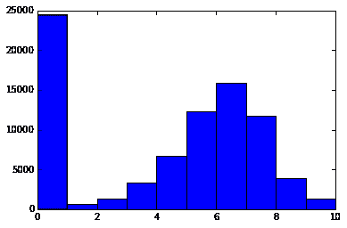
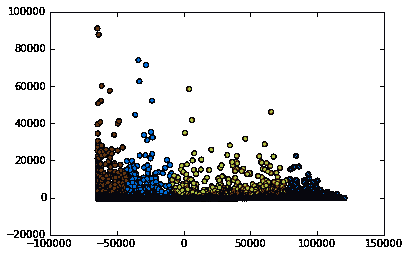

# 教程:学习 Python 编程和机器学习

> 原文：<https://www.dataquest.io/blog/machine-learning-python/>

October 21, 2015As you learn Python programming, you’ll become aware of a growing number of opportunities for analyzing and utilizing collections of data. Machine learning is one of the areas that you’ll want to master. With machine learning, you can make predictions by feeding data into complex algorithms. The uses for machine learning are seemingly endless, making this a powerful skill to add to your resume. In this tutorial, we’ll guide you through the basic principles of machine learning, and how to get started with machine learning with Python. Luckily for us, Python has an amazing ecosystem of libraries that make machine learning easy to get started with. We’ll be using the excellent [Scikit-learn](https://scikit-learn.org/), [Pandas](https://pandas.pydata.org/), and [Matplotlib](https://matplotlib.org/) libraries in this tutorial. If you want to dive more deeply into machine learning, and apply algorithms in your browser, check out our interactive [machine learning fundamentals course](https://www.dataquest.io/course/python-for-data-science-fundamentals). The first lesson is totally free!

## 数据集

在我们深入机器学习之前，我们将探索一个数据集，并找出什么可能是有趣的预测。数据集来自

[BoardGameGeek](https://www.boardgamegeek.com/) ，并包含`80000`棋盘游戏的数据。[这里是](https://www.boardgamegeek.com/boardgame/169786/scythe)网站上的一款单人桌游。这些信息被 Sean Beck 友好地整理成了*CSV*格式，可以在这里 T10 下载。数据集包含关于每个棋盘游戏的几个数据点。以下是一些有趣的例子:

*   `name` —棋盘游戏的名称。
*   `playingtime` —播放时间(厂家给定)。
*   `minplaytime` —最小播放时间(厂家给定)。
*   `maxplaytime` —最大播放时间(厂家给定)。
*   `minage` —建议的最小游戏年龄。
*   `users_rated` —给游戏评分的用户数量。
*   `average_rating` —用户给游戏的平均评分。(0-10)
*   `total_weights` —用户给定的重量数。`Weight`是 BoardGameGeek 编造的主观衡量标准。这是一个游戏有多“深入”或有多复杂。[这里有](https://boardgamegeek.com/wiki/page/Weight)一个完整的解释。
*   `average_weight` —所有主观权重的平均值(0-5)。

## 学习 Python 编程:熊猫入门

我们探索的第一步是读入数据并打印一些快速汇总统计数据。为了做到这一点，我们将使用熊猫图书馆。Pandas 提供了数据结构和数据分析工具，使得在 Python 中操作数据更快更有效。最常见的数据结构被称为

*数据帧*。数据帧是矩阵的扩展，所以在回到数据帧之前，我们将讨论什么是矩阵。我们的数据文件如下所示(为了便于查看，我们删除了一些列):

```
id,type,name,yearpublished,minplayers,maxplayers,playingtime
12333,boardgame,Twilight Struggle,2005,2,2,180
120677,boardgame,Terra Mystica,2012,2,5,150
```

这是一种叫做

*csv* ，或者逗号分隔的值，你可以在这里阅读更多关于[的内容。数据的每一行都是一个不同的棋盘游戏，每一个棋盘游戏的不同数据点都用逗号分隔。第一行是标题行，描述每个数据点是什么。一个数据点的整个集合向下是一列。我们可以很容易地将 csv 文件概念化为矩阵:](https://en.wikipedia.org/wiki/Comma-separated_values)

```
 _   1       2           3                   4
1   id      type        name                yearpublished
2   12333   boardgame   Twilight Struggle   2005
3   120677  boardgame   Terra Mystica       2012 
```

出于显示目的，我们在这里删除了一些列，但是您仍然可以直观地感受到数据的外观。矩阵是由行和列组成的二维数据结构。我们可以通过位置来访问矩阵中的元素。第一行开始于

`id`，第二排从`12333`开始，第三排从`120677`开始。第一列是`id`，第二列是`type`，以此类推。Python 中的矩阵可以通过 [NumPy](https://www.numpy.org/) 库使用。然而，矩阵也有一些缺点。不能简单地通过名称访问列和行，并且每一列都必须具有相同的数据类型。这意味着我们无法在一个矩阵中有效地存储我们的棋盘游戏数据——`name`列包含字符串，而`yearpublished`列包含整数，这意味着我们无法将它们都存储在同一个矩阵中。另一方面，dataframe 在每一列中可以有不同的数据类型。它还有很多分析数据的内置细节，比如按名称查找列。Pandas 让我们可以访问这些功能，并且通常使数据处理更加简单。

## 读入我们的数据

现在，我们将把 csv 文件中的数据读入 Pandas 数据帧，使用

`read_csv`法。

```
 # Import the pandas library.
import pandas
# Read in the data.
games = pandas.read_csv("board_games.csv")
# Print the names of the columns in games.
print(games.columns)
```

```
Index(['id', 'type', 'name', 'yearpublished', 'minplayers', 'maxplayers','playingtime', 'minplaytime', 'maxplaytime', 'minage', 'users_rated', 'average_rating', 'bayes_average_rating', 'total_owners',       'total_traders', 'total_wanters', 'total_wishers', 'total_comments',       'total_weights', 'average_weight'],
      dtype='object')
```

上面的代码读入数据，并向我们显示所有的列名。数据中没有在上面列出的列应该是不言自明的。

```
print(games.shape)
```

```
(81312, 20)
```

我们还可以看到数据的形状，这表明它已经

`81312`行或游戏，以及`20`列或描述每个游戏的数据点。

## 绘制我们的目标变量

预测一个人给一个新的、未发行的棋盘游戏的平均分数可能是有趣的。这存储在

`average_rating`列，这是一个棋盘游戏的所有用户评级的平均值。举例来说，预测这个专栏可能对那些正在考虑下一步该做什么游戏的桌游制造商有用。我们可以使用`games["average_rating"]`来访问一个包含熊猫的数据帧。这将从数据帧中提取一个单独的列。让我们绘制这个栏目的[直方图](https://en.wikipedia.org/wiki/Histogram)，这样我们就可以直观地看到收视率的分布。我们将使用 Matplotlib 来生成可视化。当你学习 Python 编程时，你会发现 Matplotlib 是主要的绘图基础设施，大多数其他绘图库，如 [seaborn](https://seaborn.pydata.org) 和 [ggplot2](https://github.com/yhat/ggplot) 都是建立在 Matplotlib 之上的。我们用`import matplotlib.pyplot as plt`导入 Matplotlib 的绘图函数。然后我们可以画出并展示图表。

```
 # Import matplotlib
import matplotlib.pyplot as plt

# Make a histogram of all the ratings in the average_rating column.
plt.hist(games["average_rating"])

# Show the plot.plt.show()
```

我们在这里看到的是，有相当多的游戏有`0`评级。有一个相当正常的评分分布，有些偏右，平均评分在`6`左右(如果你去掉零)。

## 探索 0 评级

真的有这么多可怕的游戏被赋予了

`0`评级？还是发生了其他事情？我们需要更深入地研究数据来检查这一点。对于 Pandas，我们可以使用布尔[序列](https://pandas.pydata.org/pandas-docs/stable/generated/pandas.Series.html)选择数据子集(向量，或一列/一行数据，在 Pandas 中称为序列)。这里有一个例子:

```
games[games["average_rating"] == 0]
```

上面的代码将创建一个新的 dataframe，只包含

`games`其中`average_rating`列的值等于`0`。然后我们可以*索引*得到的数据帧来得到我们想要的值。在 Pandas 中有两种索引方式——我们可以根据行或列的名称进行索引，也可以根据位置进行索引。按名称索引看起来像`games["average_rating"]`——这将返回整个`games`的`average_rating`列。按位置索引看起来像`games.iloc[0]` —这将返回数据帧的整个第一行。我们也可以一次传入多个索引值— `games.iloc[0,0]`将返回`games`第一行的第一列。点击阅读更多关于熊猫索引[的信息。](https://pandas.pydata.org/pandas-docs/stable/indexing.html)

```
 # Print the first row of all the games with zero scores.
# The .iloc method on dataframes allows us to index by position.
print(games[games["average_rating"] == 0].iloc[0])
# Print the first row of all the games with scores greater than 0.
print(games[games["average_rating"] > 0].iloc[0])
```

```
id                             318
type                     boardgame
name                    Looney Leo
users_rated                      0
average_rating                   0
bayes_average_rating             0
Name: 13048, dtype: object
id                                  12333
type                            boardgame
name                    Twilight Struggle
users_rated                         20113
average_rating                    8.33774
bayes_average_rating              8.22186
Name: 0, dtype: object 
```

这向我们展示了一个游戏与

`0`评级和一个评级在`0`以上的游戏就是`0`评级的游戏没有评论。`users_rated`栏是`0`。通过过滤掉任何带有`0`评论的桌游，我们可以去除很多噪音。

## 移除没有评论的游戏

```
 # Remove any rows without user reviews.
games = games[games["users_rated"] > 0]
# Remove any rows with missing values.
games = games.dropna(axis=0)
```

我们只是过滤掉了所有没有用户评论的行。在此过程中，我们还删除了所有缺少值的行。许多机器学习算法无法处理缺失值，因此我们需要一些方法来处理它们。过滤掉它们是一种常见的技术，但这意味着我们可能会丢失有价值的数据。列出了处理缺失数据的其他技术

[此处](https://en.wikipedia.org/wiki/Missing_data)。

## 集群游戏

我们已经看到可能有不同的博弈。一组(我们刚刚删除)是没有评论的游戏。另一组可以是一组高评级的游戏。了解这些游戏的一种方法是一种叫做

[聚类](https://en.wikipedia.org/wiki/Cluster_analysis)。聚类通过将相似的行(在本例中为游戏)组合在一起，使您能够轻松地找到数据中的模式。我们将使用一种叫做[的特殊类型的聚类，k-means 聚类](https://en.wikipedia.org/wiki/K-means_clustering)。Scikit-learn 有一个很好的 k 均值聚类实现，我们可以使用它。Scikit-learn 是 Python 中主要的机器学习库，包含最常见算法的实现，包括随机森林、支持向量机和逻辑回归。Scikit-learn 有一个一致的 API 来访问这些算法。

```
 # Import the kmeans clustering model.
from sklearn.cluster import KMeans

# Initialize the model with 2 parameters -- number of clusters and random state.
kmeans_model = KMeans(n_clusters=5, random_state=1)
# Get only the numeric columns from games.
good_columns = games._get_numeric_data()
# Fit the model using the good columns.
kmeans_model.fit(good_columns)
# Get the cluster assignments.
labels = kmeans_model.labels_ 
```

为了在 Scikit-learn 中使用聚类算法，我们将首先使用两个参数初始化它——

`n_clusters`定义了我们想要多少个游戏集群，而`random_state`是我们设置的一个随机种子，以便稍后重现我们的结果。[这里是](https://scikit-learn.org/stable/modules/generated/sklearn.cluster.KMeans.html)关于实施的更多信息。然后，我们只从数据帧中获取数字列。大多数机器学习算法不能直接对文本数据进行操作，只能以数字作为输入。仅获取数字列会删除`type`和`name`，这对于聚类算法是不可用的。最后，我们将 kmeans 模型与我们的数据进行拟合，并获得每一行的集群分配标签。

## 绘制集群

现在我们有了集群标签，让我们绘制集群。一个症结是我们的数据有许多列——这超出了人类理解和物理学的领域，无法以超过 3 维的方式可视化事物。所以我们必须在不损失太多信息的情况下降低数据的维度。实现这一点的一种方法是一种叫做

[主成分分析](https://en.wikipedia.org/wiki/Principal_component_analysis)，或称 PCA。PCA 采用多列，将它们变成较少的列，同时试图保留每列中的唯一信息。为了简化，假设我们有两列，`total_owners`和`total_traders`。这两列之间有一些关联，并且有一些重叠的信息。PCA 会将这些信息压缩到一个包含新数字的列中，同时尽量不丢失任何信息。我们将尝试把我们的棋盘游戏数据转换成二维或列，这样我们就可以很容易地绘制出来。

```
 # Import the PCA model.
from sklearn.decomposition import PCA

# Create a PCA model.
pca_2 = PCA(2)
# Fit the PCA model on the numeric columns from earlier.
plot_columns = pca_2.fit_transform(good_columns)
# Make a scatter plot of each game, shaded according to cluster assignment.
plt.scatter(x=plot_columns[:,0], y=plot_columns[:,1], c=labels)
# Show the plot.
plt.show() 
```

我们首先从 Scikit-learn 初始化一个 PCA 模型。PCA 不是一种机器学习技术，但 Scikit-learn 还包含其他对执行机器学习有用的模型。在为机器学习算法预处理数据时，像 PCA 这样的降维技术被广泛使用。然后，我们将数据转换成`2`列，并绘制这些列。当我们绘制列时，我们根据它们的簇分配给它们着色。该图向我们展示了 5 个不同的集群。我们可以更深入地了解每个集群中有哪些游戏，从而更多地了解是什么因素导致了游戏的集群化。

## 弄清楚预测什么

在进入机器学习之前，我们需要确定两件事——我们将如何测量误差，以及我们将预测什么。我们之前认为

预测可能是好的，我们的探索强化了这一观念。测量误差的方法有很多种(这里列出了许多)。一般来说，当我们进行回归并预测[连续](https://en.wikipedia.org/wiki/Continuous_and_discrete_variables)变量时，我们将需要一个不同于我们进行分类并预测[离散](https://en.wikipedia.org/wiki/Continuous_and_discrete_variables)值时的误差度量。为此，我们将使用[均方误差](https://en.wikipedia.org/wiki/Mean_squared_error) —这很容易计算，也很容易理解。它告诉我们，平均来说，我们的预测与实际值有多远。

## 寻找相关性

既然我们想预测

让我们看看哪些列可能对我们的预测感兴趣。一种方法是找出`average_rating`和其他每一列之间的相关性。这将向我们展示哪些其他栏目可能预测`average_rating`最好。我们可以在熊猫数据框架上使用 [corr](https://pandas.pydata.org/pandas-docs/stable/generated/pandas.DataFrame.corr.html) 方法来轻松找到相关性。这将为我们提供每列和其他列之间的相关性。因为这样做的结果是一个数据帧，所以我们可以对它进行索引，并且只获得`average_rating`列的相关性。

```
games.corr()["average_rating"]
```

```
 id                      0.304201
yearpublished           0.108461
minplayers             -0.032701
maxplayers             -0.008335
playingtime             0.048994
minplaytime             0.043985
maxplaytime             0.048994
minage                  0.210049
users_rated             0.112564
average_rating          1.000000
bayes_average_rating    0.231563
total_owners            0.137478
total_traders           0.119452
total_wanters           0.196566
total_wishers           0.171375
total_comments          0.123714
total_weights           0.109691
average_weight          0.351081
Name: average_rating, dtype: float64 
```

我们看到

`average_weight`和`id`栏与评分的相关性最好。`ids`可能是在游戏被添加到数据库时被分配的，所以这可能表明后来创建的游戏在评级中得分更高。也许在 BoardGameGeek 早期，评论者没有这么好，或者更老的游戏质量更低。`average_weight`表示一款游戏的“深度”或复杂程度，所以可能是越复杂的游戏复习的越好。

## 选择预测列

在我们开始学习 Python 编程时进行预测之前，让我们只选择与训练我们的算法相关的列。我们希望删除某些非数字列。我们还希望删除那些只有在您已经知道平均评级的情况下才能计算的列。包含这些列将破坏分类器的目的，即在没有任何先前知识的情况下预测评级。使用只能在知道目标的情况下计算的列会导致

[过度拟合](https://en.wikipedia.org/wiki/Overfitting)，你的模型在训练集中表现良好，但不能很好地推广到未来数据。在某种程度上，`bayes_average_rating`列似乎是从`average_rating`派生出来的，所以让我们删除它。

```
 # Get all the columns from the dataframe.
columns = games.columns.tolist()
# Filter the columns to remove ones we don't want.
columns = [c for c in columns if c not in ["bayes_average_rating", "average_rating", "type", "name"]]

# Store the variable we'll be predicting on.
target = "average_rating" 
```

## 分成训练集和测试集

我们希望能够使用我们的误差度量来计算出一个算法有多精确。然而，在该算法已经被训练的相同数据上评估该算法将导致过度拟合。我们希望算法学习一般化的规则来进行预测，而不是记住如何进行特定的预测。一个例子是学习数学。如果你记住了

`1+1=2`和`2+2=4`，你将能够完美地回答任何关于`1+1`和`2+2`的问题。你会有`0`错误。然而，一旦有人问你一些你知道答案的训练之外的问题，比如`3+3`，你将无法解答。另一方面，如果你能够归纳和学习加法，你会偶尔犯错误，因为你没有记住答案——也许你会得到一个`3453 + 353535`,但你将能够解决任何抛给你的加法问题。如果你在训练机器学习算法时，你的错误看起来出奇地低，你应该总是检查一下，看看你是否过度拟合了。为了防止过度拟合，我们将在由数据的`80%`组成的集合上训练我们的算法，并在由数据的`20%`组成的另一个集合上测试它。为此，我们首先随机抽取`80%`行放入训练集中，然后将所有其他的放入测试集中。

```
 # Import a convenience function to split the sets.
from sklearn.cross_validation import train_test_split

# Generate the training set.  Set random_state to be able to replicate results.
train = games.sample(frac=0.8, random_state=1)
# Select anything not in the training set and put it in the testing set.
test = games.loc[~games.index.isin(train.index)]
# Print the shapes of both sets.
print(train.shape)
print(test.shape) 
```

```
 (45515, 20)
(11379, 20) 
```

上面，我们利用了这样一个事实，即每一个 Pandas 行都有一个惟一的索引来选择不在训练集中的任何一行到测试集中。

## 拟合线性回归

[线性回归](https://en.wikipedia.org/wiki/Linear_regression)是一种强大且常用的机器学习算法。它使用预测变量的线性组合来预测目标变量。假设我们有两个值，`3`和`4`。线性组合将是`3 * .5 + 4 * .5`。线性组合包括将每个数字乘以一个常数，然后将结果相加。这里可以阅读更多[。只有当预测变量和目标变量线性相关时，线性回归才有效。正如我们前面看到的，一些预测因素与目标相关，所以线性回归对我们来说应该很好。我们可以在 Scikit-learn 中使用线性回归实现，就像我们之前使用 k-means 实现一样。](https://en.wikipedia.org/wiki/Linear_combination)

```
 # Import the linearregression model.
from sklearn.linear_model import LinearRegression

# Initialize the model class.
model = LinearRegression()
# Fit the model to the training data.
model.fit(train[columns], train[target]) 
```

当我们拟合模型时，我们传递预测矩阵，该矩阵由我们之前选取的数据帧中的所有列组成。如果在索引时将一个列表传递给 Pandas 数据帧，它将生成一个包含列表中所有列的新数据帧。我们还传入目标变量，我们希望对其进行预测。该模型学习以最小误差将预测值映射到目标值的方程。

## 预测误差

训练完模型后，我们可以用它对新数据进行预测。这些新数据必须与训练数据的格式完全相同，否则模型不会做出准确的预测。我们的测试集与训练集相同(除了各行包含不同的棋盘游戏)。我们从测试集中选择相同的列子集，然后对其进行预测。

```
 # Import the scikit-learn function to compute error.
from sklearn.metrics import mean_squared_error
# Generate our predictions for the test set.
predictions = model.predict(test[columns])
# Compute error between our test predictions and the actual values.
mean_squared_error(predictions, test[target]) 
```

```
1.8239281903519875
```

一旦我们有了预测，我们就能够计算测试集预测和实际值之间的误差。均方差的公式为\(\frac{1}{n}\sum_{i=1}^{n}(y_i–\hat{y}_i)^{2}\。基本上，我们从实际值中减去每个预测值，求差值的平方，然后将它们加在一起。然后我们将结果除以预测值的总数。这将给出每次预测的平均误差。

## 尝试不同的模式

Scikit-learn 的一个好处是，它使我们能够非常容易地尝试更强大的算法。一种这样的算法叫做

[随机森林](https://en.wikipedia.org/wiki/Random_forest)。随机森林算法可以发现线性回归无法发现的数据非线性。比方说，如果一个游戏的`minage`，小于 5，则等级低，如果是`5-10`，则等级高，如果在`10-15`之间，则等级低。线性回归算法无法发现这一点，因为预测值和目标值之间没有线性关系。用随机森林做出的预测通常比用线性回归做出的预测误差更小。

```
 # Import the random forest model.
from sklearn.ensemble import RandomForestRegressor

# Initialize the model with some parameters.
model = RandomForestRegressor(n_estimators=100, min_samples_leaf=10, random_state=1)
# Fit the model to the data.
model.fit(train[columns], train[target])
# Make predictions.
predictions = model.predict(test[columns])
# Compute the error.
mean_squared_error(predictions, test[target]) 
```

```
1.4144905030983794
```

## 进一步探索

我们已经成功地从 csv 格式的数据转向预测。以下是进一步探索的一些想法:

*   试试一个[支持向量机](https://en.wikipedia.org/wiki/Support_vector_machine)。
*   尝试[集合](https://en.wikipedia.org/wiki/Ensemble_learning)多个模型来创建更好的预测。
*   尝试预测不同的列，例如`average_weight`。
*   从文本中生成特征，如游戏名称的长度、字数等。

## 想了解更多关于机器学习的知识？

在

[Dataquest](https://www.dataquest.io) ，我们提供关于机器学习和数据科学的互动课程。我们相信边做边学，通过分析真实数据和构建项目，您可以在浏览器中进行交互式学习。今天学习 Python 编程，并查看我们所有的[机器学习课程](https://www.dataquest.io/course/python-for-data-science-fundamentals)。