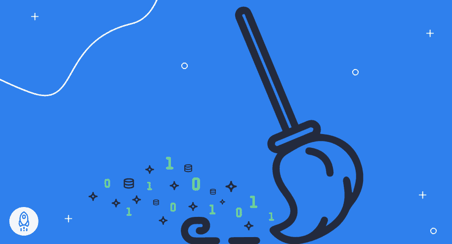

# 2021 年对数据清理最有帮助的 Python 库

> 原文：<https://www.dataquest.io/blog/most-helpful-python-libraries-for-data-cleaning/>

September 23, 2021

大多数调查表明，数据科学家和数据分析师花费 70-80%的时间清理和准备用于分析的数据。对于许多数据工作者来说，数据的清理和准备也是他们工作中最不喜欢的部分，因此他们将其余 20-30%的时间用于抱怨。。。这个笑话大概是这样的。。。

不幸的是，数据总是会有某些不一致、遗漏的输入、不相关的信息、重复的信息或彻头彻尾的错误；这是无法回避的。尤其是当数据来自不同来源时，每一个都有自己的怪癖、挑战和不规则性。杂乱的数据是无用的数据，这就是为什么数据科学家花费大部分时间来理解所有的废话。

毫无疑问，清理和准备数据既繁琐又辛苦，而且很重要。你的数据越干净、越有条理，一切都会变得更快、更容易、更高效。在 Dataquest，我们知道这种斗争，所以我们很高兴分享我们的 15 个最有助于数据清理的 Python 库。

*   NumPy
*   熊猫
*   Matplotlib
*   数据清洁器
*   动力操作研究机构（dynamic operators research apparatus 的缩写）
*   希伯恩
*   箭
*   Scrubadub
*   有平面的
*   缺少编号
*   摩丁
*   Ftfy
*   我的天啊
*   Dabl
*   Imblearn

## NumPy

NumPy 是一个快速易用的开源科学计算 Python 库。它也是数据科学生态系统的基础库，因为许多最受欢迎的 Python 库，如 Pandas 和 Matplotlib，都是基于 NumPy 构建的。

除了作为其他强大库的基础之外，NumPy 还有许多特性，这些特性使得它对于用于数据分析的[](https://www.dataquest.io/path/data-analyst/)Python 来说是不可或缺的。由于其速度和多功能性，NumPy 的向量化、索引和广播概念代表了数组计算的事实上的标准；然而，NumPy 在处理多维数组时确实大放异彩。它还提供了一个数字计算工具的综合工具箱，如线性代数例程、傅立叶变换等。

NumPy 可以为很多人做很多事情。其高级语法允许任何背景或经验水平的程序员使用其强大的数据处理能力。例如，NumPy 使事件视界太空望远镜产生了有史以来第一张黑洞图像。它还证实了引力波的存在，目前它正在加速各种科学研究和体育分析。

一个涵盖从体育到太空的所有内容的程序也可以帮助你管理和清理数据，这是不是很令人惊讶？

## 熊猫

熊猫是 NumPy 支持的图书馆之一。它是 Python 中使用最广泛的数据分析和操作库，不难看出其中的原因。

Pandas 快速且易于使用，其语法非常用户友好，再加上它在操作数据帧方面令人难以置信的灵活性，使它成为分析、操作和清理数据不可或缺的工具。

这个强大的 Python 库不仅处理数字数据，还处理文本数据和日期。它允许您连接、合并、连接或复制数据帧，并使用 drop()函数轻松添加或删除列或行。

简而言之，pandas 结合了速度、易用性和灵活的功能，创建了一个非常强大的工具，使数据操作和分析变得快速而简单。

## Matplotlib

了解您的数据是清理过程的关键部分。清理数据的全部目的是让数据变得可以理解。但是在你拥有漂亮干净的数据之前，你需要了解你的杂乱数据中的问题，比如它们的种类和程度，然后你才能清理它。该操作的很大一部分依赖于准确而直观的数据呈现。

Matplotlib 以其令人印象深刻的数据可视化而闻名，这使得它成为数据清理的一个有价值的工具。它是使用 Python 生成图形、图表和其他 2D [数据可视化的首选库。](https://www.dataquest.io/path/data-analysis-and-visualization-with-python/)

您可以在数据清理中使用 Matplotlib，通过生成分布图来帮助您了解数据的不足之处。你可以让它处理数据中的问题和异常的识别和可视化。这意味着您可以集中精力解决这些数据问题。

## 数据清洁器

Datacleaner 是一个基于熊猫数据框架的第三方库。Datacleaner 相当新，没有熊猫受欢迎，因为 Datacleaner 能做的许多事情在熊猫身上也是可能的。然而，Datacleaner 有一个独特的方法，它结合了一些典型的数据清理功能，并使它们自动化，从而节省您宝贵的时间和精力。

使用 Datacleaner，您可以在逐列的基础上用众数或中位数轻松替换缺失值，对分类变量进行编码，并删除缺失值的行。

## 动力操作研究机构（dynamic operators research apparatus 的缩写）

Dora 库使用 scikit-learn、pandas 和 Matplotlib 进行探索性分析，或者更具体地说，用于自动化探索性分析中最不理想的方面。除了负责特征选择、提取和可视化，Dora 还优化和自动化数据清理。

Dora 将通过许多数据清理功能为您节省宝贵的时间和精力，如输入缺失值、读取缺失值和缩放不当值的数据以及缩放输入变量的值。

此外，Dora 还提供了一个简单的接口，用于在转换数据时为数据拍摄快照，并且它以其独特的数据版本控制功能与其他 Python 包区别开来。

## 希伯恩

在本文的前面，我们讨论了可视化数据以揭示数据缺陷和不一致性的重要性。在解决数据中的问题之前，您需要知道它们是什么以及它们在哪里:数据可视化就是答案。对于许多 Python 用户来说，Matplotlib 是数据可视化的首选库。然而，一些用户发现 Matplotlib 在定制数据可视化选项方面的局限性令人沮丧。这就是为什么我们现在有了 seaborn。

Seaborn 是一个数据可视化包，它建立在 Matplotlib 的基础上，在提供可定制的数据可视化的同时，生成有吸引力的、信息丰富的统计图形。

虽然许多用户更喜欢 seaborn，因为它的定制功能，但它也改进了其前身的一个功能问题:即，seaborn 在 pandas 的数据框架内工作更流畅，使探索性分析和数据清理更令人愉快。

## 箭

提高数据质量的一个重要方面是在整个数据框架中创建统一性和一致性。对于试图在处理日期和时间时创建这种一致性的 Python 开发人员来说，这可能会令人沮丧。数小时和数行代码之后，日期和时间格式化的特殊困难仍然存在。

Arrow 是一个 Python 库，专门用来处理这些困难并创建数据一致性。它的省时功能包括时区转换；自动字符串格式化和解析；支持 pytz、dateutil 对象、ZoneInfo tzinfo 以及生成从微秒到年的时间范围的范围、下限、时间跨度和上限。

Arrow 是时区敏感的(与标准 Python 库不同)，默认情况下是 UTC。它让用户可以用更少的代码和更少的输入更熟练地控制日期和时间。这意味着您可以提高数据的一致性，同时减少争分夺秒的时间。

## Scrubadub

Scrubadub 是金融和医疗保健数据科学家的最爱，是一个专门从自由文本中消除个人身份信息(PII)的 Python 库。

这个简单、免费的开源软件包可以轻松地从您的数据中删除敏感的个人信息，并保护信任您的人的隐私和安全。

Scrubadub 目前允许用户清除其数据中的以下信息:

*   电子邮件地址
*   资源定位符
*   名称
*   Skype 用户名
*   电话号码
*   密码/用户名组合
*   社会安全号码

## 有平面的

只需一个函数调用，制表将使用您的数据来创建小而有吸引力的表格，这些表格可读性很强，这要归功于许多功能，如数字格式、标题和按小数点对齐的列。

这个 [开源库](https://www.dataquest.io/blog/8-rarely-used-python-libraries-how-to-use-them/) 还允许用户使用其他工具和语言处理表格数据，使用户能够以其他流行格式输出数据，如 HTML、PHP 或 Markdown Extra。

## 缺少编号

处理缺失值是数据清理的主要方面之一。Missingno 图书馆就是这么做的。它逐列识别并可视化数据帧中缺失的值，以便用户可以看到他们的数据所处的状态。

可视化问题是解决问题的第一步，Missingno 是一个简单方便的库，可以完成这项工作。

## 摩丁

熊猫已经是一个快速库了，正如我们上面提到的。但是摩丁把熊猫带到了一个全新的水平。摩丁通过分配数据和计算速度来提高熊猫的性能。

Modin 用户将受益于与 pandas 语法的平滑和不引人注目的集成，这可以将 pandas 的速度提高 400%！

## Ftfy

另一个专门的库，Ftfy 非常简单并且擅长它所做的事情。这一切都在名称中，Ftfy，或“为您修复文本。”Ftfy 的诞生是为了一个简单的任务:将不好的 Unicode 和无用的字符转换成相关的可读文本数据。

**例子:**

```
“quoteâ€\x9d = "quote"
ü = ü
lt;3 = <3
```

如果你花很多时间处理文本数据，Ftfy 是一个方便的小工具，可以快速理解无意义的内容。

## 我的天啊

与这个列表中的其他提到的不同，SciPy 不仅仅是一个库；这是一个完整的数据科学生态系统，提供了这个列表中已经提到的一系列开源库，包括 NumPy、Matplotlib 和 pandas。

此外，SciPy 还提供了许多专门的工具，其中之一是 Scikit-learn，它的“预处理”包可用于数据清理和数据集标准化。

## Dabl

scikit-learn 的核心工程师之一开发了 Dabl 作为数据分析库，以简化 [数据探索](https://www.dataquest.io/course/data-exploration/) 和预处理。

Dabl 有一个完整的流程来检测数据集中的某些数据类型和质量问题，并自动应用适当的预处理程序。

它可以处理缺失值，将分类变量转换为数值，它甚至有内置的可视化选项来促进快速数据探索。

## Imblearn

我们倒计时的最后一个库是 unbalanced-learn(缩写为 Imblearn)，它依赖于 Scikit-learn，并为面临分类和不平衡类的 Python 用户提供工具。

使用称为“欠采样”的预处理技术，Imblearn 将梳理您的数据，并删除数据集中缺失、不一致或不规则的值。

## 结论

当涉及到数据科学时，你会得到你投入的东西。数据分析模型的好坏取决于输入的数据，数据越干净，处理、分析和可视化就越简单。正是因为这个原因，我们专门为用 Python 清理 [数据开辟了一条完整的技能之路。](https://www.dataquest.io/path/data-cleaning-python/)

这个库列表绝不是详尽的。Python 生态系统中有许多强大的工具，可以极大地改善数据科学家的日常工作流程。虽然你可能不会使用所有这些工具，但我们希望通过采用其中一些，你会看到日常效率、生产力和乐趣的显著提高。

如果您认为这篇文章有帮助或有见地，我们鼓励您加入我们由成千上万的学生和数据专业人员组成的蓬勃发展的社区，寻求了解更多关于不断扩展的数据科学世界的信息。今天就免费报名吧！