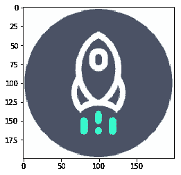
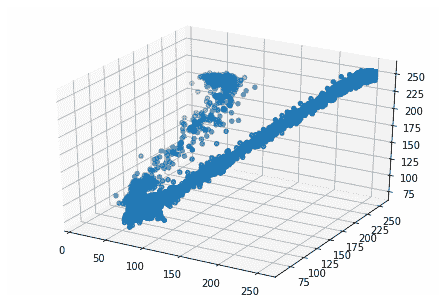
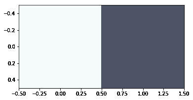

# 教程:通过聚类查找图像中的主色

> 原文：<https://www.dataquest.io/blog/tutorial-colors-image-clustering-python/>

February 21, 2019

用代码分析图像可能很困难。如何让你的代码“理解”图像的上下文？

一般来说，[用 AI](https://thenextweb.com/artificial-intelligence/2018/07/18/a-beginners-guide-to-ai-computer-vision-and-image-recognition/) 分析图像的第一步是找到主色。在本教程中，我们将使用`matplotlib`的`imageclass`来寻找图像中的主色。使用第三方 API 也可以找到主色，但我们将为此构建自己的系统，这样我们就可以完全控制整个过程。

我们将首先以矩阵的形式将图像转换为其组成颜色，然后对其执行 k-means 聚类以找到主色。

## 先决条件

本教程假设您了解 Python 的基础知识，但是您不需要以前在 Python 中处理过图像。

本教程基于以下内容:

*   Python 版本 3.6.5
*   matplotlib 版本 2.2.3:解码图像和可视化主色
*   scipy 版本 1.1.0:执行确定主色的聚类

软件包`matplotlib`和`scipy`可以通过软件包管理器`pip`安装。你可能希望在虚拟环境中安装特定版本的包[，以确保不会与你正在处理的其他项目的依赖项发生冲突。](https://www.pythonforbeginners.com/basics/how-to-use-python-virtualenv/)

```
pip install matplotlib==2.2.3
pip install scipy==1.1.0
```

此外，我们在本教程中分析 JPG 图像，只有当你安装一个额外的软件包，枕头支持才可用。

```
pip install pillow==5.2.0
```

或者，你可以使用 Jupyter 笔记本。本教程的代码是在 Anaconda 版本 1.8.7 的 Jupyter 笔记本上运行的。以上这些包预装在 Anaconda 中。

```
import matplotlib
matplotlib.__version__
```

```
'3.0.2'
```

```
import PIL
PIL.__version__
```

```
'5.3.0'
```

```
import scipy
scipy.__version__
```

```
'1.1.0'
```

## 解码图像

图像可能有各种扩展名，JPG，PNG，TIFF 是常见的。这篇文章只关注 JPG 图像，但是其他图像格式的过程应该没有太大的不同。该过程的第一步是读取图像。

具有 JPG 扩展的图像在内存中存储为一系列点，称为像素。一个[像素](https://en.wikipedia.org/wiki/Pixel)，或者一个图片元素，代表图像中的一个点。圆点的颜色由三个值的组合决定，即它的三种成分颜色(红色、蓝色和绿色)。像素的颜色本质上是这三种成分颜色的组合。


*图片来源:[数据遗传学](https://www.datagenetics.com/blog/march12012/index.html)*

让我们使用 Dataquest 的徽标来寻找图像中的主色。你可以在这里下载图片。

要在 Python 中读取图像，需要导入 matplotlib 的 image 类([文档](https://matplotlib.org/api/image_api.html))。image 类的 imread()方法将图像解码为其 RGB 值。imread()方法的输出是一个尺寸为 M x N x 3 的数组，其中 M 和 N 是图像的尺寸。

```
from matplotlib import image as imgimage = img.imread('./dataquest.jpg')

image.shape(200, 200, 3)
```

您可以使用 matplotlib 的 pyplot 类的 imshow()方法来显示图像，该图像采用 RGB 值矩阵的形式。

```
%matplotlib inlinefrom matplotlib import pyplot as pltplt.imshow(image)
plt.show()
```



我们从 imread()方法中得到的矩阵依赖于正在读取的图像的类型。例如，PNG 图像还会包含一个测量像素透明度的元素。这篇文章将只涵盖 JPG 的图像。

在对图像进行聚类之前，我们需要执行一个额外的步骤。在找出图像主色的过程中，我们不关心像素的位置。因此，我们需要将 M x N x 3 矩阵转换成三个单独的列表，分别包含红色、蓝色和绿色值。以下代码片段将存储在 image 中的矩阵转换为三个单独的列表，每个列表的长度为 40，000 (200 x 200)。

```
r = []
g = []
b = []for line in image:
for pixel in line:
temp_r, temp_g, temp_b = pixel
r.append(temp_r)
g.append(temp_g)
b.append(temp_b)
```

上面的代码片段创建了三个空列表，然后遍历图像的每个像素，将 RGB 值分别追加到 r、g 和 b 列表中。如果操作正确，每个列表的长度将为 40，000 (200 x 200)。

## 聚类基础

现在我们已经存储了图像的所有颜色，是时候寻找主色了。现在让我们花一点时间来理解聚类的基础，以及它将如何帮助我们找到图像中的主色。

聚类是一种有助于根据特定属性将相似的项目分组在一起的技术。我们将对上面刚刚创建的三种颜色的列表应用 [k 均值聚类](https://www.dataquest.io/blog/k-means-clustering-us-senators/)。

每个聚类中心的颜色将反映一个聚类所有成员属性的平均值，这将帮助我们确定图像中的主色。

## 有多少主色？

在我们对像素数据点执行 k-means 聚类之前，弄清楚对于给定的图像有多少个聚类是理想的可能对我们有好处，因为不是所有的图像都具有相同数量的主色。

由于我们正在处理聚类的三个变量——像素的红色、蓝色和绿色值——我们可以在三维上可视化这些变量，以了解可能存在多少种主色。

为了在 matplotlib 中进行 3D 绘图，我们将使用 Axes3D()类([文档](https://matplotlib.org/api/_as_gen/mpl_toolkits.mplot3d.axes3d.Axes3D.html))。在使用 Axes3D()类初始化轴之后，我们使用 scatter 方法并使用三个颜色值列表作为参数。

```
from mpl_toolkits.mplot3d import Axes3Dfig = plt.figure()
ax = Axes3D(fig)
ax.scatter(r, g, b)
plt.show()
```



在结果图中，我们可以看到点的分布形成了两个拉长的集群。通过观察，我们可以看到图像主要由两种颜色组成，这一事实也支持了这一点。因此，我们将在下一节重点创建两个集群。

不过，首先，我们可能会猜测，3D 绘图可能不会为某些图像生成明显的聚类。此外，如果我们使用 PNG 图像，我们将有第四个参数(每个像素的透明度值)，这将使三维绘图成为不可能。在这种情况下，您可能需要使用[肘方法](https://en.wikipedia.org/wiki/Elbow_method_(clustering))来确定理想的集群数量。

## 在 SciPy 中执行聚类

在上一步中，我们已经确定我们想要两个聚类，现在我们准备对数据执行 k-means 聚类。让我们创建一个 Pandas 数据框来轻松管理变量。

```
import pandas as pddf = pd.DataFrame({'red': r,
'blue': b,
'green': g})
```

使用 SciPy 进行 k-means 聚类的过程主要包括三个步骤:

1.  通过将每个数据点除以其标准偏差来标准化变量。我们将使用`vq`类的`whiten()`方法。
2.  使用`kmeans()`方法生成聚类中心。
3.  使用`vq`类的`vq()`方法为每个数据点生成分类标签。

上面的第一步确保每个变量的变化同等地影响聚类。想象一下两个尺度相差很大的变量。如果我们忽略上面的第一步，具有较大规模和变化的变量将对集群的形成产生较大影响，从而使过程有偏差。因此，我们使用 whiten()函数对变量进行标准化。whiten()函数接受一个参数，即变量值的列表或数组，并返回标准化的值。标准化后，我们打印数据框的样本。请注意，在标准化列中，列中的变化已经大大减少。

```
from scipy.cluster.vq import whitendf['scaled_red'] = whiten(df['red'])
df['scaled_blue'] = whiten(df['blue'])
df['scaled_green'] = whiten(df['green'])
df.sample(n = 10)
```

|  | 红色 | 蓝色 | 绿色的 | 缩放 _ 红色 | 缩放 _ 蓝色 | 缩放 _ 绿色 |
| --- | --- | --- | --- | --- | --- | --- |
| Twenty-four thousand eight hundred and eighty-eight | Two hundred and fifty-five | Two hundred and fifty-five | Two hundred and fifty-five | 3.068012 | 3.590282 | 3.170015 |
| Thirty-eight thousand five hundred and eighty-three | Two hundred and fifty-five | Two hundred and fifty-five | Two hundred and fifty-five | 3.068012 | 3.590282 | 3.170015 |
| Two thousand six hundred and fifty-nine | Sixty-seven | Ninety-one | seventy-two | 0.806105 | 1.281238 | 0.895063 |
| Thirty-six thousand nine hundred and fifty-four | Two hundred and fifty-five | Two hundred and fifty-five | Two hundred and fifty-five | 3.068012 | 3.590282 | 3.170015 |
| Thirty-nine thousand nine hundred and sixty-seven | Two hundred and fifty-five | Two hundred and fifty-five | Two hundred and fifty-five | 3.068012 | 3.590282 | 3.170015 |
| Thirteen thousand eight hundred and fifty-one | Seventy-five | One hundred and one | Eighty-two | 0.902357 | 1.422033 | 1.019377 |
| Fourteen thousand three hundred and fifty-four | Seventy-five | One hundred and one | Eighty-two | 0.902357 | 1.422033 | 1.019377 |
| Eighteen thousand six hundred and thirteen | Seventy-five | One hundred | Eighty-two | 0.902357 | 1.407954 | 1.019377 |
| Six thousand seven hundred and nineteen | Seventy-five | One hundred | Eighty-two | 0.902357 | 1.407954 | 1.019377 |
| Fourteen thousand two hundred and ninety-nine | Seventy-one | One hundred and four | Eighty-two | 0.854231 | 1.464272 | 1.019377 |

下一步是用标准化的列执行 k-means 聚类。我们将使用`kmeans()`函数来执行聚类。`kmeans()`函数([文档](https://docs.scipy.org/doc/scipy/reference/generated/scipy.cluster.vq.kmeans.html))有两个必需的参数——观察值和聚类数。它返回两个值-聚类中心和失真。失真是每个点与其最近的聚类中心之间距离的平方之和。我们将不会在本教程中使用失真。

```
from scipy.cluster.vq import kmeanscluster_centers, distortion = kmeans(df[['scaled_red', 'scaled_green', 'scaled_blue']], 2)
```

k-means 聚类的最后一步是生成聚类标签。但是，在本练习中，我们不需要这样做。我们只寻找由聚类中心表示的主色。

## 显示主色

我们已经执行了 k-means 聚类并生成了我们的聚类中心，所以让我们看看它们包含什么值。

```
print(cluster_centers)
```

```
[[2.94579782 3.1243935 3.52525635]
[0.91860119 1.05099931 1.4465091 ]]
```

如你所见，我们得到的结果是 RGB 值的标准化版本。为了得到原始的颜色值，我们需要将它们乘以它们的标准偏差。

我们将使用`matplotlib`的`pyplot`类的`imshow()`方法以调色板的形式显示颜色。然而，为了显示颜色，`imshow()`需要 0 到 1 范围内的 RGB 值，其中 1 表示我们原始 RGB 值的 255。因此，我们必须将聚类中心的每个 RGB 分量除以 255，以得到 0 到 1 之间的值，并通过`imshow()`方法显示它们。

最后，在使用`imshow()`函数([文档](https://matplotlib.org/api/_as_gen/matplotlib.pyplot.imshow.html))绘制颜色之前，我们还有一个需要考虑的问题。聚类中心的维数是 N×3，其中 N 是聚类的数量。`imshow()`最初用于显示颜色的 A X B 矩阵，因此它需要一个维度为 A x B x 3 的 3D 数组(调色板中每个块有三个颜色元素)。因此，我们需要将 N×3 矩阵转换为 1×N×3 矩阵，方法是将聚类中心的颜色作为单个元素的列表进行传递。例如，如果我们将颜色存储在`colors`中，我们需要将`[colors]`作为参数传递给`imshow()`。

让我们探索一下图像中的主色。

```
colors = []r_std, g_std, b_std = df[['red', 'green', 'blue']].std()for cluster_center in cluster_centers:
scaled_r, scaled_g, scaled_b = cluster_center
colors.append((
scaled_r * r_std / 255,
scaled_g * g_std / 255,
scaled_b * b_std / 255
))
plt.imshow([colors])
plt.show()
```



正如所料，图像中看到的颜色与我们开始使用的图像中的突出颜色非常相似。也就是说，你可能已经注意到上面的浅蓝色实际上并没有出现在我们的源图像中。记住，聚类中心是每个聚类中所有像素的所有 RGB 值的平均值。因此，得到的聚类中心实际上可能不是原始图像中的颜色，它只是位于聚类中心的 RBG 值，所有相似的像素都来自我们的图像。

## 结论

在这篇文章中，我们看了使用`matplotlib`和`scipy`在 Python 中查找图像主色的逐步实现。我们从 JPG 图像开始，并使用`matplotlib`中图像类的`imread()`方法将其转换为 RGB 值。然后，我们使用`scipy`进行 k-means 聚类，以找到主色。最后，我们使用`matplotlib`中`pyplot`类的`imshow()`方法显示主色。

*想学习更多 Python 技巧？Dataquest 提供了一系列完整的课程，可以带你从零到 Python 的数据科学家。[报名开始免费学习！](https://www.dataquest.io/)*

[免费开始学习 Python！](https://www.dataquest.io/)